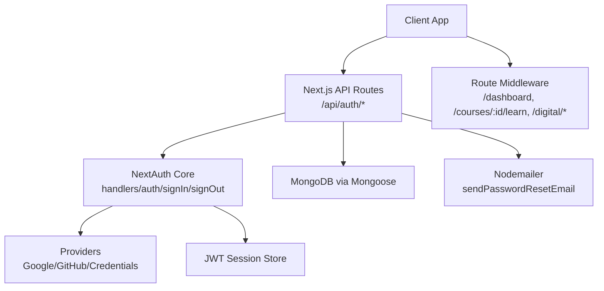
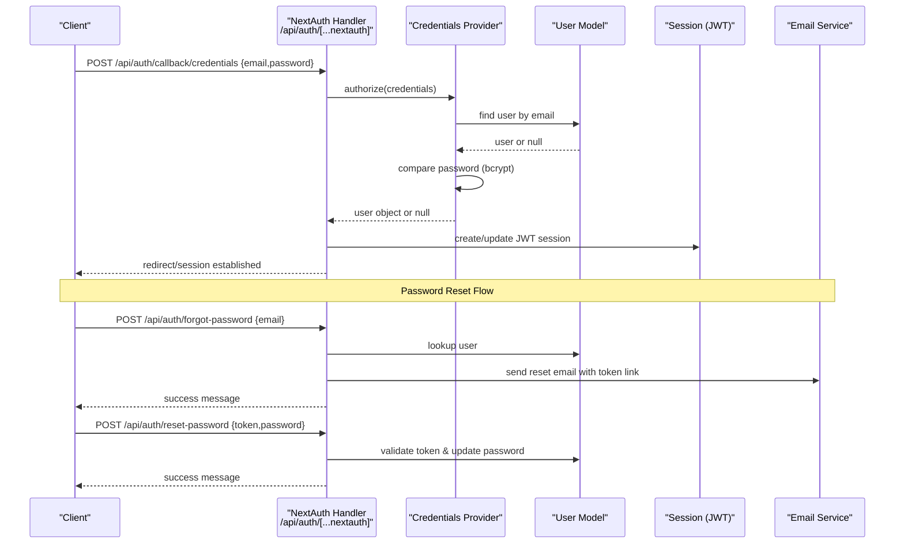
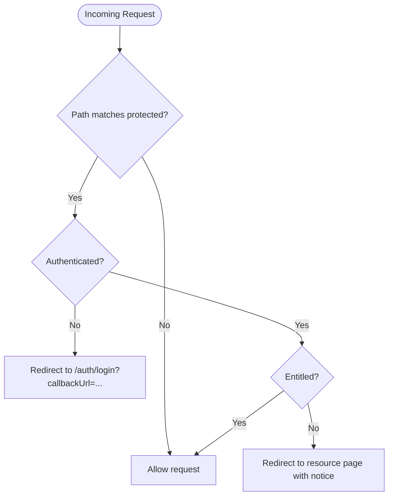
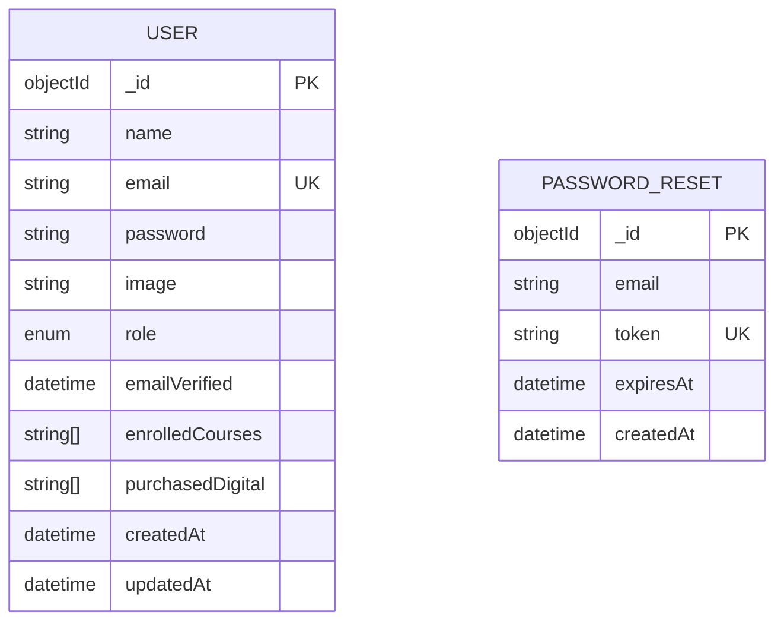
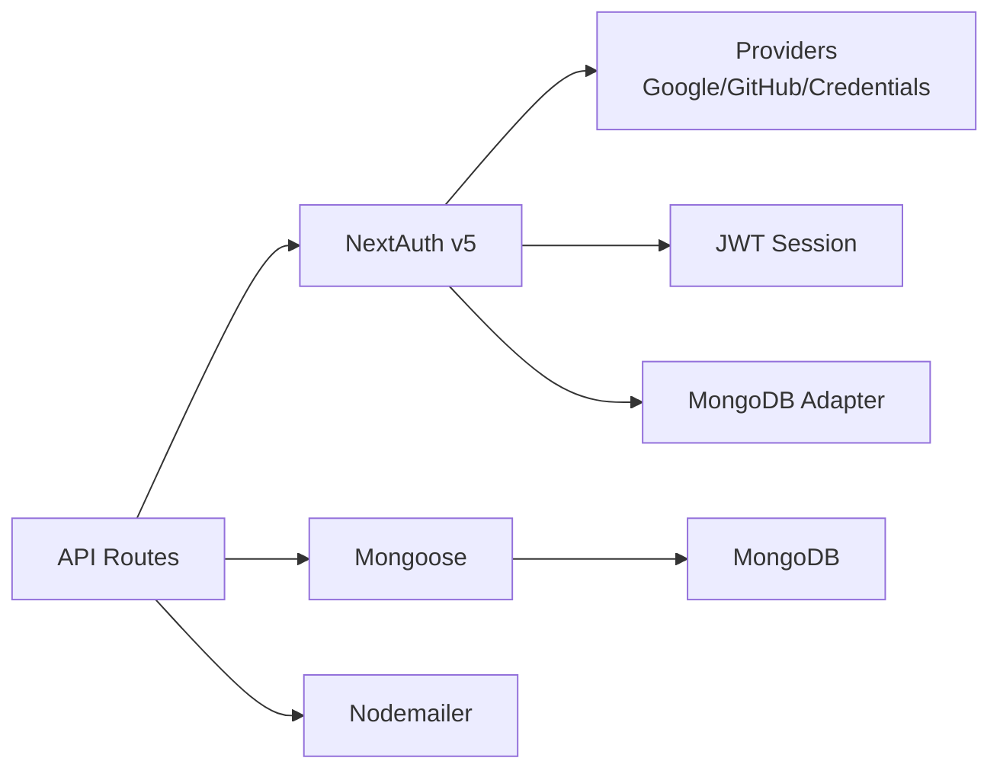

# API Reference

<cite>
**Referenced Files in This Document**
- [route.ts](file://app/api/auth/[...nextauth]/route.ts)
- [route.ts](file://app/api/auth/me/route.ts)
- [route.ts](file://app/api/auth/register/route.ts)
- [route.ts](file://app/api/auth/forgot-password/route.ts)
- [route.ts](file://app/api/auth/reset-password/route.ts)
- [auth.ts](file://auth.ts)
- [auth.config.ts](file://auth.config.ts)
- [User.ts](file://models/User.ts)
- [PasswordReset.ts](file://models/PasswordReset.ts)
- [email.ts](file://lib/email.ts)
- [proxy.ts](file://proxy.ts)
- [package.json](file://package.json)
</cite>

## Table of Contents
1. Introduction
2. Project Structure
3. Core Components
4. Architecture Overview
5. Detailed Component Analysis
6. Dependency Analysis
7. Performance Considerations
8. Troubleshooting Guide
9. Conclusion
10. Appendices

## Introduction
This document provides comprehensive API documentation for the Digentic platform’s authentication endpoints and data access APIs. It covers HTTP methods, URL patterns, request/response schemas, authentication requirements, parameter validation, error responses, and example requests. It also documents the authentication flow (token generation, session management, authorization), security headers, CORS considerations, versioning strategy, client integration guidelines, and troubleshooting tips.

## Project Structure
The authentication and user data APIs are implemented as Next.js Route Handlers under app/api/auth. The core authentication logic is provided by NextAuth v5 with a JWT session strategy and MongoDB adapter. Password reset flows use email via Nodemailer. A middleware proxy enforces route-level authorization for dashboard and course/digital content routes.

**Diagram sources**
- [route.ts:1-3](file://app/api/auth/[...nextauth]/route.ts#L1-L3)
- [auth.ts:9-84](file://auth.ts#L9-L84)
- [auth.config.ts:21-99](file://auth.config.ts#L21-L99)
- [email.ts:3-39](file://lib/email.ts#L3-L39)
- [proxy.ts:7-78](file://proxy.ts#L7-L78)

**Section sources**
- [route.ts:1-3](file://app/api/auth/[...nextauth]/route.ts#L1-L3)
- [auth.ts:9-84](file://auth.ts#L9-L84)
- [auth.config.ts:21-99](file://auth.config.ts#L21-L99)
- [proxy.ts:7-78](file://proxy.ts#L7-L78)

## Core Components
- Authentication handlers: NextAuth handlers exposed at /api/auth/[...nextauth] for sign-in, sign-out, callbacks, and provider flows.
- User profile endpoint: GET /api/auth/me returns current authenticated user profile from the database.
- Registration: POST /api/auth/register creates a new user account with validated inputs and hashed password.
- Password reset: POST /api/auth/forgot-password issues a time-limited reset token and sends an email; POST /api/auth/reset-password validates token and updates password.
- Authorization middleware: Route-level checks for dashboard and protected content paths.

**Section sources**
- [route.ts:1-3](file://app/api/auth/[...nextauth]/route.ts#L1-L3)
- [route.ts:6-50](file://app/api/auth/me/route.ts#L6-L50)
- [route.ts:6-76](file://app/api/auth/register/route.ts#L6-L76)
- [route.ts:8-62](file://app/api/auth/forgot-password/route.ts#L8-L62)
- [route.ts:7-70](file://app/api/auth/reset-password/route.ts#L7-L70)
- [proxy.ts:7-78](file://proxy.ts#L7-L78)

## Architecture Overview
Authentication uses NextAuth v5 with JWT sessions. Credentials provider validates users against MongoDB using bcrypt. Social providers (Google, GitHub) are configured. Password reset uses a secure, time-bound token stored in MongoDB and emailed to the user. Protected routes enforce login and entitlements via middleware.

**Diagram sources**
- [auth.ts:21-82](file://auth.ts#L21-L82)
- [auth.config.ts:30-99](file://auth.config.ts#L30-L99)
- [route.ts:8-62](file://app/api/auth/forgot-password/route.ts#L8-L62)
- [route.ts:7-70](file://app/api/auth/reset-password/route.ts#L7-L70)
- [email.ts:3-39](file://lib/email.ts#L3-L39)

## Detailed Component Analysis

### Authentication Endpoints
- Base path: /api/auth
- Methods and routes:
  - GET|POST /api/auth/[...nextauth]: NextAuth handler for all auth flows (sign-in, sign-out, callbacks).
  - GET /api/auth/me: Returns current user profile if authenticated.
  - POST /api/auth/register: Create a new user account.
  - POST /api/auth/forgot-password: Request password reset email.
  - POST /api/auth/reset-password: Reset password using a valid token.

Authentication Requirements:
- /api/auth/me requires an active session (JWT).
- Other endpoints accept unauthenticated requests but may require credentials internally.

Request/Response Schemas:
- Register
  - Request body: name (string, required), email (string, valid email format, required), password (string, min length enforced server-side).
  - Success response: { success: true, message: string, user: { id: string, name: string, email: string, role: string } }, status 201.
  - Validation errors: { error: string }, status 400.
  - Conflict: { error: "An account with this email already exists." }, status 409.
- Forgot Password
  - Request body: email (string, valid email format, required).
  - Response: { success: true, message: string }, status 200 (always succeeds even if email not found to prevent enumeration).
- Reset Password
  - Request body: token (string, required), password (string, min length enforced server-side).
  - Success: { success: true, message: string }, status 200.
  - Invalid/expired token: { error: string }, status 400.
- Me
  - Headers: Cookie-based session (handled by browser/NextAuth).
  - Success: { success: true, user: { id: string, name: string, email: string, image?: string|null, role: string, enrolledCourses: string[], purchasedDigital: string[], createdAt: string } }, status 200.
  - Unauthorized: { error: "Unauthorized. Please sign in." }, status 401.
  - Not found: { error: "User profile not found in database." }, status 404.

Error Responses:
- All endpoints return JSON with either { success, ... } on success or { error } on failure.
- Status codes include 200, 201, 400, 401, 404, 409, 500 as appropriate.

Example Requests:
- Register:
  - curl: curl -X POST https://your-domain/api/auth/register -H "Content-Type: application/json" -d '{"name":"Jane Doe","email":"jane@example.com","password":"securepass"}'
  - fetch: fetch('/api/auth/register', { method:'POST', headers:{'Content-Type':'application/json'}, body:JSON.stringify({name:'Jane Doe',email:'jane@example.com',password:'securepass'}) })
- Forgot Password:
  - curl: curl -X POST https://your-domain/api/auth/forgot-password -H "Content-Type: application/json" -d '{"email":"jane@example.com"}'
  - fetch: fetch('/api/auth/forgot-password', { method:'POST', headers:{'Content-Type':'application/json'}, body:JSON.stringify({email:'jane@example.com'}) })
- Reset Password:
  - curl: curl -X POST https://your-domain/api/auth/reset-password -H "Content-Type: application/json" -d '{"token":"abc123...","password":"newsecurepass"}'
  - fetch: fetch('/api/auth/reset-password', { method:'POST', headers:{'Content-Type':'application/json'}, body:JSON.stringify({token:'abc123...',password:'newsecurepass'}) })
- Me:
  - curl: curl -X GET https://your-domain/api/auth/me --cookie-jar cookies.txt
  - fetch: fetch('/api/auth/me', { credentials:'include' })

Validation Rules:
- Email must be a valid email format.
- Password minimum lengths enforced server-side.
- Duplicate email registration rejected.
- Token expiration enforced for password reset.

Security Notes:
- Passwords are hashed using bcrypt before storage.
- Password reset tokens are time-limited and deleted after use.
- Account enumeration protection during forgot-password flow.

**Section sources**
- [route.ts:6-76](file://app/api/auth/register/route.ts#L6-L76)
- [route.ts:8-62](file://app/api/auth/forgot-password/route.ts#L8-L62)
- [route.ts:7-70](file://app/api/auth/reset-password/route.ts#L7-L70)
- [route.ts:6-50](file://app/api/auth/me/route.ts#L6-L50)

### Authorization Middleware
- Purpose: Enforce login and entitlements for specific routes.
- Protected paths:
  - /dashboard and /dashboard/*: Requires authenticated session.
  - /courses/:id/learn and /courses/:id/learn/*: Requires authenticated session and enrollment (admin or enrolledCourses includes courseId).
  - /digital/download and /digital/downloads: Requires authenticated session and purchase (admin or purchasedDigital includes product slug).
- Behavior: Redirects unauthenticated users to /auth/login with callbackUrl; redirects unauthorized users to relevant pages with notice query parameters.

**Diagram sources**
- [proxy.ts:7-78](file://proxy.ts#L7-L78)

**Section sources**
- [proxy.ts:7-78](file://proxy.ts#L7-L78)

### Data Models
- User
  - Fields: _id, name, email (unique, lowercase, indexed), password (optional, min length), image, role (user/admin), emailVerified, enrolledCourses (string[]), purchasedDigital (string[]), timestamps.
  - Method: comparePassword(candidatePassword): Promise<boolean>.
- PasswordReset
  - Fields: email, token (unique, indexed), expiresAt, createdAt (with TTL index auto-deletion after 1 hour).

**Diagram sources**
- [User.ts:19-67](file://models/User.ts#L19-L67)
- [PasswordReset.ts:10-37](file://models/PasswordReset.ts#L10-L37)

**Section sources**
- [User.ts:1-81](file://models/User.ts#L1-L81)
- [PasswordReset.ts:1-44](file://models/PasswordReset.ts#L1-L44)

### Security Headers, CORS, and Rate Limiting
- Security Headers: No explicit custom headers are set in the analyzed files. Rely on Next.js defaults and hosting environment for standard headers.
- CORS: No explicit CORS configuration found in next.config.js. For cross-origin clients, configure allowed origins and credentials appropriately at the hosting layer or via Next.js middleware if needed.
- Rate Limiting: No rate limiting implementation detected. Consider adding rate limiting at the API gateway or using a middleware to protect endpoints like register and password reset.

[No sources needed since this section provides general guidance based on absence of explicit configuration]

### API Versioning Strategy and Backward Compatibility
- Current state: No explicit API versioning prefix (e.g., /api/v1) is present.
- Recommendation: Introduce a versioned base path (/api/v1) for future changes while maintaining backward compatibility by keeping legacy routes until deprecation windows are complete. Use response schema stability and deprecation headers when evolving fields.

[No sources needed since this section provides general guidance]

## Dependency Analysis
Key dependencies and their roles:
- NextAuth v5: Provides authentication handlers, session management (JWT), and provider integrations.
- MongoDB Adapter: Persists sessions and accounts to MongoDB.
- Mongoose + MongoDB: Data persistence for User and PasswordReset models.
- bcryptjs: Password hashing and verification.
- Nodemailer: Sends password reset emails.
- Next.js routing and middleware: Exposes API routes and enforces authorization.

**Diagram sources**
- [auth.ts:1-13](file://auth.ts#L1-L13)
- [auth.config.ts:1-20](file://auth.config.ts#L1-L20)
- [package.json:12-37](file://package.json#L12-L37)

**Section sources**
- [auth.ts:1-13](file://auth.ts#L1-L13)
- [auth.config.ts:1-20](file://auth.config.ts#L1-L20)
- [package.json:12-37](file://package.json#L12-L37)

## Performance Considerations
- Database queries: Ensure indexes exist on frequently queried fields (email in User model is indexed).
- Password hashing: bcrypt cost factor balances security and performance; consider tuning based on deployment capacity.
- Email sending: Asynchronous delivery recommended; ensure SMTP transport is reliable and retries on transient failures.
- Session size: JWT payload includes role and arrays; keep payloads minimal to reduce cookie size.

[No sources needed since this section provides general guidance]

## Troubleshooting Guide
Common issues and resolutions:
- Registration fails with duplicate email:
  - Cause: Existing account with same email.
  - Resolution: Use existing account or change email.
- Password reset email not received:
  - Cause: SMTP misconfiguration or email provider filtering.
  - Resolution: Verify SMTP_HOST, SMTP_PORT, SMTP_USER, SMTP_PASS; check spam folder; review console logs in development mode.
- Reset token expired:
  - Cause: Token validity window exceeded.
  - Resolution: Request a new reset link.
- /api/auth/me returns 401:
  - Cause: Missing or invalid session.
  - Resolution: Ensure cookies are included in requests (credentials:'include') and that the user is signed in.
- Access denied to courses/digital downloads:
  - Cause: Not enrolled or not purchased.
  - Resolution: Enroll in course or purchase digital product; admin bypass available.

**Section sources**
- [route.ts:6-76](file://app/api/auth/register/route.ts#L6-L76)
- [route.ts:8-62](file://app/api/auth/forgot-password/route.ts#L8-L62)
- [route.ts:7-70](file://app/api/auth/reset-password/route.ts#L7-L70)
- [route.ts:6-50](file://app/api/auth/me/route.ts#L6-L50)
- [proxy.ts:7-78](file://proxy.ts#L7-L78)
- [email.ts:3-39](file://lib/email.ts#L3-L39)

## Conclusion
The Digentic platform provides a robust authentication system built on NextAuth v5 with JWT sessions, credential and social providers, and secure password reset flows. Data access is protected via route-level middleware enforcing login and entitlements. To enhance production readiness, consider adding explicit CORS configuration, rate limiting, and API versioning. Clients should handle session cookies correctly and implement proper error handling for all endpoints.

## Appendices

### Client Integration Guidelines
- Use credentials:'include' in fetch calls to share cookies across domains if necessary.
- Handle redirects gracefully for authentication and authorization flows.
- Implement retry logic for network errors and exponential backoff for rate-limited scenarios.
- Store minimal user info locally; rely on server-side session for authoritative state.

SDK Example Patterns:
- Registration:
  - JavaScript: See example in Register section above.
- Sign In:
  - Use NextAuth signIn('credentials', { email, password }) or call /api/auth/callback/credentials via fetch with credentials included.
- Fetch Profile:
  - JavaScript: See example in Me section above.

[No sources needed since this section provides general guidance]