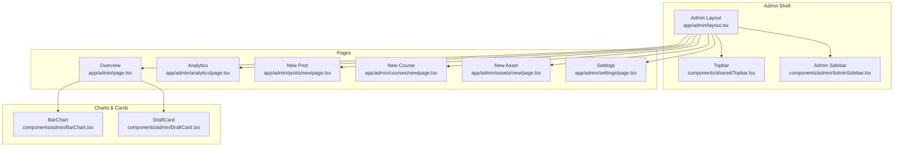
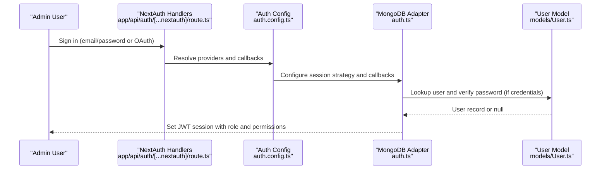
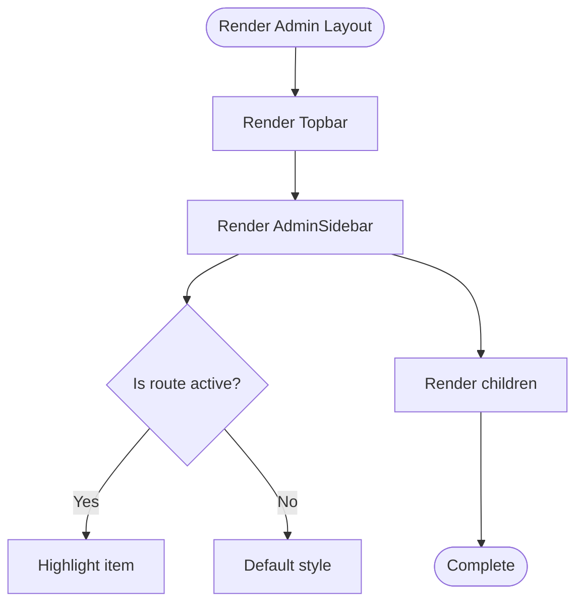
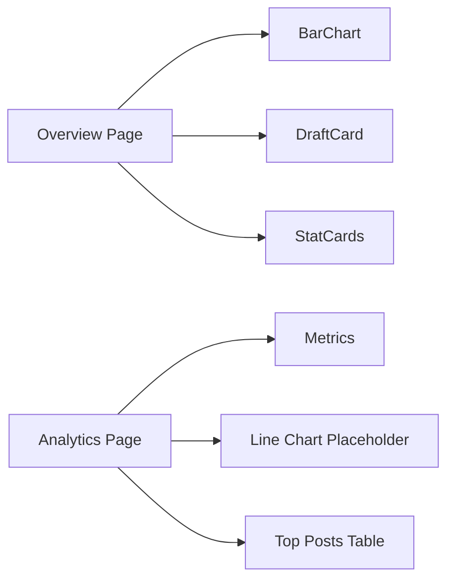
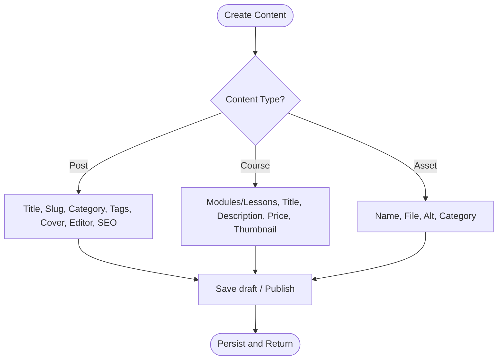
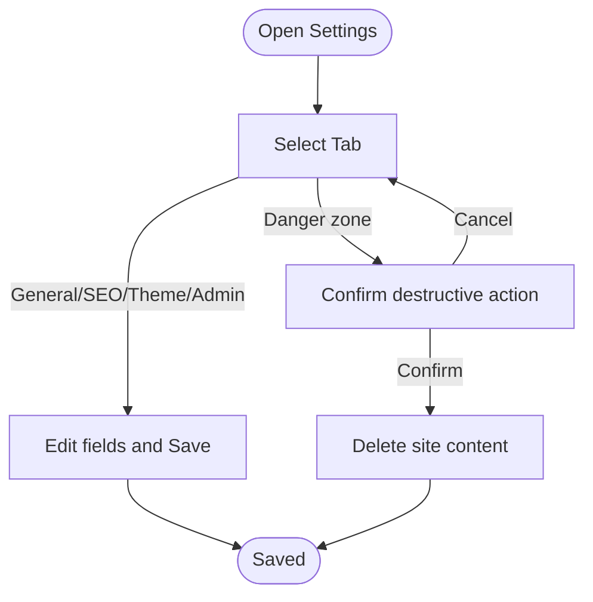
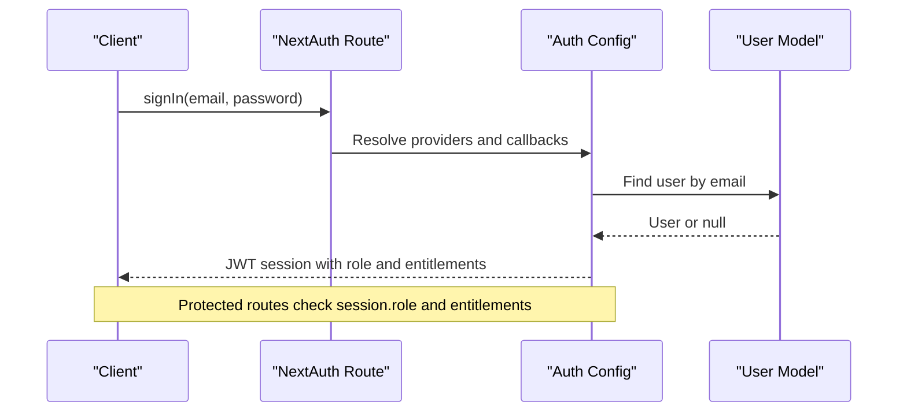
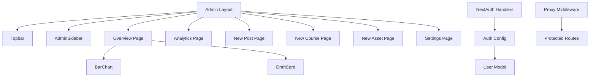

# Admin Dashboard

<cite>
**Referenced Files in This Document**
- [layout.tsx](file://app/admin/layout.tsx)
- [page.tsx](file://app/admin/page.tsx)
- [AdminSidebar.tsx](file://components/admin/AdminSidebar.tsx)
- [BarChart.tsx](file://components/admin/BarChart.tsx)
- [DraftCard.tsx](file://components/admin/DraftCard.tsx)
- [page.tsx](file://app/admin/analytics/page.tsx)
- [page.tsx](file://app/admin/posts/new/page.tsx)
- [page.tsx](file://app/admin/courses/new/page.tsx)
- [page.tsx](file://app/admin/assets/new/page.tsx)
- [page.tsx](file://app/admin/settings/page.tsx)
- [Topbar.tsx](file://components/shared/Topbar.tsx)
- [auth.ts](file://auth.ts)
- [auth.config.ts](file://auth.config.ts)
- [User.ts](file://models/User.ts)
- [route.ts](file://app/api/auth/[...nextauth]/route.ts)
- [proxy.ts](file://proxy.ts)
</cite>

## Table of Contents
1. Introduction
2. Project Structure
3. Core Components
4. Architecture Overview
5. Detailed Component Analysis
6. Dependency Analysis
7. Performance Considerations
8. Troubleshooting Guide
9. Conclusion

## Introduction
This document explains the Admin Dashboard feature for content management and system administration. It covers analytics and reporting, content creation interfaces (posts, courses, digital assets), user administration and access control, system settings, performance monitoring placeholders, maintenance tools, sidebar navigation, workflows, and security considerations. Examples are provided to illustrate creating content, managing users, and accessing analytics data.

## Project Structure
The admin dashboard is implemented as a Next.js application with:
- A dedicated admin layout that composes a top bar and a left sidebar
- Feature pages under app/admin for overview, analytics, posts, assets, projects, courses, likes, and settings
- Reusable UI components for charts, draft cards, and shared elements like the topbar

**Diagram sources**
- [layout.tsx:1-21](file://app/admin/layout.tsx#L1-L21)
- [AdminSidebar.tsx:1-110](file://components/admin/AdminSidebar.tsx#L1-L110)
- [page.tsx:1-39](file://app/admin/page.tsx#L1-L39)
- [BarChart.tsx:1-53](file://components/admin/BarChart.tsx#L1-L53)
- [DraftCard.tsx:1-46](file://components/admin/DraftCard.tsx#L1-L46)
- [page.tsx:1-101](file://app/admin/analytics/page.tsx#L1-L101)
- [page.tsx:1-179](file://app/admin/posts/new/page.tsx#L1-L179)
- [page.tsx:1-181](file://app/admin/courses/new/page.tsx#L1-L181)
- [page.tsx:1-85](file://app/admin/assets/new/page.tsx#L1-L85)
- [page.tsx:1-114](file://app/admin/settings/page.tsx#L1-L114)

**Section sources**
- [layout.tsx:1-21](file://app/admin/layout.tsx#L1-L21)
- [AdminSidebar.tsx:1-110](file://components/admin/AdminSidebar.tsx#L1-L110)
- [page.tsx:1-39](file://app/admin/page.tsx#L1-L39)

## Core Components
- Admin Layout: Wraps all admin pages with a fixed dark background, a Topbar, and a scrollable main area. Renders the AdminSidebar on the left.
- Admin Sidebar: Provides grouped navigation for Main (Overview, Analytics), Create (New post, Drafts, New asset, New project, New course), and Utilities (Likes, Settings). Highlights active routes and supports badges.
- Topbar: Displays branding, role context, search, notifications, settings, and a profile link that routes differently based on role.
- Overview Page: Shows stat cards, a BarChart for page views, and recent drafts via DraftCard.
- Analytics Page: Presents key metrics, a placeholder line chart for traffic over time, and a table of top posts with tags and view counts.
- Content Creation Pages:
  - New Post: Title, slug, category, tags, cover image upload, rich text editor placeholder, SEO fields, and actions (Save draft, Publish now).
  - New Course: Title, description, price, thumbnail, dynamic modules and lessons with add/remove operations, and Save course action.
  - New Asset: Name, file upload with supported formats and size hint, alt text, category selection, and Upload asset action.
- Settings Page: Tabbed interface for General, SEO defaults, Theme, Admin account, and Danger zone (with destructive “Delete site” action).

**Section sources**
- [layout.tsx:1-21](file://app/admin/layout.tsx#L1-L21)
- [AdminSidebar.tsx:1-110](file://components/admin/AdminSidebar.tsx#L1-L110)
- [Topbar.tsx:1-85](file://components/shared/Topbar.tsx#L1-L85)
- [page.tsx:1-39](file://app/admin/page.tsx#L1-L39)
- [page.tsx:1-101](file://app/admin/analytics/page.tsx#L1-L101)
- [page.tsx:1-179](file://app/admin/posts/new/page.tsx#L1-L179)
- [page.tsx:1-181](file://app/admin/courses/new/page.tsx#L1-L181)
- [page.tsx:1-85](file://app/admin/assets/new/page.tsx#L1-L85)
- [page.tsx:1-114](file://app/admin/settings/page.tsx#L1-L114)

## Architecture Overview
The admin dashboard follows a client-side layout pattern with server-rendered pages and client components for interactivity. Authentication and authorization are handled by NextAuth with JWT strategy and MongoDB adapter. Role-based access is enforced through session tokens and middleware-like proxy logic.

**Diagram sources**
- [route.ts:1-3](file://app/api/auth/[...nextauth]/route.ts#L1-L3)
- [auth.config.ts:1-101](file://auth.config.ts#L1-L101)
- [auth.ts:1-133](file://auth.ts#L1-L133)
- [User.ts:1-81](file://models/User.ts#L1-L81)

## Detailed Component Analysis

### Admin Layout and Navigation
- The layout composes Topbar and AdminSidebar and renders children in a scrollable main area.
- The sidebar groups navigation into MAIN, CREATE, and utilities, with active state detection and badge support.

**Diagram sources**
- [layout.tsx:1-21](file://app/admin/layout.tsx#L1-L21)
- [AdminSidebar.tsx:1-110](file://components/admin/AdminSidebar.tsx#L1-L110)

**Section sources**
- [layout.tsx:1-21](file://app/admin/layout.tsx#L1-L21)
- [AdminSidebar.tsx:1-110](file://components/admin/AdminSidebar.tsx#L1-L110)

### Overview and Analytics
- Overview displays stat cards, a BarChart component for last 7 days page views, and recent drafts using DraftCard.
- Analytics shows metrics (page views, unique users, avg read time, bounce rate), a placeholder line chart for daily visitors, and a top posts table with tags and view counts.

**Diagram sources**
- [page.tsx:1-39](file://app/admin/page.tsx#L1-L39)
- [BarChart.tsx:1-53](file://components/admin/BarChart.tsx#L1-L53)
- [DraftCard.tsx:1-46](file://components/admin/DraftCard.tsx#L1-L46)
- [page.tsx:1-101](file://app/admin/analytics/page.tsx#L1-L101)

**Section sources**
- [page.tsx:1-39](file://app/admin/page.tsx#L1-L39)
- [page.tsx:1-101](file://app/admin/analytics/page.tsx#L1-L101)

### Content Creation Interfaces
- New Post: Fields include title, slug, category, tags (add/remove), cover image upload, rich text editor placeholder, SEO meta title/description, and actions (Save draft, Publish now).
- New Course: Supports dynamic modules and lessons with add/remove, plus title, description, price, thumbnail upload, and Save course.
- New Asset: Includes name, file upload with format hints, alt text, category selection, and Upload asset.

**Diagram sources**
- [page.tsx:1-179](file://app/admin/posts/new/page.tsx#L1-L179)
- [page.tsx:1-181](file://app/admin/courses/new/page.tsx#L1-L181)
- [page.tsx:1-85](file://app/admin/assets/new/page.tsx#L1-L85)

**Section sources**
- [page.tsx:1-179](file://app/admin/posts/new/page.tsx#L1-L179)
- [page.tsx:1-181](file://app/admin/courses/new/page.tsx#L1-L181)
- [page.tsx:1-85](file://app/admin/assets/new/page.tsx#L1-L85)

### System Settings and Maintenance
- Settings provides tabs for General, SEO defaults, Theme, Admin account, and a Danger zone with a destructive action to delete site content.
- The Danger zone warns about irreversible deletion and exposes a Delete site button.

**Diagram sources**
- [page.tsx:1-114](file://app/admin/settings/page.tsx#L1-L114)

**Section sources**
- [page.tsx:1-114](file://app/admin/settings/page.tsx#L1-L114)

### User Administration and Access Control
- Authentication uses NextAuth with Google and GitHub providers and a Credentials provider for local email/password login.
- Temporary admin login is supported via environment variables for development/testing; otherwise, users are validated against the database model.
- Session tokens carry role and entitlements (e.g., enrolledCourses, purchasedDigital) used for access decisions elsewhere in the app.
- Proxy/middleware logic enforces authentication and enrollment checks for protected routes such as dashboard and course learning paths.

**Diagram sources**
- [auth.ts:1-133](file://auth.ts#L1-L133)
- [auth.config.ts:1-101](file://auth.config.ts#L1-L101)
- [User.ts:1-81](file://models/User.ts#L1-L81)
- [route.ts:1-3](file://app/api/auth/[...nextauth]/route.ts#L1-L3)
- [proxy.ts:1-56](file://proxy.ts#L1-L56)

**Section sources**
- [auth.ts:1-133](file://auth.ts#L1-L133)
- [auth.config.ts:1-101](file://auth.config.ts#L1-L101)
- [User.ts:1-81](file://models/User.ts#L1-L81)
- [proxy.ts:1-56](file://proxy.ts#L1-L56)

## Dependency Analysis
Key dependencies and relationships:
- Admin pages depend on shared UI components (Topbar, StatCard, TagPill) and admin-specific components (BarChart, DraftCard).
- The AdminSidebar drives navigation across admin features.
- Authentication flows connect NextAuth handlers, configuration, and the User model.
- Proxy logic gates access to protected routes based on session state.

**Diagram sources**
- [layout.tsx:1-21](file://app/admin/layout.tsx#L1-L21)
- [AdminSidebar.tsx:1-110](file://components/admin/AdminSidebar.tsx#L1-L110)
- [page.tsx:1-39](file://app/admin/page.tsx#L1-L39)
- [BarChart.tsx:1-53](file://components/admin/BarChart.tsx#L1-L53)
- [DraftCard.tsx:1-46](file://components/admin/DraftCard.tsx#L1-L46)
- [page.tsx:1-101](file://app/admin/analytics/page.tsx#L1-L101)
- [page.tsx:1-179](file://app/admin/posts/new/page.tsx#L1-L179)
- [page.tsx:1-181](file://app/admin/courses/new/page.tsx#L1-L181)
- [page.tsx:1-85](file://app/admin/assets/new/page.tsx#L1-L85)
- [page.tsx:1-114](file://app/admin/settings/page.tsx#L1-L114)
- [route.ts:1-3](file://app/api/auth/[...nextauth]/route.ts#L1-L3)
- [auth.config.ts:1-101](file://auth.config.ts#L1-L101)
- [User.ts:1-81](file://models/User.ts#L1-L81)
- [proxy.ts:1-56](file://proxy.ts#L1-L56)

**Section sources**
- [layout.tsx:1-21](file://app/admin/layout.tsx#L1-L21)
- [AdminSidebar.tsx:1-110](file://components/admin/AdminSidebar.tsx#L1-L110)
- [auth.ts:1-133](file://auth.ts#L1-L133)
- [proxy.ts:1-56](file://proxy.ts#L1-L56)

## Performance Considerations
- Charts and lists render static or minimal client-side data; consider lazy loading large datasets when integrating real APIs.
- Avoid heavy computations in render loops; precompute values (as done for bar heights) outside JSX where possible.
- Use memoization for expensive components if adding complex interactions later.
- Keep images and assets optimized; enforce size limits at upload boundaries.

[No sources needed since this section provides general guidance]

## Troubleshooting Guide
- Authentication failures:
  - Ensure environment variables for temporary admin credentials are set correctly in development.
  - Verify database connectivity and that user records exist with valid hashed passwords.
- Access denied to protected routes:
  - Confirm the session contains the expected role and entitlements.
  - Check proxy logic for route patterns and redirect behavior.
- Settings destructive actions:
  - The Danger zone performs irreversible deletion; ensure backups before use.

**Section sources**
- [auth.ts:1-133](file://auth.ts#L1-L133)
- [auth.config.ts:1-101](file://auth.config.ts#L1-L101)
- [proxy.ts:1-56](file://proxy.ts#L1-L56)
- [page.tsx:1-114](file://app/admin/settings/page.tsx#L1-L114)

## Conclusion
The Admin Dashboard provides a cohesive interface for content management and system administration, including analytics visualization, robust content creation forms, and secure access controls. While many features currently use static or placeholder data, the structure supports straightforward integration with backend services for full CRUD operations, real-time analytics, and advanced administrative workflows. Security is enforced via NextAuth with role-based sessions and middleware-style routing protection.

[No sources needed since this section summarizes without analyzing specific files]