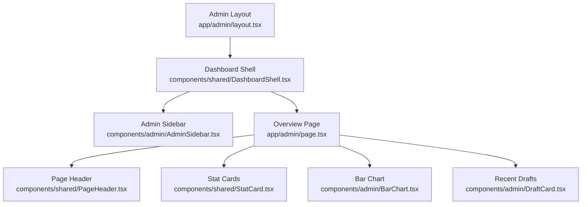
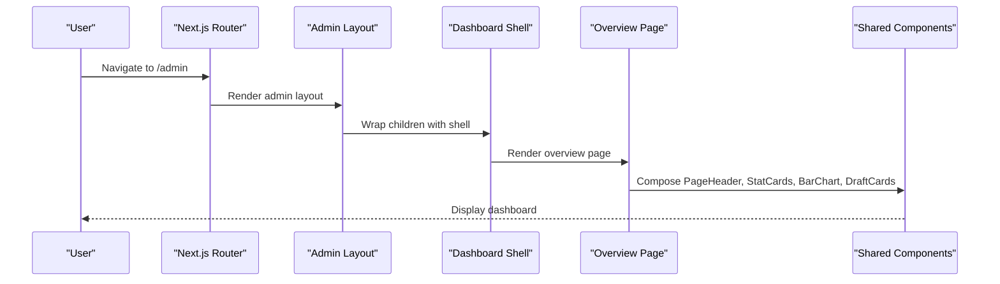
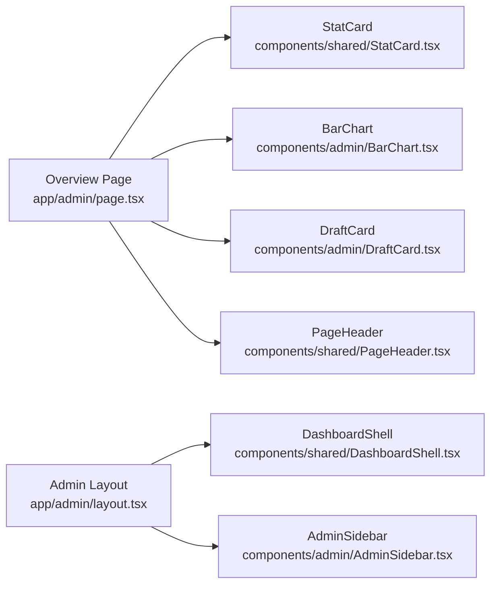

# Admin Overview Dashboard

<cite>
**Referenced Files in This Document**
- [app/admin/page.tsx](file://app/admin/page.tsx)
- [components/shared/StatCard.tsx](file://components/shared/StatCard.tsx)
- [components/admin/BarChart.tsx](file://components/admin/BarChart.tsx)
- [components/admin/DraftCard.tsx](file://components/admin/DraftCard.tsx)
- [components/shared/PageHeader.tsx](file://components/shared/PageHeader.tsx)
- [components/shared/DashboardShell.tsx](file://components/shared/DashboardShell.tsx)
- [components/admin/AdminSidebar.tsx](file://components/admin/AdminSidebar.tsx)
- [app/admin/layout.tsx](file://app/admin/layout.tsx)
- [app/admin/posts/drafts/page.tsx](file://app/admin/posts/drafts/page.tsx)
- [components/shared/FilterChips.tsx](file://components/shared/FilterChips.tsx)
- [components/shared/TagPill.tsx](file://components/shared/TagPill.tsx)
</cite>

## Table of Contents
1. Introduction
2. Project Structure
3. Core Components
4. Architecture Overview
5. Detailed Component Analysis
6. Dependency Analysis
7. Performance Considerations
8. Troubleshooting Guide
9. Conclusion
10. Appendices

## Introduction
This document explains the Admin Overview Dashboard that provides a system status snapshot and key metrics for administrators. It covers:
- Stat cards showing total posts, likes, drafts, and courses with guidance for real-time updates
- The bar chart visualization for analytics data and performance metrics
- Recent drafts section displaying content creation activity with timestamps and tags
- Customization examples for stat displays, chart data sources, and draft workflows
- Responsive design considerations and accessibility features

## Project Structure
The admin overview is rendered within an admin layout shell that includes a topbar and sidebar. The overview page composes reusable components to present metrics, analytics, and recent drafts.

**Diagram sources**
- [app/admin/layout.tsx:1-15](file://app/admin/layout.tsx#L1-L15)
- [components/shared/DashboardShell.tsx:1-28](file://components/shared/DashboardShell.tsx#L1-L28)
- [components/admin/AdminSidebar.tsx:1-110](file://components/admin/AdminSidebar.tsx#L1-L110)
- [app/admin/page.tsx:1-39](file://app/admin/page.tsx#L1-L39)
- [components/shared/PageHeader.tsx:1-38](file://components/shared/PageHeader.tsx#L1-L38)
- [components/shared/StatCard.tsx:1-36](file://components/shared/StatCard.tsx#L1-L36)
- [components/admin/BarChart.tsx:1-53](file://components/admin/BarChart.tsx#L1-L53)
- [components/admin/DraftCard.tsx:1-46](file://components/admin/DraftCard.tsx#L1-L46)

**Section sources**
- [app/admin/layout.tsx:1-15](file://app/admin/layout.tsx#L1-L15)
- [components/shared/DashboardShell.tsx:1-28](file://components/shared/DashboardShell.tsx#L1-L28)
- [components/admin/AdminSidebar.tsx:1-110](file://components/admin/AdminSidebar.tsx#L1-L110)
- [app/admin/page.tsx:1-39](file://app/admin/page.tsx#L1-L39)

## Core Components
- Overview page orchestrates the dashboard by composing:
  - Page header with role badge
  - Stat cards grid for high-level metrics
  - Bar chart for weekly page views
  - Recent drafts list with tags and timestamps
- Shared UI primitives include:
  - StatCard for metric tiles
  - DraftCard for draft entries
  - PageHeader for consistent headers
  - FilterChips and TagPill for filtering and tagging

Key responsibilities:
- StatCard: renders value, label, and optional icon with hover state
- BarChart: renders a simple bar chart with computed heights based on data values
- DraftCard: shows title, tag, time, and an edit link
- PageHeader: displays title, subtitle, role badge, and optional actions
- AdminSidebar: navigation between admin sections (overview, analytics, drafts, etc.)
- DashboardShell: wraps pages with topbar and sidebar layout

**Section sources**
- [app/admin/page.tsx:1-39](file://app/admin/page.tsx#L1-L39)
- [components/shared/StatCard.tsx:1-36](file://components/shared/StatCard.tsx#L1-L36)
- [components/admin/BarChart.tsx:1-53](file://components/admin/BarChart.tsx#L1-L53)
- [components/admin/DraftCard.tsx:1-46](file://components/admin/DraftCard.tsx#L1-L46)
- [components/shared/PageHeader.tsx:1-38](file://components/shared/PageHeader.tsx#L1-L38)
- [components/admin/AdminSidebar.tsx:1-110](file://components/admin/AdminSidebar.tsx#L1-L110)
- [components/shared/DashboardShell.tsx:1-28](file://components/shared/DashboardShell.tsx#L1-L28)

## Architecture Overview
The admin dashboard follows a client-side React architecture with Next.js routing. The overview page composes presentational components. Data is currently static but can be replaced with dynamic fetching or server components as needed.

**Diagram sources**
- [app/admin/layout.tsx:1-15](file://app/admin/layout.tsx#L1-L15)
- [components/shared/DashboardShell.tsx:1-28](file://components/shared/DashboardShell.tsx#L1-L28)
- [app/admin/page.tsx:1-39](file://app/admin/page.tsx#L1-L39)

## Detailed Component Analysis

### Overview Page
- Renders a page header with role badge
- Displays a responsive grid of four stat cards
- Includes a bar chart component for last 7 days page views
- Shows recent drafts using draft cards with tags and timestamps

Customization tips:
- Replace static values in stat cards with dynamic data from your backend or API
- Swap the bar chart data source to fetch from an analytics endpoint
- Extend recent drafts to pull from a drafts collection and sort by timestamp

**Section sources**
- [app/admin/page.tsx:1-39](file://app/admin/page.tsx#L1-L39)

### Stat Cards
- Accepts value, label, and optional icon props
- Highlights value with accent color and supports hover border change
- Suitable for counts like posts, likes, drafts, courses

Real-time updates:
- Integrate polling or WebSocket updates to refresh values without full page reload
- Use optimistic UI updates for immediate feedback when creating posts or receiving likes

Accessibility:
- Ensure icons are decorative; provide meaningful labels via aria-label if needed
- Maintain sufficient color contrast for values and labels

**Section sources**
- [components/shared/StatCard.tsx:1-36](file://components/shared/StatCard.tsx#L1-L36)

### Bar Chart
- Renders a simple bar chart with computed heights based on max value
- Highlights today’s bar with a distinct color
- Uses inline styles for background and borders

Configuring data sources:
- Replace the internal dataset with props or a fetched dataset
- Normalize data to { day, value, isToday } shape for compatibility
- Add tooltips or legends for better readability

Performance:
- Memoize computed maxHeight and bar heights to avoid recalculation on re-renders
- Consider virtualizing large datasets if expanding to many bars

**Section sources**
- [components/admin/BarChart.tsx:1-53](file://components/admin/BarChart.tsx#L1-L53)

### Recent Drafts
- Displays draft title, tag, and relative time
- Provides an edit link per draft
- Styled consistently with other dashboard elements

Draft workflow management:
- Connect to a drafts API to list, filter, and paginate drafts
- Add publish and delete actions wired to backend endpoints
- Show draft status indicators (e.g., saved vs. published)

Accessibility:
- Make links keyboard navigable and focus-visible
- Provide descriptive link text for “Edit”

**Section sources**
- [components/admin/DraftCard.tsx:1-46](file://components/admin/DraftCard.tsx#L1-L46)
- [app/admin/page.tsx:26-34](file://app/admin/page.tsx#L26-L34)

### Drafts Listing Page
- Lists all drafts with filters by tag
- Supports active filter state and filtered rendering
- Provides Edit, Publish, and Delete actions per draft

Workflow enhancements:
- Wire Publish/Delete to API routes
- Add confirmation dialogs for destructive actions
- Implement optimistic updates and error handling

**Section sources**
- [app/admin/posts/drafts/page.tsx:1-90](file://app/admin/posts/drafts/page.tsx#L1-L90)
- [components/shared/FilterChips.tsx:1-30](file://components/shared/FilterChips.tsx#L1-L30)
- [components/shared/TagPill.tsx:1-38](file://components/shared/TagPill.tsx#L1-L38)

### Layout and Navigation
- Admin layout wraps pages with DashboardShell and AdminSidebar
- DashboardShell provides topbar and main area with fixed positioning
- AdminSidebar groups navigation items and highlights active route

Responsiveness:
- Sidebar width is fixed; ensure main content adapts via flex layout
- Consider collapsible sidebar on smaller screens

**Section sources**
- [app/admin/layout.tsx:1-15](file://app/admin/layout.tsx#L1-L15)
- [components/shared/DashboardShell.tsx:1-28](file://components/shared/DashboardShell.tsx#L1-L28)
- [components/admin/AdminSidebar.tsx:1-110](file://components/admin/AdminSidebar.tsx#L1-L110)

## Dependency Analysis
The overview page depends on shared and admin components. The layout composes shell and sidebar.

**Diagram sources**
- [app/admin/page.tsx:1-39](file://app/admin/page.tsx#L1-L39)
- [components/shared/StatCard.tsx:1-36](file://components/shared/StatCard.tsx#L1-L36)
- [components/admin/BarChart.tsx:1-53](file://components/admin/BarChart.tsx#L1-L53)
- [components/admin/DraftCard.tsx:1-46](file://components/admin/DraftCard.tsx#L1-L46)
- [components/shared/PageHeader.tsx:1-38](file://components/shared/PageHeader.tsx#L1-L38)
- [app/admin/layout.tsx:1-15](file://app/admin/layout.tsx#L1-L15)
- [components/shared/DashboardShell.tsx:1-28](file://components/shared/DashboardShell.tsx#L1-L28)
- [components/admin/AdminSidebar.tsx:1-110](file://components/admin/AdminSidebar.tsx#L1-L110)

**Section sources**
- [app/admin/page.tsx:1-39](file://app/admin/page.tsx#L1-L39)
- [app/admin/layout.tsx:1-15](file://app/admin/layout.tsx#L1-L15)

## Performance Considerations
- Avoid unnecessary re-renders by memoizing derived values (e.g., max bar height)
- Use pagination or virtualization for large draft lists
- Debounce search/filter inputs if adding free-text filtering
- Prefer server-side data fetching for initial load where possible to reduce client bundle size
- Keep chart data minimal; aggregate on the server if needed

[No sources needed since this section provides general guidance]

## Troubleshooting Guide
Common issues and resolutions:
- Stats not updating:
  - Ensure data source is connected and refetch triggers are in place
  - Verify network requests succeed and handle errors gracefully
- Chart misalignment:
  - Confirm data array contains numeric values and normalize missing fields
  - Check that computed max value is non-zero to avoid division issues
- Draft actions not working:
  - Validate API endpoints exist and return expected responses
  - Add loading and error states around actions
- Accessibility problems:
  - Ensure interactive elements have proper roles and labels
  - Test keyboard navigation and screen reader announcements

[No sources needed since this section provides general guidance]

## Conclusion
The Admin Overview Dashboard provides a clear, modular interface for monitoring system status and key metrics. Its component-based structure makes it easy to customize stat displays, configure chart data sources, and manage draft workflows. With thoughtful responsiveness and accessibility practices, it offers a robust foundation for administrative tasks.

[No sources needed since this section summarizes without analyzing specific files]

## Appendices

### Real-Time Updates Strategy
- Polling: Periodically fetch stats and update local state
- WebSockets: Subscribe to live events for instant updates
- Optimistic UI: Update UI immediately and revert on failure

[No sources needed since this section provides general guidance]

### Customization Examples
- Customize stat displays:
  - Pass different icons and format values (e.g., thousands separators)
  - Add trend indicators or sparklines
- Configure chart data sources:
  - Accept props for data arrays and labels
  - Support multiple series and legends
- Manage draft workflows:
  - Add bulk actions (publish/delete selected)
  - Implement draft versioning and history

[No sources needed since this section provides general guidance]