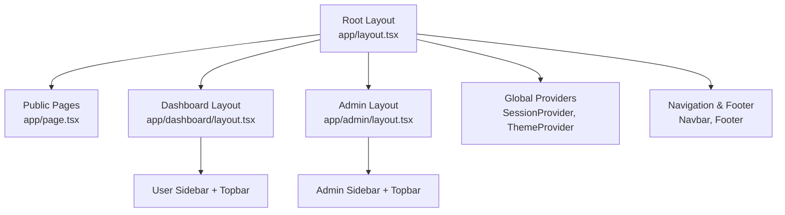
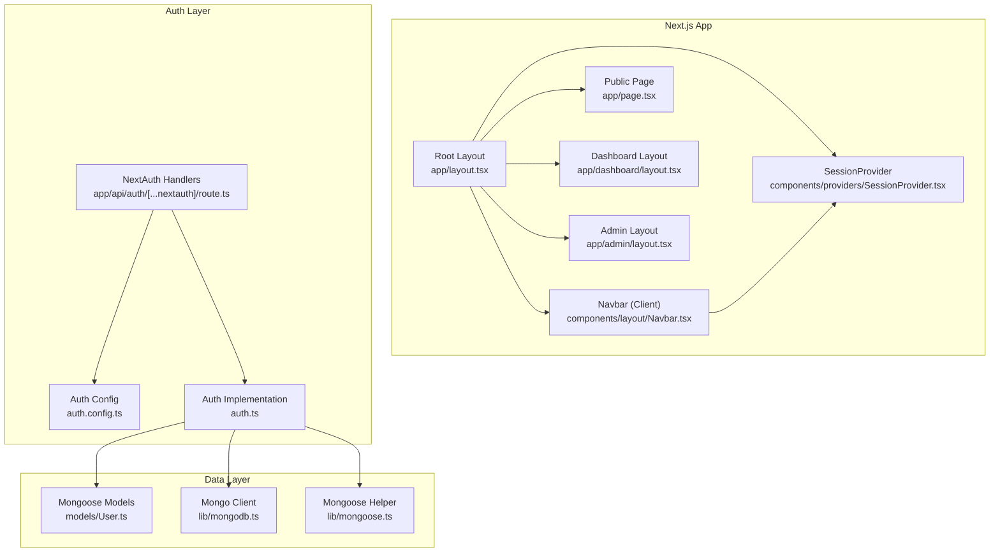
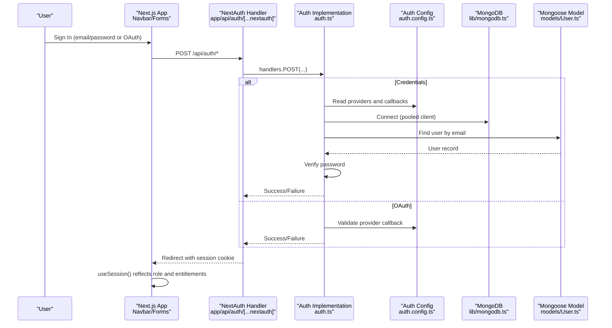
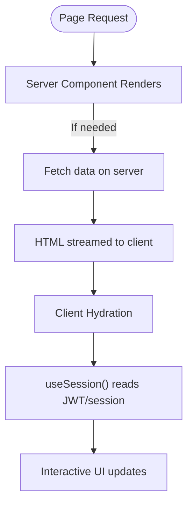
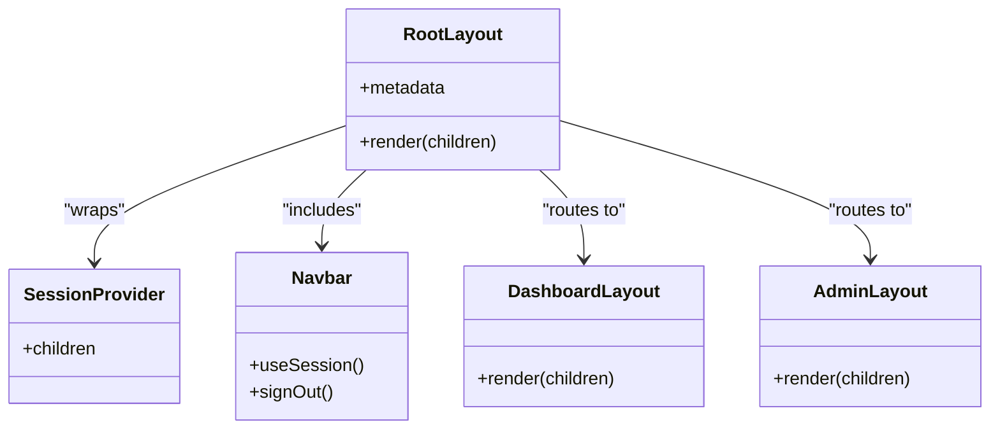
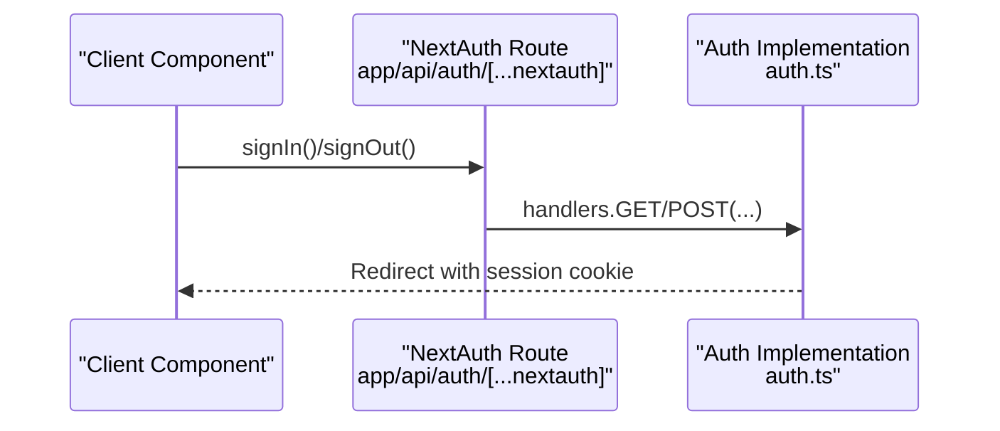
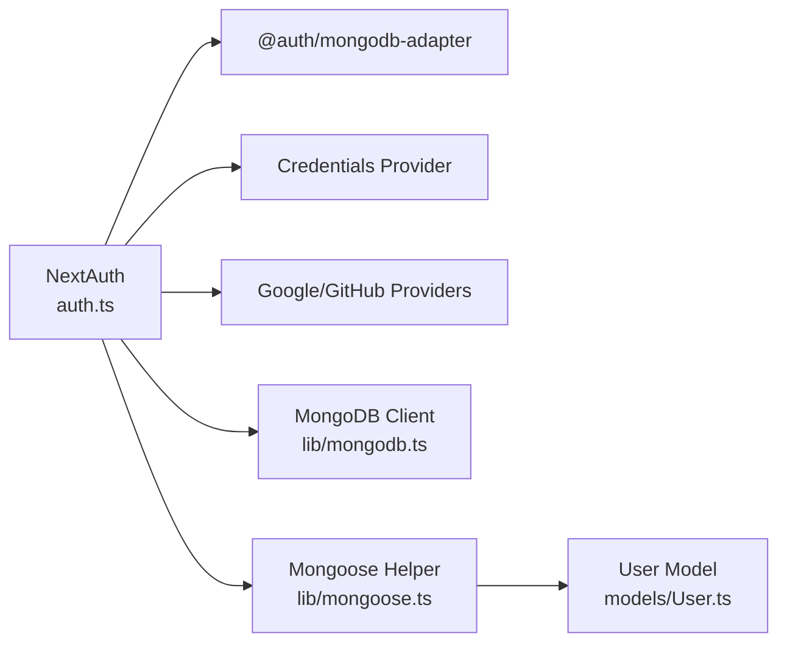

# Architecture Overview

<cite>
**Referenced Files in This Document**
- [app/layout.tsx](file://app/layout.tsx)
- [app/page.tsx](file://app/page.tsx)
- [app/admin/layout.tsx](file://app/admin/layout.tsx)
- [app/dashboard/layout.tsx](file://app/dashboard/layout.tsx)
- [auth.ts](file://auth.ts)
- [auth.config.ts](file://auth.config.ts)
- [app/api/auth/[...nextauth]/route.ts](file://app/api/auth/[...nextauth]/route.ts)
- [components/providers/SessionProvider.tsx](file://components/providers/SessionProvider.tsx)
- [components/layout/Navbar.tsx](file://components/layout/Navbar.tsx)
- [models/User.ts](file://models/User.ts)
- [lib/mongodb.ts](file://lib/mongodb.ts)
- [lib/mongoose.ts](file://lib/mongoose.ts)
- [next.config.js](file://next.config.js)
- [package.json](file://package.json)
</cite>

## Table of Contents
1. Introduction
2. Project Structure
3. Core Components
4. Architecture Overview
5. Detailed Component Analysis
6. Dependency Analysis
7. Performance Considerations
8. Troubleshooting Guide
9. Conclusion

## Introduction
This document provides an architectural overview of the Digentic platform built with Next.js App Router. It explains the file-based routing conventions, server-side rendering patterns, component hierarchy from root layouts to feature modules, data flow between client and server components, state management strategies, API communication flows, authentication architecture using NextAuth.js with role-based access control, system boundaries, integration points with external services, deployment topology considerations, and cross-cutting concerns such as security, performance, and scalability.

## Project Structure
Digentic follows Next.js App Router conventions:
- File-based routes under app/ define pages and layouts per route segment (for example, /dashboard, /admin, /blog, /courses).
- Root layout at app/layout.tsx wraps all pages with global providers, theme, navigation, and footer.
- Feature-specific layouts exist for admin and dashboard areas to provide distinct chrome and navigation.
- Shared UI components live under components/, organized by domain (layout, shared, home, blog, courses, user, admin).
- Data access is centralized in lib/ (MongoDB connection, Mongoose helpers), and models are defined under models/.
- Authentication endpoints are exposed via app/api/auth/[...nextauth]/route.ts, delegating to auth.ts.

**Diagram sources**
- [app/layout.tsx:27-47](file://app/layout.tsx#L27-L47)
- [app/dashboard/layout.tsx:4-20](file://app/dashboard/layout.tsx#L4-L20)
- [app/admin/layout.tsx:4-20](file://app/admin/layout.tsx#L4-L20)

**Section sources**
- [app/layout.tsx:1-47](file://app/layout.tsx#L1-L47)
- [app/page.tsx:1-26](file://app/page.tsx#L1-L26)
- [app/dashboard/layout.tsx:1-21](file://app/dashboard/layout.tsx#L1-L21)
- [app/admin/layout.tsx:1-21](file://app/admin/layout.tsx#L1-L21)

## Core Components
- Root layout composes global metadata, theme provider, session provider, navbar, main content area, and footer. It sets up the base HTML structure and ensures consistent styling across pages.
- Dashboard and Admin layouts provide application-specific chrome (topbar and sidebar) and a scrollable main region for feature pages.
- SessionProvider wraps the React tree to expose NextAuth session context to client components.
- Navbar is a client component that reads session state, renders navigation links, and exposes sign-in/sign-out actions.

Key responsibilities:
- Global providers and metadata: Root layout
- Feature chrome: Dashboard/Admin layouts
- Client-side session access: SessionProvider and Navbar
- Public landing composition: Home page aggregates feature sections

**Section sources**
- [app/layout.tsx:11-47](file://app/layout.tsx#L11-L47)
- [components/providers/SessionProvider.tsx:1-13](file://components/providers/SessionProvider.tsx#L1-L13)
- [components/layout/Navbar.tsx:1-235](file://components/layout/Navbar.tsx#L1-L235)
- [app/dashboard/layout.tsx:1-21](file://app/dashboard/layout.tsx#L1-L21)
- [app/admin/layout.tsx:1-21](file://app/admin/layout.tsx#L1-L21)

## Architecture Overview
The platform uses Next.js App Router with a mix of server and client components:
- Server components render initial HTML and can fetch data on the server for fast first paint.
- Client components handle interactivity and consume session state via NextAuth hooks.
- Authentication is implemented with NextAuth.js using JWT strategy and MongoDB adapter, with custom credentials provider and Google/GitHub social providers.
- Data persistence uses MongoDB via Mongoose models and a pooled client connection helper.

**Diagram sources**
- [app/layout.tsx:27-47](file://app/layout.tsx#L27-L47)
- [components/providers/SessionProvider.tsx:1-13](file://components/providers/SessionProvider.tsx#L1-L13)
- [components/layout/Navbar.tsx:1-235](file://components/layout/Navbar.tsx#L1-L235)
- [app/api/auth/[...nextauth]/route.ts:1-4](file://app/api/auth/[...nextauth]/route.ts#L1-L4)
- [auth.config.ts:1-101](file://auth.config.ts#L1-L101)
- [auth.ts:1-133](file://auth.ts#L1-L133)
- [models/User.ts:1-81](file://models/User.ts#L1-L81)
- [lib/mongodb.ts:1-38](file://lib/mongodb.ts#L1-L38)
- [lib/mongoose.ts:1-47](file://lib/mongoose.ts#L1-L47)

## Detailed Component Analysis

### Authentication Architecture (NextAuth.js with Role-Based Access Control)
- Providers: Credentials provider validates email/password against the User model; Google and GitHub providers are configured via environment variables.
- Strategy: JWT-based sessions with callbacks enriching tokens and sessions with role, enrolledCourses, and purchasedDigital.
- Events: createUser event initializes or updates roles and entitlements for special development accounts.
- API Route: The catch-all NextAuth handler delegates GET/POST to the central implementation.

**Diagram sources**
- [app/api/auth/[...nextauth]/route.ts:1-4](file://app/api/auth/[...nextauth]/route.ts#L1-L4)
- [auth.ts:1-133](file://auth.ts#L1-L133)
- [auth.config.ts:1-101](file://auth.config.ts#L1-L101)
- [lib/mongodb.ts:1-38](file://lib/mongodb.ts#L1-L38)
- [models/User.ts:1-81](file://models/User.ts#L1-L81)

**Section sources**
- [auth.ts:1-133](file://auth.ts#L1-L133)
- [auth.config.ts:1-101](file://auth.config.ts#L1-L101)
- [app/api/auth/[...nextauth]/route.ts:1-4](file://app/api/auth/[...nextauth]/route.ts#L1-L4)
- [models/User.ts:1-81](file://models/User.ts#L1-L81)
- [lib/mongodb.ts:1-38](file://lib/mongodb.ts#L1-L38)

### Data Flow Patterns (Server vs Client Components)
- Server components:
  - Root layout defines metadata and global providers.
  - Feature pages can be server components to fetch data on the server and stream HTML.
- Client components:
  - Navbar consumes session via useSession and triggers sign-in/out actions.
  - Any interactive UI requiring real-time state should be a client component.
- State management:
  - Session state is managed by NextAuth and provided through SessionProvider.
  - Local UI state is handled within client components using React state/hooks.

[No sources needed since this diagram shows conceptual workflow, not actual code structure]

### Component Hierarchy
- Root layout composes:
  - ThemeProvider for theming
  - AuthSessionProvider for session context
  - Navbar and Footer for global chrome
  - Main content area for page children
- Dashboard and Admin layouts compose:
  - Topbar with role context
  - Feature-specific sidebar
  - Scrollable main region

**Diagram sources**
- [app/layout.tsx:27-47](file://app/layout.tsx#L27-L47)
- [app/dashboard/layout.tsx:4-20](file://app/dashboard/layout.tsx#L4-L20)
- [app/admin/layout.tsx:4-20](file://app/admin/layout.tsx#L4-L20)
- [components/providers/SessionProvider.tsx:1-13](file://components/providers/SessionProvider.tsx#L1-L13)
- [components/layout/Navbar.tsx:1-235](file://components/layout/Navbar.tsx#L1-L235)

**Section sources**
- [app/layout.tsx:27-47](file://app/layout.tsx#L27-L47)
- [app/dashboard/layout.tsx:1-21](file://app/dashboard/layout.tsx#L1-L21)
- [app/admin/layout.tsx:1-21](file://app/admin/layout.tsx#L1-L21)
- [components/providers/SessionProvider.tsx:1-13](file://components/providers/SessionProvider.tsx#L1-L13)
- [components/layout/Navbar.tsx:1-235](file://components/layout/Navbar.tsx#L1-L235)

### API Communication Flows
- Authentication endpoints are exposed via NextAuth’s catch-all route, which forwards requests to the central auth implementation.
- Client components call NextAuth functions (signIn, signOut) which interact with these endpoints and update the session.

**Diagram sources**
- [app/api/auth/[...nextauth]/route.ts:1-4](file://app/api/auth/[...nextauth]/route.ts#L1-L4)
- [auth.ts:1-133](file://auth.ts#L1-L133)

**Section sources**
- [app/api/auth/[...nextauth]/route.ts:1-4](file://app/api/auth/[...nextauth]/route.ts#L1-L4)
- [auth.ts:1-133](file://auth.ts#L1-L133)

## Dependency Analysis
- NextAuth depends on:
  - MongoDB adapter for persistent sessions
  - Credentials provider for email/password login
  - Google and GitHub providers configured via environment variables
- Data layer depends on:
  - MongoDB client pooling via lib/mongodb.ts
  - Mongoose connection caching via lib/mongoose.ts
  - User model schema and methods in models/User.ts

**Diagram sources**
- [auth.ts:1-133](file://auth.ts#L1-L133)
- [lib/mongodb.ts:1-38](file://lib/mongodb.ts#L1-L38)
- [lib/mongoose.ts:1-47](file://lib/mongoose.ts#L1-L47)
- [models/User.ts:1-81](file://models/User.ts#L1-L81)

**Section sources**
- [auth.ts:1-133](file://auth.ts#L1-L133)
- [lib/mongodb.ts:1-38](file://lib/mongodb.ts#L1-L38)
- [lib/mongoose.ts:1-47](file://lib/mongoose.ts#L1-L47)
- [models/User.ts:1-81](file://models/User.ts#L1-L81)

## Performance Considerations
- Image optimization is disabled globally via Next.js config, which may affect performance; consider enabling image optimization for production assets.
- Database connections are pooled and cached to reduce latency and connection overhead.
- Server components and streaming HTML improve perceived performance and Time to First Byte.
- Client components are used judiciously for interactivity to minimize bundle size and hydration cost.

[No sources needed since this section provides general guidance]

## Troubleshooting Guide
- Authentication failures:
  - Ensure environment variables for providers and database URI are set correctly.
  - Check MongoDB connectivity and credentials.
  - Validate user records and password hashing logic in the User model.
- Session inconsistencies:
  - Confirm JWT strategy and callbacks are correctly augmenting token and session fields.
  - Verify client-side SessionProvider is wrapping the app tree.
- Routing issues:
  - Ensure layout files exist for nested routes (dashboard, admin) and that they export default layouts.

**Section sources**
- [auth.config.ts:1-101](file://auth.config.ts#L1-L101)
- [auth.ts:1-133](file://auth.ts#L1-L133)
- [models/User.ts:1-81](file://models/User.ts#L1-L81)
- [lib/mongodb.ts:1-38](file://lib/mongodb.ts#L1-L38)
- [lib/mongoose.ts:1-47](file://lib/mongoose.ts#L1-L47)
- [app/dashboard/layout.tsx:1-21](file://app/dashboard/layout.tsx#L1-L21)
- [app/admin/layout.tsx:1-21](file://app/admin/layout.tsx#L1-L21)

## Conclusion
Digentic leverages Next.js App Router for a scalable, maintainable architecture with clear separation between server-rendered pages and interactive client components. Authentication is robustly implemented with NextAuth.js, supporting multiple providers and role-based access control. Data persistence uses MongoDB with efficient connection pooling and Mongoose models. The layered layout structure supports both public and authenticated experiences, while global providers ensure consistent session and theme contexts. Security, performance, and scalability are addressed through JWT sessions, server-side rendering, and optimized data access patterns.