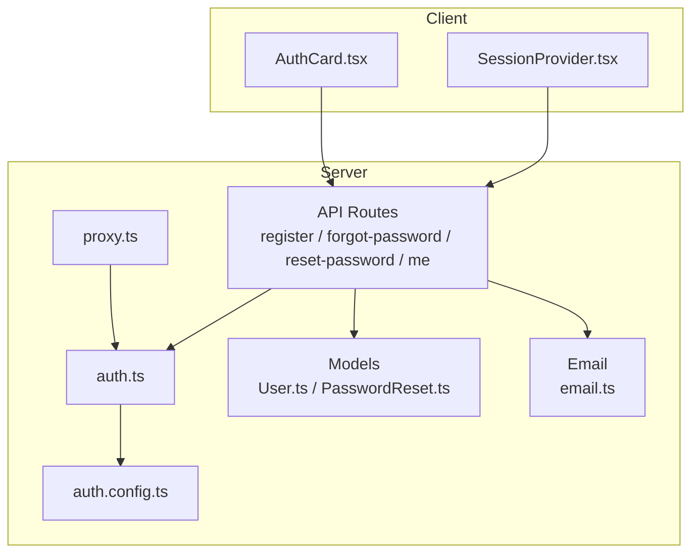
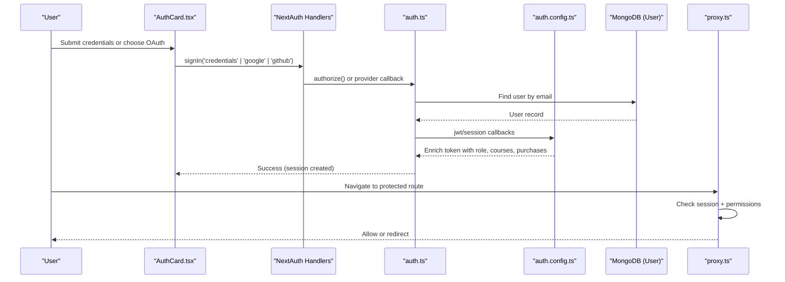
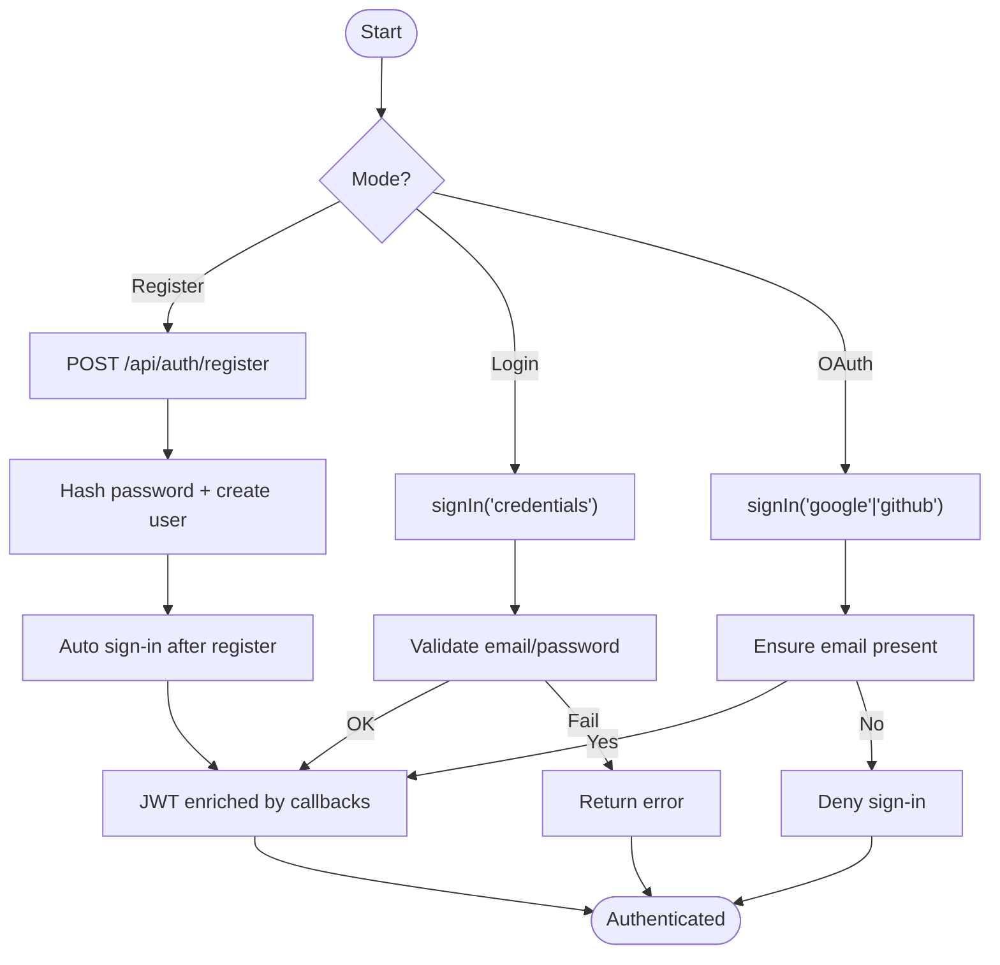
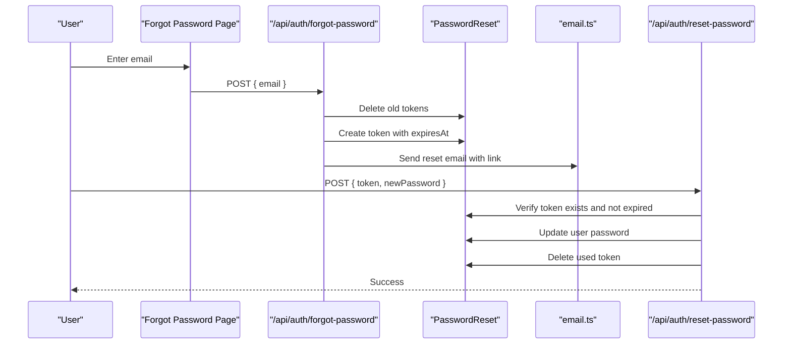
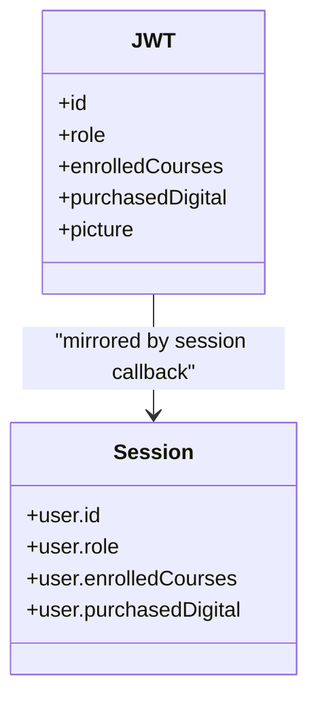
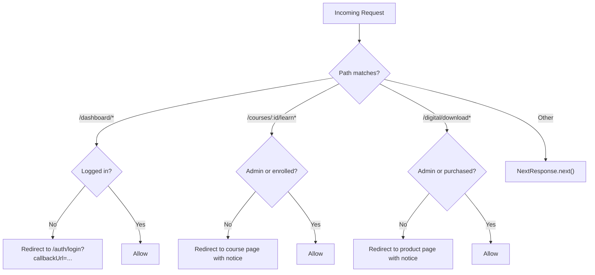
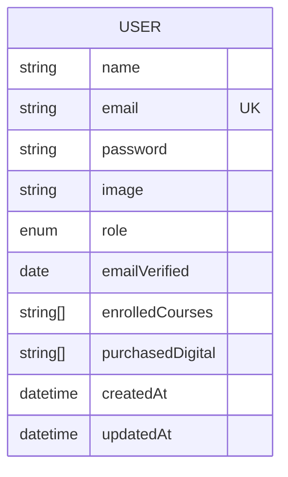
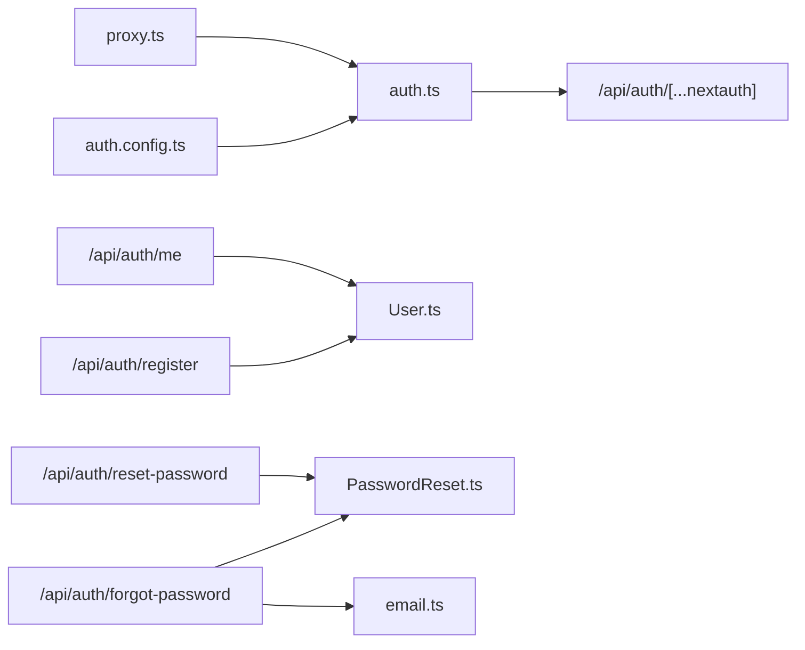

# Authentication & Authorization

<cite>
**Referenced Files in This Document**
- [auth.ts](file://auth.ts)
- [auth.config.ts](file://auth.config.ts)
- [User.ts](file://models/User.ts)
- [PasswordReset.ts](file://models/PasswordReset.ts)
- [route.ts](file://app/api/auth/[...nextauth]/route.ts)
- [register.ts](file://app/api/auth/register/route.ts)
- [forgot-password.ts](file://app/api/auth/forgot-password/route.ts)
- [reset-password.ts](file://app/api/auth/reset-password/route.ts)
- [me.ts](file://app/api/auth/me/route.ts)
- [SessionProvider.tsx](file://components/providers/SessionProvider.tsx)
- [AuthCard.tsx](file://components/auth/AuthCard.tsx)
- [proxy.ts](file://proxy.ts)
- [email.ts](file://lib/email.ts)
</cite>

## Table of Contents
1. Introduction
2. Project Structure
3. Core Components
4. Architecture Overview
5. Detailed Component Analysis
6. Dependency Analysis
7. Performance Considerations
8. Troubleshooting Guide
9. Conclusion
10. Appendices

## Introduction
This document explains the authentication and authorization system for the Digentic platform built with NextAuth.js. It covers user registration, login, password reset, session management, role-based access control (user/admin), protected routes via middleware, JWT lifecycle, security considerations, API endpoints, and guidance for extending providers.

## Project Structure
The authentication system is implemented across configuration, models, API routes, UI components, and middleware:
- Configuration and providers: auth.config.ts, auth.ts
- Data models: User.ts, PasswordReset.ts
- API routes: register, forgot-password, reset-password, me, NextAuth handlers
- Client-side session provider and auth UI: SessionProvider.tsx, AuthCard.tsx
- Route protection and permissions: proxy.ts
- Email delivery: email.ts

**Diagram sources**
- [auth.config.ts:1-100](file://auth.config.ts#L1-L100)
- [auth.ts:1-133](file://auth.ts#L1-L133)
- [proxy.ts:1-92](file://proxy.ts#L1-L92)
- [register.ts:1-76](file://app/api/auth/register/route.ts#L1-L76)
- [forgot-password.ts:1-62](file://app/api/auth/forgot-password/route.ts#L1-L62)
- [reset-password.ts:1-70](file://app/api/auth/reset-password/route.ts#L1-L70)
- [me.ts:1-51](file://app/api/auth/me/route.ts#L1-L51)
- [User.ts:1-81](file://models/User.ts#L1-L81)
- [PasswordReset.ts:1-44](file://models/PasswordReset.ts#L1-L44)
- [email.ts:1-40](file://lib/email.ts#L1-L40)

**Section sources**
- [auth.config.ts:1-100](file://auth.config.ts#L1-L100)
- [auth.ts:1-133](file://auth.ts#L1-L133)
- [proxy.ts:1-92](file://proxy.ts#L1-L92)

## Core Components
- NextAuth configuration and providers: Centralized in auth.config.ts and extended in auth.ts with credentials and social providers.
- Models: User model defines schema, roles, and password verification; PasswordReset model stores short-lived tokens.
- API routes: Registration, password reset flow, current user profile retrieval, and NextAuth handler wiring.
- Middleware: Route-level guards for dashboard, course lessons, and digital downloads based on session and permissions.
- Client integration: SessionProvider wraps the app to expose sessions; AuthCard handles login/register flows and OAuth.

**Section sources**
- [auth.config.ts:1-100](file://auth.config.ts#L1-L100)
- [auth.ts:1-133](file://auth.ts#L1-L133)
- [User.ts:1-81](file://models/User.ts#L1-L81)
- [PasswordReset.ts:1-44](file://models/PasswordReset.ts#L1-L44)
- [register.ts:1-76](file://app/api/auth/register/route.ts#L1-L76)
- [forgot-password.ts:1-62](file://app/api/auth/forgot-password/route.ts#L1-L62)
- [reset-password.ts:1-70](file://app/api/auth/reset-password/route.ts#L1-L70)
- [me.ts:1-51](file://app/api/auth/me/route.ts#L1-L51)
- [proxy.ts:1-92](file://proxy.ts#L1-L92)
- [SessionProvider.tsx:1-13](file://components/providers/SessionProvider.tsx#L1-L13)
- [AuthCard.tsx:1-605](file://components/auth/AuthCard.tsx#L1-L605)

## Architecture Overview
NextAuth.js manages authentication with JWT strategy and a MongoDB adapter. Social providers are configured alongside a custom Credentials provider that validates against the User model. The middleware enforces route-level access control using session data.

**Diagram sources**
- [auth.ts:1-133](file://auth.ts#L1-L133)
- [auth.config.ts:1-100](file://auth.config.ts#L1-L100)
- [proxy.ts:1-92](file://proxy.ts#L1-L92)
- [AuthCard.tsx:1-605](file://components/auth/AuthCard.tsx#L1-L605)

## Detailed Component Analysis

### Authentication Flow (Login, Register, OAuth)
- Login: Credentials provider validates email/password via User.comparePassword. On success, JWT is populated with id, role, enrolledCourses, purchasedDigital, and picture.
- Register: Custom API creates a hashed password, persists the user, and returns minimal user info. Frontend then signs in automatically.
- OAuth: Google and GitHub providers are configured; signIn callback ensures an email exists before proceeding.

**Diagram sources**
- [auth.ts:15-83](file://auth.ts#L15-L83)
- [auth.config.ts:21-99](file://auth.config.ts#L21-L99)
- [register.ts:6-76](file://app/api/auth/register/route.ts#L6-L76)
- [AuthCard.tsx:94-180](file://components/auth/AuthCard.tsx#L94-L180)

**Section sources**
- [auth.ts:15-83](file://auth.ts#L15-L83)
- [auth.config.ts:21-99](file://auth.config.ts#L21-L99)
- [register.ts:6-76](file://app/api/auth/register/route.ts#L6-L76)
- [AuthCard.tsx:94-180](file://components/auth/AuthCard.tsx#L94-L180)

### Password Reset Flow
- Forgot password: Validates email, deletes any existing reset tokens for the user, generates a secure random token with a 1-hour expiry, stores it, and sends an email with a reset link.
- Reset password: Validates token and new password length, verifies token not expired, hashes and updates the password, then deletes the used token.

**Diagram sources**
- [forgot-password.ts:1-62](file://app/api/auth/forgot-password/route.ts#L1-L62)
- [reset-password.ts:1-70](file://app/api/auth/reset-password/route.ts#L1-L70)
- [PasswordReset.ts:1-44](file://models/PasswordReset.ts#L1-L44)
- [email.ts:1-40](file://lib/email.ts#L1-L40)

**Section sources**
- [forgot-password.ts:1-62](file://app/api/auth/forgot-password/route.ts#L1-L62)
- [reset-password.ts:1-70](file://app/api/auth/reset-password/route.ts#L1-L70)
- [PasswordReset.ts:1-44](file://models/PasswordReset.ts#L1-L44)
- [email.ts:1-40](file://lib/email.ts#L1-L40)

### Session Management and JWT Lifecycle
- Strategy: JWT-based sessions.
- Callbacks:
  - jwt: Populates token with id, role, enrolledCourses, purchasedDigital, and picture. Supports update trigger to sync changes from server sessions.
  - session: Mirrors token fields into session.user for client consumption.
- Provider events: createUser synchronizes roles and entitlements when accounts are created via providers.

**Diagram sources**
- [auth.config.ts:30-99](file://auth.config.ts#L30-L99)
- [auth.ts:85-130](file://auth.ts#L85-L130)

**Section sources**
- [auth.config.ts:30-99](file://auth.config.ts#L30-L99)
- [auth.ts:85-130](file://auth.ts#L85-L130)

### Protected Routes and Role-Based Access Control
Middleware enforces:
- Dashboard: Requires authentication.
- Course lessons: Requires authentication and either admin role or enrollment in the specific course.
- Digital downloads: Requires authentication and either admin role or purchase ownership of the product.

**Diagram sources**
- [proxy.ts:7-78](file://proxy.ts#L7-L78)

**Section sources**
- [proxy.ts:7-78](file://proxy.ts#L7-L78)

### User Model Schema and Permissions
- Fields: name, email (unique, lowercase), optional password, image, role (enum: user/admin), emailVerified, enrolledCourses (string[]), purchasedDigital (string[]), timestamps.
- Methods: comparePassword uses bcrypt to validate candidate passwords.
- Permissions: Admin bypasses enrollment/purchase checks; otherwise, access is gated by arrays in the session/JWT.

**Diagram sources**
- [User.ts:4-67](file://models/User.ts#L4-L67)

**Section sources**
- [User.ts:4-67](file://models/User.ts#L4-L67)

### API Endpoints Reference
- POST /api/auth/register
  - Request body: name, email, password
  - Response: success message and minimal user object on 201; errors on 400/409/500
- POST /api/auth/forgot-password
  - Request body: email
  - Response: generic success message even if email not found; errors on 400/500
- POST /api/auth/reset-password
  - Request body: token, password
  - Response: success message on update; errors for invalid/expired token or validation failures
- GET /api/auth/me
  - Requires authenticated session
  - Response: full user profile excluding password; 401 if unauthenticated; 404 if user missing; 500 on errors
- NextAuth handlers
  - GET/POST /api/auth/[...nextauth]
  - Handles signIn, signOut, callbacks, and provider flows

**Section sources**
- [register.ts:6-76](file://app/api/auth/register/route.ts#L6-L76)
- [forgot-password.ts:8-62](file://app/api/auth/forgot-password/route.ts#L8-L62)
- [reset-password.ts:7-70](file://app/api/auth/reset-password/route.ts#L7-L70)
- [me.ts:6-51](file://app/api/auth/me/route.ts#L6-L51)
- [route.ts:1-4](file://app/api/auth/[...nextauth]/route.ts#L1-L4)

### Client-Side Integration
- SessionProvider wraps the application to provide NextAuth session context.
- AuthCard implements login/register forms, OAuth buttons, and redirects to callbackUrl after successful sign-in.

**Section sources**
- [SessionProvider.tsx:1-13](file://components/providers/SessionProvider.tsx#L1-L13)
- [AuthCard.tsx:1-605](file://components/auth/AuthCard.tsx#L1-L605)

## Dependency Analysis
- auth.ts depends on auth.config.ts for providers and callbacks, MongoDB adapter, and User model.
- API routes depend on Mongoose connection, User model, and PasswordReset model.
- Middleware depends on NextAuth instance and reads session.user fields set by callbacks.
- Email utility depends on SMTP environment variables.

**Diagram sources**
- [auth.config.ts:1-100](file://auth.config.ts#L1-L100)
- [auth.ts:1-133](file://auth.ts#L1-L133)
- [register.ts:1-76](file://app/api/auth/register/route.ts#L1-L76)
- [forgot-password.ts:1-62](file://app/api/auth/forgot-password/route.ts#L1-L62)
- [reset-password.ts:1-70](file://app/api/auth/reset-password/route.ts#L1-L70)
- [me.ts:1-51](file://app/api/auth/me/route.ts#L1-L51)
- [proxy.ts:1-92](file://proxy.ts#L1-L92)
- [User.ts:1-81](file://models/User.ts#L1-L81)
- [PasswordReset.ts:1-44](file://models/PasswordReset.ts#L1-L44)
- [email.ts:1-40](file://lib/email.ts#L1-L40)

**Section sources**
- [auth.ts:1-133](file://auth.ts#L1-L133)
- [auth.config.ts:1-100](file://auth.config.ts#L1-L100)
- [proxy.ts:1-92](file://proxy.ts#L1-L92)

## Performance Considerations
- Use JWT strategy to avoid frequent database reads per request; enrich tokens once during sign-in and refresh only when necessary.
- Keep session payloads minimal: include only required fields (id, role, entitlements).
- Ensure indexes exist on frequently queried fields such as email and token.
- For password reset, leverage TTL indexes to auto-expire tokens.
- Avoid heavy operations in middleware; keep checks lightweight and rely on session data.

[No sources needed since this section provides general guidance]

## Troubleshooting Guide
Common issues and mitigations:
- Invalid credentials: Ensure email normalization and password hashing match between registration and login.
- OAuth sign-in fails without email: Providers require email presence; handle gracefully and inform users.
- Password reset link expired: Tokens expire after 1 hour; prompt users to request a new link.
- Unauthorized access to protected routes: Middleware will redirect to login with callbackUrl; verify session availability.
- Email not sent: Confirm SMTP settings; in development mode, reset links are logged to console.

**Section sources**
- [auth.ts:21-83](file://auth.ts#L21-L83)
- [auth.config.ts:21-29](file://auth.config.ts#L21-L29)
- [forgot-password.ts:24-48](file://app/api/auth/forgot-password/route.ts#L24-L48)
- [reset-password.ts:27-56](file://app/api/auth/reset-password/route.ts#L27-L56)
- [proxy.ts:12-78](file://proxy.ts#L12-L78)
- [email.ts:3-39](file://lib/email.ts#L3-L39)

## Conclusion
The Digentic platform uses NextAuth.js with JWT sessions, robust role-based access control, and clear separation of concerns between configuration, models, API routes, and middleware. Security is reinforced through hashed passwords, short-lived reset tokens, and server-side route guards. Extending functionality involves adding providers in auth.config.ts, updating JWT/session callbacks, and refining middleware rules.

[No sources needed since this section summarizes without analyzing specific files]

## Appendices

### Best Practices and Security Considerations
- Enforce strong password policies and minimum lengths consistently on both client and server.
- Never log sensitive data (passwords, tokens); use structured logging for errors.
- Rotate secrets regularly and store them securely in environment variables.
- Validate and sanitize all inputs at API boundaries.
- Limit exposed fields in responses (e.g., exclude passwords).
- Use HTTPS everywhere and configure secure cookie flags where applicable.
- Monitor failed login attempts and consider rate limiting.

[No sources needed since this section provides general guidance]

### Extending Authentication Providers
- Add a new provider in auth.config.ts under providers array.
- If needed, adjust jwt/session callbacks to map provider fields to token/session.
- Update middleware if the new provider introduces new roles or entitlements.

**Section sources**
- [auth.config.ts:9-20](file://auth.config.ts#L9-L20)
- [auth.config.ts:30-99](file://auth.config.ts#L30-L99)
- [proxy.ts:12-78](file://proxy.ts#L12-L78)