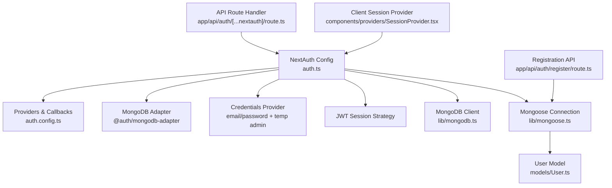
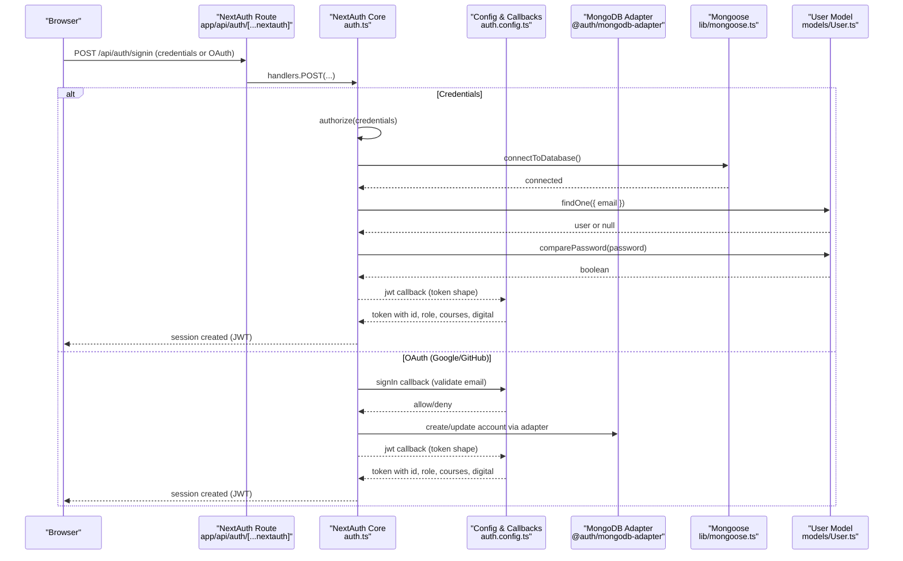
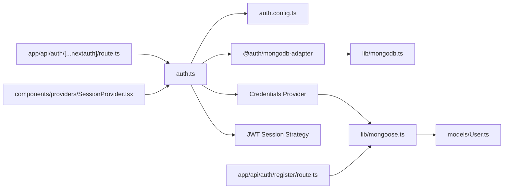

# NextAuth.js Configuration

<cite>
**Referenced Files in This Document**
- [auth.ts](file://auth.ts)
- [auth.config.ts](file://auth.config.ts)
- [route.ts](file://app/api/auth/[...nextauth]/route.ts)
- [mongodb.ts](file://lib/mongodb.ts)
- [mongoose.ts](file://lib/mongoose.ts)
- [User.ts](file://models/User.ts)
- [register/route.ts](file://app/api/auth/register/route.ts)
- [SessionProvider.tsx](file://components/providers/SessionProvider.tsx)
- [package.json](file://package.json)
</cite>

## Table of Contents
1. [Introduction](#introduction)
2. [Project Structure](#project-structure)
3. [Core Components](#core-components)
4. [Architecture Overview](#architecture-overview)
5. [Detailed Component Analysis](#detailed-component-analysis)
6. [Dependency Analysis](#dependency-analysis)
7. [Performance Considerations](#performance-considerations)
8. [Troubleshooting Guide](#troubleshooting-guide)
9. [Conclusion](#conclusion)
10. [Appendices](#appendices)

## Introduction
This document explains how NextAuth.js is configured in the Digentic platform. It covers the main authentication setup, MongoDB adapter integration, JWT session strategy, provider configuration (Google and GitHub), credentials provider with email/password validation, temporary admin login for development/testing, user data mapping to sessions and tokens, and environment variable requirements. It also provides guidance on adding new providers, customizing session handling, and configuring security options.

## Project Structure
Authentication-related files are organized as follows:
- Core NextAuth configuration and runtime exports live in auth.ts and auth.config.ts.
- The API route handler for NextAuth endpoints is at app/api/auth/[...nextauth]/route.ts.
- Database connections are managed by lib/mongodb.ts (MongoDB client) and lib/mongoose.ts (Mongoose connection).
- User model and password hashing logic are defined in models/User.ts.
- Registration flow is implemented in app/api/auth/register/route.ts.
- Client-side session context is provided via components/providers/SessionProvider.tsx.

**Diagram sources**
- [auth.ts:9-84](file://auth.ts#L9-L84)
- [auth.config.ts:5-100](file://auth.config.ts#L5-L100)
- [route.ts:1-4](file://app/api/auth/[...nextauth]/route.ts#L1-L4)
- [mongodb.ts:1-38](file://lib/mongodb.ts#L1-L38)
- [mongoose.ts:1-47](file://lib/mongoose.ts#L1-L47)
- [User.ts:1-81](file://models/User.ts#L1-L81)
- [register/route.ts:1-76](file://app/api/auth/register/route.ts#L1-L76)
- [SessionProvider.tsx:1-13](file://components/providers/SessionProvider.tsx#L1-L13)

**Section sources**
- [auth.ts:1-133](file://auth.ts#L1-L133)
- [auth.config.ts:1-101](file://auth.config.ts#L1-L101)
- [route.ts:1-4](file://app/api/auth/[...nextauth]/route.ts#L1-L4)
- [mongodb.ts:1-38](file://lib/mongodb.ts#L1-L38)
- [mongoose.ts:1-47](file://lib/mongoose.ts#L1-L47)
- [User.ts:1-81](file://models/User.ts#L1-L81)
- [register/route.ts:1-76](file://app/api/auth/register/route.ts#L1-L76)
- [SessionProvider.tsx:1-13](file://components/providers/SessionProvider.tsx#L1-L13)

## Core Components
- NextAuth initialization and exports: handlers, auth, signIn, signOut are exported from auth.ts and mounted at the catch-all route.
- Providers: Google and GitHub from auth.config.ts; Credentials provider added in auth.ts for email/password and temporary admin login.
- Session strategy: JWT-based sessions configured in auth.ts.
- MongoDB adapter: @auth/mongodb-adapter integrates with a shared MongoDB client promise.
- Mongoose model: User schema includes role, enrolledCourses, purchasedDigital, and password hashing method.
- Registration API: Validates input, hashes password, creates user, returns minimal user info.
- Client session provider: Wraps application with NextAuth’s SessionProvider for client access to session data.

Key responsibilities:
- auth.ts: Orchestrates providers, adapter, session strategy, events, and merges config from auth.config.ts.
- auth.config.ts: Declares OAuth providers, signIn page, and callbacks for token/session shaping.
- mongodb.ts: Provides a reusable MongoClient instance and database getter.
- mongoose.ts: Manages a cached Mongoose connection for efficient DB operations.
- User.ts: Defines schema, validations, and comparePassword utility.
- register/route.ts: Implements secure registration with validation and bcrypt hashing.
- SessionProvider.tsx: Enables client-side session consumption.

**Section sources**
- [auth.ts:9-131](file://auth.ts#L9-L131)
- [auth.config.ts:5-100](file://auth.config.ts#L5-L100)
- [mongodb.ts:1-38](file://lib/mongodb.ts#L1-L38)
- [mongoose.ts:1-47](file://lib/mongoose.ts#L1-L47)
- [User.ts:19-78](file://models/User.ts#L19-L78)
- [register/route.ts:6-67](file://app/api/auth/register/route.ts#L6-L67)
- [SessionProvider.tsx:6-12](file://components/providers/SessionProvider.tsx#L6-L12)

## Architecture Overview
The authentication architecture combines server-side NextAuth with client-side session context and persistent storage in MongoDB.

**Diagram sources**
- [route.ts:1-4](file://app/api/auth/[...nextauth]/route.ts#L1-L4)
- [auth.ts:9-84](file://auth.ts#L9-L84)
- [auth.config.ts:21-98](file://auth.config.ts#L21-L98)
- [mongodb.ts:1-38](file://lib/mongodb.ts#L1-L38)
- [mongoose.ts:21-44](file://lib/mongoose.ts#L21-L44)
- [User.ts:69-75](file://models/User.ts#L69-L75)

## Detailed Component Analysis

### Main Authentication Setup (auth.ts)
- Initializes NextAuth with merged configuration from auth.config.ts.
- Uses MongoDB adapter for session and account persistence.
- Sets JWT session strategy for stateless sessions.
- Adds Credentials provider with:
  - Email/password validation.
  - Temporary admin login using environment variables for email and password.
  - User lookup via Mongoose and password verification.
  - Mapping of user fields into NextAuth user object including roles and entitlements.
- Events:
  - createUser: Ensures admin privileges and entitlements when creating or updating users.
  - linkAccount: Logs account linking events.

Security notes:
- Temporary admin credentials should only be used in development/test environments.
- Passwords are compared using bcrypt via the User model method.

**Section sources**
- [auth.ts:9-131](file://auth.ts#L9-L131)

### Credentials Provider Implementation
- Validates presence of email and password.
- Normalizes email (lowercase, trimmed).
- Checks temporary admin credentials first if they match environment variables.
- Otherwise connects to database, finds user by email, verifies password, and maps user data to NextAuth user object.
- Returns null on failure to authenticate.

Data mapping highlights:
- id, name, email, image, role, enrolledCourses, purchasedDigital are included.
- Arrays are normalized to strings where necessary.

**Section sources**
- [auth.ts:15-83](file://auth.ts#L15-L83)

### Temporary Admin Login
- Controlled by TEMP_ADMIN_EMAIL and TEMP_ADMIN_PASSWORD environment variables.
- When matched, returns a special user object with admin role and full access arrays.
- Also handled in JWT callback to ensure consistent token claims.

Usage recommendation:
- Disable or remove temporary admin login in production by not setting these environment variables.

**Section sources**
- [auth.ts:29-47](file://auth.ts#L29-L47)
- [auth.config.ts:30-63](file://auth.config.ts#L30-L63)

### JWT Session Strategy and Callbacks
- Session strategy set to JWT in auth.ts.
- jwt callback populates token with:
  - id (from user.id or _id).
  - role (defaulting to 'user').
  - enrolledCourses and purchasedDigital (normalized arrays).
  - picture (if present).
- session callback enriches session.user with the same fields for client usage.
- signIn callback ensures OAuth logins require an email.

Customization opportunities:
- Extend token/session with additional claims.
- Implement refresh or rotation strategies if needed.

**Section sources**
- [auth.ts:12-12](file://auth.ts#L12-L12)
- [auth.config.ts:21-98](file://auth.config.ts#L21-L98)

### Provider Configuration (Google and GitHub)
- Providers declared in auth.config.ts with clientId and clientSecret read from environment variables.
- allowDangerousEmailAccountLinking enabled to support linking accounts across providers.
- signIn callback enforces email presence for these providers.

Adding a new provider:
- Import the provider in auth.config.ts.
- Add it to the providers array with required environment variables.
- If needed, extend jwt/session callbacks to include provider-specific claims.

**Section sources**
- [auth.config.ts:9-20](file://auth.config.ts#L9-L20)
- [auth.config.ts:21-29](file://auth.config.ts#L21-L29)

### MongoDB Adapter Integration
- Uses @auth/mongodb-adapter with a shared MongoDB client promise from lib/mongodb.ts.
- Ensures sessions, accounts, and verification tokens are stored in MongoDB.
- Complements Mongoose-based user model for custom business logic.

Environment variables:
- MONGODB_URI controls the database connection string.

**Section sources**
- [auth.ts:2-4](file://auth.ts#L2-L4)
- [mongodb.ts:1-38](file://lib/mongodb.ts#L1-L38)

### Mongoose Connection and User Model
- Mongoose connection is cached globally to avoid reconnection overhead.
- User model defines schema, validations, timestamps, and collection name aligned with NextAuth collections.
- comparePassword method uses bcrypt to verify passwords securely.

Best practices:
- Ensure MONGODB_URI is correctly set for your environment.
- Keep password hashing salt rounds appropriate for performance and security.

**Section sources**
- [mongoose.ts:1-47](file://lib/mongoose.ts#L1-L47)
- [User.ts:19-78](file://models/User.ts#L19-L78)

### Registration Flow
- Validates name, email format, and password length.
- Connects to database and checks for existing user by normalized email.
- Hashes password with bcrypt before saving.
- Creates user with default role and empty entitlement arrays.
- Returns success response with minimal user details.

Error handling:
- Returns appropriate HTTP status codes for validation errors, conflicts, and server errors.

**Section sources**
- [register/route.ts:6-67](file://app/api/auth/register/route.ts#L6-L67)

### Client-Side Session Provider
- Wraps application with NextAuth’s SessionProvider to expose session data to client components.
- Enables use of hooks like useSession for UI state and authorization checks.

Integration note:
- Ensure this provider is mounted near the root of your React tree.

**Section sources**
- [SessionProvider.tsx:1-13](file://components/providers/SessionProvider.tsx#L1-L13)

## Dependency Analysis
NextAuth depends on several modules and services:

**Diagram sources**
- [auth.ts:1-131](file://auth.ts#L1-L131)
- [auth.config.ts:1-101](file://auth.config.ts#L1-L101)
- [route.ts:1-4](file://app/api/auth/[...nextauth]/route.ts#L1-L4)
- [mongodb.ts:1-38](file://lib/mongodb.ts#L1-L38)
- [mongoose.ts:1-47](file://lib/mongoose.ts#L1-L47)
- [User.ts:1-81](file://models/User.ts#L1-L81)
- [register/route.ts:1-76](file://app/api/auth/register/route.ts#L1-L76)
- [SessionProvider.tsx:1-13](file://components/providers/SessionProvider.tsx#L1-L13)

**Section sources**
- [package.json:12-36](file://package.json#L12-L36)

## Performance Considerations
- JWT sessions reduce server load by avoiding server-side session stores.
- MongoDB adapter leverages a pooled client connection for efficiency.
- Mongoose connection caching prevents repeated connection overhead.
- Password hashing cost (bcrypt) balances security and performance; adjust salt rounds based on deployment needs.
- Normalize and index emails to speed up lookups.

[No sources needed since this section provides general guidance]

## Troubleshooting Guide
Common issues and resolutions:
- Missing environment variables:
  - Ensure MONGODB_URI, GOOGLE_CLIENT_ID, GOOGLE_CLIENT_SECRET, GITHUB_CLIENT_ID, GITHUB_CLIENT_SECRET are set.
  - For temporary admin login, set TEMP_ADMIN_EMAIL and TEMP_ADMIN_PASSWORD only in development/test.
- Database connectivity:
  - Verify MONGODB_URI points to a reachable MongoDB instance.
  - Check network/firewall rules and credentials if using Atlas or remote databases.
- OAuth failures:
  - Confirm redirect URIs and scopes in provider console settings.
  - Ensure allowDangerousEmailAccountLinking matches your policy.
- Registration errors:
  - Validate email format and password length constraints.
  - Handle duplicate email conflicts gracefully.
- Session inconsistencies:
  - Review jwt and session callbacks to ensure all required fields are propagated.
  - Clear browser cookies if session corruption is suspected.

**Section sources**
- [auth.config.ts:10-19](file://auth.config.ts#L10-L19)
- [auth.ts:29-47](file://auth.ts#L29-L47)
- [register/route.ts:11-30](file://app/api/auth/register/route.ts#L11-L30)

## Conclusion
The Digentic platform uses NextAuth.js with a JWT session strategy, MongoDB adapter, and multiple providers (Google, GitHub, Credentials). The configuration cleanly separates provider definitions and callbacks from runtime setup, enabling easy extension and customization. Security is enforced through validated inputs, hashed passwords, and controlled temporary admin access. Environment variables centralize sensitive configuration, and the modular structure supports scalable authentication features.

[No sources needed since this section summarizes without analyzing specific files]

## Appendices

### Environment Variables Reference
- MONGODB_URI: MongoDB connection string for both MongoDB adapter and Mongoose.
- GOOGLE_CLIENT_ID, GOOGLE_CLIENT_SECRET: Google OAuth credentials.
- GITHUB_CLIENT_ID, GITHUB_CLIENT_SECRET: GitHub OAuth credentials.
- TEMP_ADMIN_EMAIL, TEMP_ADMIN_PASSWORD: Temporary admin credentials for development/testing.

[No sources needed since this section lists environment variables conceptually]

### Adding a New Authentication Provider
Steps:
- Import the provider in auth.config.ts.
- Add it to the providers array with required environment variables.
- Update signIn callback if you need provider-specific validation.
- Extend jwt/session callbacks to include any provider-specific claims.

Example reference paths:
- Provider declaration pattern: [auth.config.ts:9-20](file://auth.config.ts#L9-L20)
- SignIn validation pattern: [auth.config.ts:21-29](file://auth.config.ts#L21-L29)
- Token/session enrichment pattern: [auth.config.ts:30-98](file://auth.config.ts#L30-L98)

**Section sources**
- [auth.config.ts:9-20](file://auth.config.ts#L9-L20)
- [auth.config.ts:21-98](file://auth.config.ts#L21-L98)

### Customizing Session Handling
- Modify jwt callback to add or transform token fields.
- Update session callback to mirror token changes onto session.user.
- Use events like createUser to initialize or update user attributes upon account creation.

Reference paths:
- jwt callback: [auth.config.ts:30-84](file://auth.config.ts#L30-L84)
- session callback: [auth.config.ts:86-98](file://auth.config.ts#L86-L98)
- createUser event: [auth.ts:85-126](file://auth.ts#L85-L126)

**Section sources**
- [auth.config.ts:30-98](file://auth.config.ts#L30-L98)
- [auth.ts:85-126](file://auth.ts#L85-L126)

### Security Options and Best Practices
- Use HTTPS in production to protect cookies and tokens.
- Restrict temporary admin login to non-production environments.
- Enforce strong password policies during registration.
- Regularly rotate OAuth secrets and database credentials.
- Monitor logs for failed sign-ins and account linking events.

[No sources needed since this section provides general guidance]