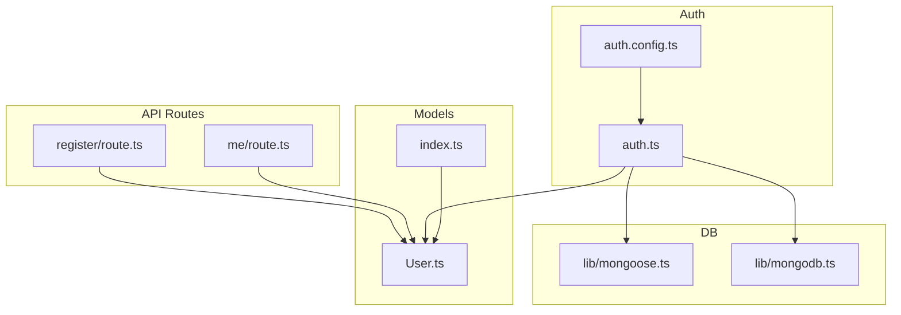
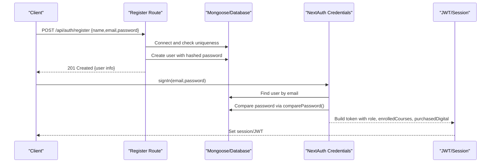
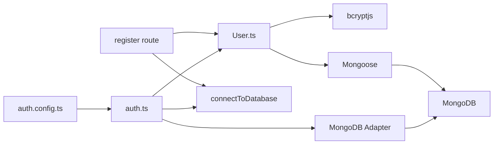

# User Model & Schema

<cite>
**Referenced Files in This Document**
- [User.ts](file://models/User.ts)
- [index.ts](file://models/index.ts)
- [route.ts (register)](file://app/api/auth/register/route.ts)
- [route.ts (me)](file://app/api/auth/me/route.ts)
- [auth.ts](file://auth.ts)
- [auth.config.ts](file://auth.config.ts)
- [mongoose.ts](file://lib/mongoose.ts)
- [mongodb.ts](file://lib/mongodb.ts)
</cite>

## Table of Contents
1. [Introduction](#introduction)
2. [Project Structure](#project-structure)
3. [Core Components](#core-components)
4. [Architecture Overview](#architecture-overview)
5. [Detailed Component Analysis](#detailed-component-analysis)
6. [Dependency Analysis](#dependency-analysis)
7. [Performance Considerations](#performance-considerations)
8. [Troubleshooting Guide](#troubleshooting-guide)
9. [Conclusion](#conclusion)
10. [Appendices](#appendices)

## Introduction
This document provides a comprehensive guide to the User model schema and data structure used across authentication, authorization, and user profile features. It explains all fields, validation rules, data types, password hashing with bcrypt, role-based access control, feature permissions arrays for enrolled courses and purchased digital products, and how users relate to other entities such as courses and digital assets. It also includes examples of creating, updating, and querying users, along with security considerations for password handling.

## Project Structure
The User model is defined using Mongoose and integrated with NextAuth for authentication flows. The relevant files include:
- Model definition and methods: models/User.ts
- Model exports: models/index.ts
- Authentication and session configuration: auth.ts, auth.config.ts
- Registration and profile endpoints: app/api/auth/register/route.ts, app/api/auth/me/route.ts
- Database connections: lib/mongoose.ts, lib/mongodb.ts

**Diagram sources**
- [User.ts:19-67](file://models/User.ts#L19-L67)
- [index.ts:1-4](file://models/index.ts#L1-L4)
- [auth.ts:1-133](file://auth.ts#L1-L133)
- [auth.config.ts:1-129](file://auth.config.ts#L1-L129)
- [route.ts (register):1-76](file://app/api/auth/register/route.ts#L1-L76)
- [route.ts (me):1-51](file://app/api/auth/me/route.ts#L1-L51)
- [mongoose.ts:1-47](file://lib/mongoose.ts#L1-L47)
- [mongodb.ts:1-38](file://lib/mongodb.ts#L1-L38)

**Section sources**
- [User.ts:19-67](file://models/User.ts#L19-L67)
- [index.ts:1-4](file://models/index.ts#L1-L4)
- [auth.ts:1-133](file://auth.ts#L1-L133)
- [auth.config.ts:1-129](file://auth.config.ts#L1-L129)
- [route.ts (register):1-76](file://app/api/auth/register/route.ts#L1-L76)
- [route.ts (me):1-51](file://app/api/auth/me/route.ts#L1-L51)
- [mongoose.ts:1-47](file://lib/mongoose.ts#L1-L47)
- [mongodb.ts:1-38](file://lib/mongodb.ts#L1-L38)

## Core Components
- User schema defines fields for identity, credentials, profile, roles, and feature permissions.
- Password hashing uses bcryptjs; comparePassword method validates candidate passwords against stored hashes.
- Role-based access control uses an enum field to restrict or enable admin capabilities.
- Feature permissions are represented by arrays storing references to courses and digital products.
- Integration with NextAuth enables OAuth and credential-based login, mapping DB fields into JWT/session.

Key responsibilities:
- Data validation at schema level (required, unique, format checks).
- Secure password storage and verification.
- Consistent user representation in sessions and API responses.

**Section sources**
- [User.ts:1-81](file://models/User.ts#L1-L81)
- [auth.ts:21-83](file://auth.ts#L21-L83)
- [auth.config.ts:21-129](file://auth.config.ts#L21-L129)

## Architecture Overview
The system combines Mongoose for schema modeling and NextAuth for authentication. Registration creates hashed passwords and default feature arrays. Login verifies credentials via comparePassword and builds session tokens that include role and permissions. Profile retrieval excludes sensitive fields like password.

**Diagram sources**
- [route.ts (register):6-67](file://app/api/auth/register/route.ts#L6-L67)
- [auth.ts:21-83](file://auth.ts#L21-L83)
- [User.ts:69-75](file://models/User.ts#L69-L75)
- [auth.config.ts:58-129](file://auth.config.ts#L58-L129)

## Detailed Component Analysis

### User Schema Fields and Validation
- name: String, required, trimmed, max length enforced.
- email: String, required, unique, lowercased, trimmed, validated with regex pattern, indexed.
- password: String, optional in schema but required for credential-based login; minimum length enforced.
- image: String, nullable default.
- role: Enum 'user' | 'admin', defaults to 'user'.
- emailVerified: Date, nullable default.
- enrolledCourses: Array of Strings, default empty array.
- purchasedDigital: Array of Strings, default empty array.
- timestamps: createdAt and updatedAt automatically managed.

Security notes:
- Email is normalized to lowercase and trimmed before storage and queries.
- Passwords are never stored in plain text; they are hashed during registration and reset flows.
- Sensitive fields (password) are excluded from profile responses.

**Section sources**
- [User.ts:19-67](file://models/User.ts#L19-L67)
- [route.ts (me):19-21](file://app/api/auth/me/route.ts#L19-L21)

### Password Hashing and comparePassword
- Hashing: During registration and password reset, passwords are hashed using bcryptjs with a cost factor suitable for secure storage.
- Verification: comparePassword compares a candidate password against the stored hash asynchronously and returns a boolean.

Usage patterns:
- Registration endpoint hashes the incoming password before persisting.
- Credential-based login calls comparePassword to validate user input.
- Reset password flow updates the stored hash after validating the reset token.

Security considerations:
- Use strong hashing parameters (cost factor) to resist brute-force attacks.
- Never log or expose raw passwords.
- Ensure consistent normalization of emails before comparisons.

**Section sources**
- [route.ts (register):43-53](file://app/api/auth/register/route.ts#L43-L53)
- [route.ts (reset-password):44-53](file://app/api/auth/reset-password/route.ts#L44-L53)
- [User.ts:69-75](file://models/User.ts#L69-L75)
- [auth.ts:49-60](file://auth.ts#L49-L60)

### Role-Based Access Control (RBAC)
- Role field determines access levels: 'user' or 'admin'.
- Temporary admin support exists for development/testing via environment variables; this grants admin privileges and full access to courses and digital assets in sessions.
- For production, roles should be set based on verified criteria and persisted in the database.

Behavior:
- During sign-in, the role is included in the JWT and session.
- Admins may receive special treatment in redirects and permission checks.

**Section sources**
- [User.ts:45-49](file://models/User.ts#L45-L49)
- [auth.ts:29-47](file://auth.ts#L29-L47)
- [auth.config.ts:28-55](file://auth.config.ts#L28-L55)

### Feature Permissions: enrolledCourses and purchasedDigital
- enrolledCourses: Array of strings representing course identifiers the user has enrolled in.
- purchasedDigital: Array of strings representing digital product identifiers the user has purchased.
- These arrays are used to gate access to content and features.
- In temporary admin mode, these arrays can be set to ['all'] to grant unrestricted access.

Integration points:
- NextAuth maps these arrays into JWT and session objects for client-side and server-side checks.
- APIs can query these arrays to determine access to specific resources.

**Section sources**
- [User.ts:54-61](file://models/User.ts#L54-L61)
- [auth.config.ts:81-91](file://auth.config.ts#L81-L91)
- [auth.config.ts:118-123](file://auth.config.ts#L118-L123)
- [auth.ts:62-77](file://auth.ts#L62-L77)

### Relationships to Courses and Digital Products
- Users reference courses and digital products via string arrays (enrolledCourses, purchasedDigital).
- While not enforcing foreign keys at the schema level, these arrays act as logical relationships.
- To enforce referential integrity, consider adding validation or background jobs to ensure referenced IDs exist in their respective collections.

Best practices:
- Validate existence of referenced IDs when enrolling or purchasing.
- Use indexes on referenced IDs in course and digital product collections for efficient lookups.

**Section sources**
- [User.ts:54-61](file://models/User.ts#L54-L61)

### Examples: Creation, Updates, Queries

- Create a user:
  - Endpoint: POST /api/auth/register
  - Validates name, email, password; normalizes email; hashes password; sets default role and empty arrays; returns created user info without password.

- Update a user's password:
  - Endpoint: POST /api/auth/reset-password
  - Validates reset token and new password; hashes new password; updates user record; cleans up reset token.

- Query current user profile:
  - Endpoint: GET /api/auth/me
  - Requires authenticated session; fetches user by email; excludes password; returns profile including role and permissions.

- Authenticate with credentials:
  - Flow: NextAuth Credentials provider finds user by email; uses comparePassword; builds session with role and permissions.

**Section sources**
- [route.ts (register):6-67](file://app/api/auth/register/route.ts#L6-L67)
- [route.ts (reset-password):7-69](file://app/api/auth/reset-password/route.ts#L7-L69)
- [route.ts (me):6-51](file://app/api/auth/me/route.ts#L6-L51)
- [auth.ts:21-83](file://auth.ts#L21-L83)

## Dependency Analysis
- User model depends on Mongoose for schema and methods, and bcryptjs for password hashing.
- Authentication depends on NextAuth and MongoDB adapter; it integrates with both direct MongoDB client and Mongoose connection.
- API routes depend on User model and database connection utilities.

**Diagram sources**
- [User.ts:1-3](file://models/User.ts#L1-L3)
- [route.ts (register):1-4](file://app/api/auth/register/route.ts#L1-L4)
- [auth.ts:1-7](file://auth.ts#L1-L7)
- [auth.config.ts:1-7](file://auth.config.ts#L1-L7)
- [mongoose.ts:1-47](file://lib/mongoose.ts#L1-L47)
- [mongodb.ts:1-38](file://lib/mongodb.ts#L1-L38)

**Section sources**
- [User.ts:1-3](file://models/User.ts#L1-L3)
- [auth.ts:1-7](file://auth.ts#L1-L7)
- [auth.config.ts:1-7](file://auth.config.ts#L1-L7)
- [route.ts (register):1-4](file://app/api/auth/register/route.ts#L1-L4)
- [mongoose.ts:1-47](file://lib/mongoose.ts#L1-L47)
- [mongodb.ts:1-38](file://lib/mongodb.ts#L1-L38)

## Performance Considerations
- Indexing: Email is indexed for fast lookups during authentication and profile retrieval.
- Connection pooling: Mongoose connection caching reduces overhead across requests.
- Selective projection: Profile endpoint excludes password to minimize payload size and improve security.
- Hashing cost: Adjust bcrypt cost factor based on performance requirements and security posture.

[No sources needed since this section provides general guidance]

## Troubleshooting Guide
Common issues and resolutions:
- Duplicate email during registration:
  - Cause: Unique constraint violation.
  - Resolution: Normalize email and check existence before creation.

- Invalid credentials:
  - Cause: Missing password or incorrect comparison.
  - Resolution: Ensure password is present and use comparePassword for verification.

- Unauthorized access:
  - Cause: Missing or invalid session.
  - Resolution: Verify session presence and email before querying user profile.

- Role misconfiguration:
  - Cause: Incorrect role assignment or missing environment variables for temporary admin.
  - Resolution: Confirm role values and environment settings; avoid relying solely on temporary admin in production.

**Section sources**
- [route.ts (register):11-41](file://app/api/auth/register/route.ts#L11-L41)
- [auth.ts:49-60](file://auth.ts#L49-L60)
- [route.ts (me):10-28](file://app/api/auth/me/route.ts#L10-L28)

## Conclusion
The User model provides a robust foundation for identity, authentication, and authorization. It enforces strict validation, secure password handling, and supports role-based access control and feature permissions through arrays. Integration with NextAuth ensures consistent session management and secure credential verification. Following the outlined best practices will help maintain security, scalability, and clarity in user-related operations.

[No sources needed since this section summarizes without analyzing specific files]

## Appendices

### Field Reference Summary
- name: Full name; required; trimmed; max length enforced.
- email: Unique, normalized, validated email; indexed.
- password: Optional in schema; hashed at rest; minimum length enforced.
- image: Optional profile image URL.
- role: Enum 'user' | 'admin'; default 'user'.
- emailVerified: Timestamp indicating email verification status.
- enrolledCourses: Array of course IDs; default empty.
- purchasedDigital: Array of digital product IDs; default empty.
- createdAt, updatedAt: Auto-managed timestamps.

**Section sources**
- [User.ts:19-67](file://models/User.ts#L19-L67)

### Security Checklist
- Always hash passwords before storage.
- Use comparePassword for verification; never store or compare plaintext.
- Exclude sensitive fields from API responses.
- Normalize inputs (email) consistently.
- Validate and sanitize all user-provided data.
- Limit temporary admin usage to development environments.

**Section sources**
- [route.ts (register):43-53](file://app/api/auth/register/route.ts#L43-L53)
- [route.ts (reset-password):44-53](file://app/api/auth/reset-password/route.ts#L44-L53)
- [User.ts:69-75](file://models/User.ts#L69-L75)
- [route.ts (me):19-21](file://app/api/auth/me/route.ts#L19-L21)