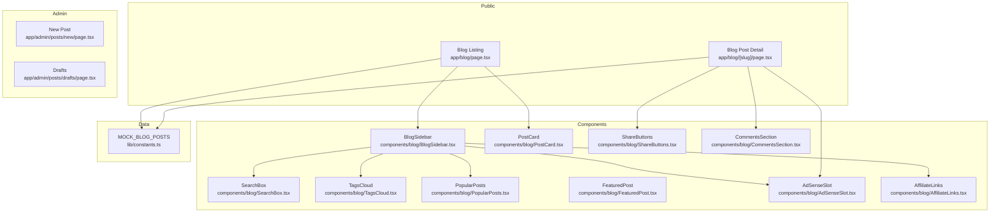
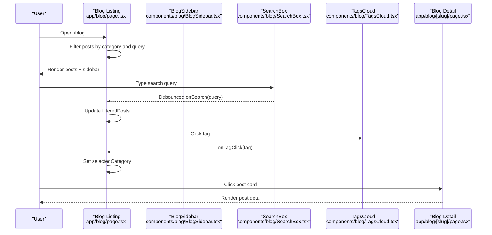
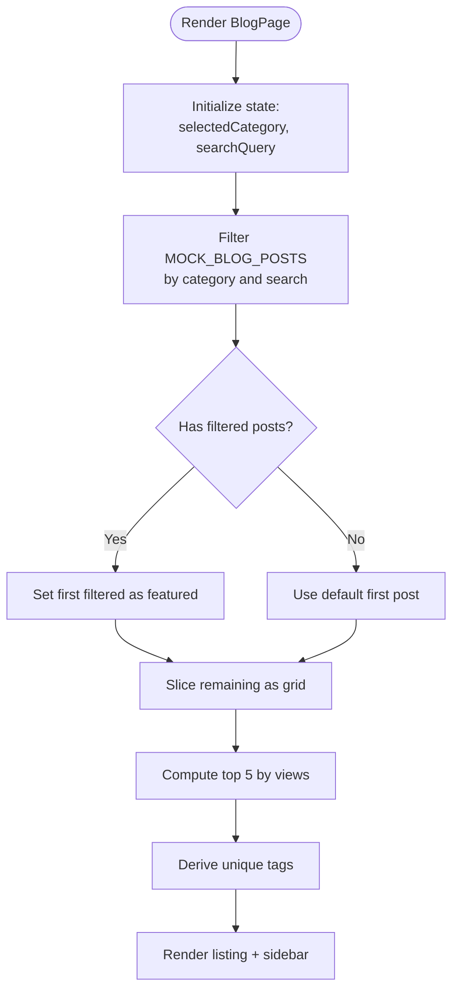
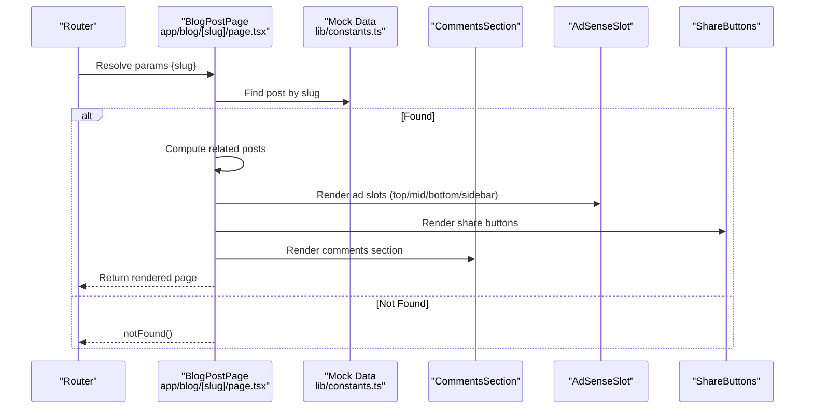
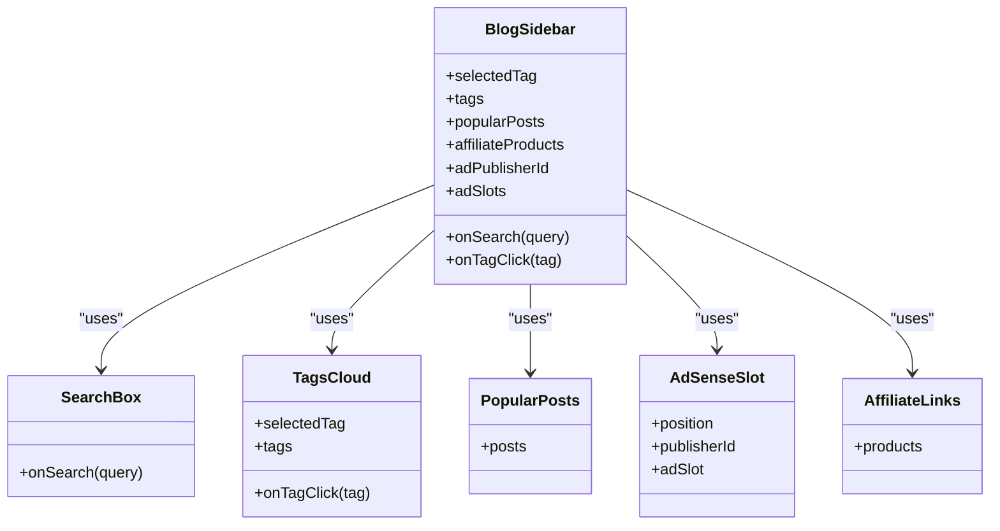
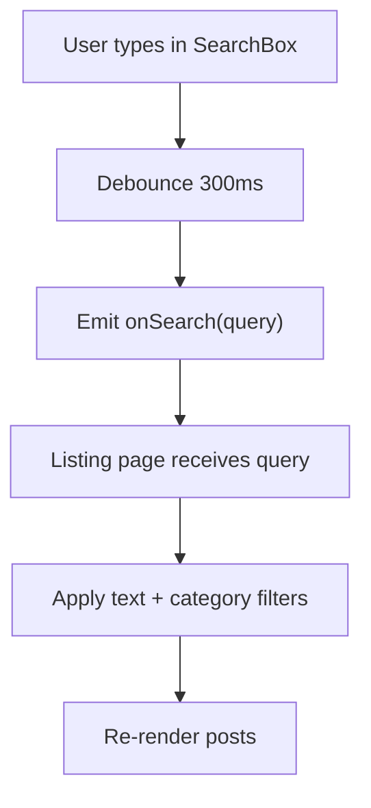
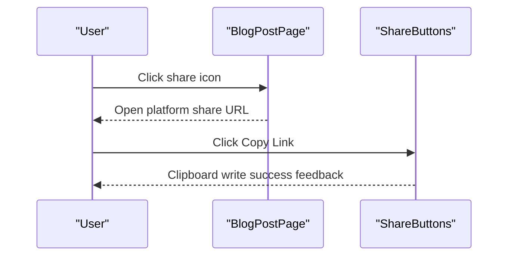
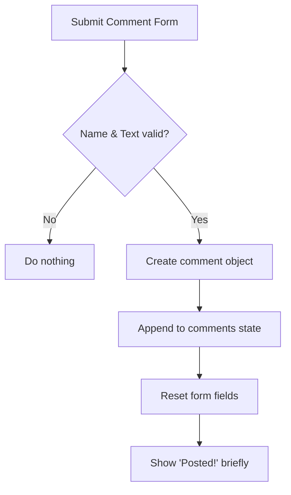
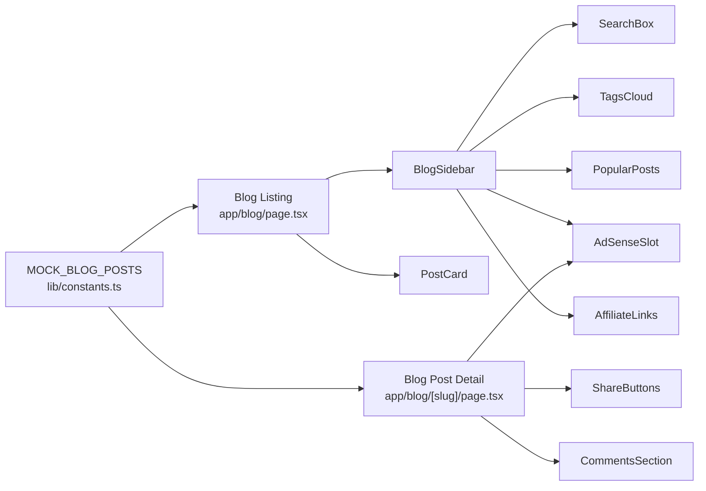

# Blog System

<cite>
**Referenced Files in This Document**
- [page.tsx](file://app/blog/page.tsx)
- [page.tsx](file://app/blog/[slug]/page.tsx)
- [BlogSidebar.tsx](file://components/blog/BlogSidebar.tsx)
- [CommentsSection.tsx](file://components/blog/CommentsSection.tsx)
- [SearchBox.tsx](file://components/blog/SearchBox.tsx)
- [ShareButtons.tsx](file://components/blog/ShareButtons.tsx)
- [TagsCloud.tsx](file://components/blog/TagsCloud.tsx)
- [PostCard.tsx](file://components/blog/PostCard.tsx)
- [FeaturedPost.tsx](file://components/blog/FeaturedPost.tsx)
- [PopularPosts.tsx](file://components/blog/PopularPosts.tsx)
- [AffiliateLinks.tsx](file://components/blog/AffiliateLinks.tsx)
- [AdSenseSlot.tsx](file://components/blog/AdSenseSlot.tsx)
- [constants.ts](file://lib/constants.ts)
- [page.tsx](file://app/admin/posts/new/page.tsx)
- [page.tsx](file://app/admin/posts/drafts/page.tsx)
</cite>

## Table of Contents
1. Introduction
2. Project Structure
3. Core Components
4. Architecture Overview
5. Detailed Component Analysis
6. Dependency Analysis
7. Performance Considerations
8. Troubleshooting Guide
9. Conclusion
10. Appendices

## Introduction
This document explains the blog system feature focused on content publishing and management. It covers post creation, editing, and publishing workflows with rich text support; category and tag organization; search and filtering; social sharing; comments; SEO metadata and URL structures; sidebar configuration; performance optimization; and analytics integration points. The system currently uses client-side mock data for demonstration and provides admin UI scaffolding for creating posts and managing drafts.

## Project Structure
The blog feature spans public pages, reusable components, and admin interfaces:
- Public listing and detail pages under app/blog
- Reusable blog components under components/blog
- Mock data and site config under lib/constants.ts
- Admin post creation and draft management under app/admin/posts

**Diagram sources**
- [page.tsx:1-125](file://app/blog/page.tsx#L1-L125)
- [page.tsx:1-421](file://app/blog/[slug]/page.tsx#L1-L421)
- [BlogSidebar.tsx:1-141](file://components/blog/BlogSidebar.tsx#L1-L141)
- [SearchBox.tsx:1-71](file://components/blog/SearchBox.tsx#L1-L71)
- [TagsCloud.tsx:1-46](file://components/blog/TagsCloud.tsx#L1-L46)
- [PopularPosts.tsx:1-70](file://components/blog/PopularPosts.tsx#L1-L70)
- [PostCard.tsx:1-96](file://components/blog/PostCard.tsx#L1-L96)
- [FeaturedPost.tsx:1-100](file://components/blog/FeaturedPost.tsx#L1-L100)
- [ShareButtons.tsx:1-69](file://components/blog/ShareButtons.tsx#L1-L69)
- [CommentsSection.tsx:1-167](file://components/blog/CommentsSection.tsx#L1-L167)
- [AdSenseSlot.tsx:1-100](file://components/blog/AdSenseSlot.tsx#L1-L100)
- [AffiliateLinks.tsx:1-66](file://components/blog/AffiliateLinks.tsx#L1-L66)
- [constants.ts:286-431](file://lib/constants.ts#L286-L431)

**Section sources**
- [page.tsx:1-125](file://app/blog/page.tsx#L1-L125)
- [page.tsx:1-421](file://app/blog/[slug]/page.tsx#L1-L421)
- [constants.ts:286-431](file://lib/constants.ts#L286-L431)

## Core Components
- Blog listing page: Displays a featured post, a grid of posts, pagination controls, and a sidebar with search, tags, popular posts, ads, and affiliate links. Filtering by category and text search are handled client-side using mock data.
- Blog post detail page: Renders article header, cover image, author info, metadata bar (category, tags), inline ads, rich HTML content, related posts, share buttons, and comments.
- BlogSidebar: Composes SearchBox, PopularPosts, TagsCloud, AdSenseSlot, AffiliateLinks, and a newsletter CTA. Accepts callbacks to update search and tag filters.
- SearchBox: Debounced search input that emits updates after typing pauses.
- TagsCloud: Tag chips with active state and click handlers to filter posts.
- PostCard: Displays post thumbnail, category badge, title, excerpt, date, read time, and link to detail page.
- FeaturedPost: Hero-style layout for the top post with image and summary.
- PopularPosts: Ranked list of most-viewed posts with optional thumbnails.
- ShareButtons: Social share links (Twitter, LinkedIn, Facebook) and copy-to-clipboard functionality.
- CommentsSection: Local comment form with validation and animated list of comments.
- AdSenseSlot: Placeholder or real ad rendering based on publisher/slot props.
- AffiliateLinks: Curated product recommendations with external links.

**Section sources**
- [page.tsx:1-125](file://app/blog/page.tsx#L1-L125)
- [page.tsx:1-421](file://app/blog/[slug]/page.tsx#L1-L421)
- [BlogSidebar.tsx:1-141](file://components/blog/BlogSidebar.tsx#L1-L141)
- [SearchBox.tsx:1-71](file://components/blog/SearchBox.tsx#L1-L71)
- [TagsCloud.tsx:1-46](file://components/blog/TagsCloud.tsx#L1-L46)
- [PostCard.tsx:1-96](file://components/blog/PostCard.tsx#L1-L96)
- [FeaturedPost.tsx:1-100](file://components/blog/FeaturedPost.tsx#L1-L100)
- [PopularPosts.tsx:1-70](file://components/blog/PopularPosts.tsx#L1-L70)
- [ShareButtons.tsx:1-69](file://components/blog/ShareButtons.tsx#L1-L69)
- [CommentsSection.tsx:1-167](file://components/blog/CommentsSection.tsx#L1-L167)
- [AdSenseSlot.tsx:1-100](file://components/blog/AdSenseSlot.tsx#L1-L100)
- [AffiliateLinks.tsx:1-66](file://components/blog/AffiliateLinks.tsx#L1-L66)

## Architecture Overview
The blog follows a Next.js App Router structure with client components for interactivity and server components for static rendering where appropriate. Data is currently sourced from an in-memory mock array. The listing page composes multiple presentational components and manages local state for filtering and search. The detail page renders rich content and engagement features.

**Diagram sources**
- [page.tsx:1-125](file://app/blog/page.tsx#L1-L125)
- [BlogSidebar.tsx:1-141](file://components/blog/BlogSidebar.tsx#L1-L141)
- [SearchBox.tsx:1-71](file://components/blog/SearchBox.tsx#L1-L71)
- [TagsCloud.tsx:1-46](file://components/blog/TagsCloud.tsx#L1-L46)
- [page.tsx:1-421](file://app/blog/[slug]/page.tsx#L1-L421)

## Detailed Component Analysis

### Blog Listing Page
- Manages selected category and search query state.
- Filters mock posts by category and text match on title/excerpt.
- Derives featured post and grid posts from filtered results.
- Computes popular posts by views and exposes unique tags for the sidebar.
- Renders pagination placeholders.

**Diagram sources**
- [page.tsx:1-125](file://app/blog/page.tsx#L1-L125)
- [constants.ts:286-431](file://lib/constants.ts#L286-L431)

**Section sources**
- [page.tsx:1-125](file://app/blog/page.tsx#L1-L125)
- [constants.ts:286-431](file://lib/constants.ts#L286-L431)

### Blog Post Detail Page
- Resolves post by slug from mock data and handles not-found.
- Builds related posts by category and fallback logic.
- Renders rich HTML content via dangerouslySetInnerHTML (placeholder for MDX).
- Provides metadata bar with category, tags, and quick share links.
- Integrates AdSense slots, affiliate recommendations, share buttons, and comments.

**Diagram sources**
- [page.tsx:1-421](file://app/blog/[slug]/page.tsx#L1-L421)
- [constants.ts:286-431](file://lib/constants.ts#L286-L431)
- [AdSenseSlot.tsx:1-100](file://components/blog/AdSenseSlot.tsx#L1-L100)
- [ShareButtons.tsx:1-69](file://components/blog/ShareButtons.tsx#L1-L69)
- [CommentsSection.tsx:1-167](file://components/blog/CommentsSection.tsx#L1-L167)

**Section sources**
- [page.tsx:1-421](file://app/blog/[slug]/page.tsx#L1-L421)

### BlogSidebar
- Composes search, popular posts, tags cloud, ads, affiliate links, and newsletter CTA.
- Exposes callbacks for search and tag selection to parent pages.

**Diagram sources**
- [BlogSidebar.tsx:1-141](file://components/blog/BlogSidebar.tsx#L1-L141)
- [SearchBox.tsx:1-71](file://components/blog/SearchBox.tsx#L1-L71)
- [TagsCloud.tsx:1-46](file://components/blog/TagsCloud.tsx#L1-L46)
- [PopularPosts.tsx:1-70](file://components/blog/PopularPosts.tsx#L1-L70)
- [AdSenseSlot.tsx:1-100](file://components/blog/AdSenseSlot.tsx#L1-L100)
- [AffiliateLinks.tsx:1-66](file://components/blog/AffiliateLinks.tsx#L1-L66)

**Section sources**
- [BlogSidebar.tsx:1-141](file://components/blog/BlogSidebar.tsx#L1-L141)

### Search and Filtering
- SearchBox debounces user input to reduce re-renders and triggers onSearch callback.
- Listing page applies both category and text filters to mock posts.
- TagsCloud allows tag-based filtering by updating selected category.

**Diagram sources**
- [SearchBox.tsx:1-71](file://components/blog/SearchBox.tsx#L1-L71)
- [page.tsx:1-125](file://app/blog/page.tsx#L1-L125)

**Section sources**
- [SearchBox.tsx:1-71](file://components/blog/SearchBox.tsx#L1-L71)
- [page.tsx:1-125](file://app/blog/page.tsx#L1-L125)

### Social Sharing
- Inline share links in the metadata bar open platform-specific share dialogs.
- ShareButtons component offers Twitter, LinkedIn, Facebook, and copy-to-clipboard.

**Diagram sources**
- [page.tsx:1-421](file://app/blog/[slug]/page.tsx#L1-L421)
- [ShareButtons.tsx:1-69](file://components/blog/ShareButtons.tsx#L1-L69)

**Section sources**
- [page.tsx:1-421](file://app/blog/[slug]/page.tsx#L1-L421)
- [ShareButtons.tsx:1-69](file://components/blog/ShareButtons.tsx#L1-L69)

### Comment System
- CommentsSection maintains local state for comments and form inputs.
- Validates required fields and appends new comments with generated avatars.
- Displays existing comments with animations and counts.

**Diagram sources**
- [CommentsSection.tsx:1-167](file://components/blog/CommentsSection.tsx#L1-L167)

**Section sources**
- [CommentsSection.tsx:1-167](file://components/blog/CommentsSection.tsx#L1-L167)

### Rich Content Rendering
- Detail page renders HTML content via dangerouslySetInnerHTML.
- A helper function generates sample rich content based on post category.
- In production, replace with a markdown/MDX loader pipeline.

**Section sources**
- [page.tsx:1-421](file://app/blog/[slug]/page.tsx#L1-L421)

### Category and Tag Organization
- Categories are used to group posts and drive filtering.
- Tags are derived from categories and exposed via TagsCloud and per-post tag links.
- Admin post creation includes category selection and tag management UI.

**Section sources**
- [page.tsx:1-125](file://app/blog/page.tsx#L1-L125)
- [TagsCloud.tsx:1-46](file://components/blog/TagsCloud.tsx#L1-L46)
- [page.tsx:1-421](file://app/blog/[slug]/page.tsx#L1-L421)
- [page.tsx:1-179](file://app/admin/posts/new/page.tsx#L1-L179)

### SEO Optimization and URL Structures
- URLs follow a clean slug pattern (/blog/[slug]).
- Metadata bar displays category and tags; share links include encoded titles and URLs.
- Admin post creation includes fields for meta title and description.
- Site-wide configuration is centralized in constants.

**Section sources**
- [page.tsx:1-421](file://app/blog/[slug]/page.tsx#L1-L421)
- [page.tsx:1-179](file://app/admin/posts/new/page.tsx#L1-L179)
- [constants.ts:1-22](file://lib/constants.ts#L1-L22)

### Sidebar Configuration Examples
- Add or remove sections by toggling conditional rendering in BlogSidebar.
- Configure AdSense by passing publisherId and slot IDs to AdSenseSlot.
- Customize affiliate products by overriding the default product list.

**Section sources**
- [BlogSidebar.tsx:1-141](file://components/blog/BlogSidebar.tsx#L1-L141)
- [AdSenseSlot.tsx:1-100](file://components/blog/AdSenseSlot.tsx#L1-L100)
- [AffiliateLinks.tsx:1-66](file://components/blog/AffiliateLinks.tsx#L1-L66)

## Dependency Analysis
- Blog listing depends on mock data and composes PostCard, FeaturedPost, and BlogSidebar.
- BlogSidebar composes SearchBox, TagsCloud, PopularPosts, AdSenseSlot, and AffiliateLinks.
- Detail page depends on mock data and integrates ShareButtons, CommentsSection, and AdSenseSlot.
- All components are loosely coupled through props and callbacks.

**Diagram sources**
- [constants.ts:286-431](file://lib/constants.ts#L286-L431)
- [page.tsx:1-125](file://app/blog/page.tsx#L1-L125)
- [page.tsx:1-421](file://app/blog/[slug]/page.tsx#L1-L421)
- [BlogSidebar.tsx:1-141](file://components/blog/BlogSidebar.tsx#L1-L141)
- [SearchBox.tsx:1-71](file://components/blog/SearchBox.tsx#L1-L71)
- [TagsCloud.tsx:1-46](file://components/blog/TagsCloud.tsx#L1-L46)
- [PopularPosts.tsx:1-70](file://components/blog/PopularPosts.tsx#L1-L70)
- [AdSenseSlot.tsx:1-100](file://components/blog/AdSenseSlot.tsx#L1-L100)
- [AffiliateLinks.tsx:1-66](file://components/blog/AffiliateLinks.tsx#L1-L66)
- [ShareButtons.tsx:1-69](file://components/blog/ShareButtons.tsx#L1-L69)
- [CommentsSection.tsx:1-167](file://components/blog/CommentsSection.tsx#L1-L167)

**Section sources**
- [constants.ts:286-431](file://lib/constants.ts#L286-L431)
- [page.tsx:1-125](file://app/blog/page.tsx#L1-L125)
- [page.tsx:1-421](file://app/blog/[slug]/page.tsx#L1-L421)

## Performance Considerations
- Client-side filtering and search are efficient for small datasets; consider server-side pagination and indexing for large catalogs.
- Use memoization for expensive computations (already applied for filtered posts).
- Debounce search input to limit re-renders.
- Lazy-load images and use optimized sizes; consider Next.js Image optimizations.
- Avoid repeated script initialization for AdSense; manage globally.
- Cache static assets and consider ISR for post detail pages when backed by a CMS.

[No sources needed since this section provides general guidance]

## Troubleshooting Guide
- No posts found: Ensure search query and category filters are correctly set; verify mock data availability.
- Missing post detail: Confirm slug exists in mock data; otherwise notFound is triggered.
- Comments not posting: Check required fields (name, text) and form validation.
- Ads not showing: Provide publisherId and adSlot to AdSenseSlot; ensure global AdSense script is initialized once.

**Section sources**
- [page.tsx:1-125](file://app/blog/page.tsx#L1-L125)
- [page.tsx:1-421](file://app/blog/[slug]/page.tsx#L1-L421)
- [CommentsSection.tsx:1-167](file://components/blog/CommentsSection.tsx#L1-L167)
- [AdSenseSlot.tsx:1-100](file://components/blog/AdSenseSlot.tsx#L1-L100)

## Conclusion
The blog system provides a complete front-end experience for browsing, searching, and engaging with content. It supports category/tag organization, social sharing, comments, and ad placements. Admin scaffolding enables post creation and draft management. For production, integrate a CMS or database, implement server-side rendering/caching, and add analytics tracking for performance insights.

[No sources needed since this section summarizes without analyzing specific files]

## Appendices

### Creating a Blog Post (Admin Workflow)
- Navigate to the new post page and fill in title, slug, category, tags, cover image, and content.
- Optionally set SEO meta title and description.
- Save as draft or publish immediately.

**Section sources**
- [page.tsx:1-179](file://app/admin/posts/new/page.tsx#L1-L179)

### Managing Drafts
- View all drafts with filters by tag.
- Edit, publish, or delete drafts from the list.

**Section sources**
- [page.tsx:1-90](file://app/admin/posts/drafts/page.tsx#L1-L90)

### Configuring Sidebar Elements
- Toggle visibility of sections in BlogSidebar based on props.
- Pass custom affiliate products and AdSense credentials to AdSenseSlot.
- Provide tags and popular posts to reflect current content.

**Section sources**
- [BlogSidebar.tsx:1-141](file://components/blog/BlogSidebar.tsx#L1-L141)
- [AdSenseSlot.tsx:1-100](file://components/blog/AdSenseSlot.tsx#L1-L100)
- [AffiliateLinks.tsx:1-66](file://components/blog/AffiliateLinks.tsx#L1-L66)

### Analytics Integration Points
- Track post views and reader interactions in the detail page and listing.
- Integrate analytics SDKs in layout or page-level effects.
- Record events for share clicks, comment submissions, and ad impressions.

[No sources needed since this section provides general guidance]