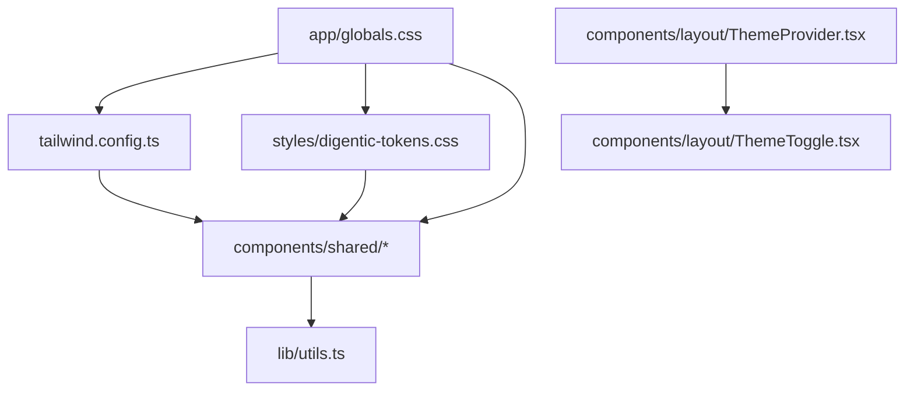
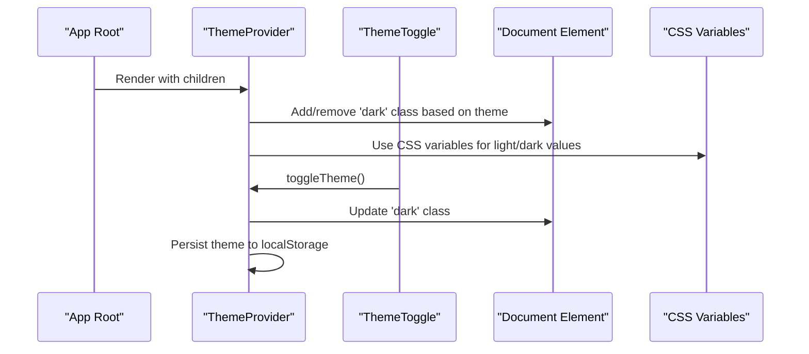
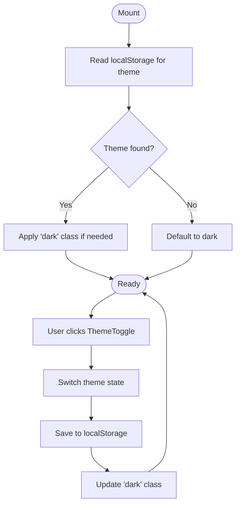
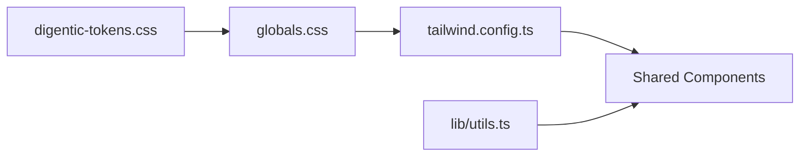
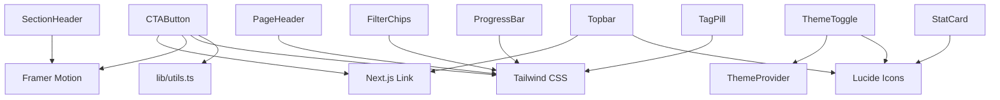

# Component Library

<cite>
**Referenced Files in This Document**
- [components.json](file://components.json)
- [tailwind.config.ts](file://tailwind.config.ts)
- [styles/digentic-tokens.css](file://styles/digentic-tokens.css)
- [app/globals.css](file://app/globals.css)
- [components/layout/ThemeProvider.tsx](file://components/layout/ThemeProvider.tsx)
- [components/layout/ThemeToggle.tsx](file://components/layout/ThemeToggle.tsx)
- [components/shared/CTAButton.tsx](file://components/shared/CTAButton.tsx)
- [components/shared/PageHeader.tsx](file://components/shared/PageHeader.tsx)
- [components/shared/FilterChips.tsx](file://components/shared/FilterChips.tsx)
- [components/shared/ProgressBar.tsx](file://components/shared/ProgressBar.tsx)
- [components/shared/StatCard.tsx](file://components/shared/StatCard.tsx)
- [components/shared/TagPill.tsx](file://components/shared/TagPill.tsx)
- [components/shared/SectionHeader.tsx](file://components/shared/SectionHeader.tsx)
- [components/shared/Topbar.tsx](file://components/shared/Topbar.tsx)
- [lib/utils.ts](file://lib/utils.ts)
</cite>

## Table of Contents
1. Introduction
2. Project Structure
3. Core Components
4. Architecture Overview
5. Detailed Component Analysis
6. Dependency Analysis
7. Performance Considerations
8. Troubleshooting Guide
9. Conclusion
10. Appendices

## Introduction
This document describes the shared component library and design system used across the application. It focuses on reusable UI components, theming (dark/light), responsive patterns, accessibility, composition strategies, performance, and testing approaches. The goal is to help developers consistently build accessible, performant, and visually coherent interfaces using the provided components and tokens.

## Project Structure
The project uses a Next.js app with a clear separation between layout, shared UI primitives, and feature-specific components:
- Layout and theming live under components/layout
- Shared UI primitives live under components/shared
- Global styles and CSS variables define the design tokens and theme modes
- Tailwind configuration extends colors, animations, and dark mode behavior
- Utility functions provide class merging for consistent styling

**Diagram sources**
- [app/globals.css:1-76](file://app/globals.css#L1-L76)
- [tailwind.config.ts:1-129](file://tailwind.config.ts#L1-L129)
- [styles/digentic-tokens.css:1-15](file://styles/digentic-tokens.css#L1-L15)
- [components/layout/ThemeProvider.tsx:1-57](file://components/layout/ThemeProvider.tsx#L1-L57)
- [components/layout/ThemeToggle.tsx:1-35](file://components/layout/ThemeToggle.tsx#L1-L35)
- [lib/utils.ts:1-7](file://lib/utils.ts#L1-L7)

**Section sources**
- [components.json:1-21](file://components.json#L1-L21)
- [tailwind.config.ts:1-129](file://tailwind.config.ts#L1-L129)
- [app/globals.css:1-76](file://app/globals.css#L1-L76)
- [styles/digentic-tokens.css:1-15](file://styles/digentic-tokens.css#L1-L15)
- [lib/utils.ts:1-7](file://lib/utils.ts#L1-L7)

## Core Components
Below are the shared UI primitives with their props, events, and customization options. All components use the design tokens defined in global CSS and Tailwind config.

- CTAButton
  - Props: href, children, variant (primary | outline | ghost), className, icon
  - Events: navigates via Next.js Link; no custom events
  - Customization: variants control color and hover effects; className allows overrides; icon slot for leading/trailing icons
  - Accessibility: semantic <a> element via Link; ensure meaningful link text
  - Theming: uses orange gradients and Tailwind classes; respects dark mode via global tokens
  - Usage example: see [components/shared/CTAButton.tsx:7-48](file://components/shared/CTAButton.tsx#L7-L48)

- PageHeader
  - Props: title, subtitle (optional), role (admin | user), actions (ReactNode)
  - Events: none
  - Customization: role badge renders Admin/User; actions slot for buttons or controls
  - Accessibility: uses heading hierarchy; ensure aria-labels on action buttons
  - Theming: uses token-based colors for background, borders, and text
  - Usage example: see [components/shared/PageHeader.tsx:1-38](file://components/shared/PageHeader.tsx#L1-L38)

- FilterChips
  - Props: items (string[]), active (string), onChange(item)
  - Events: onChange fires when a chip is selected
  - Customization: active state highlighted; supports multiple chips in a row
  - Accessibility: buttons with keyboard focus; consider adding aria-pressed for selection state
  - Theming: active/inactive states use token colors
  - Usage example: see [components/shared/FilterChips.tsx:1-30](file://components/shared/FilterChips.tsx#L1-L30)

- ProgressBar
  - Props: value (number 0–100), className
  - Events: none
  - Customization: width reflects value; gradient fill; className for container overrides
  - Accessibility: consider adding role="progressbar" and aria-valuenow for screen readers
  - Theming: track and fill use token colors
  - Usage example: see [components/shared/ProgressBar.tsx:1-22](file://components/shared/ProgressBar.tsx#L1-L22)

- StatCard
  - Props: value (string | number), label (string), icon (LucideIcon optional)
  - Events: none
  - Customization: icon slot; hover border accent
  - Accessibility: semantic structure; if interactive, add appropriate roles
  - Theming: uses token backgrounds and accents
  - Usage example: see [components/shared/StatCard.tsx:1-36](file://components/shared/StatCard.tsx#L1-L36)

- TagPill
  - Props: label (string), variant (default | active | outlined), onClick (optional)
  - Events: onClick when variant is active
  - Customization: three visual variants; can be button or span based on variant
  - Accessibility: when rendered as button, ensure keyboard support; avoid generic labels
  - Theming: uses token colors for borders and fills
  - Usage example: see [components/shared/TagPill.tsx:1-38](file://components/shared/TagPill.tsx#L1-L38)

- SectionHeader
  - Props: badge (optional), title (string), subtitle (optional), center (boolean)
  - Events: none
  - Customization: optional badge; centered or left-aligned; fade-in animation on view
  - Accessibility: proper heading levels; ensure readable contrast
  - Theming: gradient text and muted foreground
  - Usage example: see [components/shared/SectionHeader.tsx:1-42](file://components/shared/SectionHeader.tsx#L1-L42)

- Topbar
  - Props: role (admin | user), userName (optional string)
  - Events: navigation links based on role; search/bell/settings buttons are placeholders
  - Customization: initials avatar; role-specific navigation
  - Accessibility: ensure all buttons have aria-labels; links should be descriptive
  - Theming: uses token colors for backgrounds, borders, and text
  - Usage example: see [components/shared/Topbar.tsx:1-85](file://components/shared/Topbar.tsx#L1-L85)

**Section sources**
- [components/shared/CTAButton.tsx:1-49](file://components/shared/CTAButton.tsx#L1-L49)
- [components/shared/PageHeader.tsx:1-38](file://components/shared/PageHeader.tsx#L1-L38)
- [components/shared/FilterChips.tsx:1-30](file://components/shared/FilterChips.tsx#L1-L30)
- [components/shared/ProgressBar.tsx:1-22](file://components/shared/ProgressBar.tsx#L1-L22)
- [components/shared/StatCard.tsx:1-36](file://components/shared/StatCard.tsx#L1-L36)
- [components/shared/TagPill.tsx:1-38](file://components/shared/TagPill.tsx#L1-L38)
- [components/shared/SectionHeader.tsx:1-42](file://components/shared/SectionHeader.tsx#L1-L42)
- [components/shared/Topbar.tsx:1-85](file://components/shared/Topbar.tsx#L1-L85)

## Architecture Overview
The theming architecture combines CSS variables, Tailwind’s dark mode, and a React context provider to manage theme state persistently.

**Diagram sources**
- [components/layout/ThemeProvider.tsx:19-51](file://components/layout/ThemeProvider.tsx#L19-L51)
- [components/layout/ThemeToggle.tsx:7-33](file://components/layout/ThemeToggle.tsx#L7-L33)
- [app/globals.css:8-75](file://app/globals.css#L8-L75)
- [tailwind.config.ts:3-5](file://tailwind.config.ts#L3-L5)

**Section sources**
- [components/layout/ThemeProvider.tsx:1-57](file://components/layout/ThemeProvider.tsx#L1-L57)
- [components/layout/ThemeToggle.tsx:1-35](file://components/layout/ThemeToggle.tsx#L1-L35)
- [app/globals.css:1-76](file://app/globals.css#L1-L76)
- [tailwind.config.ts:1-129](file://tailwind.config.ts#L1-L129)

## Detailed Component Analysis

### Theme System
- Dark/Light Mode
  - Controlled by toggling the 'dark' class on the root element
  - CSS variables switch between light and dark palettes
  - Tailwind configured with darkMode: 'class'
- Persistence
  - Theme stored in localStorage and restored on mount
  - Mounted flag prevents hydration mismatch
- Integration
  - ThemeProvider exposes theme, toggleTheme, and mounted via context
  - ThemeToggle consumes context to render current icon and handle clicks

**Diagram sources**
- [components/layout/ThemeProvider.tsx:23-45](file://components/layout/ThemeProvider.tsx#L23-L45)
- [components/layout/ThemeToggle.tsx:7-33](file://components/layout/ThemeToggle.tsx#L7-L33)
- [app/globals.css:8-75](file://app/globals.css#L8-L75)
- [tailwind.config.ts:3-5](file://tailwind.config.ts#L3-L5)

**Section sources**
- [components/layout/ThemeProvider.tsx:1-57](file://components/layout/ThemeProvider.tsx#L1-L57)
- [components/layout/ThemeToggle.tsx:1-35](file://components/layout/ThemeToggle.tsx#L1-L35)
- [app/globals.css:1-76](file://app/globals.css#L1-L76)
- [tailwind.config.ts:1-129](file://tailwind.config.ts#L1-L129)

### Design Tokens and Styling
- Token Sources
  - Global CSS defines light and dark variable sets
  - Additional brand tokens in digentic-tokens.css
  - Tailwind config maps HSL variables to semantic color names
- Class Utilities
  - cn utility merges class names safely with tailwind-merge
- Visual Consistency
  - Gradients, shadows, and hover states standardized in globals and Tailwind
  - Card hover and glow utilities for consistent interactions

**Diagram sources**
- [styles/digentic-tokens.css:1-15](file://styles/digentic-tokens.css#L1-L15)
- [app/globals.css:1-76](file://app/globals.css#L1-L76)
- [tailwind.config.ts:10-94](file://tailwind.config.ts#L10-L94)
- [lib/utils.ts:1-7](file://lib/utils.ts#L1-L7)

**Section sources**
- [styles/digentic-tokens.css:1-15](file://styles/digentic-tokens.css#L1-L15)
- [app/globals.css:1-76](file://app/globals.css#L1-L76)
- [tailwind.config.ts:10-94](file://tailwind.config.ts#L10-L94)
- [lib/utils.ts:1-7](file://lib/utils.ts#L1-L7)

### Responsive Design Patterns
- Breakpoints and Typography
  - Use Tailwind’s responsive utilities (e.g., md:text-*) for scaling typography and spacing
- Layout Flexibility
  - Flexbox/Grid patterns in components allow wrapping and alignment at different sizes
- Animations
  - Fade-in and motion transitions enhance perceived responsiveness without impacting performance

[No sources needed since this section provides general guidance]

### Accessibility Compliance
- Semantic Elements
  - Use headings, links, and buttons appropriately
- Keyboard Navigation
  - Ensure all interactive elements are focusable and operable via keyboard
- ARIA Attributes
  - Add aria-labels where icons lack text; consider aria-pressed for toggles like FilterChips
- Color Contrast
  - Rely on token-driven colors that meet contrast requirements in both themes

[No sources needed since this section provides general guidance]

### Component Composition Strategies
- Slotting Content
  - Use children and named slots (e.g., actions in PageHeader) to compose complex layouts
- Variant Prop Pattern
  - Centralize style variants (e.g., CTAButton variants) for consistent look and feel
- Context-Driven Behavior
  - Leverage ThemeProvider for cross-cutting concerns like theme switching
- Utility Functions
  - Merge classes with cn to avoid conflicts and enable flexible overrides

**Section sources**
- [components/shared/PageHeader.tsx:1-38](file://components/shared/PageHeader.tsx#L1-L38)
- [components/shared/CTAButton.tsx:1-49](file://components/shared/CTAButton.tsx#L1-L49)
- [lib/utils.ts:1-7](file://lib/utils.ts#L1-L7)

## Dependency Analysis
Components depend on:
- Next.js Link for navigation
- Framer Motion for animations
- Lucide React for icons
- Tailwind CSS for styling
- CSS variables for theming
- Utility function for class merging

**Diagram sources**
- [components/shared/CTAButton.tsx:1-49](file://components/shared/CTAButton.tsx#L1-L49)
- [components/layout/ThemeToggle.tsx:1-35](file://components/layout/ThemeToggle.tsx#L1-L35)
- [components/shared/PageHeader.tsx:1-38](file://components/shared/PageHeader.tsx#L1-L38)
- [components/shared/FilterChips.tsx:1-30](file://components/shared/FilterChips.tsx#L1-L30)
- [components/shared/ProgressBar.tsx:1-22](file://components/shared/ProgressBar.tsx#L1-L22)
- [components/shared/StatCard.tsx:1-36](file://components/shared/StatCard.tsx#L1-L36)
- [components/shared/TagPill.tsx:1-38](file://components/shared/TagPill.tsx#L1-L38)
- [components/shared/SectionHeader.tsx:1-42](file://components/shared/SectionHeader.tsx#L1-L42)
- [components/shared/Topbar.tsx:1-85](file://components/shared/Topbar.tsx#L1-L85)
- [lib/utils.ts:1-7](file://lib/utils.ts#L1-L7)

**Section sources**
- [components/shared/CTAButton.tsx:1-49](file://components/shared/CTAButton.tsx#L1-L49)
- [components/layout/ThemeToggle.tsx:1-35](file://components/layout/ThemeToggle.tsx#L1-L35)
- [components/shared/PageHeader.tsx:1-38](file://components/shared/PageHeader.tsx#L1-L38)
- [components/shared/FilterChips.tsx:1-30](file://components/shared/FilterChips.tsx#L1-L30)
- [components/shared/ProgressBar.tsx:1-22](file://components/shared/ProgressBar.tsx#L1-L22)
- [components/shared/StatCard.tsx:1-36](file://components/shared/StatCard.tsx#L1-L36)
- [components/shared/TagPill.tsx:1-38](file://components/shared/TagPill.tsx#L1-L38)
- [components/shared/SectionHeader.tsx:1-42](file://components/shared/SectionHeader.tsx#L1-L42)
- [components/shared/Topbar.tsx:1-85](file://components/shared/Topbar.tsx#L1-L85)
- [lib/utils.ts:1-7](file://lib/utils.ts#L1-L7)

## Performance Considerations
- Client-Side Rendering
  - Components marked 'use client' run in the browser; keep client logic minimal
- Animation Efficiency
  - Use Framer Motion sparingly; prefer simple CSS transitions where possible
- Class Merging
  - Use cn utility to prevent redundant class generation and improve rendering
- Lazy Loading
  - Consider dynamic imports for heavy components not needed on initial load
- Bundle Size
  - Import only required icons from Lucide; avoid unused dependencies

[No sources needed since this section provides general guidance]

## Troubleshooting Guide
- Theme Not Applying
  - Verify 'dark' class is toggled on the root element
  - Ensure CSS variables are loaded before components render
  - Check localStorage persistence and mounted state
- Inconsistent Styles
  - Confirm Tailwind config includes correct content paths
  - Validate CSS variables in globals.css match expected tokens
- Accessibility Issues
  - Add missing aria-labels to icon-only buttons
  - Ensure keyboard focus order matches visual order
- Hydration Mismatch
  - Avoid reading theme from window during SSR; rely on mounted flag

**Section sources**
- [components/layout/ThemeProvider.tsx:23-45](file://components/layout/ThemeProvider.tsx#L23-L45)
- [app/globals.css:8-75](file://app/globals.css#L8-L75)
- [tailwind.config.ts:3-9](file://tailwind.config.ts#L3-L9)

## Conclusion
The shared component library provides a cohesive design system built on CSS variables, Tailwind, and React context. It offers reusable primitives with consistent theming, responsive behavior, and accessible foundations. By following the documented prop interfaces, composition strategies, and performance guidelines, teams can maintain visual and behavioral consistency while optimizing for scalability and user experience.

## Appendices

### API Reference Summary
- CTAButton: href, children, variant, className, icon
- PageHeader: title, subtitle, role, actions
- FilterChips: items, active, onChange
- ProgressBar: value, className
- StatCard: value, label, icon
- TagPill: label, variant, onClick
- SectionHeader: badge, title, subtitle, center
- Topbar: role, userName

**Section sources**
- [components/shared/CTAButton.tsx:7-13](file://components/shared/CTAButton.tsx#L7-L13)
- [components/shared/PageHeader.tsx:1-6](file://components/shared/PageHeader.tsx#L1-L6)
- [components/shared/FilterChips.tsx:1-5](file://components/shared/FilterChips.tsx#L1-L5)
- [components/shared/ProgressBar.tsx:1-4](file://components/shared/ProgressBar.tsx#L1-L4)
- [components/shared/StatCard.tsx:3-7](file://components/shared/StatCard.tsx#L3-L7)
- [components/shared/TagPill.tsx:1-5](file://components/shared/TagPill.tsx#L1-L5)
- [components/shared/SectionHeader.tsx:5-10](file://components/shared/SectionHeader.tsx#L5-L10)
- [components/shared/Topbar.tsx:6-9](file://components/shared/Topbar.tsx#L6-L9)

### Testing Strategies
- Unit Tests
  - Test component rendering with various props and variants
  - Assert accessibility attributes (aria-labels, roles)
- Interaction Tests
  - Simulate clicks on FilterChips and verify onChange calls
  - Validate ThemeToggle updates theme state and persists to localStorage
- Visual Regression
  - Capture screenshots per theme and breakpoint
  - Compare against baselines to detect unintended style changes
- Accessibility Audits
  - Run automated checks (e.g., axe-core) to catch common issues
  - Perform manual keyboard navigation tests

[No sources needed since this section provides general guidance]