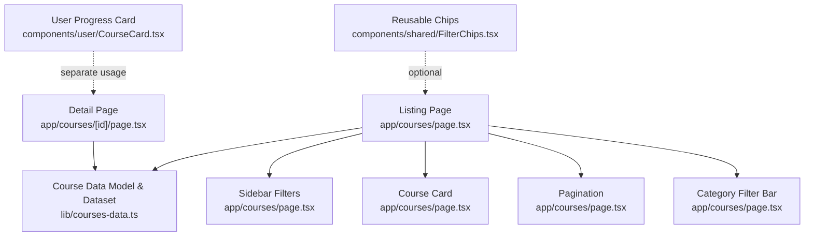
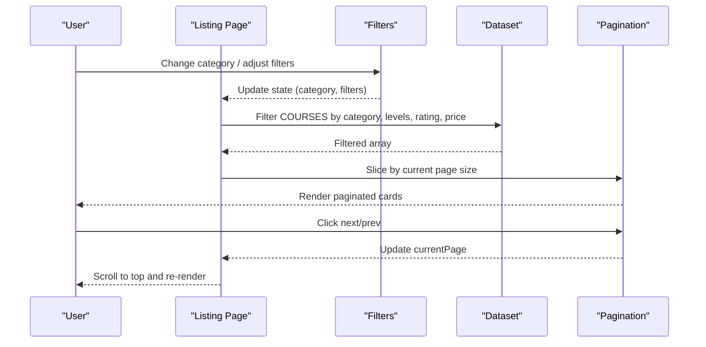
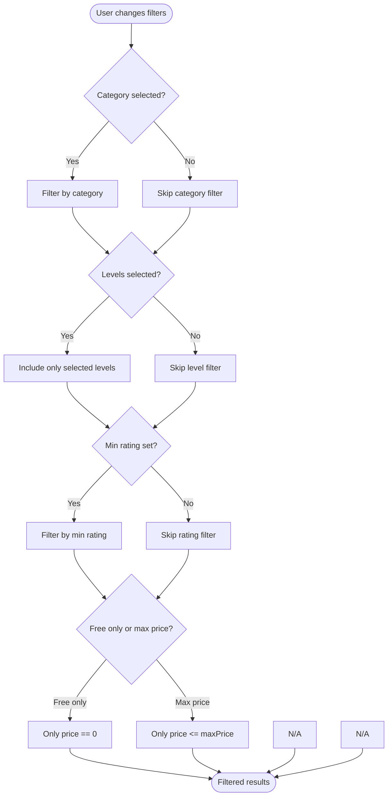
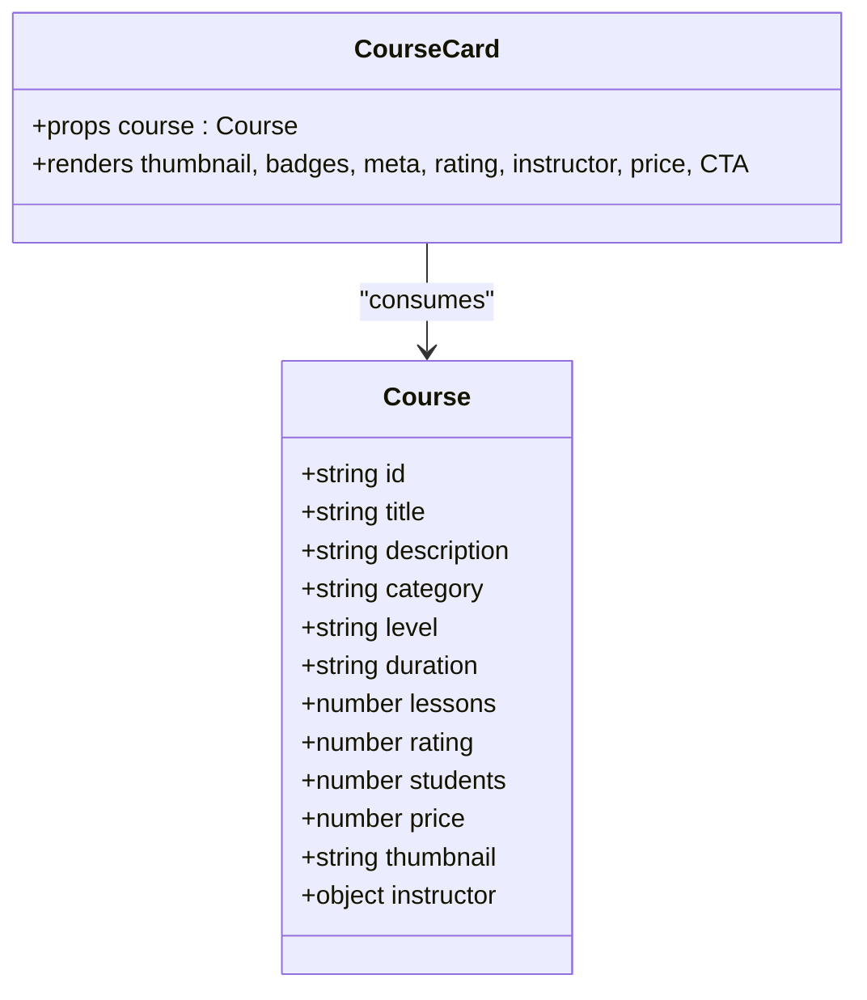
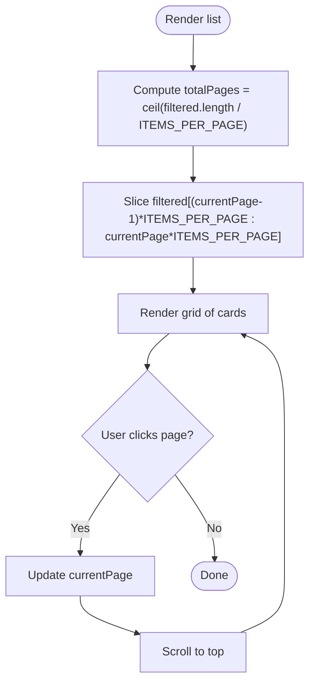
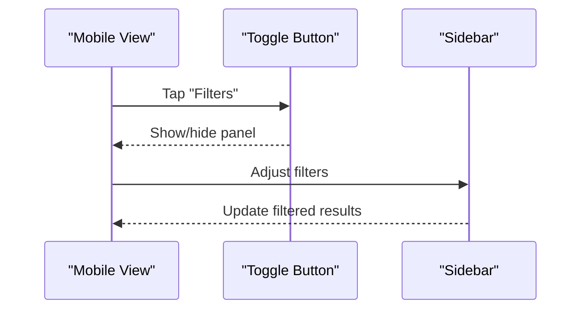
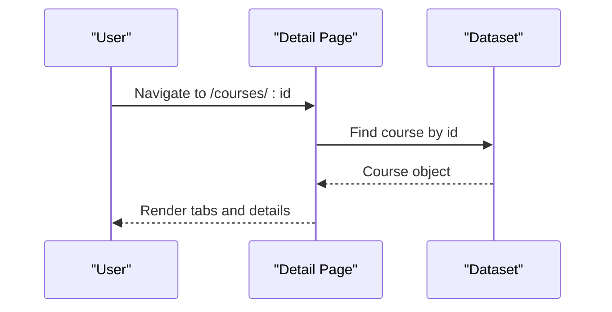
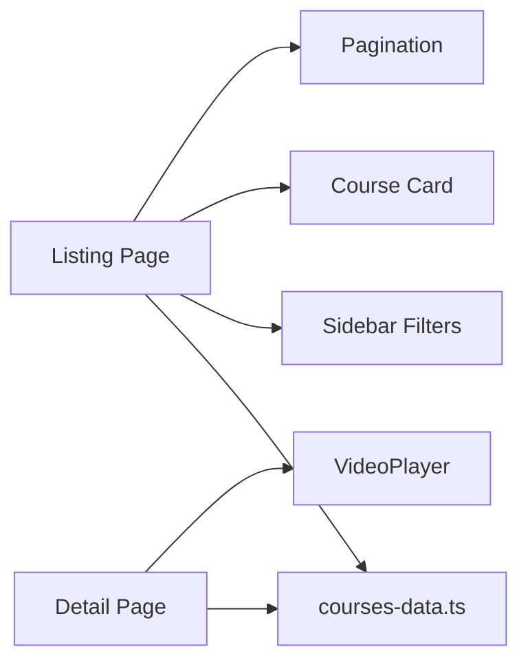

# Course Catalog & Discovery

<cite>
**Referenced Files in This Document**
- [page.tsx](file://app/courses/page.tsx)
- [page.tsx](file://app/courses/[id]/page.tsx)
- [courses-data.ts](file://lib/courses-data.ts)
- [FilterChips.tsx](file://components/shared/FilterChips.tsx)
- [CourseCard.tsx](file://components/user/CourseCard.tsx)
</cite>

## Table of Contents
1. [Introduction](#introduction)
2. [Project Structure](#project-structure)
3. [Core Components](#core-components)
4. [Architecture Overview](#architecture-overview)
5. [Detailed Component Analysis](#detailed-component-analysis)
6. [Dependency Analysis](#dependency-analysis)
7. [Performance Considerations](#performance-considerations)
8. [Troubleshooting Guide](#troubleshooting-guide)
9. [Conclusion](#conclusion)
10. [Appendices](#appendices)

## Introduction
This document explains the course catalog and discovery system, focusing on the listing page that supports category filtering, level-based sorting, price range filtering, and rating filters. It also covers the responsive grid layout with course cards (thumbnails, instructor info, pricing, enrollment counts), pagination for large collections, and a mobile-responsive filter sidebar. Finally, it provides guidance for adding new courses, implementing custom filters, optimizing search performance, and ensuring accessibility and keyboard navigation.

## Project Structure
The catalog experience is implemented primarily in the Next.js app router:
- Listing page: app/courses/page.tsx
- Course detail page: app/courses/[id]/page.tsx
- Shared data model and dataset: lib/courses-data.ts
- Reusable UI components: components/shared/FilterChips.tsx, components/user/CourseCard.tsx

**Diagram sources**
- [page.tsx:1-597](file://app/courses/page.tsx#L1-L597)
- [page.tsx:1-619](file://app/courses/[id]/page.tsx#L1-L619)
- [courses-data.ts:1-724](file://lib/courses-data.ts#L1-L724)
- [FilterChips.tsx:1-30](file://components/shared/FilterChips.tsx#L1-L30)
- [CourseCard.tsx:1-33](file://components/user/CourseCard.tsx#L1-L33)

**Section sources**
- [page.tsx:1-597](file://app/courses/page.tsx#L1-L597)
- [page.tsx:1-619](file://app/courses/[id]/page.tsx#L1-L619)
- [courses-data.ts:1-724](file://lib/courses-data.ts#L1-L724)

## Core Components
- Listing page: Implements category tabs, a sticky filter bar, a responsive two-column layout (sidebar + grid), and pagination. Filtering logic applies category, levels, minimum rating, free-only, and max price constraints.
- Course card: Displays thumbnail, level badge, duration, category, title, description, lessons count, enrollment count, star rating, instructor avatar/name, price, and an enroll link.
- Sidebar filters: Collapsible sections for Level (checkboxes), Price (free-only toggle and range slider), and Minimum Rating (radio buttons). Includes a “Clear All” action when any filter is active.
- Pagination: Renders previous/next and numbered pages; scrolls to top on page change.
- Detail page: Shows course overview, curriculum accordion, reviews with rating filter, instructor section, and related courses.

**Section sources**
- [page.tsx:72-173](file://app/courses/page.tsx#L72-L173)
- [page.tsx:178-339](file://app/courses/page.tsx#L178-L339)
- [page.tsx:345-386](file://app/courses/page.tsx#L345-L386)
- [page.tsx:401-597](file://app/courses/page.tsx#L401-L597)
- [page.tsx:167-619](file://app/courses/[id]/page.tsx#L167-L619)

## Architecture Overview
The listing page composes stateful UI components and pure filtering logic over a static dataset. The flow is:
- User selects a category or adjusts filters.
- State updates trigger recomputation of filtered results via useMemo.
- Results are sliced into pages based on ITEMS_PER_PAGE.
- Grid renders paginated items using the CourseCard component.
- Pagination controls update current page and scroll to top.

**Diagram sources**
- [page.tsx:407-429](file://app/courses/page.tsx#L407-L429)
- [page.tsx:436-597](file://app/courses/page.tsx#L436-L597)

## Detailed Component Analysis

### Listing Page: Category Filtering, Sorting, and Filters
- Categories: Horizontal pill-style tabs with icons; selecting a tab resets to page 1.
- Levels: Multi-select checkboxes; each shows the count of matching courses.
- Price: Free-only checkbox disables the range slider; range slider sets maximum price threshold.
- Rating: Radio buttons for minimum rating; option to reset to show all ratings.
- Filtering pipeline: Applies category, levels inclusion, minimum rating, free-only, and max price conditions.

**Diagram sources**
- [page.tsx:407-416](file://app/courses/page.tsx#L407-L416)

**Section sources**
- [page.tsx:29-40](file://app/courses/page.tsx#L29-L40)
- [page.tsx:178-339](file://app/courses/page.tsx#L178-L339)
- [page.tsx:401-429](file://app/courses/page.tsx#L401-L429)

### Responsive Grid Layout and Course Cards
- Grid: Single column on small screens, two columns on medium, three on large.
- Card content: Thumbnail with overlay, level badge, free badge, duration pill, category label, truncated title/description, lessons and enrollment counts, star rating, instructor avatar/name, price, and an “Enroll Now” link to the course detail page.
- Hover effects: Border color and shadow transitions for emphasis.

**Diagram sources**
- [courses-data.ts:30-64](file://lib/courses-data.ts#L30-L64)
- [page.tsx:72-173](file://app/courses/page.tsx#L72-L173)

**Section sources**
- [page.tsx:72-173](file://app/courses/page.tsx#L72-L173)
- [courses-data.ts:30-64](file://lib/courses-data.ts#L30-L64)

### Pagination System
- Items per page: Fixed at 6.
- Behavior: Calculates total pages from filtered length; slices array for current page; renders prev/next and numbered buttons; scrolls to top on page change.

**Diagram sources**
- [page.tsx:345-386](file://app/courses/page.tsx#L345-L386)
- [page.tsx:418-419](file://app/courses/page.tsx#L418-L419)
- [page.tsx:583-590](file://app/courses/page.tsx#L583-L590)

**Section sources**
- [page.tsx:345-386](file://app/courses/page.tsx#L345-L386)
- [page.tsx:418-419](file://app/courses/page.tsx#L418-L419)
- [page.tsx:583-590](file://app/courses/page.tsx#L583-L590)

### Mobile-Responsive Filter Sidebar
- Desktop: Sticky left sidebar with collapsible sections.
- Mobile: Toggle button reveals a panel above the grid containing the same filters.
- Clear All: Appears when any filter is active; resets to defaults and page 1.

**Diagram sources**
- [page.tsx:507-537](file://app/courses/page.tsx#L507-L537)
- [page.tsx:185-339](file://app/courses/page.tsx#L185-L339)

**Section sources**
- [page.tsx:507-537](file://app/courses/page.tsx#L507-L537)
- [page.tsx:185-339](file://app/courses/page.tsx#L185-L339)

### Course Detail Page Integration
- Finds course by ID; if not found, triggers notFound.
- Tabs: Overview, Curriculum (accordion), Reviews (with rating filter), Instructor (bio, stats, social links).
- Related courses: Prioritizes same category, fallback to general selection.

**Diagram sources**
- [page.tsx:167-180](file://app/courses/[id]/page.tsx#L167-L180)
- [page.tsx:303-619](file://app/courses/[id]/page.tsx#L303-L619)

**Section sources**
- [page.tsx:167-180](file://app/courses/[id]/page.tsx#L167-L180)
- [page.tsx:303-619](file://app/courses/[id]/page.tsx#L303-L619)

### Conceptual Overview
- Adding a new course: Add a new entry to the shared dataset following the defined type shape. Ensure fields like category, level, price, and thumbnail are present so filters and cards render correctly.
- Implementing custom filters: Extend the filter state and UI, then add a condition in the filtering function. For example, add a tag filter by introducing a tags array field and a corresponding checkbox group.
- Optimizing search performance: Keep filtering logic efficient by leveraging memoization and avoiding unnecessary re-renders. For larger datasets, consider server-side filtering and pagination.

[No sources needed since this section doesn't analyze specific files]

## Dependency Analysis
- Listing page depends on:
  - Course data model and dataset for types and content.
  - Local state for active category, filters, and pagination.
  - UI components for rendering cards, filters, and pagination.
- Detail page depends on:
  - Same dataset for course details and related courses.
  - Video player component for previews.

**Diagram sources**
- [page.tsx:1-597](file://app/courses/page.tsx#L1-L597)
- [page.tsx:1-619](file://app/courses/[id]/page.tsx#L1-L619)
- [courses-data.ts:1-724](file://lib/courses-data.ts#L1-L724)

**Section sources**
- [page.tsx:1-597](file://app/courses/page.tsx#L1-L597)
- [page.tsx:1-619](file://app/courses/[id]/page.tsx#L1-L619)
- [courses-data.ts:1-724](file://lib/courses-data.ts#L1-L724)

## Performance Considerations
- Memoized filtering: Use memoization to avoid recalculating filtered lists on every render unless dependencies change.
- Pagination: Slice arrays client-side for small-to-medium datasets; for large catalogs, move filtering and pagination to the server to reduce payload size.
- Image optimization: Ensure thumbnails are appropriately sized and lazy-loaded where possible.
- Avoid heavy computations in render loops: Keep filter logic simple and efficient.

[No sources needed since this section provides general guidance]

## Troubleshooting Guide
- No results shown: Check that filters are not overly restrictive; use “Clear All” to reset.
- Pagination not updating: Ensure page index resets when filters or categories change.
- Images not loading: Verify thumbnail URLs and CORS settings.
- Accessibility issues: Confirm interactive elements have proper labels and focus states.

**Section sources**
- [page.tsx:561-580](file://app/courses/page.tsx#L561-L580)
- [page.tsx:421-434](file://app/courses/page.tsx#L421-L434)

## Conclusion
The catalog and discovery system provides a robust, user-friendly interface for browsing courses with powerful filtering and responsive design. The architecture separates concerns cleanly between data, filtering logic, and UI components, making it straightforward to extend with new filters, improve performance, and enhance accessibility.

[No sources needed since this section summarizes without analyzing specific files]

## Appendices

### How to Add New Courses
- Open the dataset file and append a new course object conforming to the defined type. Include required fields such as id, title, category, level, price, thumbnail, and instructor details.
- Validate that category values match existing options to ensure correct filtering behavior.

**Section sources**
- [courses-data.ts:30-64](file://lib/courses-data.ts#L30-L64)
- [courses-data.ts:99-724](file://lib/courses-data.ts#L99-L724)

### Implementing Custom Filters
- Extend the filter state structure to include the new filter property.
- Add UI controls (e.g., checkboxes, dropdowns) to update the filter state.
- Update the filtering function to incorporate the new condition alongside existing ones.

**Section sources**
- [page.tsx:178-183](file://app/courses/page.tsx#L178-L183)
- [page.tsx:407-416](file://app/courses/page.tsx#L407-L416)

### Optimizing Search Performance
- For small datasets, keep client-side filtering with memoization.
- For large datasets, implement server-side filtering and pagination to minimize network payloads and processing time.
- Consider debouncing rapid filter changes to reduce re-renders.

[No sources needed since this section provides general guidance]

### Accessibility and Keyboard Navigation
- Ensure all interactive elements (tabs, checkboxes, radio buttons, sliders, pagination buttons) are keyboard accessible and have visible focus indicators.
- Provide descriptive labels for inputs and buttons to support screen readers.
- Maintain logical tab order across the page, especially within the filter sidebar and course grid.

[No sources needed since this section provides general guidance]