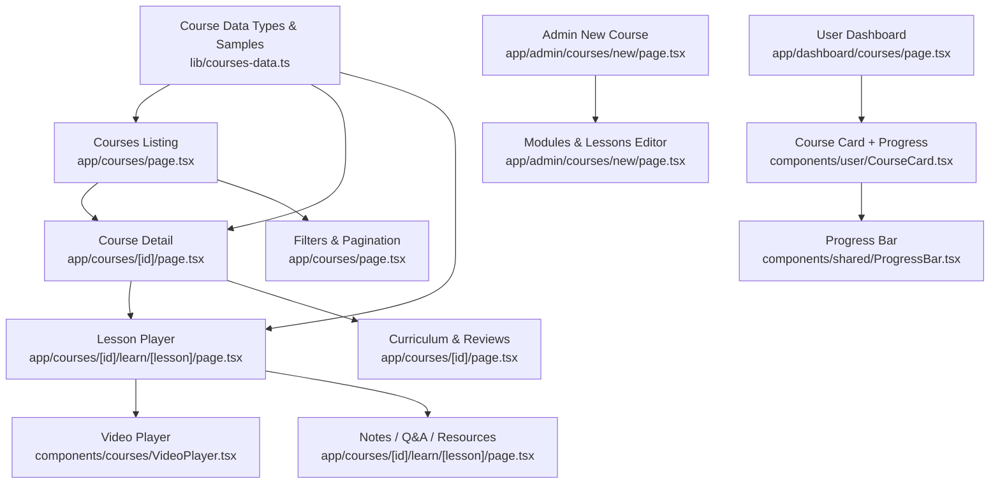
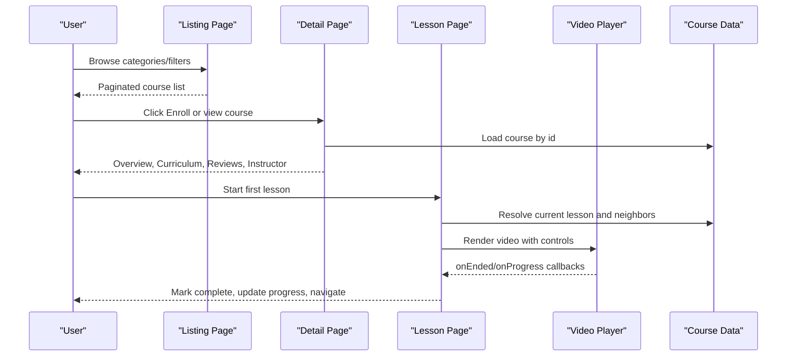
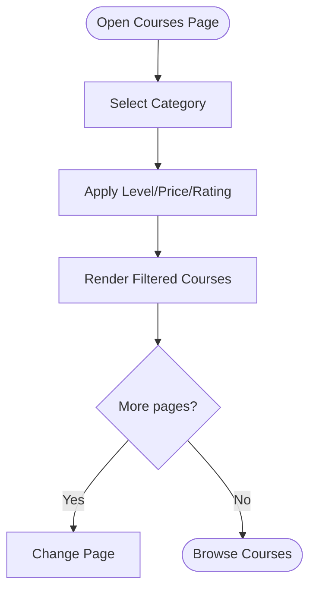
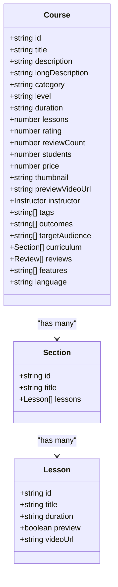
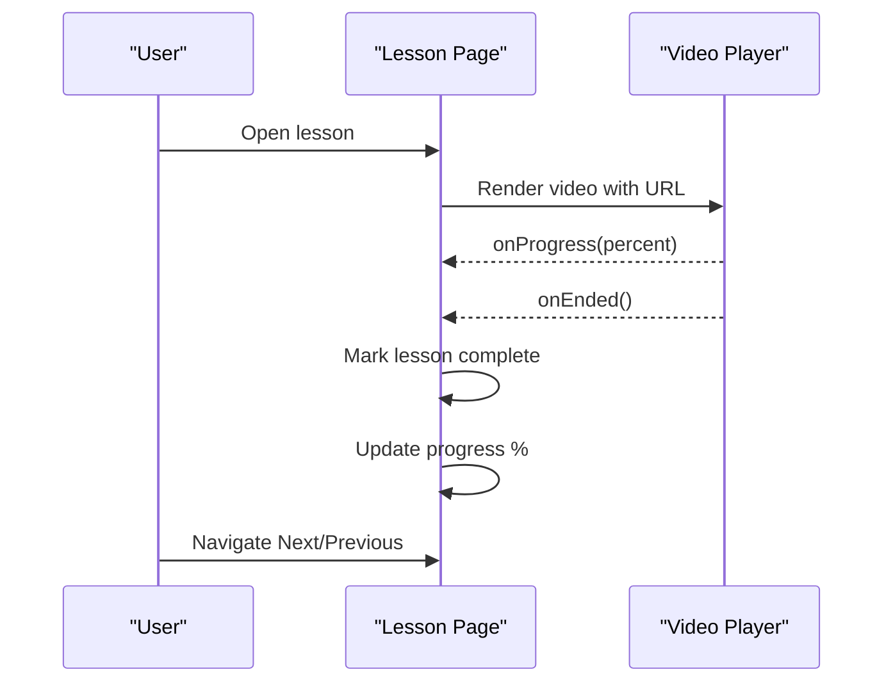
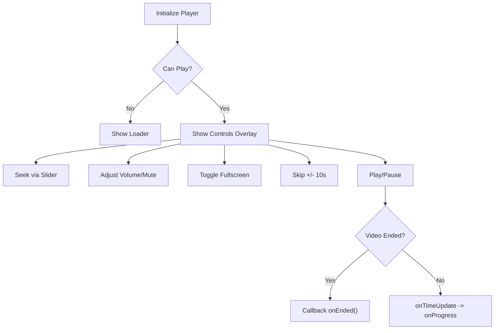
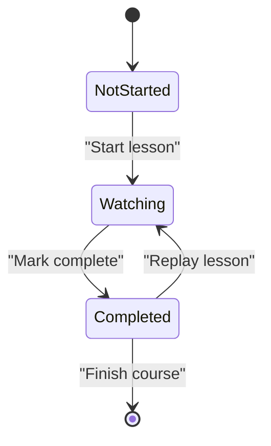
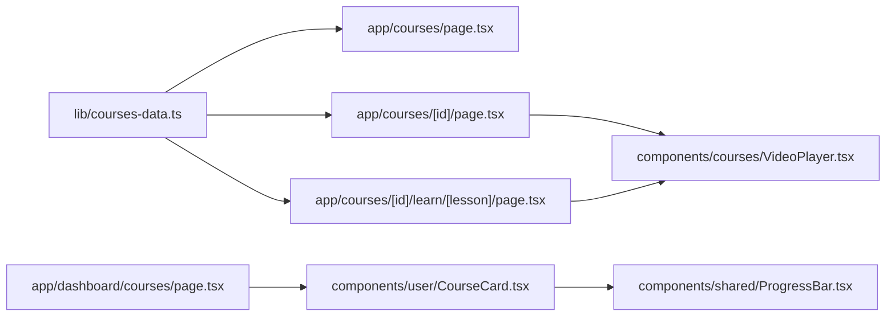

# Course Platform

<cite>
**Referenced Files in This Document**
- [courses/page.tsx](file://app/courses/page.tsx)
- [course detail page.tsx](file://app/courses/[id]/page.tsx)
- [learn lesson page.tsx](file://app/courses/[id]/learn/[lesson]/page.tsx)
- [VideoPlayer.tsx](file://components/courses/VideoPlayer.tsx)
- [courses-data.ts](file://lib/courses-data.ts)
- [user courses page.tsx](file://app/dashboard/courses/page.tsx)
- [CourseCard.tsx](file://components/user/CourseCard.tsx)
- [ProgressBar.tsx](file://components/shared/ProgressBar.tsx)
- [admin new course page.tsx](file://app/admin/courses/new/page.tsx)
</cite>

## Table of Contents
1. Introduction
2. Project Structure
3. Core Components
4. Architecture Overview
5. Detailed Component Analysis
6. Dependency Analysis
7. Performance Considerations
8. Troubleshooting Guide
9. Conclusion
10. Appendices

## Introduction
This document explains the course platform’s structured learning experience and curriculum management. It covers how courses are organized into modules and lessons, how learners browse and filter the catalog, how enrollment flows to a lesson player, and how progress is tracked. It also documents the video player integration for content delivery, UX patterns for consumption, and admin capabilities for creating courses and managing metadata.

## Project Structure
The course feature spans several pages and components:
- Catalog browsing and filtering on the courses listing page
- Course detail with overview, curriculum, reviews, and instructor tabs
- Lesson learning page with sidebar navigation, notes, Q&A, and resources
- Reusable video player component used across preview and lesson playback
- Shared progress UI and user dashboard cards
- Admin interface to create courses with modules and lessons

**Diagram sources**
- [courses/page.tsx:401-597](file://app/courses/page.tsx#L401-L597)
- [course detail page.tsx:167-619](file://app/courses/[id]/page.tsx#L167-L619)
- [learn lesson page.tsx:376-607](file://app/courses/[id]/learn/[lesson]/page.tsx#L376-L607)
- [VideoPlayer.tsx:29-306](file://components/courses/VideoPlayer.tsx#L29-L306)
- [courses-data.ts:6-64](file://lib/courses-data.ts#L6-L64)

**Section sources**
- [courses/page.tsx:401-597](file://app/courses/page.tsx#L401-L597)
- [course detail page.tsx:167-619](file://app/courses/[id]/page.tsx#L167-L619)
- [learn lesson page.tsx:376-607](file://app/courses/[id]/learn/[lesson]/page.tsx#L376-L607)
- [VideoPlayer.tsx:29-306](file://components/courses/VideoPlayer.tsx#L29-L306)
- [courses-data.ts:6-64](file://lib/courses-data.ts#L6-L64)

## Core Components
- Courses listing page: category filters, level/rating/price filters, pagination, and course cards.
- Course detail page: hero with preview video, tabbed content (Overview, Curriculum, Reviews, Instructor), related courses, and enrollment CTA.
- Lesson player: full-screen video area, lesson sidebar grouped by sections, completion tracking, notes/Q&A/resources panels, and prev/next navigation.
- Video player: custom controls, seek bar, volume/mute, fullscreen, keyboard shortcuts, error handling, and progress callbacks.
- User dashboard: enrolled courses with progress and next lesson hints.
- Admin new course: dynamic module and lesson editor for course metadata and structure.

**Section sources**
- [courses/page.tsx:401-597](file://app/courses/page.tsx#L401-L597)
- [course detail page.tsx:167-619](file://app/courses/[id]/page.tsx#L167-L619)
- [learn lesson page.tsx:376-607](file://app/courses/[id]/learn/[lesson]/page.tsx#L376-L607)
- [VideoPlayer.tsx:29-306](file://components/courses/VideoPlayer.tsx#L29-L306)
- [user courses page.tsx:7-71](file://app/dashboard/courses/page.tsx#L7-L71)
- [CourseCard.tsx:11-33](file://components/user/CourseCard.tsx#L11-L33)
- [ProgressBar.tsx:6-22](file://components/shared/ProgressBar.tsx#L6-L22)
- [admin new course page.tsx:21-181](file://app/admin/courses/new/page.tsx#L21-L181)

## Architecture Overview
The platform uses a client-side data model for courses and lessons, rendered through Next.js pages. The flow moves from catalog browsing to course details, then to lesson playback with integrated progress tracking and supplementary materials.

**Diagram sources**
- [courses/page.tsx:401-597](file://app/courses/page.tsx#L401-L597)
- [course detail page.tsx:167-619](file://app/courses/[id]/page.tsx#L167-L619)
- [learn lesson page.tsx:376-607](file://app/courses/[id]/learn/[lesson]/page.tsx#L376-L607)
- [VideoPlayer.tsx:29-306](file://components/courses/VideoPlayer.tsx#L29-L306)
- [courses-data.ts:6-64](file://lib/courses-data.ts#L6-L64)

## Detailed Component Analysis

### Course Catalog and Filtering
- Categories: horizontal sticky bar for quick filtering by topic.
- Filters: collapsible sidebar supporting Level, Price (with free-only toggle and max price slider), and Minimum Rating.
- Pagination: client-side pagination with reset on filter/category change.
- Course cards: thumbnail, level badge, duration, rating, instructor avatar, price, and enroll link.

**Diagram sources**
- [courses/page.tsx:401-597](file://app/courses/page.tsx#L401-L597)

**Section sources**
- [courses/page.tsx:29-41](file://app/courses/page.tsx#L29-L41)
- [courses/page.tsx:178-340](file://app/courses/page.tsx#L178-L340)
- [courses/page.tsx:345-396](file://app/courses/page.tsx#L345-L396)
- [courses/page.tsx:401-597](file://app/courses/page.tsx#L401-L597)

### Course Detail and Curriculum
- Hero section with preview video toggle and key stats (rating, students, duration).
- Tabs:
  - Overview: outcomes, description, target audience.
  - Curriculum: accordion sections showing lessons, durations, and preview indicators.
  - Reviews: overall rating, per-rating filter, review cards with helpful votes.
  - Instructor: bio, stats, social links, other courses.
- Enrollment CTA navigates to the first lesson.

**Diagram sources**
- [courses-data.ts:6-64](file://lib/courses-data.ts#L6-L64)

**Section sources**
- [course detail page.tsx:54-98](file://app/courses/[id]/page.tsx#L54-L98)
- [course detail page.tsx:167-619](file://app/courses/[id]/page.tsx#L167-L619)

### Lesson Navigation and Content Delivery
- Sidebar groups lessons by sections with completion counts and open/close state.
- Each lesson item shows play/completed/locked states based on preview and completion.
- Prev/Next navigation below the video; Next shortcut in sidebar.
- Notes panel: local note creation per lesson.
- Q&A panel: seed questions, ask question form, voting UI.
- Resources panel: downloadable files and “Download All” action.

**Diagram sources**
- [learn lesson page.tsx:376-607](file://app/courses/[id]/learn/[lesson]/page.tsx#L376-L607)
- [VideoPlayer.tsx:29-306](file://components/courses/VideoPlayer.tsx#L29-L306)

**Section sources**
- [learn lesson page.tsx:77-171](file://app/courses/[id]/learn/[lesson]/page.tsx#L77-L171)
- [learn lesson page.tsx:178-371](file://app/courses/[id]/learn/[lesson]/page.tsx#L178-L371)
- [learn lesson page.tsx:376-607](file://app/courses/[id]/learn/[lesson]/page.tsx#L376-L607)

### Video Player Integration
- Controls: play/pause, skip ±10s, seek bar with buffered indicator, volume slider, mute toggle, fullscreen.
- Keyboard shortcuts: Space to play/pause, arrow keys to seek.
- Auto-hide control overlay during playback.
- Error states with friendly messages and loading spinner.
- Callbacks: onEnded triggers completion marking; onProgress updates learner progress.

**Diagram sources**
- [VideoPlayer.tsx:29-306](file://components/courses/VideoPlayer.tsx#L29-L306)

**Section sources**
- [VideoPlayer.tsx:29-306](file://components/courses/VideoPlayer.tsx#L29-L306)

### Enrollment Management and Progress Tracking
- Enrollment CTA on course detail navigates to the first lesson.
- Learner progress is tracked locally as a set of completed lesson IDs and percentage computed from total lessons.
- Sidebar shows per-section completion counts and overall progress.
- Dashboard displays enrolled courses with average progress and next lesson hints.

**Diagram sources**
- [learn lesson page.tsx:376-607](file://app/courses/[id]/learn/[lesson]/page.tsx#L376-L607)
- [user courses page.tsx:7-71](file://app/dashboard/courses/page.tsx#L7-L71)
- [CourseCard.tsx:11-33](file://components/user/CourseCard.tsx#L11-L33)
- [ProgressBar.tsx:6-22](file://components/shared/ProgressBar.tsx#L6-L22)

**Section sources**
- [course detail page.tsx:286-291](file://app/courses/[id]/page.tsx#L286-L291)
- [learn lesson page.tsx:397-412](file://app/courses/[id]/learn/[lesson]/page.tsx#L397-L412)
- [user courses page.tsx:7-71](file://app/dashboard/courses/page.tsx#L7-L71)

### Completion Certificates
- Course detail lists “Certificate of completion” as a feature for applicable courses.
- Certificate issuance logic is not implemented in this codebase; it is presented as a feature flag within course metadata.

**Section sources**
- [course detail page.tsx:557-574](file://app/courses/[id]/page.tsx#L557-L574)
- [courses-data.ts:205-213](file://lib/courses-data.ts#L205-L213)

### Course Catalog Browsing, Search, and Filtering
- Category tabs provide quick topic-based filtering.
- Advanced filters include Level checkboxes, Minimum Rating radio buttons, Price range slider, and Free-only toggle.
- Pagination resets when filters or categories change.

**Section sources**
- [courses/page.tsx:29-41](file://app/courses/page.tsx#L29-L41)
- [courses/page.tsx:178-340](file://app/courses/page.tsx#L178-L340)
- [courses/page.tsx:401-597](file://app/courses/page.tsx#L401-L597)

### Lesson Navigation System and Content Delivery Mechanisms
- Flattened lesson list derived from curriculum sections enables prev/next navigation.
- Sidebar organizes lessons by sections with default open state for the current section.
- Content delivery uses native HTML5 video with a custom control layer and sample video URLs.

**Section sources**
- [learn lesson page.tsx:385-395](file://app/courses/[id]/learn/[lesson]/page.tsx#L385-L395)
- [learn lesson page.tsx:563-602](file://app/courses/[id]/learn/[lesson]/page.tsx#L563-L602)
- [courses-data.ts:72-79](file://lib/courses-data.ts#L72-L79)

### Examples: Creating Courses, Adding Lessons, Managing Metadata
- Admin new course page supports:
  - Course title, description, price, thumbnail upload placeholder.
  - Dynamic modules with titles and nested lessons.
  - Add/remove modules and lessons, update titles inline.
  - Save action button (placeholder for persistence).

**Section sources**
- [admin new course page.tsx:21-181](file://app/admin/courses/new/page.tsx#L21-L181)

## Dependency Analysis
- Data model: Course, Section, Lesson types defined centrally and consumed by all course-related pages.
- Pages depend on shared components:
  - VideoPlayer used in both course detail preview and lesson player.
  - ProgressBar and CourseCard used in user dashboard.
- Routing:
  - Listing: /courses
  - Detail: /courses/[id]
  - Learn: /courses/[id]/learn/[lesson]

**Diagram sources**
- [courses-data.ts:6-64](file://lib/courses-data.ts#L6-L64)
- [courses/page.tsx:401-597](file://app/courses/page.tsx#L401-L597)
- [course detail page.tsx:167-619](file://app/courses/[id]/page.tsx#L167-L619)
- [learn lesson page.tsx:376-607](file://app/courses/[id]/learn/[lesson]/page.tsx#L376-L607)
- [VideoPlayer.tsx:29-306](file://components/courses/VideoPlayer.tsx#L29-L306)
- [user courses page.tsx:7-71](file://app/dashboard/courses/page.tsx#L7-L71)
- [CourseCard.tsx:11-33](file://components/user/CourseCard.tsx#L11-L33)
- [ProgressBar.tsx:6-22](file://components/shared/ProgressBar.tsx#L6-L22)

**Section sources**
- [courses-data.ts:6-64](file://lib/courses-data.ts#L6-L64)
- [courses/page.tsx:401-597](file://app/courses/page.tsx#L401-L597)
- [course detail page.tsx:167-619](file://app/courses/[id]/page.tsx#L167-L619)
- [learn lesson page.tsx:376-607](file://app/courses/[id]/learn/[lesson]/page.tsx#L376-L607)
- [VideoPlayer.tsx:29-306](file://components/courses/VideoPlayer.tsx#L29-L306)
- [user courses page.tsx:7-71](file://app/dashboard/courses/page.tsx#L7-L71)
- [CourseCard.tsx:11-33](file://components/user/CourseCard.tsx#L11-L33)
- [ProgressBar.tsx:6-22](file://components/shared/ProgressBar.tsx#L6-L22)

## Performance Considerations
- Video streaming:
  - Uses native HTML5 video with preload="metadata" to reduce initial load.
  - Buffered progress displayed to improve perceived performance.
  - Sample videos are CORS-enabled and hosted externally for reliable playback.
- Rendering:
  - Client-side filtering and pagination avoid server round-trips for small datasets.
  - Sticky headers and lazy expansion of curriculum sections minimize layout shifts.
- Recommendations:
  - Introduce adaptive bitrate streaming (HLS/DASH) for large videos.
  - Implement server-side search and filtering for scalability.
  - Cache course data at build time or via CDN for faster catalog loads.
  - Defer non-critical assets (reviews, instructor bios) until after main content.

[No sources needed since this section provides general guidance]

## Troubleshooting Guide
- Video playback errors:
  - Error codes mapped to user-friendly messages; check network, source support, and CORS.
  - Ensure correct video URL and that the source is accessible.
- Locked lessons:
  - Non-preview lessons appear locked; ensure enrollment flow leads to the first lesson.
- No results in catalog:
  - Reset filters and category to default to restore listings.

**Section sources**
- [VideoPlayer.tsx:173-182](file://components/courses/VideoPlayer.tsx#L173-L182)
- [learn lesson page.tsx:90-119](file://app/courses/[id]/learn/[lesson]/page.tsx#L90-L119)
- [courses/page.tsx:554-580](file://app/courses/page.tsx#L554-L580)

## Conclusion
The course platform delivers a structured learning experience with clear organization into modules and lessons, robust catalog browsing with filtering, and an integrated video player for content delivery. Progress tracking and supplementary materials (notes, Q&A, resources) enhance engagement. Admin tools enable easy course creation and metadata management. Future enhancements can focus on scalable search, adaptive streaming, and backend-backed progress persistence.

[No sources needed since this section summarizes without analyzing specific files]

## Appendices

### Data Model Summary
- Course: core metadata, pricing, ratings, curriculum, reviews, features, language.
- Section: module grouping with ordered lessons.
- Lesson: title, duration, preview flag, optional video URL.

**Section sources**
- [courses-data.ts:6-64](file://lib/courses-data.ts#L6-L64)

### Key Implementation Paths
- Catalog listing and filters: [courses/page.tsx:401-597](file://app/courses/page.tsx#L401-L597)
- Course detail and curriculum: [course detail page.tsx:167-619](file://app/courses/[id]/page.tsx#L167-L619)
- Lesson player and sidebar: [learn lesson page.tsx:376-607](file://app/courses/[id]/learn/[lesson]/page.tsx#L376-L607)
- Video player controls: [VideoPlayer.tsx:29-306](file://components/courses/VideoPlayer.tsx#L29-L306)
- Admin course creation: [admin new course page.tsx:21-181](file://app/admin/courses/new/page.tsx#L21-L181)