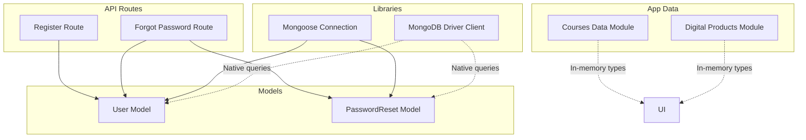
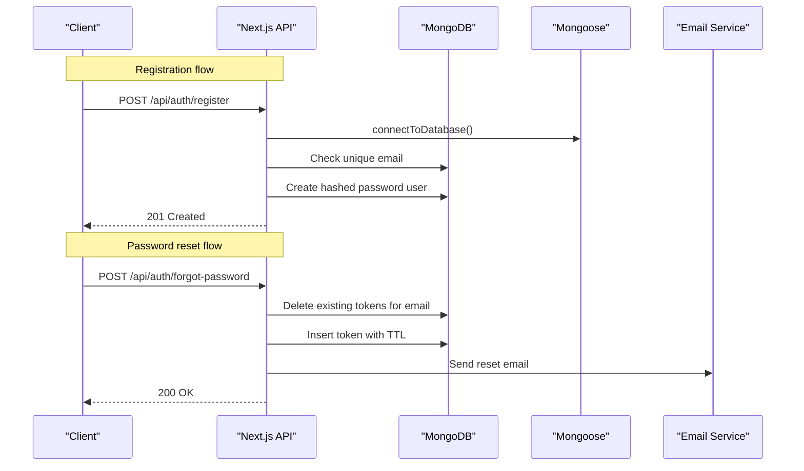
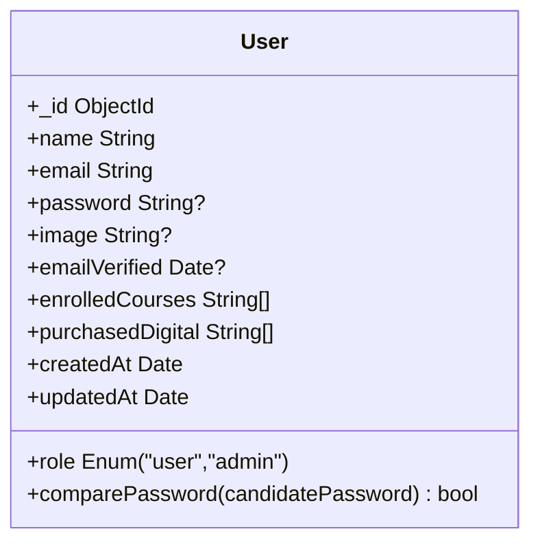
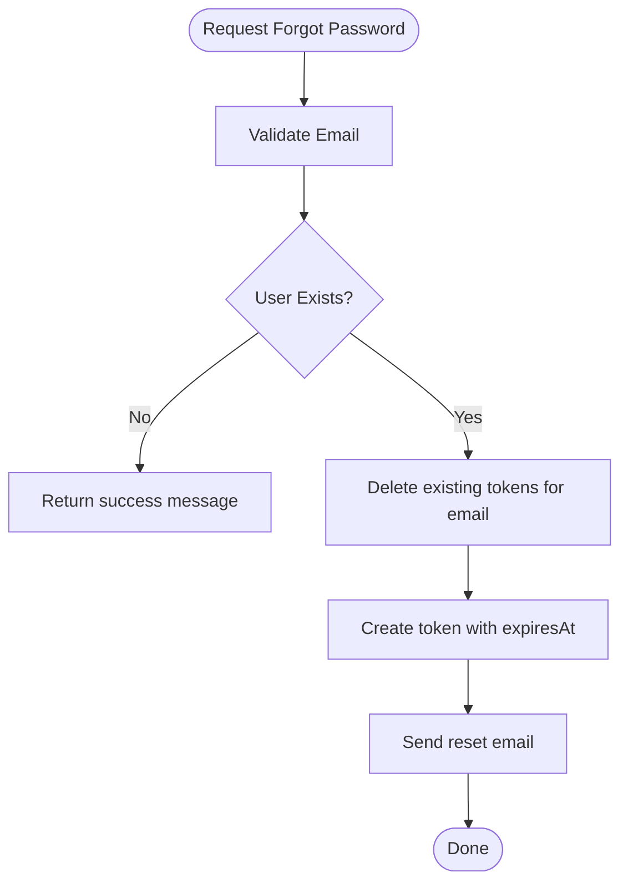
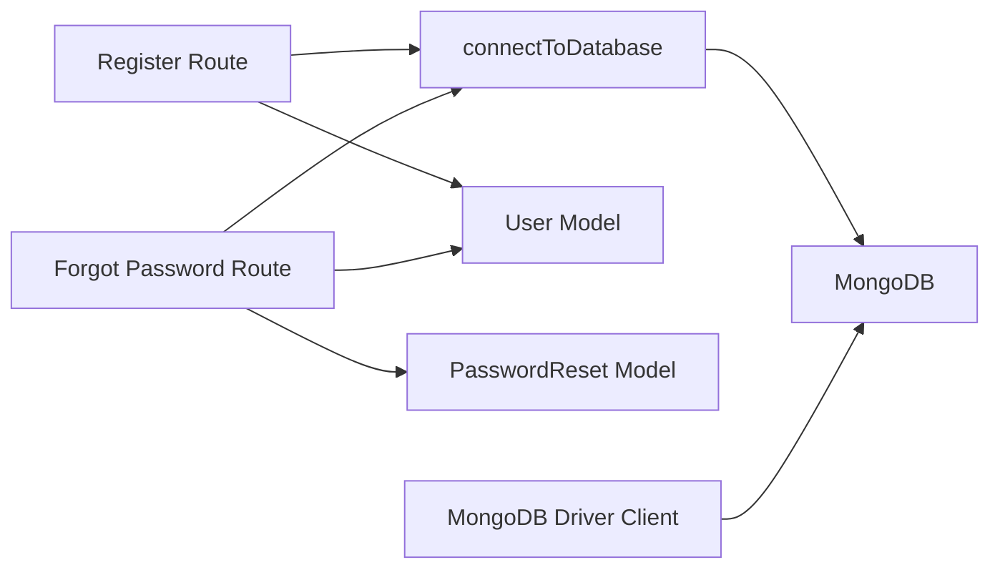

# Database Design

<cite>
**Referenced Files in This Document**
- [User.ts](file://models/User.ts)
- [PasswordReset.ts](file://models/PasswordReset.ts)
- [index.ts](file://models/index.ts)
- [mongoose.ts](file://lib/mongoose.ts)
- [mongodb.ts](file://lib/mongodb.ts)
- [register route.ts](file://app/api/auth/register/route.ts)
- [forgot-password route.ts](file://app/api/auth/forgot-password/route.ts)
- [courses-data.ts](file://lib/courses-data.ts)
- [digital-products.ts](file://lib/digital-products.ts)
</cite>

## Table of Contents
1. Introduction
2. Project Structure
3. Core Components
4. Architecture Overview
5. Detailed Component Analysis
6. Dependency Analysis
7. Performance Considerations
8. Troubleshooting Guide
9. Conclusion
10. Appendices

## Introduction
This document describes the database design for the Digentic platform with a focus on MongoDB schema design and Mongoose models. It details entity relationships among users, courses, digital products, and blog posts; field definitions, validation rules, and business constraints; primary and foreign key relationships; indexes for performance; query patterns using both native MongoDB driver and Mongoose ODM; data lifecycle management and retention policies; security and access control; and migration strategies for schema evolution.

## Project Structure
The repository uses:
- Mongoose models for persistent entities (users and password resets).
- TypeScript interfaces and static data modules to represent courses and digital products at the application layer.
- API routes that perform user registration and password reset flows against the database.
- Separate connection utilities for Mongoose and the native MongoDB driver.

**Diagram sources**
- [User.ts:19-67](file://models/User.ts#L19-L67)
- [PasswordReset.ts:10-37](file://models/PasswordReset.ts#L10-L37)
- [mongoose.ts:21-44](file://lib/mongoose.ts#L21-L44)
- [mongodb.ts:32-35](file://lib/mongodb.ts#L32-L35)
- [register route.ts:6-75](file://app/api/auth/register/route.ts#L6-L75)
- [forgot-password route.ts:8-61](file://app/api/auth/forgot-password/route.ts#L8-L61)

**Section sources**
- [User.ts:19-67](file://models/User.ts#L19-L67)
- [PasswordReset.ts:10-37](file://models/PasswordReset.ts#L10-L37)
- [mongoose.ts:21-44](file://lib/mongoose.ts#L21-L44)
- [mongodb.ts:32-35](file://lib/mongodb.ts#L32-L35)
- [register route.ts:6-75](file://app/api/auth/register/route.ts#L6-L75)
- [forgot-password route.ts:8-61](file://app/api/auth/forgot-password/route.ts#L8-L61)

## Core Components
- User model: Represents platform users with authentication-related fields, roles, and references to enrolled courses and purchased digital products. Includes validation and a password comparison method.
- PasswordReset model: Stores one-time password reset tokens with TTL-based expiration for automatic cleanup.
- Courses and Digital Products: Represented as TypeScript interfaces and static arrays used by the frontend and server components. These are not persisted via Mongoose in this codebase but define the expected data shapes for display and interaction.

Key responsibilities:
- Enforce data integrity through Mongoose schema validation.
- Provide secure password handling via hashing and comparison.
- Manage short-lived tokens for password recovery.
- Expose consistent data contracts for courses and digital products.

**Section sources**
- [User.ts:4-17](file://models/User.ts#L4-L17)
- [User.ts:19-67](file://models/User.ts#L19-L67)
- [PasswordReset.ts:3-8](file://models/PasswordReset.ts#L3-L8)
- [PasswordReset.ts:10-37](file://models/PasswordReset.ts#L10-L37)
- [courses-data.ts:6-64](file://lib/courses-data.ts#L6-L64)
- [digital-products.ts:18-50](file://lib/digital-products.ts#L18-L50)

## Architecture Overview
The data architecture combines:
- A Mongoose-based persistence layer for users and password resets.
- In-memory data modules for courses and digital products, which can be migrated to a database later.
- API routes orchestrating user registration and password reset workflows.

**Diagram sources**
- [register route.ts:6-75](file://app/api/auth/register/route.ts#L6-L75)
- [forgot-password route.ts:8-61](file://app/api/auth/forgot-password/route.ts#L8-L61)
- [mongoose.ts:21-44](file://lib/mongoose.ts#L21-L44)

## Detailed Component Analysis

### User Model
- Purpose: Central identity and enrollment/purchase tracking for users.
- Primary key: _id (ObjectId).
- Key fields and constraints:
  - name: required string, trimmed, max length.
  - email: required, unique, lowercase, trimmed, validated format, indexed.
  - password: optional string with minimum length when present.
  - image: optional string, default null.
  - role: enum restricted to user/admin, default user.
  - emailVerified: optional date, default null.
  - enrolledCourses: array of strings (course IDs), default empty.
  - purchasedDigital: array of strings (product IDs), default empty.
  - timestamps: createdAt, updatedAt automatically managed.
- Methods: comparePassword(candidatePassword) returns boolean after bcrypt comparison.
- Collection: users.

Relationships:
- Users enroll in courses via enrolledCourses (array of course IDs).
- Users purchase digital products via purchasedDigital (array of product IDs).

Indexes:
- Email index for fast lookups and uniqueness enforcement.

Validation and business rules:
- Unique email prevents duplicate accounts.
- Role defaults to user unless explicitly set to admin.
- Password must meet minimum length if provided.

Security considerations:
- Passwords are stored hashed; never store plaintext.
- Use comparePassword for authentication checks.

Query patterns:
- Find by email for login or account operations.
- Update enrolledCourses and purchasedDigital arrays during enrollment and purchase events.

**Diagram sources**
- [User.ts:4-17](file://models/User.ts#L4-L17)
- [User.ts:19-67](file://models/User.ts#L19-L67)

**Section sources**
- [User.ts:4-17](file://models/User.ts#L4-L17)
- [User.ts:19-67](file://models/User.ts#L19-L67)

### PasswordReset Model
- Purpose: Store temporary password reset tokens with automatic expiration.
- Primary key: _id (ObjectId).
- Key fields and constraints:
  - email: required, lowercase, trimmed.
  - token: required, unique, indexed.
  - expiresAt: required date marking token expiry.
  - createdAt: default now; configured with TTL to auto-delete after 1 hour.
- Collection: password_resets.

Business rules:
- Tokens are single-use and time-bound.
- Existing tokens for an email are invalidated before issuing a new one.

Indexes:
- Token index for fast lookup and uniqueness.

Lifecycle:
- Create token on forgot-password request.
- Auto-expire via TTL index.
- Delete all previous tokens for the same email to prevent reuse.

**Diagram sources**
- [forgot-password route.ts:8-61](file://app/api/auth/forgot-password/route.ts#L8-L61)
- [PasswordReset.ts:10-37](file://models/PasswordReset.ts#L10-L37)

**Section sources**
- [PasswordReset.ts:3-8](file://models/PasswordReset.ts#L3-L8)
- [PasswordReset.ts:10-37](file://models/PasswordReset.ts#L10-L37)
- [forgot-password route.ts:8-61](file://app/api/auth/forgot-password/route.ts#L8-L61)

### Courses Data Model (Application Layer)
- Representation: TypeScript interface Course with nested Lesson and Section structures, plus metadata like category, level, duration, lessons count, rating, reviews, instructor info, tags, outcomes, target audience, curriculum, features, and language.
- Usage: Static dataset consumed by pages for listing, detail, and learning views. Not currently persisted via Mongoose.

Data shape highlights:
- id: string identifier.
- title, description, longDescription: text content.
- category, level, duration, lessons, price: classification and pricing.
- thumbnail, previewVideoUrl: media assets.
- instructor: nested object with profile and social links.
- tags, outcomes, targetAudience: arrays for categorization and marketing.
- curriculum: array of sections containing lessons.
- reviews: array of review entries.
- features: array of feature descriptions.
- language: string.

Query patterns (in-memory):
- Filter by category, level, tags.
- Sort by rating or students.
- Paginate results.

Migration note:
- When persisting, consider splitting into collections: courses, sections, lessons, reviews, instructors, with references from courses to these subdocuments or related documents.

**Section sources**
- [courses-data.ts:6-64](file://lib/courses-data.ts#L6-L64)
- [courses-data.ts:99-724](file://lib/courses-data.ts#L99-L724)

### Digital Products Data Model (Application Layer)
- Representation: TypeScript interface DigitalProduct with fields including id, slug, title, descriptions, type, category, price, ratings, download counts, images, features, filesIncluded, tags, reviews, FAQs, featured flag, format, fileSize, updates, support.
- Usage: Static dataset consumed by digital storefront pages. Not currently persisted via Mongoose.

Data shape highlights:
- id, slug: identifiers for routing and lookup.
- title, description, longDescription: content.
- type, category: classification enums.
- price, originalPrice: pricing.
- rating, reviewCount, downloadCount: metrics.
- images: array of asset URLs.
- features: array of feature strings.
- filesIncluded: array of file metadata objects.
- tags: array of tags for filtering.
- reviews: array of review objects.
- faqs: array of Q&A pairs.
- featured: boolean for highlighting.
- format, fileSize, updates, support: metadata for downloads and support.

Query patterns (in-memory):
- Filter by category/type/tags.
- Sort by rating or downloadCount.
- Search by slug for detail pages.

Migration note:
- When persisting, consider a single collection with embedded reviews and FAQs, or separate collections for reviews and FAQs referenced by product ID.

**Section sources**
- [digital-products.ts:1-50](file://lib/digital-products.ts#L1-L50)
- [digital-products.ts:52-542](file://lib/digital-products.ts#L52-L542)

### Blog Posts (Conceptual Model)
- Current state: The UI includes blog listing and detail pages, and an admin form for creating posts. However, there is no dedicated Mongoose model or API route for blog posts in this codebase.
- Recommended schema (conceptual):
  - id: ObjectId.
  - title: string.
  - slug: string (unique).
  - excerpt: string.
  - content: string or structured blocks.
  - category: string.
  - tags: string[].
  - authorId: ObjectId reference to User.
  - publishDate: Date.
  - readTime: string.
  - views: number.
  - status: enum (draft, published).
  - createdAt, updatedAt: timestamps.
- Indexes:
  - slug: unique index for fast routing.
  - category, tags: compound or multikey indexes for filtering.
  - publishDate: descending index for listing recent posts.

Note: This section outlines a conceptual model since no concrete implementation exists yet.

[No sources needed since this section doesn't analyze specific source files]

## Dependency Analysis
- Mongoose connection utility provides a cached connection instance to avoid repeated connections.
- Native MongoDB client utility exposes a promise-based client for direct queries where appropriate.
- API routes depend on models for data operations and on connection utilities to ensure connectivity.
- Application data modules (courses, digital products) are independent of the database layer and serve as in-memory datasets.

**Diagram sources**
- [register route.ts:6-75](file://app/api/auth/register/route.ts#L6-L75)
- [forgot-password route.ts:8-61](file://app/api/auth/forgot-password/route.ts#L8-L61)
- [mongoose.ts:21-44](file://lib/mongoose.ts#L21-L44)
- [mongodb.ts:32-35](file://lib/mongodb.ts#L32-L35)

**Section sources**
- [mongoose.ts:21-44](file://lib/mongoose.ts#L21-L44)
- [mongodb.ts:32-35](file://lib/mongodb.ts#L32-L35)
- [register route.ts:6-75](file://app/api/auth/register/route.ts#L6-L75)
- [forgot-password route.ts:8-61](file://app/api/auth/forgot-password/route.ts#L8-L61)

## Performance Considerations
- Indexing:
  - Email index on User for fast lookups and uniqueness checks.
  - Token index on PasswordReset for efficient retrieval and uniqueness enforcement.
  - Consider adding indexes on frequently queried fields when migrating courses and digital products to the database (e.g., slug, category, tags, publishDate).
- TTL:
  - PasswordReset uses a TTL index on createdAt to auto-delete expired tokens, reducing manual cleanup.
- Connection caching:
  - Mongoose connection is cached globally to minimize reconnection overhead.
- Query efficiency:
  - Prefer targeted queries (e.g., findOne by email) and projection to reduce payload size.
  - For large arrays (enrolledCourses, purchasedDigital), consider pagination or lazy loading strategies when displaying user dashboards.

[No sources needed since this section provides general guidance]

## Troubleshooting Guide
Common issues and resolutions:
- Duplicate email during registration:
  - Cause: Unique constraint on email.
  - Resolution: Ensure email normalization (lowercase, trim) and check existence before create.
- Invalid email format:
  - Cause: Regex validation failure.
  - Resolution: Validate input on the client and server before sending requests.
- Password reset token not found:
  - Cause: Expired or deleted token.
  - Resolution: Reissue a new token; rely on TTL for automatic cleanup.
- Connection errors:
  - Cause: Network or configuration issues.
  - Resolution: Verify MONGODB_URI and environment settings; handle connection retries and error propagation.

Operational tips:
- Log errors in API routes for better diagnostics.
- Use structured logging for database operations.
- Monitor TTL behavior and collection sizes for password_resets.

**Section sources**
- [register route.ts:6-75](file://app/api/auth/register/route.ts#L6-L75)
- [forgot-password route.ts:8-61](file://app/api/auth/forgot-password/route.ts#L8-L61)
- [mongoose.ts:21-44](file://lib/mongoose.ts#L21-L44)

## Conclusion
The Digentic platform currently persists users and password reset tokens using Mongoose with well-defined schemas, validations, and indexes. Courses and digital products are represented as TypeScript interfaces and static datasets, providing clear contracts for future migration to a database. The API routes implement secure registration and password reset flows with proper validation and error handling. To scale further, consider migrating courses and digital products into MongoDB with appropriate indexing, embedding vs. referencing strategies, and robust query patterns. Implement comprehensive monitoring, backups, and retention policies to ensure reliability and compliance.

[No sources needed since this section summarizes without analyzing specific files]

## Appendices

### Data Access Patterns
- Mongoose ODM:
  - Use connectToDatabase to obtain a shared connection.
  - Perform CRUD operations via User and PasswordReset models.
  - Leverage built-in validation and methods (e.g., comparePassword).
- Native MongoDB Driver:
  - Use getDatabase to retrieve the database instance.
  - Execute raw queries for advanced operations or analytics.
  - Combine with Mongoose for high-level operations and native driver for specialized tasks.

**Section sources**
- [mongoose.ts:21-44](file://lib/mongoose.ts#L21-L44)
- [mongodb.ts:32-35](file://lib/mongodb.ts#L32-L35)

### Security and Privacy
- Passwords:
  - Hashed storage using bcrypt; never store plaintext.
  - Use comparePassword for verification.
- Email normalization:
  - Lowercase and trim emails to prevent duplicates and improve consistency.
- Token security:
  - Generate cryptographically secure random tokens.
  - Enforce TTL expiration and invalidate prior tokens per email.
- Access control:
  - Role field distinguishes user vs. admin; enforce server-side authorization on protected endpoints.

**Section sources**
- [User.ts:19-67](file://models/User.ts#L19-L67)
- [forgot-password route.ts:8-61](file://app/api/auth/forgot-password/route.ts#L8-L61)

### Migration Strategies and Version Management
- Schema evolution:
  - Introduce new fields with defaults to maintain backward compatibility.
  - Use migrations to add indexes and transform existing data safely.
- Versioning:
  - Track schema versions in a dedicated collection or metadata file.
  - Apply versioned migrations on deployment hooks.
- Backward compatibility:
  - Support multiple schema versions in application logic during transition periods.
- Rollback plan:
  - Maintain reversible migrations and test them in staging environments.

[No sources needed since this section provides general guidance]