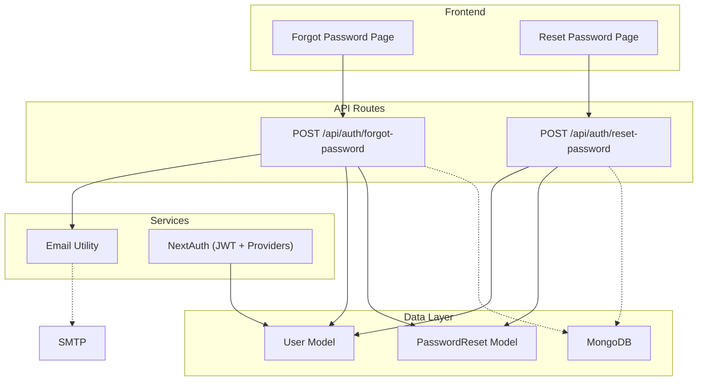
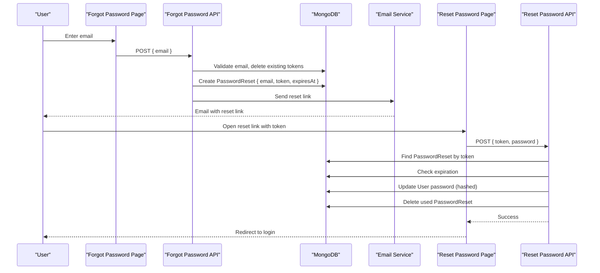
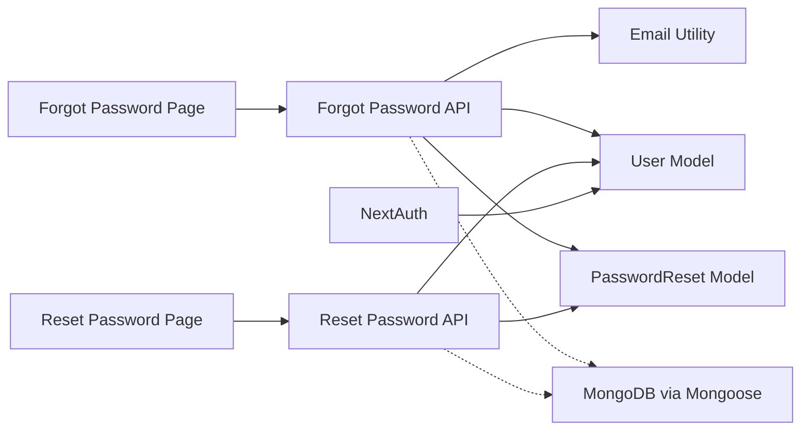
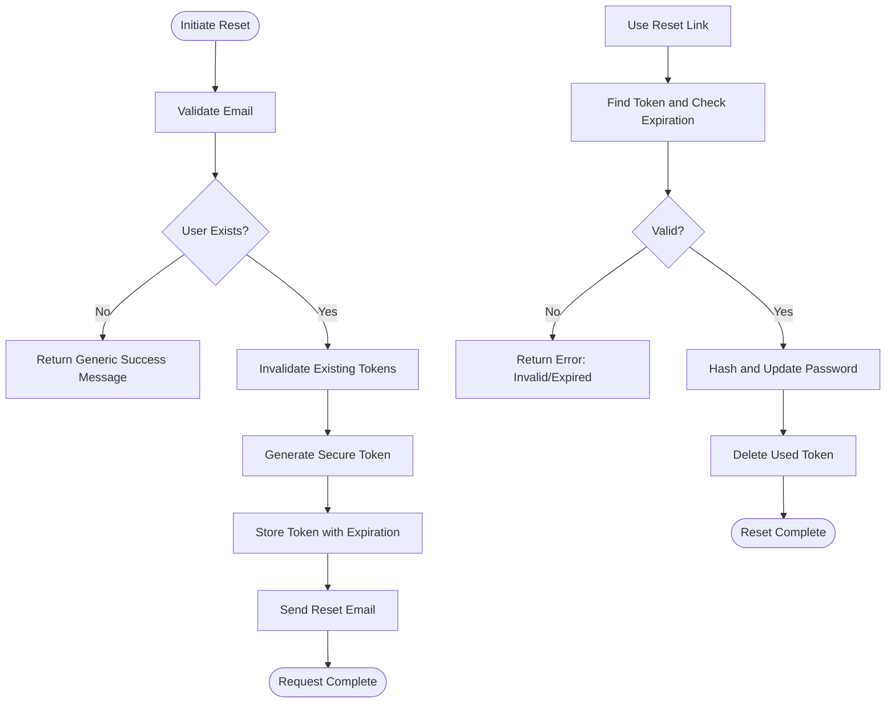

# Password Reset Model

<cite>
**Referenced Files in This Document**
- [PasswordReset.ts](file://models/PasswordReset.ts)
- [User.ts](file://models/User.ts)
- [forgot-password/route.ts](file://app/api/auth/forgot-password/route.ts)
- [reset-password/route.ts](file://app/api/auth/reset-password/route.ts)
- [email.ts](file://lib/email.ts)
- [auth.config.ts](file://auth.config.ts)
- [auth.ts](file://auth.ts)
- [mongoose.ts](file://lib/mongoose.ts)
- [forgot-password/page.tsx](file://app/auth/forgot-password/page.tsx)
- [reset-password/page.tsx](file://app/auth/reset-password/page.tsx)
</cite>

## Table of Contents
1. Introduction
2. Project Structure
3. Core Components
4. Architecture Overview
5. Detailed Component Analysis
6. Dependency Analysis
7. Performance Considerations
8. Troubleshooting Guide
9. Conclusion
10. Appendices

## Introduction
This document provides detailed data model and workflow documentation for the PasswordReset feature in the Digentic platform. It explains how password reset tokens are generated, stored, validated, and consumed; how expiration is enforced; and how the system integrates with authentication to provide a secure password recovery flow. It also covers security measures, lifecycle management, cleanup strategies, and integration patterns with the authentication system.

## Project Structure
The password reset functionality spans models, API routes, email utilities, and UI pages:
- Data models define the schema for users and password reset tokens.
- API routes handle token creation and consumption.
- Email utility sends reset links or logs them in development.
- UI pages collect user input and call the API endpoints.
- Authentication configuration and session handling integrate with NextAuth.

**Diagram sources**
- [forgot-password/route.ts:8-61](file://app/api/auth/forgot-password/route.ts#L8-L61)
- [reset-password/route.ts:7-69](file://app/api/auth/reset-password/route.ts#L7-L69)
- [email.ts:3-39](file://lib/email.ts#L3-L39)
- [User.ts:19-67](file://models/User.ts#L19-L67)
- [PasswordReset.ts:10-37](file://models/PasswordReset.ts#L10-L37)
- [auth.ts:9-84](file://auth.ts#L9-L84)
- [auth.config.ts:5-20](file://auth.config.ts#L5-L20)

**Section sources**
- [PasswordReset.ts:10-37](file://models/PasswordReset.ts#L10-L37)
- [User.ts:19-67](file://models/User.ts#L19-L67)
- [forgot-password/route.ts:8-61](file://app/api/auth/forgot-password/route.ts#L8-L61)
- [reset-password/route.ts:7-69](file://app/api/auth/reset-password/route.ts#L7-L69)
- [email.ts:3-39](file://lib/email.ts#L3-L39)
- [auth.ts:9-84](file://auth.ts#L9-L84)
- [auth.config.ts:5-20](file://auth.config.ts#L5-L20)

## Core Components
- PasswordReset model: Stores email, cryptographic token, expiration time, and creation timestamp. Uses MongoDB TTL to auto-delete expired records.
- User model: Represents users with hashed passwords and role-based attributes. Used to update passwords after successful reset.
- Forgot password API route: Validates input, generates a secure token, stores it with an expiration, invalidates prior tokens, and emails the reset link.
- Reset password API route: Validates token existence and freshness, hashes new password, updates user, and deletes the used token.
- Email utility: Sends HTML email via SMTP or logs the reset URL in development mode.
- Authentication integration: NextAuth handles sessions and providers; password reset flows operate independently but share the same user store.

**Section sources**
- [PasswordReset.ts:3-43](file://models/PasswordReset.ts#L3-L43)
- [User.ts:4-81](file://models/User.ts#L4-L81)
- [forgot-password/route.ts:8-61](file://app/api/auth/forgot-password/route.ts#L8-L61)
- [reset-password/route.ts:7-69](file://app/api/auth/reset-password/route.ts#L7-L69)
- [email.ts:3-39](file://lib/email.ts#L3-L39)
- [auth.ts:9-84](file://auth.ts#L9-L84)

## Architecture Overview
The password reset flow consists of two main phases: initiation and completion.

**Diagram sources**
- [forgot-password/route.ts:8-61](file://app/api/auth/forgot-password/route.ts#L8-L61)
- [reset-password/route.ts:7-69](file://app/api/auth/reset-password/route.ts#L7-L69)
- [email.ts:3-39](file://lib/email.ts#L3-L39)
- [PasswordReset.ts:10-37](file://models/PasswordReset.ts#L10-L37)
- [User.ts:19-67](file://models/User.ts#L19-L67)

## Detailed Component Analysis

### PasswordReset Data Model
- Fields:
  - email: normalized, required string.
  - token: unique, indexed string for lookups.
  - expiresAt: required date marking token validity.
  - createdAt: default current time; configured with a TTL index to automatically expire documents after one hour.
- Collection: password_resets.
- Indexes:
  - Unique index on token for fast lookup and uniqueness enforcement.
  - TTL index on createdAt to auto-delete expired entries.

Security considerations:
- Tokens are cryptographically random and stored alongside expiration metadata.
- The TTL ensures stale tokens are removed without manual cleanup.

Complexity:
- Lookup by token is O(1) average due to indexing.
- Deletion operations are efficient with indexes.

**Section sources**
- [PasswordReset.ts:3-43](file://models/PasswordReset.ts#L3-L43)

### User Model Integration
- The User model stores hashed passwords and supports comparison via a method.
- During password reset, the API updates the user’s password field with a newly hashed value.
- Role and other attributes remain unaffected by the reset process.

Integration points:
- Password reset API locates the user by email associated with the valid token and updates the password.
- Authentication uses the same User model for credential verification.

**Section sources**
- [User.ts:19-67](file://models/User.ts#L19-L67)
- [reset-password/route.ts:44-56](file://app/api/auth/reset-password/route.ts#L44-L56)

### Forgot Password Flow
- Input validation: Ensures a well-formed email address.
- Token generation: Creates a cryptographically secure token using a secure random generator.
- Expiration policy: Sets a one-hour validity window.
- Cleanup strategy: Deletes any existing reset tokens for the same email before creating a new one to prevent reuse.
- Email delivery: Sends a reset link constructed from the origin and token parameter.

Error handling:
- Returns generic success messages even if the email does not exist to avoid enumeration attacks.
- Logs errors and returns a server error response when unexpected issues occur.

**Section sources**
- [forgot-password/route.ts:8-61](file://app/api/auth/forgot-password/route.ts#L8-L61)
- [email.ts:3-39](file://lib/email.ts#L3-L39)

### Reset Password Flow
- Input validation: Requires a token and a strong password (minimum length).
- Validation steps:
  - Finds the PasswordReset record by token.
  - Checks expiration; deletes expired records immediately.
- Password update:
  - Hashes the new password securely.
  - Updates the user’s password by email.
- Cleanup:
  - Deletes the used PasswordReset record to ensure single-use tokens.

Error handling:
- Provides clear error responses for invalid/expired tokens and network/server errors.

**Section sources**
- [reset-password/route.ts:7-69](file://app/api/auth/reset-password/route.ts#L7-L69)

### Email Delivery
- SMTP configuration: Reads host, port, secure flag, credentials, and sender from environment variables.
- Development mode: If SMTP is not configured, logs the reset URL to console for local testing.
- Email content: Includes a styled HTML message with a reset button and fallback plain link.

Operational notes:
- Ensure environment variables are set for production email delivery.
- Verify domain reputation and SPF/DKIM settings for deliverability.

**Section sources**
- [email.ts:3-39](file://lib/email.ts#L3-L39)

### Frontend Pages
- Forgot Password page:
  - Collects email, validates format, calls the forgot password API, and displays success or error messages.
- Reset Password page:
  - Extracts token from query parameters, validates inputs, calls the reset password API, and redirects to login upon success.

User experience:
- Clear feedback for loading states, errors, and success.
- Guidance to request a new link if the token is missing or invalid.

**Section sources**
- [forgot-password/page.tsx:14-48](file://app/auth/forgot-password/page.tsx#L14-L48)
- [reset-password/page.tsx:19-78](file://app/auth/reset-password/page.tsx#L19-L78)

### Authentication Integration
- NextAuth configuration defines providers and callbacks for JWT/session handling.
- Credentials provider integrates with the User model for login; password reset operates independently but shares the same user store.
- Session strategy uses JWT; password changes do not invalidate sessions unless explicitly handled elsewhere.

Integration pattern:
- After password reset, users can log in with their new credentials.
- Consider implementing session invalidation on password change if needed for enhanced security.

**Section sources**
- [auth.config.ts:5-20](file://auth.config.ts#L5-L20)
- [auth.ts:9-84](file://auth.ts#L9-L84)

## Dependency Analysis
The following diagram shows key dependencies between components involved in password reset:

**Diagram sources**
- [forgot-password/route.ts:8-61](file://app/api/auth/forgot-password/route.ts#L8-L61)
- [reset-password/route.ts:7-69](file://app/api/auth/reset-password/route.ts#L7-L69)
- [email.ts:3-39](file://lib/email.ts#L3-L39)
- [User.ts:19-67](file://models/User.ts#L19-L67)
- [PasswordReset.ts:10-37](file://models/PasswordReset.ts#L10-L37)
- [auth.ts:9-84](file://auth.ts#L9-L84)

**Section sources**
- [forgot-password/route.ts:8-61](file://app/api/auth/forgot-password/route.ts#L8-L61)
- [reset-password/route.ts:7-69](file://app/api/auth/reset-password/route.ts#L7-L69)
- [email.ts:3-39](file://lib/email.ts#L3-L39)
- [User.ts:19-67](file://models/User.ts#L19-L67)
- [PasswordReset.ts:10-37](file://models/PasswordReset.ts#L10-L37)
- [auth.ts:9-84](file://auth.ts#L9-L84)

## Performance Considerations
- Indexing: Token uniqueness and lookup benefit from indexes, ensuring fast queries.
- TTL cleanup: MongoDB TTL removes expired records automatically, reducing storage growth and query load.
- Database connection caching: Reuses Mongoose connections to minimize overhead across requests.
- Rate limiting: Not implemented in the provided code; consider adding rate limiting to mitigate brute-force attempts on password reset endpoints.
- Email throughput: SMTP reliability and throttling may affect performance; monitor delivery queues and implement retries/backoff if necessary.

[No sources needed since this section provides general guidance]

## Troubleshooting Guide
Common issues and resolutions:
- Invalid or missing token:
  - Ensure the reset link includes the token parameter and that the token has not expired.
  - Expired tokens are deleted; request a new reset link.
- Email not received:
  - Verify SMTP environment variables are correctly set.
  - In development, check console logs for the reset URL.
- Network or server errors:
  - Inspect server logs for stack traces and database connectivity issues.
  - Confirm MongoDB URI and connection settings.

Operational checks:
- Validate environment variables for SMTP and MongoDB.
- Monitor application logs for error messages from API routes.
- Ensure CORS and origin headers are properly configured for email link construction.

**Section sources**
- [forgot-password/route.ts:54-61](file://app/api/auth/forgot-password/route.ts#L54-L61)
- [reset-password/route.ts:62-69](file://app/api/auth/reset-password/route.ts#L62-L69)
- [email.ts:33-39](file://lib/email.ts#L33-L39)
- [mongoose.ts:21-44](file://lib/mongoose.ts#L21-L44)

## Conclusion
The PasswordReset implementation in Digentic follows a secure, efficient, and maintainable design:
- Cryptographic token generation and strict expiration enforce short-lived access.
- MongoDB TTL and explicit deletion ensure clean state and minimal storage overhead.
- Robust input validation and error handling protect against common attack vectors.
- Integration with NextAuth and the User model enables seamless authentication workflows.
For enhanced security and scalability, consider adding rate limiting, audit logging, and session invalidation on password changes.

[No sources needed since this section summarizes without analyzing specific files]

## Appendices

### Lifecycle of Password Reset Requests

**Diagram sources**
- [forgot-password/route.ts:8-61](file://app/api/auth/forgot-password/route.ts#L8-L61)
- [reset-password/route.ts:7-69](file://app/api/auth/reset-password/route.ts#L7-L69)

### Security Measures Summary
- Token generation uses a secure random source.
- Tokens are unique and indexed for fast, safe lookup.
- One-time use enforced by deleting tokens after successful password update.
- Expiration enforced both at runtime and via MongoDB TTL.
- Generic success responses prevent account enumeration.
- Passwords are hashed before storage.

**Section sources**
- [forgot-password/route.ts:32-42](file://app/api/auth/forgot-password/route.ts#L32-L42)
- [reset-password/route.ts:27-56](file://app/api/auth/reset-password/route.ts#L27-L56)
- [PasswordReset.ts:18-32](file://models/PasswordReset.ts#L18-L32)

### Example Usage Patterns
- Creating a password reset token:
  - Call the forgot password endpoint with a valid email.
  - The system creates a token, sets expiration, and sends an email.
- Validating a password reset token:
  - The reset password endpoint verifies token existence and expiration.
- Consuming a password reset token:
  - Submit a new password; the system updates the user and deletes the token.

Implementation references:
- [forgot-password/route.ts:8-61](file://app/api/auth/forgot-password/route.ts#L8-L61)
- [reset-password/route.ts:7-69](file://app/api/auth/reset-password/route.ts#L7-L69)

### Integration Patterns with Authentication
- Shared user store: Both authentication and password reset operate on the same User model.
- Session strategy: JWT-based sessions; consider invalidating sessions post-reset for high-security contexts.
- Provider compatibility: Social providers (Google, GitHub) coexist with credential-based password reset.

**Section sources**
- [auth.config.ts:5-20](file://auth.config.ts#L5-L20)
- [auth.ts:9-84](file://auth.ts#L9-L84)