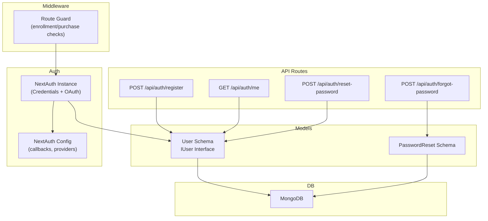
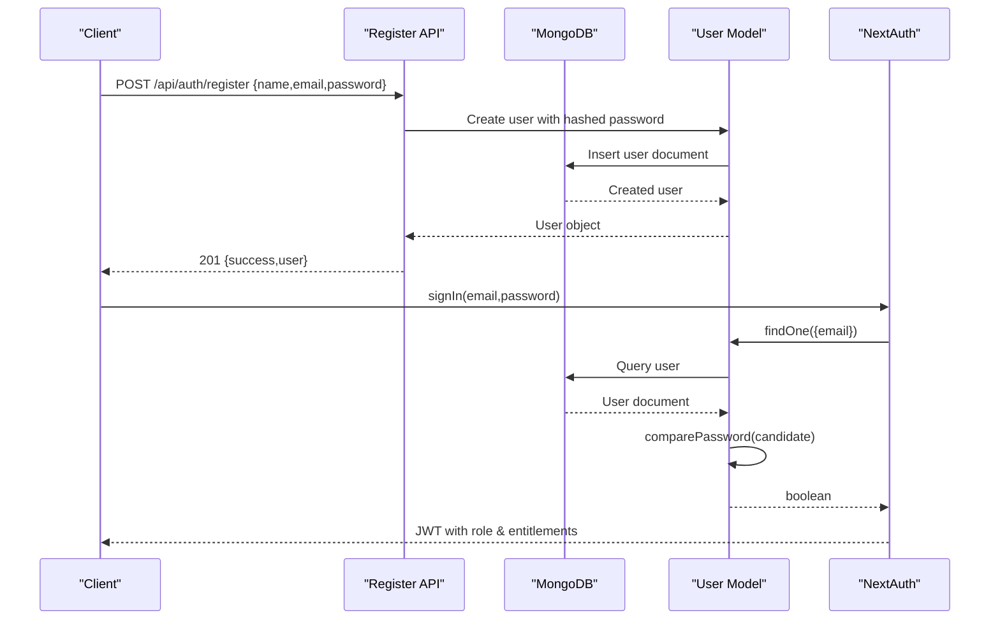
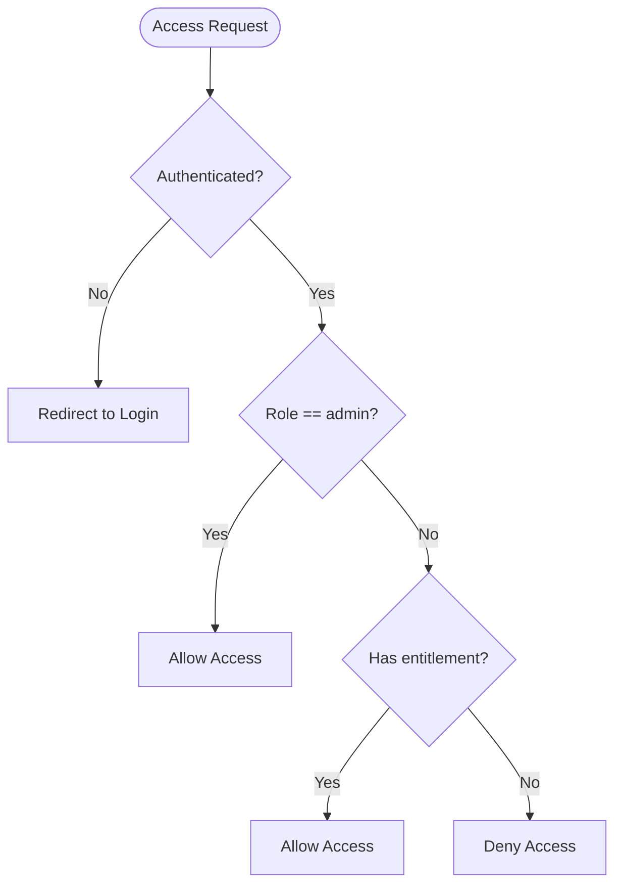
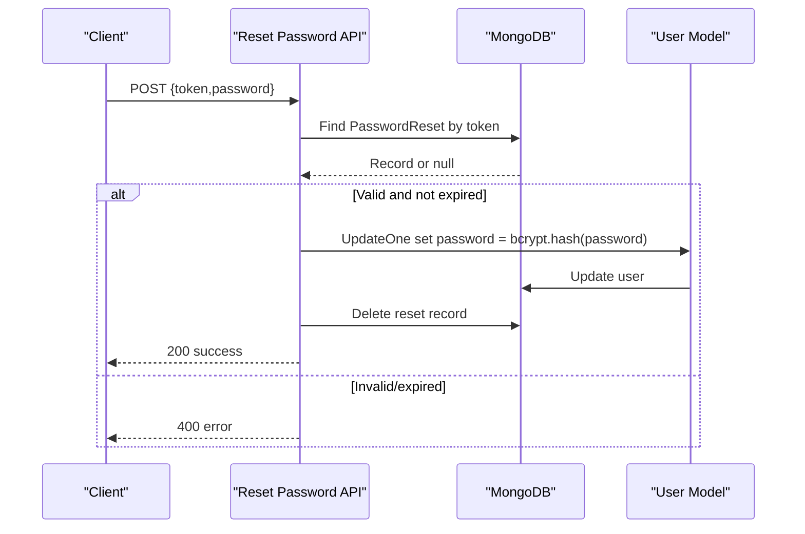
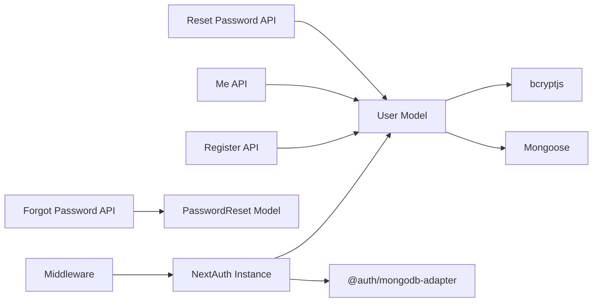

# User Model

<cite>
**Referenced Files in This Document**
- [User.ts](file://models/User.ts)
- [index.ts](file://models/index.ts)
- [auth.config.ts](file://auth.config.ts)
- [auth.ts](file://auth.ts)
- [register/route.ts](file://app/api/auth/register/route.ts)
- [me/route.ts](file://app/api/auth/me/route.ts)
- [forgot-password/route.ts](file://app/api/auth/forgot-password/route.ts)
- [reset-password/route.ts](file://app/api/auth/reset-password/route.ts)
- [PasswordReset.ts](file://models/PasswordReset.ts)
- [mongodb.ts](file://lib/mongodb.ts)
- [mongoose.ts](file://lib/mongoose.ts)
- [proxy.ts](file://proxy.ts)
</cite>

## Table of Contents
1. Introduction
2. Project Structure
3. Core Components
4. Architecture Overview
5. Detailed Component Analysis
6. Dependency Analysis
7. Performance Considerations
8. Troubleshooting Guide
9. Conclusion
10. Appendices

## Introduction
This document provides comprehensive data model documentation for the User model in the Digentic platform. It details the IUser interface and UserSchema structure, field types, validation rules, constraints, and business logic. It also explains secure password verification using bcrypt, user roles and permissions, and usage patterns for user creation, authentication, profile management, course enrollment, and digital product purchases.

## Project Structure
The User model is defined with Mongoose and integrated into NextAuth for authentication and session management. Related API routes handle registration, profile retrieval, and password reset flows. Middleware enforces access control based on user roles and entitlements (enrolled courses and purchased digital products).

**Diagram sources**
- [User.ts:19-67](file://models/User.ts#L19-L67)
- [auth.config.ts:21-99](file://auth.config.ts#L21-L99)
- [auth.ts:21-83](file://auth.ts#L21-L83)
- [register/route.ts:6-67](file://app/api/auth/register/route.ts#L6-L67)
- [me/route.ts:6-42](file://app/api/auth/me/route.ts#L6-L42)
- [forgot-password/route.ts:8-53](file://app/api/auth/forgot-password/route.ts#L8-L53)
- [reset-password/route.ts:7-61](file://app/api/auth/reset-password/route.ts#L7-L61)
- [PasswordReset.ts:10-37](file://models/PasswordReset.ts#L10-L37)
- [proxy.ts:52-91](file://proxy.ts#L52-L91)

**Section sources**
- [User.ts:1-81](file://models/User.ts#L1-L81)
- [auth.config.ts:1-101](file://auth.config.ts#L1-L101)
- [auth.ts:1-133](file://auth.ts#L1-L133)
- [register/route.ts:1-76](file://app/api/auth/register/route.ts#L1-L76)
- [me/route.ts:1-51](file://app/api/auth/me/route.ts#L1-L51)
- [forgot-password/route.ts:1-61](file://app/api/auth/forgot-password/route.ts#L1-L61)
- [reset-password/route.ts:1-69](file://app/api/auth/reset-password/route.ts#L1-L69)
- [PasswordReset.ts:1-44](file://models/PasswordReset.ts#L1-L44)
- [proxy.ts:38-91](file://proxy.ts#L38-L91)

## Core Components
- IUser interface: Defines the shape of a user document including identity fields, role, entitlements, timestamps, and the comparePassword method.
- UserSchema: Mongoose schema defining field types, defaults, validations, indexes, and collection mapping.
- comparePassword: Securely compares a candidate password against the stored hash using bcrypt.
- Role-based access: Roles are 'user' or 'admin'; admin grants special privileges via JWT/session propagation.
- Entitlements: enrolledCourses and purchasedDigital arrays track user access to courses and digital products.

Key responsibilities:
- Data validation at the schema level ensures consistent and safe input.
- Authentication integrates with NextAuth and credentials provider to verify users securely.
- Session callbacks propagate role and entitlements into tokens and sessions for client-side and middleware enforcement.

**Section sources**
- [User.ts:4-17](file://models/User.ts#L4-L17)
- [User.ts:19-67](file://models/User.ts#L19-L67)
- [User.ts:69-75](file://models/User.ts#L69-L75)
- [auth.config.ts:30-99](file://auth.config.ts#L30-L99)

## Architecture Overview
The User model participates in a layered architecture:
- Models layer: Mongoose schemas define data contracts and validations.
- Auth layer: NextAuth handles credential and OAuth sign-in, issuing JWTs enriched with role and entitlements.
- API layer: REST endpoints provide registration, profile retrieval, and password reset operations.
- Middleware layer: Route guards enforce access based on session data (role, enrolled courses, purchased digital).

**Diagram sources**
- [register/route.ts:6-67](file://app/api/auth/register/route.ts#L6-L67)
- [auth.ts:21-83](file://auth.ts#L21-L83)
- [User.ts:69-75](file://models/User.ts#L69-L75)

## Detailed Component Analysis

### IUser Interface
- _id: MongoDB ObjectId identifier.
- name: Required string; trimmed; max length enforced by schema.
- email: Required, unique, lowercase, trimmed; validated with an email regex pattern; indexed for performance.
- password: Optional string; minimum length enforced by schema; used only for credential-based auth.
- image: Optional string or null; default null.
- role: Enumerated string; allowed values 'user' or 'admin'; default 'user'.
- emailVerified: Optional date or null; indicates when email was verified.
- enrolledCourses: Array of strings; default empty; stores course IDs or slugs the user has enrolled in.
- purchasedDigital: Array of strings; default empty; stores product slugs the user has purchased.
- createdAt/updatedAt: Timestamps managed by Mongoose.
- comparePassword(candidatePassword): Async method returning boolean after comparing candidate with stored hash.

Validation and constraints:
- Name: required, trimmed, maxlength 100.
- Email: required, unique, lowercase, trimmed, matches email regex, indexed.
- Password: optional but if present must be at least 8 characters.
- Role: restricted to 'user' or 'admin', default 'user'.
- Arrays: enrolledCourses and purchasedDigital default to empty arrays.

**Section sources**
- [User.ts:4-17](file://models/User.ts#L4-L17)
- [User.ts:19-67](file://models/User.ts#L19-L67)

### UserSchema and Methods
- Collection mapping: Uses 'users' collection to align with NextAuth MongoDB adapter expectations.
- Timestamps: Enabled to auto-manage createdAt and updatedAt.
- Method comparePassword:
  - If no password exists, returns false.
  - Otherwise uses bcrypt.compare to check candidate against stored hash.

Security considerations:
- Passwords are never stored in plaintext; hashing occurs during registration and reset flows.
- comparePassword avoids timing attacks by delegating to bcrypt.compare.

**Section sources**
- [User.ts:19-67](file://models/User.ts#L19-L67)
- [User.ts:69-75](file://models/User.ts#L69-L75)

### Roles and Permissions
- Roles:
  - user: Standard user with limited access.
  - admin: Elevated access; can bypass certain restrictions.
- Permission enforcement:
  - JWT/session callbacks inject role, enrolledCourses, and purchasedDigital into token and session.
  - Admin receives special entitlements:
    - enrolledCourses set to ['all']
    - purchasedDigital set to ['all']
  - Middleware checks:
    - Course learn routes require user to be logged in and either admin or enrolled in the specific course.
    - Digital download routes require user to be logged in and either admin or having purchased the specific product.

**Diagram sources**
- [auth.config.ts:30-99](file://auth.config.ts#L30-L99)
- [proxy.ts:52-91](file://proxy.ts#L52-L91)

**Section sources**
- [auth.config.ts:30-99](file://auth.config.ts#L30-L99)
- [proxy.ts:52-91](file://proxy.ts#L52-L91)

### Password Handling and Security
- Registration:
  - Validates name, email format, and password length.
  - Normalizes email to lowercase and trims whitespace.
  - Hashes password with bcrypt before persisting.
- Credentials authentication:
  - Looks up user by normalized email.
  - Ensures user has a password stored.
  - Uses comparePassword to validate candidate password.
- Password reset:
  - Generates a random token with expiration (1 hour).
  - Stores reset record with TTL index for automatic cleanup.
  - Updates user password with new bcrypt hash upon successful reset.
- Email validation:
  - Regex-based validation across registration and forgot-password endpoints.
  - Lowercase normalization ensures consistency.

**Diagram sources**
- [reset-password/route.ts:7-61](file://app/api/auth/reset-password/route.ts#L7-L61)
- [PasswordReset.ts:10-37](file://models/PasswordReset.ts#L10-L37)

**Section sources**
- [register/route.ts:6-67](file://app/api/auth/register/route.ts#L6-L67)
- [auth.ts:21-83](file://auth.ts#L21-L83)
- [forgot-password/route.ts:8-53](file://app/api/auth/forgot-password/route.ts#L8-L53)
- [reset-password/route.ts:7-61](file://app/api/auth/reset-password/route.ts#L7-L61)
- [PasswordReset.ts:10-37](file://models/PasswordReset.ts#L10-L37)

### User Creation Example
- Endpoint: POST /api/auth/register
- Input: name, email, password
- Behavior:
  - Validates inputs.
  - Checks uniqueness of email.
  - Hashes password and creates user with default role 'user' and empty entitlement arrays.
- Output: 201 with minimal user info (id, name, email, role).

Usage pattern:
- Frontend collects form data and sends JSON payload.
- On success, redirect to login page.

**Section sources**
- [register/route.ts:6-67](file://app/api/auth/register/route.ts#L6-L67)

### Authentication Example
- Credentials provider flow:
  - Normalize email and trim password.
  - Optionally allow temporary admin login via environment variables.
  - Fetch user from database and verify password using comparePassword.
  - Return standardized user object with role and entitlements.
- JWT/session enrichment:
  - Inject role, enrolledCourses, and purchasedDigital into token.
  - Propagate to session.user for client-side use.

Usage pattern:
- Use NextAuth signIn with email/password.
- After sign-in, session contains role and entitlements for UI and middleware decisions.

**Section sources**
- [auth.ts:21-83](file://auth.ts#L21-L83)
- [auth.config.ts:30-99](file://auth.config.ts#L30-L99)

### Profile Management Example
- Endpoint: GET /api/auth/me
- Behavior:
  - Requires authenticated session.
  - Retrieves user by email, excluding password from response.
  - Returns full profile including role and entitlements.

Usage pattern:
- Call /api/auth/me to fetch current user profile for dashboard or settings pages.

**Section sources**
- [me/route.ts:6-42](file://app/api/auth/me/route.ts#L6-L42)

### Enrollment in Courses
- Enforcement:
  - Middleware protects /courses/:id/learn routes.
  - Requires authentication and checks if user is admin or has courseId in enrolledCourses.
- Business logic:
  - When a user enrolls in a course, add the course ID/slug to their enrolledCourses array.
  - Ensure idempotency to avoid duplicates.
- Access control:
  - If not enrolled, redirect to course overview with notice parameter.

Usage pattern:
- After purchase or explicit enrollment action, update user.enrolledCourses via a backend endpoint that validates authorization and persists changes.

**Section sources**
- [proxy.ts:52-73](file://proxy.ts#L52-L73)
- [auth.config.ts:53-63](file://auth.config.ts#L53-L63)

### Purchasing Digital Products
- Enforcement:
  - Middleware protects /digital/downloads routes.
  - Requires authentication and checks if user is admin or has product slug in purchasedDigital.
- Business logic:
  - After payment completion, add product slug to user.purchasedDigital.
  - Ensure idempotency to avoid duplicate entries.
- Access control:
  - If not purchased, redirect to product page with notice parameter.

Usage pattern:
- Integrate with payment provider webhook to update purchasedDigital upon successful transaction.

**Section sources**
- [proxy.ts:75-91](file://proxy.ts#L75-L91)
- [auth.config.ts:59-63](file://auth.config.ts#L59-L63)

## Dependency Analysis
- Models depend on Mongoose and bcryptjs for schema definition and password hashing.
- Auth depends on NextAuth, MongoDB adapter, and the User model for credential verification.
- API routes depend on connectToDatabase utility and User model for persistence.
- Middleware depends on session data propagated by NextAuth to enforce access.

**Diagram sources**
- [User.ts:1-3](file://models/User.ts#L1-L3)
- [auth.ts:1-7](file://auth.ts#L1-L7)
- [register/route.ts:1-4](file://app/api/auth/register/route.ts#L1-L4)
- [me/route.ts:1-4](file://app/api/auth/me/route.ts#L1-L4)
- [forgot-password/route.ts:1-6](file://app/api/auth/forgot-password/route.ts#L1-L6)
- [reset-password/route.ts:1-5](file://app/api/auth/reset-password/route.ts#L1-L5)
- [proxy.ts:38-91](file://proxy.ts#L38-L91)

**Section sources**
- [User.ts:1-3](file://models/User.ts#L1-L3)
- [auth.ts:1-7](file://auth.ts#L1-L7)
- [register/route.ts:1-4](file://app/api/auth/register/route.ts#L1-L4)
- [me/route.ts:1-4](file://app/api/auth/me/route.ts#L1-L4)
- [forgot-password/route.ts:1-6](file://app/api/auth/forgot-password/route.ts#L1-L6)
- [reset-password/route.ts:1-5](file://app/api/auth/reset-password/route.ts#L1-L5)
- [proxy.ts:38-91](file://proxy.ts#L38-L91)

## Performance Considerations
- Indexing:
  - Email field is indexed for fast lookups during authentication and registration.
- Connection pooling:
  - MongoDB client and Mongoose connections are cached to reduce overhead.
- JWT strategy:
  - Using JWT session strategy reduces database calls per request after initial authentication.
- Validation:
  - Schema-level validation minimizes invalid writes and reduces error handling costs.

[No sources needed since this section provides general guidance]

## Troubleshooting Guide
Common issues and resolutions:
- Duplicate email during registration:
  - Occurs when trying to create a user with an existing email.
  - Resolution: Prompt user to log in or recover account.
- Invalid email format:
  - Registration and forgot-password endpoints reject malformed emails.
  - Resolution: Ensure proper email formatting.
- Password too short:
  - Registration requires minimum length; reset-password requires at least 8 characters.
  - Resolution: Enforce stronger passwords in UI.
- Unauthorized access to protected routes:
  - Middleware redirects unauthenticated users or those without entitlements.
  - Resolution: Sign in first; ensure enrollment or purchase recorded.
- Temporary admin login disabled:
  - If environment variables are not set, temporary admin login will not work.
  - Resolution: Configure TEMP_ADMIN_EMAIL and TEMP_ADMIN_PASSWORD for development.

**Section sources**
- [register/route.ts:11-41](file://app/api/auth/register/route.ts#L11-L41)
- [reset-password/route.ts:11-23](file://app/api/auth/reset-password/route.ts#L11-L23)
- [proxy.ts:52-91](file://proxy.ts#L52-L91)
- [auth.ts:29-47](file://auth.ts#L29-L47)

## Conclusion
The User model in Digentic provides a robust foundation for identity, authentication, and authorization. The schema enforces strict validation and constraints, while bcrypt ensures secure password handling. Role-based access and entitlement arrays enable fine-grained control over course enrollment and digital product access. Integration with NextAuth streamlines authentication flows and propagates necessary context to middleware and UI layers. Following the documented usage patterns ensures secure and scalable user management across the platform.

[No sources needed since this section summarizes without analyzing specific files]

## Appendices

### Field Reference Table
- name: String; required; trimmed; max 100 chars.
- email: String; required; unique; lowercase; trimmed; email regex; indexed.
- password: String; optional; min 8 chars; hashed storage.
- image: String|null; optional; default null.
- role: Enum 'user'|'admin'; default 'user'.
- emailVerified: Date|null; optional.
- enrolledCourses: String[]; default [].
- purchasedDigital: String[]; default [].
- createdAt: Date; auto-managed.
- updatedAt: Date; auto-managed.

**Section sources**
- [User.ts:19-67](file://models/User.ts#L19-L67)

### Database Connections
- MongoDB client configuration and connection caching.
- Mongoose connection caching to optimize repeated connections.

**Section sources**
- [mongodb.ts:1-38](file://lib/mongodb.ts#L1-L38)
- [mongoose.ts:1-47](file://lib/mongoose.ts#L1-L47)