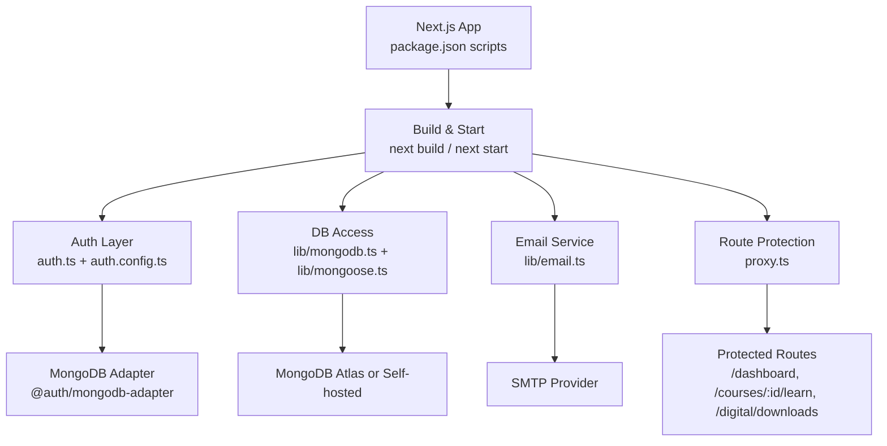
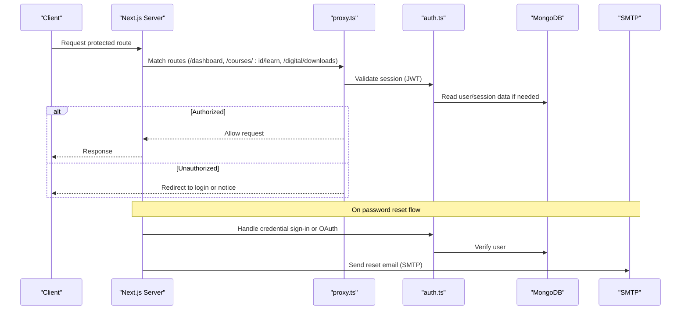
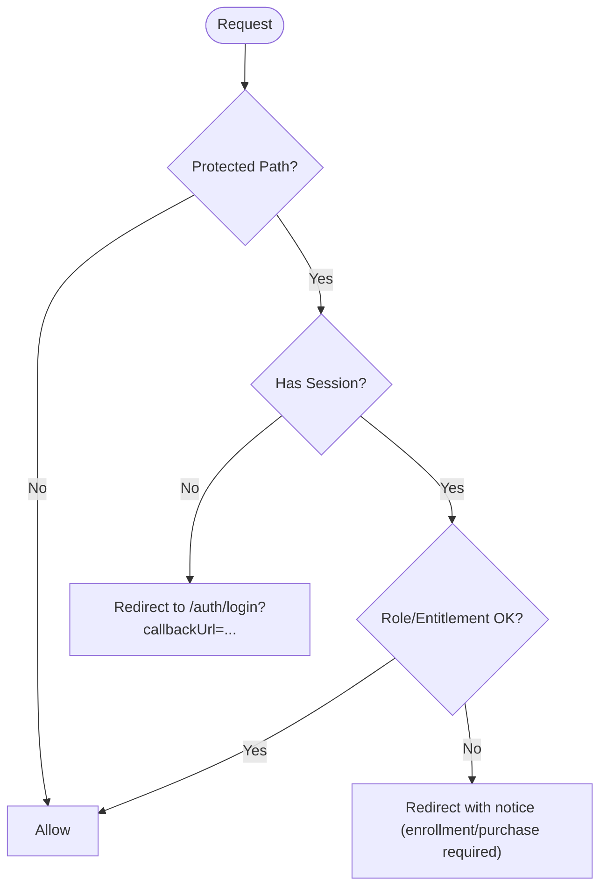
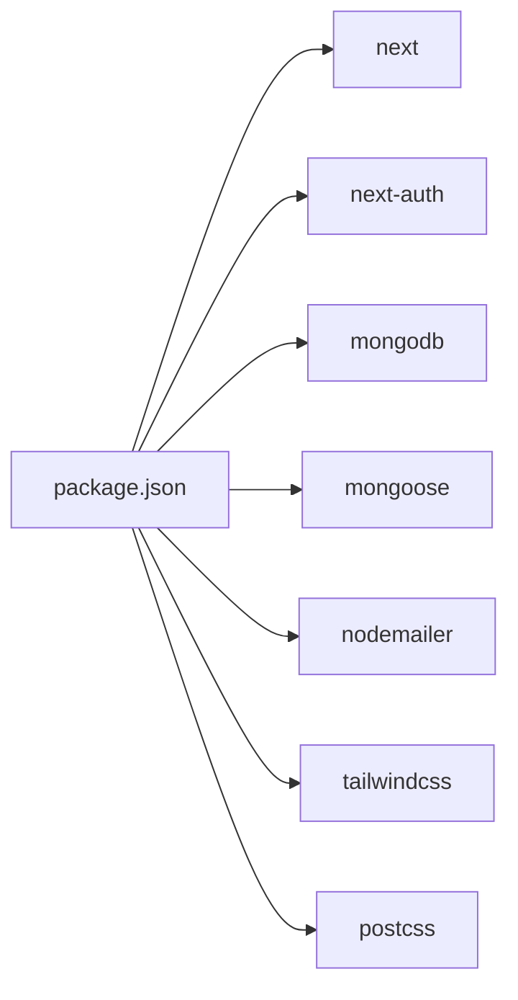

# Deployment & DevOps

<cite>
**Referenced Files in This Document**
- [package.json](file://package.json)
- [next.config.js](file://next.config.js)
- [tsconfig.json](file://tsconfig.json)
- [auth.config.ts](file://auth.config.ts)
- [auth.ts](file://auth.ts)
- [proxy.ts](file://proxy.ts)
- [lib/mongodb.ts](file://lib/mongodb.ts)
- [lib/mongoose.ts](file://lib/mongoose.ts)
- [lib/email.ts](file://lib/email.ts)
- [models/User.ts](file://models/User.ts)
- [models/PasswordReset.ts](file://models/PasswordReset.ts)
</cite>

## Table of Contents
1. Introduction
2. Project Structure
3. Core Components
4. Architecture Overview
5. Detailed Component Analysis
6. Dependency Analysis
7. Performance Considerations
8. Troubleshooting Guide
9. Conclusion
10. Appendices

## Introduction
This document provides production deployment and operational guidance for a Next.js application with authentication, MongoDB-backed data access, email notifications, and route-level authorization. It covers environment configuration, build optimization, deployment strategies (Vercel, Docker, traditional servers), CI/CD pipelines, secrets management, monitoring/logging/alerting, scaling and load balancing, rollback procedures, and disaster recovery planning.

## Project Structure
The project is a Next.js app using:
- Authentication via NextAuth with Google and GitHub providers and credentials provider
- MongoDB via both the native driver and Mongoose
- Email sending via Nodemailer
- Route protection and enrollment/purchase checks via middleware-like proxy logic
- TypeScript compilation and strict settings

**Diagram sources**
- [package.json:5-10](file://package.json#L5-L10)
- [next.config.js:1-9](file://next.config.js#L1-L9)
- [auth.config.ts:1-20](file://auth.config.ts#L1-L20)
- [auth.ts:1-15](file://auth.ts#L1-L15)
- [lib/mongodb.ts:1-11](file://lib/mongodb.ts#L1-L11)
- [lib/mongoose.ts:1-13](file://lib/mongoose.ts#L1-L13)
- [lib/email.ts:1-13](file://lib/email.ts#L1-L13)
- [proxy.ts:1-10](file://proxy.ts#L1-L10)

**Section sources**
- [package.json:5-10](file://package.json#L5-L10)
- [next.config.js:1-9](file://next.config.js#L1-L9)
- [tsconfig.json:1-20](file://tsconfig.json#L1-L20)

## Core Components
- Build and runtime scripts: development, build, start, lint, typecheck
- Image optimization disabled to support non-standard image hosts
- Authentication with multiple providers and JWT session strategy
- Database connections via MongoDB client and Mongoose with connection caching
- Email sending with SMTP configuration and fallback logging
- Route protection for dashboard, course learning, and digital downloads

Key implementation references:
- Scripts and dependencies: [package.json:5-10](file://package.json#L5-L10), [package.json:12-52](file://package.json#L12-L52)
- Next.js config: [next.config.js:1-9](file://next.config.js#L1-L9)
- Auth configuration and providers: [auth.config.ts:1-20](file://auth.config.ts#L1-L20)
- Auth assembly and adapter: [auth.ts:1-15](file://auth.ts#L1-L15)
- DB clients: [lib/mongodb.ts:1-11](file://lib/mongodb.ts#L1-L11), [lib/mongoose.ts:1-13](file://lib/mongoose.ts#L1-L13)
- Email transport: [lib/email.ts:1-13](file://lib/email.ts#L1-L13)
- Route protection matcher: [proxy.ts:80-91](file://proxy.ts#L80-L91)

**Section sources**
- [package.json:5-10](file://package.json#L5-L10)
- [next.config.js:1-9](file://next.config.js#L1-L9)
- [auth.config.ts:1-20](file://auth.config.ts#L1-L20)
- [auth.ts:1-15](file://auth.ts#L1-L15)
- [lib/mongodb.ts:1-11](file://lib/mongodb.ts#L1-L11)
- [lib/mongoose.ts:1-13](file://lib/mongoose.ts#L1-L13)
- [lib/email.ts:1-13](file://lib/email.ts#L1-L13)
- [proxy.ts:80-91](file://proxy.ts#L80-L91)

## Architecture Overview
The runtime flow integrates authentication, database access, email, and route protection:

**Diagram sources**
- [proxy.ts:12-77](file://proxy.ts#L12-L77)
- [auth.ts:21-83](file://auth.ts#L21-L83)
- [lib/mongodb.ts:21-30](file://lib/mongodb.ts#L21-L30)
- [lib/email.ts:3-13](file://lib/email.ts#L3-L13)

## Detailed Component Analysis

### Environment Configuration
Required environment variables:
- Database
  - MONGODB_URI: Connection string for MongoDB (used by both native client and Mongoose)
- Authentication
  - GOOGLE_CLIENT_ID, GOOGLE_CLIENT_SECRET
  - GITHUB_CLIENT_ID, GITHUB_CLIENT_SECRET
  - TEMP_ADMIN_EMAIL, TEMP_ADMIN_PASSWORD (temporary admin for dev/testing)
- Email
  - SMTP_HOST, SMTP_PORT, SMTP_USER, SMTP_PASS, SMTP_FROM (optional)

Notes:
- The app falls back to local MongoDB URI when MONGODB_URI is not set; ensure this is overridden in production.
- Email sending uses SMTP only when host/user/pass are provided; otherwise logs to console for development.

References:
- [lib/mongodb.ts:3](file://lib/mongodb.ts#L3)
- [lib/mongoose.ts:3](file://lib/mongoose.ts#L3)
- [auth.config.ts:10-19](file://auth.config.ts#L10-L19)
- [auth.ts:29-37](file://auth.ts#L29-L37)
- [lib/email.ts:4-13](file://lib/email.ts#L4-L13)

**Section sources**
- [lib/mongodb.ts:3](file://lib/mongodb.ts#L3)
- [lib/mongoose.ts:3](file://lib/mongoose.ts#L3)
- [auth.config.ts:10-19](file://auth.config.ts#L10-L19)
- [auth.ts:29-37](file://auth.ts#L29-L37)
- [lib/email.ts:4-13](file://lib/email.ts#L4-L13)

### Database Connections
- Native MongoDB client:
  - Uses MONGODB_URI and server API v1 options
  - In development, reuses a global client promise; in production, creates a new client per process
- Mongoose:
  - Uses MONGODB_URI with bufferCommands disabled
  - Global cache to reuse connections within the process

Operational notes:
- Ensure connection strings use TLS and appropriate timeouts in production
- Use managed MongoDB (e.g., Atlas) with IP allowlists and least-privilege users

References:
- [lib/mongodb.ts:1-11](file://lib/mongodb.ts#L1-L11)
- [lib/mongodb.ts:21-30](file://lib/mongodb.ts#L21-L30)
- [lib/mongoose.ts:21-44](file://lib/mongoose.ts#L21-L44)

**Section sources**
- [lib/mongodb.ts:1-11](file://lib/mongodb.ts#L1-L11)
- [lib/mongodb.ts:21-30](file://lib/mongodb.ts#L21-L30)
- [lib/mongoose.ts:21-44](file://lib/mongoose.ts#L21-L44)

### Authentication and Authorization
- Providers: Google and GitHub configured via environment variables
- Credentials provider: supports temporary admin login for development/testing
- Session strategy: JWT
- Route protection:
  - /dashboard and subpaths require login
  - /courses/:id/learn requires login and enrollment/admin role
  - /digital/downloads requires login and purchase/admin role

**Diagram sources**
- [proxy.ts:12-77](file://proxy.ts#L12-L77)

References:
- [auth.config.ts:1-20](file://auth.config.ts#L1-L20)
- [auth.ts:9-15](file://auth.ts#L9-L15)
- [auth.ts:21-83](file://auth.ts#L21-L83)
- [proxy.ts:12-77](file://proxy.ts#L12-L77)

**Section sources**
- [auth.config.ts:1-20](file://auth.config.ts#L1-L20)
- [auth.ts:9-15](file://auth.ts#L9-L15)
- [auth.ts:21-83](file://auth.ts#L21-L83)
- [proxy.ts:12-77](file://proxy.ts#L12-L77)

### Email Service
- Sends password reset emails via Nodemailer when SMTP_HOST, SMTP_USER, SMTP_PASS are set
- Falls back to console logging in development when SMTP is not configured

Operational notes:
- Configure SMTP securely via environment variables
- Use a reputable transactional email provider for deliverability and analytics

References:
- [lib/email.ts:3-13](file://lib/email.ts#L3-L13)
- [lib/email.ts:15-31](file://lib/email.ts#L15-L31)
- [lib/email.ts:32-38](file://lib/email.ts#L32-L38)

**Section sources**
- [lib/email.ts:3-13](file://lib/email.ts#L3-L13)
- [lib/email.ts:15-31](file://lib/email.ts#L15-L31)
- [lib/email.ts:32-38](file://lib/email.ts#L32-L38)

### Data Models
- User model includes role, enrolledCourses, purchasedDigital, timestamps, and password hashing method
- PasswordReset model includes TTL index to auto-expire tokens after 1 hour

References:
- [models/User.ts:19-67](file://models/User.ts#L19-L67)
- [models/User.ts:69-75](file://models/User.ts#L69-L75)
- [models/PasswordReset.ts:10-37](file://models/PasswordReset.ts#L10-L37)

**Section sources**
- [models/User.ts:19-67](file://models/User.ts#L19-L67)
- [models/User.ts:69-75](file://models/User.ts#L69-L75)
- [models/PasswordReset.ts:10-37](file://models/PasswordReset.ts#L10-L37)

## Dependency Analysis
Key runtime dependencies relevant to deployment:
- Next.js and NextAuth for framework and authentication
- MongoDB driver and Mongoose for database connectivity
- Nodemailer for email delivery
- Tailwind CSS and PostCSS for styling pipeline

**Diagram sources**
- [package.json:12-52](file://package.json#L12-L52)

**Section sources**
- [package.json:12-52](file://package.json#L12-L52)

## Performance Considerations
- Images: Currently unoptimized images are enabled; consider enabling Next.js image optimization for supported providers in production to improve performance and reduce bandwidth.
- Build:
  - Use production build script to generate optimized assets
  - Enable type checking in CI to catch issues early
- Database:
  - Use connection pooling and proper indexes on frequently queried fields (e.g., email)
  - Prefer managed databases with autoscaling and read replicas where applicable
- Caching:
  - Leverage Next.js caching strategies (ISR/SSG) where appropriate
  - Cache database connections at process level (already implemented)

References:
- [next.config.js:1-9](file://next.config.js#L1-L9)
- [package.json:5-10](file://package.json#L5-L10)
- [lib/mongoose.ts:21-44](file://lib/mongoose.ts#L21-L44)

**Section sources**
- [next.config.js:1-9](file://next.config.js#L1-L9)
- [package.json:5-10](file://package.json#L5-L10)
- [lib/mongoose.ts:21-44](file://lib/mongoose.ts#L21-L44)

## Troubleshooting Guide
Common issues and resolutions:
- Authentication failures:
  - Ensure all OAuth client IDs and secrets are correctly set
  - Verify callback URLs match provider settings
  - Check that TEMP_ADMIN_EMAIL and TEMP_ADMIN_PASSWORD are set appropriately for dev
- Database connection errors:
  - Confirm MONGODB_URI is correct and network-accessible
  - Validate TLS certificates and IP allowlists for managed databases
- Email delivery:
  - Verify SMTP credentials and port settings
  - In development without SMTP, check console logs for reset links

References:
- [auth.config.ts:10-19](file://auth.config.ts#L10-L19)
- [auth.ts:29-37](file://auth.ts#L29-L37)
- [lib/mongodb.ts:21-30](file://lib/mongodb.ts#L21-L30)
- [lib/email.ts:4-13](file://lib/email.ts#L4-L13)
- [lib/email.ts:32-38](file://lib/email.ts#L32-L38)

**Section sources**
- [auth.config.ts:10-19](file://auth.config.ts#L10-L19)
- [auth.ts:29-37](file://auth.ts#L29-L37)
- [lib/mongodb.ts:21-30](file://lib/mongodb.ts#L21-L30)
- [lib/email.ts:4-13](file://lib/email.ts#L4-L13)
- [lib/email.ts:32-38](file://lib/email.ts#L32-L38)

## Conclusion
This application is production-ready with clear separation of concerns for authentication, database access, email, and route protection. By configuring environment variables securely, optimizing builds, and following the deployment strategies below, you can deploy reliably across platforms. Implement CI/CD, monitoring, and disaster recovery practices to maintain high availability and observability.

## Appendices

### Build and Runtime Commands
- Development: run dev server
- Build: create production build
- Start: run production server
- Lint and Typecheck: code quality and type safety

References:
- [package.json:5-10](file://package.json#L5-L10)

**Section sources**
- [package.json:5-10](file://package.json#L5-L10)

### Deployment Strategies

#### Vercel
- Connect repository and configure environment variables in Vercel dashboard
- Build command: default Next.js build
- Output directory: .next (default)
- Recommended: enable image optimization for supported providers
- Secrets: store OAuth and SMTP credentials in Vercel environment variables

References:
- [package.json:5-10](file://package.json#L5-L10)
- [next.config.js:1-9](file://next.config.js#L1-L9)

**Section sources**
- [package.json:5-10](file://package.json#L5-L10)
- [next.config.js:1-9](file://next.config.js#L1-L9)

#### Docker Containers
- Base image: Node LTS with matching version used in package engines
- Steps:
  - Install dependencies
  - Run typecheck and lint in CI
  - Build Next.js app
  - Expose port and run production server
- Environment variables: pass MONGODB_URI, SMTP_*, and OAuth_* variables at runtime
- Health checks: implement a simple health endpoint or rely on Next.js readiness

References:
- [package.json:5-10](file://package.json#L5-L10)

**Section sources**
- [package.json:5-10](file://package.json#L5-L10)

#### Traditional Servers (PM2/Nginx)
- Process manager: PM2 to keep the app alive and manage logs
- Reverse proxy: Nginx to terminate TLS and forward to Next.js
- Environment variables: export via systemd or shell profile
- Logs: rotate and centralize application logs

References:
- [package.json:5-10](file://package.json#L5-L10)

**Section sources**
- [package.json:5-10](file://package.json#L5-L10)

### CI/CD Pipeline Setup
Suggested workflow stages:
- Install dependencies
- Lint and typecheck
- Build production artifacts
- Run tests (if added later)
- Deploy to target platform (Vercel, Docker registry, or server)

Environment-specific configurations:
- Branch-based environments (dev/staging/prod) with separate variable sets
- Secret management: use platform-native secret stores (Vercel env, GitHub Actions secrets, Docker secrets)

References:
- [package.json:5-10](file://package.json#L5-L10)

**Section sources**
- [package.json:5-10](file://package.json#L5-L10)

### Monitoring, Logging, and Alerting
- Application logs: capture stdout/stderr from Next.js process
- Structured logging: add correlation IDs for requests
- Metrics: track error rates, latency, and throughput
- Alerts: configure alerts for high error rates, downtime, and slow responses
- Centralized logging: ship logs to a service (e.g., cloud provider logs, ELK, Datadog)

[No sources needed since this section provides general guidance]

### Scaling and Load Balancing
- Horizontal scaling: run multiple instances behind a load balancer (cloud LB or reverse proxy)
- Stateless design: sessions stored in JWT; no sticky sessions required
- Database scaling: use managed services with read replicas and connection limits
- CDN: serve static assets and images via CDN for reduced latency

[No sources needed since this section provides general guidance]

### Rollback Procedures
- Version tagging: tag commits and builds for easy rollback
- Platform rollbacks: use Vercel’s rollback feature or redeploy previous artifact
- Container rollbacks: revert to previous image tag in orchestrator
- Database migrations: ensure backward-compatible changes or use migration tools with rollback scripts

[No sources needed since this section provides general guidance]

### Disaster Recovery Planning
- Backups: schedule regular backups of MongoDB (managed snapshots or logical dumps)
- Restore procedures: test restore processes periodically
- Incident response: define runbooks for common failures (DB outage, email provider issues)
- RTO/RPO: define recovery time and point objectives aligned with business needs

[No sources needed since this section provides general guidance]