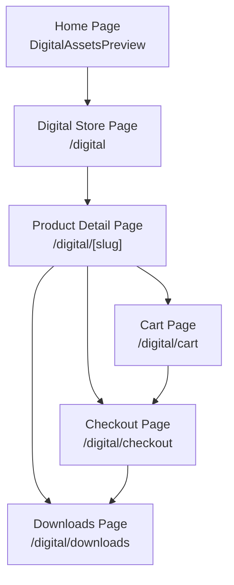
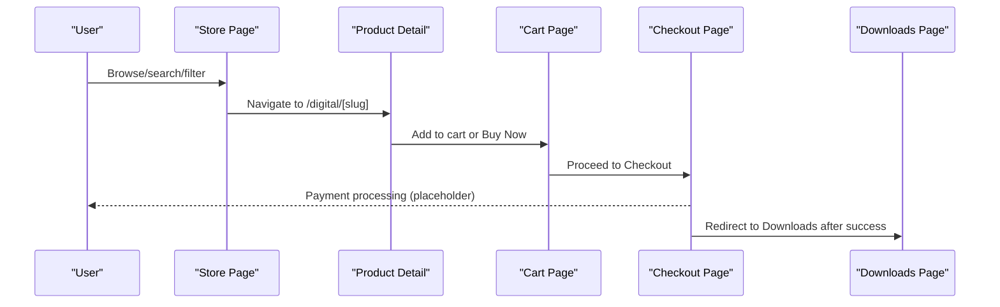
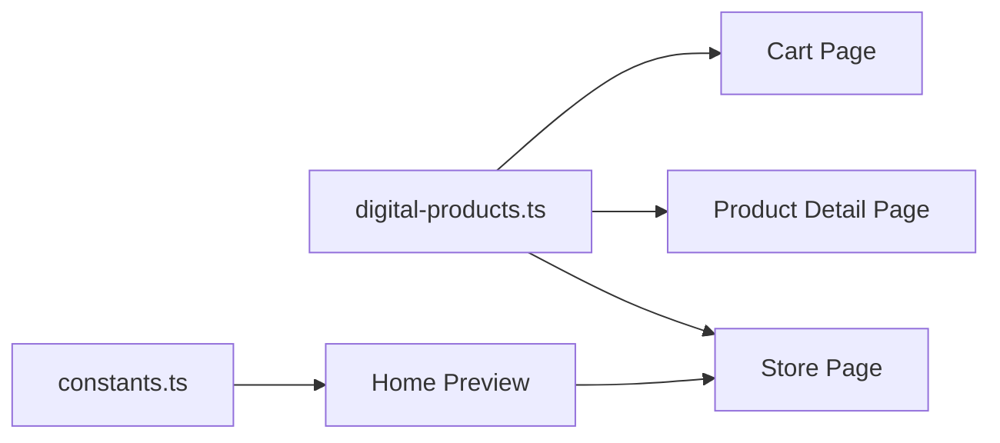

# Digital Products Marketplace

<cite>
**Referenced Files in This Document**
- [digital-products.ts](file://lib/digital-products.ts)
- [page.tsx (Digital Store)](file://app/digital/page.tsx)
- [page.tsx (Product Detail)](file://app/digital/[slug]/page.tsx)
- [page.tsx (Cart)](file://app/digital/cart/page.tsx)
- [DigitalAssetsPreview.tsx](file://components/home/DigitalAssetsPreview.tsx)
- [constants.ts](file://lib/constants.ts)
</cite>

## Table of Contents
1. Introduction
2. Project Structure
3. Core Components
4. Architecture Overview
5. Detailed Component Analysis
6. Dependency Analysis
7. Performance Considerations
8. Troubleshooting Guide
9. Conclusion
10. Appendices

## Introduction
This document explains the digital products marketplace feature for downloadable assets. It covers product catalog management, shopping cart functionality, checkout flow, download management, and access control. It also documents product display components, filtering and search, examples for adding products and managing inventory, security considerations for digital asset protection and licensing, and user experience patterns for discovery and purchase.

## Project Structure
The marketplace is implemented as a Next.js client-side feature with:
- A product catalog page with search, category filters, type filters, price filters, rating filters, and pagination
- Product detail pages with image carousel, tabs (overview, included files, reviews, FAQs), and CTAs to buy or download
- A cart page with quantity management, coupon application, tax calculation, and order summary
- A preview component on the home page that links to the store
- Centralized product data and types for consistent modeling

**Diagram sources**
- [DigitalAssetsPreview.tsx:10-75](file://components/home/DigitalAssetsPreview.tsx#L10-L75)
- [page.tsx (Digital Store):181-652](file://app/digital/page.tsx#L181-L652)
- [page.tsx (Product Detail):269-653](file://app/digital/[slug]/page.tsx#L269-L653)
- [page.tsx (Cart):37-330](file://app/digital/cart/page.tsx#L37-L330)

**Section sources**
- [DigitalAssetsPreview.tsx:10-75](file://components/home/DigitalAssetsPreview.tsx#L10-L75)
- [page.tsx (Digital Store):181-652](file://app/digital/page.tsx#L181-L652)
- [page.tsx (Product Detail):269-653](file://app/digital/[slug]/page.tsx#L269-L653)
- [page.tsx (Cart):37-330](file://app/digital/cart/page.tsx#L37-L330)

## Core Components
- Product model and catalog: Types and sample products define categories, pricing, metadata, and media.
- Storefront: Searchable, filterable product grid with pagination and featured highlights.
- Product detail: Rich presentation with image carousel, tabs, trust badges, and CTAs.
- Cart: In-memory state for items, quantities, coupons, taxes, and totals; navigation to checkout.
- Home preview: Entry point showcasing selected assets and linking to the store.

Key responsibilities:
- Catalog management via centralized product data and typed models
- Filtering and search logic on the storefront
- Cart operations (add/remove/update quantity) and pricing calculations
- Checkout routing placeholder for payment integration
- Download routing for free assets and post-purchase access

**Section sources**
- [digital-products.ts:1-562](file://lib/digital-products.ts#L1-L562)
- [page.tsx (Digital Store):181-652](file://app/digital/page.tsx#L181-L652)
- [page.tsx (Product Detail):269-653](file://app/digital/[slug]/page.tsx#L269-L653)
- [page.tsx (Cart):37-330](file://app/digital/cart/page.tsx#L37-L330)
- [DigitalAssetsPreview.tsx:10-75](file://components/home/DigitalAssetsPreview.tsx#L10-L75)

## Architecture Overview
The marketplace uses a client-side architecture with Next.js routes:
- Data layer: Centralized product definitions and constants
- UI layer: Pages and reusable components for browsing, details, and cart
- Flow: Discovery → Details → Cart → Checkout → Downloads

**Diagram sources**
- [page.tsx (Digital Store):181-652](file://app/digital/page.tsx#L181-L652)
- [page.tsx (Product Detail):269-653](file://app/digital/[slug]/page.tsx#L269-L653)
- [page.tsx (Cart):37-330](file://app/digital/cart/page.tsx#L37-L330)

## Detailed Component Analysis

### Product Catalog Management
- Categories and types are strongly typed to ensure consistency across the UI and data.
- The catalog includes rich metadata: title, description, long description, images, features, file list, tags, ratings, reviews, and support info.
- Pricing supports paid and free products, with optional original price for discounts.

Implementation highlights:
- Centralized product array and typed interfaces provide a single source of truth for catalog content.
- Category filters and badge styles standardize how products are presented.

Examples:
- Adding a new product: Extend the product array with a new entry following the defined interface.
- Managing inventory: For digital goods, “inventory” maps to availability flags like featured status and format/file sizes; updates are made by editing the product data.

**Section sources**
- [digital-products.ts:1-562](file://lib/digital-products.ts#L1-L562)

### Storefront: Display, Filtering, Search
- Search matches against title, description, and tags.
- Filters include category, product type, price (all/free/paid), minimum rating, and pagination.
- Featured products are highlighted in the sidebar.

User experience:
- Sticky category bar for quick navigation
- Responsive layout with mobile filter toggle
- Clear empty-state messaging and reset actions

**Section sources**
- [page.tsx (Digital Store):181-652](file://app/digital/page.tsx#L181-L652)

### Product Detail Page
- Image carousel with thumbnails and zoom controls
- Tabs for overview, included files, reviews, and FAQs
- Trust badges for secure payment, instant download, updates, and support
- CTAs route to downloads for free items or checkout for paid items

Behavior:
- “Add to Cart” provides immediate visual feedback
- Related products section encourages cross-selling

**Section sources**
- [page.tsx (Product Detail):269-653](file://app/digital/[slug]/page.tsx#L269-L653)

### Shopping Cart
- Stateful cart with add/remove and quantity increment/decrement
- Coupon system with predefined codes and percentage discounts
- Tax calculation at a fixed rate and total computation
- Order summary with subtotal, discount, tax, and total

Persistence note:
- Current implementation uses local state; persistence can be added via localStorage or server session if needed.

**Section sources**
- [page.tsx (Cart):37-330](file://app/digital/cart/page.tsx#L37-L330)

### Checkout Process Flow
- Navigation from product detail or cart leads to the checkout page.
- Payment integration points are not implemented yet; this is a placeholder route for future payment provider integration.
- After successful payment, users are redirected to the downloads page.

Integration guidance:
- Integrate a payment provider API call before redirecting to success and downloads.
- Validate order totals server-side and issue receipts.

**Section sources**
- [page.tsx (Product Detail):269-653](file://app/digital/[slug]/page.tsx#L269-L653)
- [page.tsx (Cart):37-330](file://app/digital/cart/page.tsx#L37-L330)

### Download Management and Access Control
- Free products link directly to the downloads page.
- Paid products should be gated behind successful payment verification before granting access.
- Recommended access control:
  - Verify purchase records tied to user accounts
  - Generate time-limited, signed URLs for secure asset delivery
  - Track download counts and enforce license terms

Security considerations:
- Do not expose raw asset paths publicly
- Use server-side validation for download requests
- Implement rate limiting and anti-abuse measures

**Section sources**
- [page.tsx (Product Detail):269-653](file://app/digital/[slug]/page.tsx#L269-L653)

### Home Preview Component
- Displays a curated selection of digital assets with prices and download counts
- Links to the full store for exploration and purchase

**Section sources**
- [DigitalAssetsPreview.tsx:10-75](file://components/home/DigitalAssetsPreview.tsx#L10-L75)

## Dependency Analysis
- Product data and types are imported by store, detail, and cart pages to maintain consistency.
- The home preview uses site constants for mock assets and navigation.

**Diagram sources**
- [digital-products.ts:1-562](file://lib/digital-products.ts#L1-L562)
- [page.tsx (Digital Store):181-652](file://app/digital/page.tsx#L181-L652)
- [page.tsx (Product Detail):269-653](file://app/digital/[slug]/page.tsx#L269-L653)
- [page.tsx (Cart):37-330](file://app/digital/cart/page.tsx#L37-L330)
- [constants.ts:463-485](file://lib/constants.ts#L463-L485)

**Section sources**
- [digital-products.ts:1-562](file://lib/digital-products.ts#L1-L562)
- [page.tsx (Digital Store):181-652](file://app/digital/page.tsx#L181-L652)
- [page.tsx (Product Detail):269-653](file://app/digital/[slug]/page.tsx#L269-L653)
- [page.tsx (Cart):37-330](file://app/digital/cart/page.tsx#L37-L330)
- [constants.ts:463-485](file://lib/constants.ts#L463-L485)

## Performance Considerations
- Client-side filtering and pagination are efficient for the current dataset size.
- Image optimization is handled via Next.js Image component with fill and object-cover.
- Consider lazy-loading heavy sections (reviews, related products) and virtualizing large lists if scaling up.
- Debounce search input to reduce re-renders during typing.

[No sources needed since this section provides general guidance]

## Troubleshooting Guide
Common issues and resolutions:
- No products found: Ensure filters are not too restrictive; use the “Reset all filters” option.
- Empty cart: Add items from product detail or store page; verify links navigate correctly.
- Invalid coupon code: Check available codes and case sensitivity; clear and retry.
- Checkout not proceeding: Confirm checkout route exists and payment integration is configured.

Operational tips:
- Validate product slugs exist to avoid 404s on detail pages.
- Keep product data consistent with UI labels and categories.

**Section sources**
- [page.tsx (Digital Store):527-619](file://app/digital/page.tsx#L527-L619)
- [page.tsx (Cart):117-136](file://app/digital/cart/page.tsx#L117-L136)
- [page.tsx (Cart):77-86](file://app/digital/cart/page.tsx#L77-L86)

## Conclusion
The marketplace provides a complete storefront for discovering and purchasing digital assets, with robust filtering, detailed product views, and a functional cart. Checkout and downloads are routed but require backend integration for payments and secure delivery. Extending the product catalog and refining access controls will enable a production-ready e-commerce experience.

[No sources needed since this section summarizes without analyzing specific files]

## Appendices

### Examples: Adding New Products
- Define a new product entry using the existing interface, including slug, title, description, type, category, price, images, features, files, tags, reviews, and metadata.
- Place it in the central product array so it appears across the store, detail, and cart flows.

**Section sources**
- [digital-products.ts:18-50](file://lib/digital-products.ts#L18-L50)
- [digital-products.ts:52-542](file://lib/digital-products.ts#L52-L542)

### Examples: Managing Inventory
- For digital goods, manage availability through fields such as featured status, format, and file sizes.
- Update product metadata to reflect changes in content or packaging.

**Section sources**
- [digital-products.ts:18-50](file://lib/digital-products.ts#L18-L50)

### Processing Orders
- Implement server-side order creation upon payment success.
- Record purchased items, totals, taxes, and discounts.
- Grant access to downloads based on verified purchases.

[No sources needed since this section provides general guidance]

### Security Considerations for Digital Assets and Licensing
- Protect assets with signed, time-limited URLs and server-side validation.
- Enforce license terms per product metadata (e.g., commercial use allowed).
- Log and monitor downloads to detect abuse.
- Secure checkout with HTTPS and validated payment responses.

[No sources needed since this section provides general guidance]

### User Experience Patterns
- Discovery: Prominent hero, sticky category filters, and search bar.
- Evaluation: Rich detail pages with reviews, FAQs, and included files.
- Purchase: Clear CTAs, trust badges, and streamlined cart with coupon support.
- Post-purchase: Immediate access to downloads and confirmation messages.

[No sources needed since this section provides general guidance]