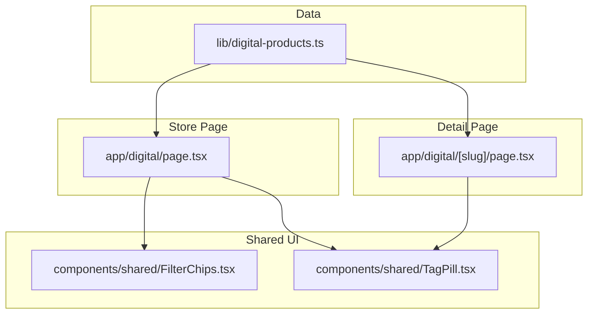
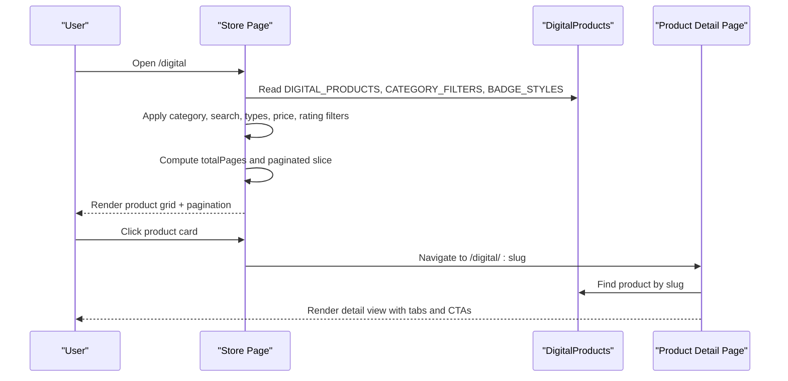
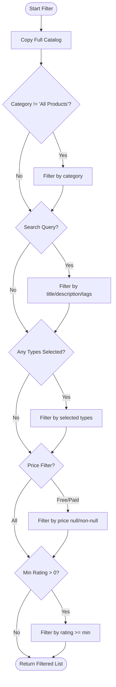
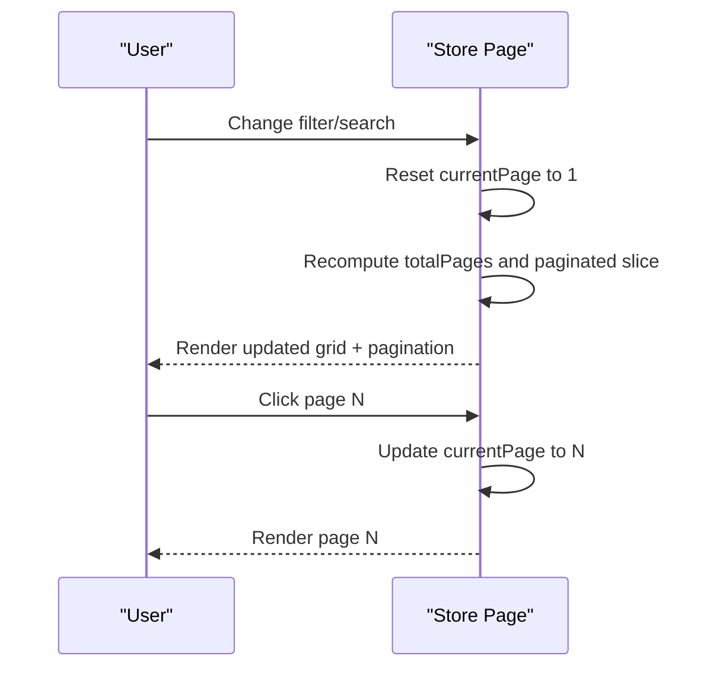
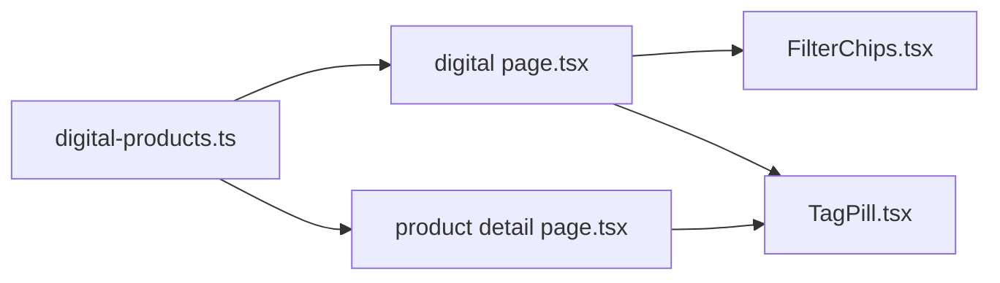

# Product Catalog & Discovery

<cite>
**Referenced Files in This Document**
- [digital-products.ts](file://lib/digital-products.ts)
- [digital page.tsx](file://app/digital/page.tsx)
- [product detail page.tsx](file://app/digital/[slug]/page.tsx)
- [FilterChips.tsx](file://components/shared/FilterChips.tsx)
- [TagPill.tsx](file://components/shared/TagPill.tsx)
</cite>

## Table of Contents
1. [Introduction](#introduction)
2. [Project Structure](#project-structure)
3. [Core Components](#core-components)
4. [Architecture Overview](#architecture-overview)
5. [Detailed Component Analysis](#detailed-component-analysis)
6. [Dependency Analysis](#dependency-analysis)
7. [Performance Considerations](#performance-considerations)
8. [Troubleshooting Guide](#troubleshooting-guide)
9. [Conclusion](#conclusion)
10. [Appendices](#appendices)

## Introduction
This document explains the digital product catalog and discovery system implemented in the project. It covers the product data model, filtering and search capabilities, pagination, product card UI, and responsive design patterns used for browsing products on both desktop and mobile devices. It also provides guidance for adding new products, implementing custom filters, and optimizing search performance.

## Project Structure
The catalog is centered around a client-side data source and a Next.js page that renders the store interface with filtering, search, and pagination. A separate product detail page displays full information about a single product.

**Diagram sources**
- [digital-products.ts:1-562](file://lib/digital-products.ts#L1-L562)
- [digital page.tsx:1-652](file://app/digital/page.tsx#L1-L652)
- [product detail page.tsx:1-653](file://app/digital/[slug]/page.tsx#L1-L653)
- [FilterChips.tsx:1-30](file://components/shared/FilterChips.tsx#L1-L30)
- [TagPill.tsx:1-38](file://components/shared/TagPill.tsx#L1-L38)

**Section sources**
- [digital-products.ts:1-562](file://lib/digital-products.ts#L1-L562)
- [digital page.tsx:1-652](file://app/digital/page.tsx#L1-L652)
- [product detail page.tsx:1-653](file://app/digital/[slug]/page.tsx#L1-L653)

## Core Components
- DigitalProduct data model and catalog constants define the structure and sample data for all products.
- The store page implements category filtering, search, type multi-select, price filtering (free/paid), minimum rating filter, and pagination.
- The product detail page presents rich product information, reviews, FAQs, and related items.
- Shared components provide reusable UI elements like filter chips and tag pills.

Key responsibilities:
- Data layer: types, enums, catalog array, category filters, badge styles.
- Store page: stateful filtering, search, pagination, responsive layout, and product cards.
- Detail page: image carousel, tabs, pricing badges, CTAs, and trust signals.
- Shared UI: consistent styling for tags and filter chips.

**Section sources**
- [digital-products.ts:1-562](file://lib/digital-products.ts#L1-L562)
- [digital page.tsx:178-652](file://app/digital/page.tsx#L178-L652)
- [product detail page.tsx:1-653](file://app/digital/[slug]/page.tsx#L1-L653)
- [FilterChips.tsx:1-30](file://components/shared/FilterChips.tsx#L1-L30)
- [TagPill.tsx:1-38](file://components/shared/TagPill.tsx#L1-L38)

## Architecture Overview
The system uses a client-side architecture where all product data is loaded from a central module. The store page computes filtered results using React hooks and memoization, then slices results for pagination. The detail page retrieves a product by slug and renders detailed content.

**Diagram sources**
- [digital page.tsx:181-235](file://app/digital/page.tsx#L181-L235)
- [digital-products.ts:52-542](file://lib/digital-products.ts#L52-L542)
- [product detail page.tsx:269-297](file://app/digital/[slug]/page.tsx#L269-L297)

## Detailed Component Analysis

### Product Data Model: DigitalProduct Interface
The DigitalProduct interface defines the canonical shape of each item in the catalog. It includes identifiers, descriptive fields, pricing, ratings, media, features, files included, tags, reviews, FAQs, and metadata such as format and file size.

- Core fields include id, slug, title, description, longDescription, type, category, price (null indicates free), originalPrice, rating, reviewCount, downloadCount, image, images, features, filesIncluded, tags, reviews, faqs, featured, format, fileSize, updates, support.
- Category and Type are strongly typed enums to ensure consistency across filters and UI.
- Badge styles map product types to visual styles for consistent presentation.

Practical implications:
- Filtering logic relies on category, type, price, rating, and tags.
- UI components render badges, ratings, and pricing based on these fields.
- Detail pages use longDescription, features, filesIncluded, reviews, and faqs for rich content.

**Section sources**
- [digital-products.ts:1-50](file://lib/digital-products.ts#L1-L50)
- [digital-products.ts:52-542](file://lib/digital-products.ts#L52-L542)
- [digital-products.ts:544-562](file://lib/digital-products.ts#L544-L562)

### Filtering System
The store page implements a comprehensive filtering system:

- Category filter: Selects products by exact category match.
- Search: Case-insensitive substring matching across title, description, and tags.
- Product type multi-select: Allows selecting multiple types; only products matching any selected type are shown.
- Price filter: Options for All, Free Only, Paid Only.
- Minimum rating filter: Filters products with rating greater than or equal to the selected threshold.

The filtering pipeline:
1. Start with the full catalog.
2. Apply category filter if not “All Products”.
3. Apply search filter if query is non-empty.
4. Apply type multi-select filter if any types are selected.
5. Apply price filter if set to free or paid.
6. Apply minimum rating filter if above zero.
7. Return the final list for pagination.

**Diagram sources**
- [digital page.tsx:191-215](file://app/digital/page.tsx#L191-L215)

**Section sources**
- [digital page.tsx:181-235](file://app/digital/page.tsx#L181-L235)

### Pagination Implementation
Pagination is computed from the filtered list:

- Items per page: Configurable constant PER_PAGE set to 6.
- Total pages: Calculated as ceiling of filtered length divided by PER_PAGE.
- Current page: Controlled by local state; resets to page 1 when filters change.
- Navigation: Previous/Next buttons and numbered page buttons; disabled states at boundaries.

Behavior highlights:
- Changing filters or search resets to page 1 to avoid empty pages.
- Grid adapts columns responsively; pagination appears when more than one page exists.

**Diagram sources**
- [digital page.tsx:181-218](file://app/digital/page.tsx#L181-L218)
- [digital page.tsx:587-618](file://app/digital/page.tsx#L587-L618)

**Section sources**
- [digital page.tsx:181-218](file://app/digital/page.tsx#L181-L218)
- [digital page.tsx:587-618](file://app/digital/page.tsx#L587-L618)

### Product Card Component
The product card component renders each product in the grid with:

- Image display with hover zoom effect and gradient overlay.
- Type badge positioned over the image.
- Discount badge when originalPrice is present.
- Title and truncated description.
- Star rating visualization with numeric rating and review count.
- Download count indicator.
- Price badge showing FREE or price value; strikethrough original price when applicable.
- Call-to-action button linking to the product detail page; text changes based on price (Download Free vs Buy Now).

Responsive behavior:
- Grid switches from 1 column on small screens to 2 on medium and 3 on large screens.
- Card layout stacks vertically with consistent spacing and typography.

**Section sources**
- [digital page.tsx:66-155](file://app/digital/page.tsx#L66-L155)
- [digital page.tsx:546-560](file://app/digital/page.tsx#L546-L560)

### Product Detail Page
The detail page provides an immersive experience:

- Image carousel with thumbnails and navigation controls.
- Type badge and optional Featured badge.
- Title, short description, star rating, review count, and download count.
- Pricing section with FREE badge or price with discount percentage.
- Primary CTA links to downloads or checkout depending on price.
- Secondary actions: Add to Cart (with feedback), Save for Later.
- Trust signals: Secure Payment, Instant Download, Updates, Support.
- Tabs: Overview, What’s Included, Reviews, FAQs.
- Related products section with mini cards.

**Section sources**
- [product detail page.tsx:269-653](file://app/digital/[slug]/page.tsx#L269-L653)

### Responsive Design Patterns and Mobile-First Approach
The store page employs a mobile-first approach:

- Sticky category bar for quick access on all screen sizes.
- Collapsible filter sidebar on mobile via a toggle button; visible by default on desktop.
- Search input with clear button; filter badge shows active filter count.
- Grid adapts to screen width with responsive breakpoints.
- Pagination remains accessible and usable on small screens.

Best practices observed:
- Use of CSS variables for theme-aware colors and backgrounds.
- Consistent spacing and typography scales across breakpoints.
- Touch-friendly controls with adequate tap targets.

**Section sources**
- [digital page.tsx:342-404](file://app/digital/page.tsx#L342-L404)
- [digital page.tsx:406-525](file://app/digital/page.tsx#L406-L525)
- [digital page.tsx:527-618](file://app/digital/page.tsx#L527-L618)

## Dependency Analysis
The system has clear separation between data and UI:

- Data module exports types, catalog, category filters, and badge styles.
- Store page imports data and composes UI components.
- Detail page imports data and renders product-specific views.
- Shared components are reused for consistent UI patterns.

**Diagram sources**
- [digital-products.ts:1-562](file://lib/digital-products.ts#L1-L562)
- [digital page.tsx:1-652](file://app/digital/page.tsx#L1-L652)
- [product detail page.tsx:1-653](file://app/digital/[slug]/page.tsx#L1-L653)
- [FilterChips.tsx:1-30](file://components/shared/FilterChips.tsx#L1-L30)
- [TagPill.tsx:1-38](file://components/shared/TagPill.tsx#L1-L38)

**Section sources**
- [digital-products.ts:1-562](file://lib/digital-products.ts#L1-L562)
- [digital page.tsx:1-652](file://app/digital/page.tsx#L1-L652)
- [product detail page.tsx:1-653](file://app/digital/[slug]/page.tsx#L1-L653)

## Performance Considerations
- Memoization: Filtering uses memoized computation to avoid unnecessary recalculations when inputs do not change.
- Client-side search: Suitable for small catalogs; consider server-side search for larger datasets.
- Pagination: Limits DOM nodes rendered per page, improving initial load and interaction responsiveness.
- Images: Use optimized images and lazy loading strategies where appropriate.
- Avoid heavy computations in render loops; keep filter logic efficient and minimal.

[No sources needed since this section provides general guidance]

## Troubleshooting Guide
Common issues and resolutions:

- No products found after filtering:
  - Clear filters and reset search to verify baseline behavior.
  - Check that category, types, price, and rating filters are not overly restrictive.
- Pagination not updating:
  - Ensure currentPage resets to 1 when filters change.
  - Verify total pages calculation and slicing logic.
- Search not returning expected results:
  - Confirm search matches against title, description, and tags.
  - Check case sensitivity and whitespace handling.
- Mobile filter panel not closing:
  - Ensure close button toggles sidebar state correctly.
  - Validate z-index and overlay behavior.

**Section sources**
- [digital page.tsx:561-584](file://app/digital/page.tsx#L561-L584)
- [digital page.tsx:587-618](file://app/digital/page.tsx#L587-L618)

## Conclusion
The digital product catalog and discovery system provides a robust, client-side solution for browsing, filtering, and exploring digital assets. It combines a well-typed data model, flexible filtering, responsive UI, and a detailed product view. The implementation supports scalability through pagination and can be extended with additional filters or backend integration as the catalog grows.

[No sources needed since this section summarizes without analyzing specific files]

## Appendices

### Adding New Products to the Catalog
Steps:
- Extend the DigitalProduct interface if new fields are required.
- Add a new product object to the catalog array with all necessary fields.
- Ensure category and type values match existing enums.
- Optionally add tags and reviews to enhance discoverability and social proof.

**Section sources**
- [digital-products.ts:18-50](file://lib/digital-products.ts#L18-L50)
- [digital-products.ts:52-542](file://lib/digital-products.ts#L52-L542)

### Implementing Custom Filters
Approach:
- Add new state variables for custom filter criteria.
- Extend the filtering pipeline to apply the new condition.
- Provide UI controls (checkboxes, radios, sliders) to update filter state.
- Reset pagination when filters change to maintain user expectations.

Example pattern reference:
- Type multi-select demonstrates how to manage arrays of selected values and reset page on change.
- Price and rating filters show radio-based selection with immediate re-filtering.

**Section sources**
- [digital page.tsx:181-235](file://app/digital/page.tsx#L181-L235)

### Optimizing Search Performance
Recommendations:
- For small catalogs, current client-side search is sufficient.
- For larger catalogs, implement server-side search with indexing and debounced queries.
- Normalize strings before comparison to handle edge cases.
- Consider caching recent searches and results to reduce recomputation.

[No sources needed since this section provides general guidance]