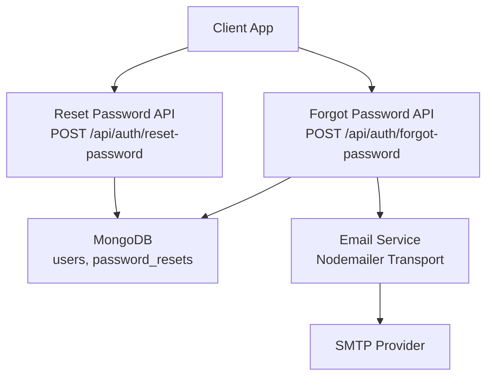
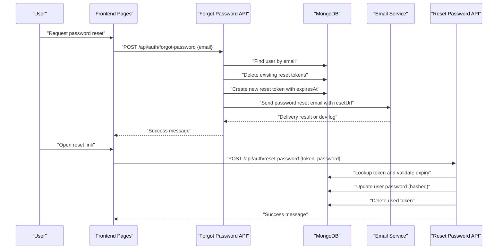
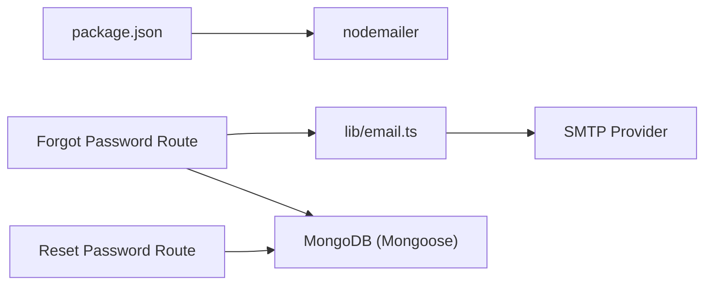

# Email System

<cite>
**Referenced Files in This Document**
- [email.ts](file://lib/email.ts)
- [PasswordReset.ts](file://models/PasswordReset.ts)
- [User.ts](file://models/User.ts)
- [forgot-password route](file://app/api/auth/forgot-password/route.ts)
- [reset-password route](file://app/api/auth/reset-password/route.ts)
- [auth.ts](file://auth.ts)
- [package.json](file://package.json)
</cite>

## Table of Contents
1. Introduction
2. Project Structure
3. Core Components
4. Architecture Overview
5. Detailed Component Analysis
6. Dependency Analysis
7. Performance Considerations
8. Troubleshooting Guide
9. Conclusion

## Introduction
This document explains the email system feature focused on transactional emails and user notifications, with a current implementation centered around password reset flows. It covers:
- Email template management for password reset with dynamic content and branding
- Password reset flow including token generation, storage, expiration handling, and email delivery
- Extensibility points to add additional notification types (e.g., course updates, purchase confirmations)
- Email service configuration using Nodemailer and environment-based provider setup
- Deliverability best practices, spam prevention, bounce handling strategies
- Logging and monitoring recommendations for delivery status and error tracking
- Security considerations for sensitive content and user data protection

## Project Structure
The email functionality is implemented as a small, focused module integrated into authentication routes and data models:
- lib/email.ts: Nodemailer transport and email sending logic
- app/api/auth/forgot-password/route.ts: Initiates password reset, generates tokens, stores them, and sends email
- app/api/auth/reset-password/route.ts: Validates token, enforces expiration, updates password, and cleans up
- models/PasswordReset.ts: MongoDB schema for reset tokens with TTL auto-expiration
- models/User.ts: User model used during password update
- auth.ts: Authentication integration (contextual; not directly involved in email sending)
- package.json: Declares nodemailer dependency

**Diagram sources**
- [forgot-password route:1-62](file://app/api/auth/forgot-password/route.ts#L1-L62)
- [reset-password route:1-70](file://app/api/auth/reset-password/route.ts#L1-L70)
- [email.ts:1-39](file://lib/email.ts#L1-L39)
- [PasswordReset.ts:1-44](file://models/PasswordReset.ts#L1-L44)
- [User.ts:1-81](file://models/User.ts#L1-L81)

**Section sources**
- [email.ts:1-39](file://lib/email.ts#L1-L39)
- [forgot-password route:1-62](file://app/api/auth/forgot-password/route.ts#L1-L62)
- [reset-password route:1-70](file://app/api/auth/reset-password/route.ts#L1-L70)
- [PasswordReset.ts:1-44](file://models/PasswordReset.ts#L1-L44)
- [User.ts:1-81](file://models/User.ts#L1-L81)
- [package.json:12-38](file://package.json#L12-L38)

## Core Components
- Email transport and sending: A single function creates a Nodemailer transporter from environment variables and sends HTML emails. In development without SMTP credentials, it logs the reset link to the console.
- Password reset token lifecycle: Tokens are generated, stored with an expiration, and automatically cleaned up by MongoDB TTL. The reset endpoint validates existence and expiry before allowing password updates.
- User model integration: The reset flow updates the user’s password securely using bcrypt hashing.

Key responsibilities:
- Validate inputs and protect against enumeration attacks
- Generate secure random tokens
- Persist tokens with TTL
- Send branded HTML email with dynamic reset URL
- Enforce one-time use by deleting the token after successful reset

**Section sources**
- [email.ts:1-39](file://lib/email.ts#L1-L39)
- [forgot-password route:1-62](file://app/api/auth/forgot-password/route.ts#L1-L62)
- [reset-password route:1-70](file://app/api/auth/reset-password/route.ts#L1-L70)
- [PasswordReset.ts:1-44](file://models/PasswordReset.ts#L1-L44)
- [User.ts:1-81](file://models/User.ts#L1-L81)

## Architecture Overview
The password reset flow integrates UI routes, API endpoints, database, and email service:

**Diagram sources**
- [forgot-password route:1-62](file://app/api/auth/forgot-password/route.ts#L1-L62)
- [reset-password route:1-70](file://app/api/auth/reset-password/route.ts#L1-L70)
- [email.ts:1-39](file://lib/email.ts#L1-L39)
- [PasswordReset.ts:1-44](file://models/PasswordReset.ts#L1-L44)
- [User.ts:1-81](file://models/User.ts#L1-L81)

## Detailed Component Analysis

### Email Transport and Template Management
- Transport configuration: Uses Nodemailer with host, port, secure flag, and auth derived from environment variables. Falls back to console logging when SMTP credentials are missing.
- Template approach: Inline HTML with embedded styles for broad client compatibility. Includes brand header, clear call-to-action button, fallback plain link, and security notice.
- Dynamic content: Reset URL injected into the template; subject line includes branding.

Extensibility guidance:
- Extract templates into separate files or a template engine to support multiple email types (welcome, course updates, purchase confirmations).
- Parameterize brand assets (logo, colors) via environment or config to support multi-brand scenarios.
- Add headers like Reply-To and custom X-Headers for analytics or segmentation.

**Section sources**
- [email.ts:1-39](file://lib/email.ts#L1-L39)

### Password Reset Flow: Token Generation, Storage, Expiration
- Token generation: Secure random bytes converted to hex string.
- Storage: Stored with email, token, expiresAt, createdAt. Collection uses TTL index to auto-delete expired entries.
- Expiration handling: Reset endpoint checks if current time exceeds expiresAt; if expired, deletes the record and returns an error instructing the user to request a new link.
- One-time use: After successful password update, the token is deleted to prevent reuse.

Security notes:
- Protects against account enumeration by returning a generic success message even if the email does not exist.
- Normalizes email input to lowercase and trims whitespace.

**Section sources**
- [forgot-password route:1-62](file://app/api/auth/forgot-password/route.ts#L1-L62)
- [reset-password route:1-70](file://app/api/auth/reset-password/route.ts#L1-L70)
- [PasswordReset.ts:1-44](file://models/PasswordReset.ts#L1-L44)

### User Model Integration and Password Update
- Password hashing: Uses bcrypt with appropriate cost factor before saving to the user record.
- Update operation: Updates only the password field for the matching email.
- Cleanup: Deletes the reset token after successful update.

**Section sources**
- [reset-password route:1-70](file://app/api/auth/reset-password/route.ts#L1-L70)
- [User.ts:1-81](file://models/User.ts#L1-L81)

### Notification System Extensibility
Current implementation focuses on password reset. To add notifications for user activities, course updates, and purchase confirmations:
- Create dedicated functions in lib/email.ts for each type (e.g., sendCourseUpdatedEmail, sendPurchaseConfirmationEmail).
- Define reusable template structures and inject dynamic fields (user name, course title, order details).
- Integrate with relevant business routes (e.g., enrollment completion, checkout success) to trigger notifications.
- Maintain consistent branding and deliverability settings across all email types.

[No sources needed since this section proposes extensibility beyond current code]

### Email Service Configuration with Nodemailer
- Environment variables required:
  - SMTP_HOST: SMTP server hostname
  - SMTP_PORT: Port number (defaults to 587; secure mode enabled for 465)
  - SMTP_USER: SMTP username
  - SMTP_PASS: SMTP password
  - SMTP_FROM: Sender address and display name (fallback provided)
- Development behavior: If SMTP credentials are absent, the system logs the reset link to the console for local testing.

Provider setup examples:
- Gmail: Use app-specific passwords and SMTP settings.
- SendGrid/Mailgun/Amazon SES: Configure respective SMTP or API integrations by adjusting transport options.

**Section sources**
- [email.ts:1-39](file://lib/email.ts#L1-L39)
- [package.json:12-38](file://package.json#L12-L38)

### Examples of Sending Different Email Types and Customizing Templates
While only password reset is implemented, you can follow these patterns:
- Welcome email: Triggered on user registration; include greeting, next steps, and links to onboarding resources.
- Course update notification: Include course title, lesson name, and direct link to the updated content.
- Purchase confirmation: Include order summary, receipt link, and support contact.

Template customization tips:
- Centralize brand assets (logo, primary color) in environment or config.
- Use responsive inline CSS for email clients.
- Provide plain-text alternatives for accessibility and deliverability.

[No sources needed since this section provides conceptual guidance]

### Deliverability Best Practices, Spam Prevention, and Bounce Handling
Best practices:
- Use a dedicated domain and verified sender identity (SPF, DKIM, DMARC).
- Keep HTML minimal and avoid suspicious links or excessive images.
- Include a visible unsubscribe mechanism for marketing-style emails.
- Monitor bounce rates and remove invalid addresses promptly.

Bounce handling:
- Implement feedback loops with your provider to handle hard bounces.
- Normalize and validate email addresses at signup.
- Log and track delivery statuses for diagnostics.

[No sources needed since this section provides general guidance]

### Logging and Monitoring for Delivery Status and Error Tracking
Current state:
- Development mode logs reset links to console when SMTP is not configured.
- API routes catch errors and return standardized responses; server logs capture stack traces.

Recommendations:
- Wrap transporter.sendMail calls with try/catch and log structured events (recipient, subject, timestamp, error).
- Integrate with a logging/metrics platform to track delivery success/failure rates.
- Add observability hooks for retries and dead-letter queues for failed deliveries.

**Section sources**
- [email.ts:1-39](file://lib/email.ts#L1-L39)
- [forgot-password route:1-62](file://app/api/auth/forgot-password/route.ts#L1-L62)
- [reset-password route:1-70](file://app/api/auth/reset-password/route.ts#L1-L70)

### Security Considerations for Sensitive Content and User Data Protection
- Tokens: Generated using cryptographically secure random bytes; stored with short-lived expiration and auto-cleanup via TTL.
- Passwords: Hashed with bcrypt before storage; never logged or returned in responses.
- Enumeration protection: Generic success messages prevent attackers from confirming email existence.
- HTTPS: Ensure all endpoints are served over TLS to protect tokens in transit.
- Input validation: Strict email format checks and normalization reduce injection risks.

**Section sources**
- [forgot-password route:1-62](file://app/api/auth/forgot-password/route.ts#L1-L62)
- [reset-password route:1-70](file://app/api/auth/reset-password/route.ts#L1-L70)
- [PasswordReset.ts:1-44](file://models/PasswordReset.ts#L1-L44)
- [User.ts:1-81](file://models/User.ts#L1-L81)

## Dependency Analysis
Core dependencies:
- Nodemailer: Email transport library declared in package.json.
- Mongoose and MongoDB: Used for storing users and password reset tokens with TTL indexes.
- Next.js API routes: Provide endpoints for forgot-password and reset-password.

**Diagram sources**
- [package.json:12-38](file://package.json#L12-L38)
- [forgot-password route:1-62](file://app/api/auth/forgot-password/route.ts#L1-L62)
- [reset-password route:1-70](file://app/api/auth/reset-password/route.ts#L1-L70)
- [email.ts:1-39](file://lib/email.ts#L1-L39)

**Section sources**
- [package.json:12-38](file://package.json#L12-L38)
- [forgot-password route:1-62](file://app/api/auth/forgot-password/route.ts#L1-L62)
- [reset-password route:1-70](file://app/api/auth/reset-password/route.ts#L1-L70)
- [email.ts:1-39](file://lib/email.ts#L1-L39)

## Performance Considerations
- Connection pooling: Reuse Nodemailer transports where possible to reduce overhead.
- Asynchronous operations: All I/O is async; ensure proper error handling to avoid blocking requests.
- Database queries: Indexes on email and token fields improve lookup performance.
- TTL cleanup: MongoDB TTL automatically removes expired tokens, reducing storage growth.

[No sources needed since this section provides general guidance]

## Troubleshooting Guide
Common issues and resolutions:
- Missing SMTP credentials: The system falls back to console logging in development; configure SMTP_HOST, SMTP_PORT, SMTP_USER, SMTP_PASS to enable real email delivery.
- Invalid email format: Requests are rejected with a validation error; ensure correct email syntax.
- Expired reset link: The reset endpoint detects expired tokens and prompts the user to request a new link.
- Duplicate tokens: Existing tokens are invalidated before creating a new one to prevent confusion.
- Errors: API routes return standardized error responses; check server logs for stack traces.

Operational tips:
- Verify DNS records (SPF, DKIM, DMARC) for improved deliverability.
- Monitor SMTP provider dashboards for bounces and blocks.
- Add structured logging around email sends to track successes and failures.

**Section sources**
- [email.ts:1-39](file://lib/email.ts#L1-L39)
- [forgot-password route:1-62](file://app/api/auth/forgot-password/route.ts#L1-L62)
- [reset-password route:1-70](file://app/api/auth/reset-password/route.ts#L1-L70)

## Conclusion
The current email system implements a secure, efficient password reset flow with Nodemailer integration, robust token handling, and branded HTML templates. While only password reset emails are implemented, the modular design allows straightforward extension to other transactional notifications such as course updates and purchase confirmations. By following the recommended deliverability, logging, and security practices, the system can scale to meet broader notification needs while maintaining reliability and safety.