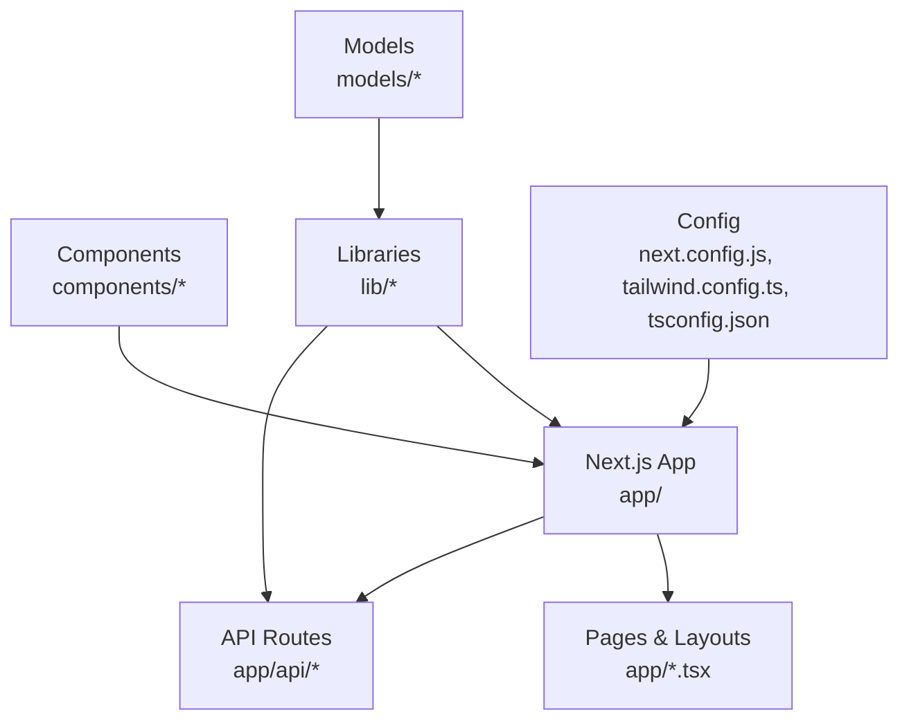
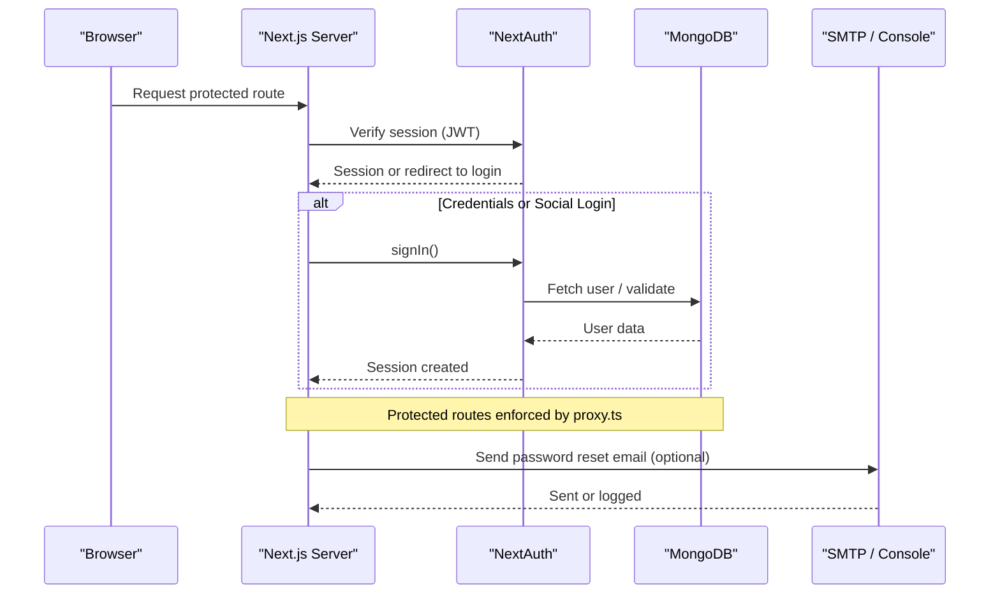
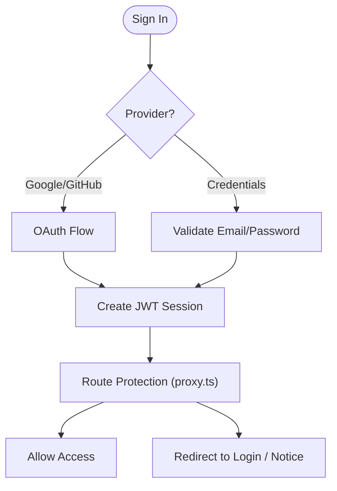
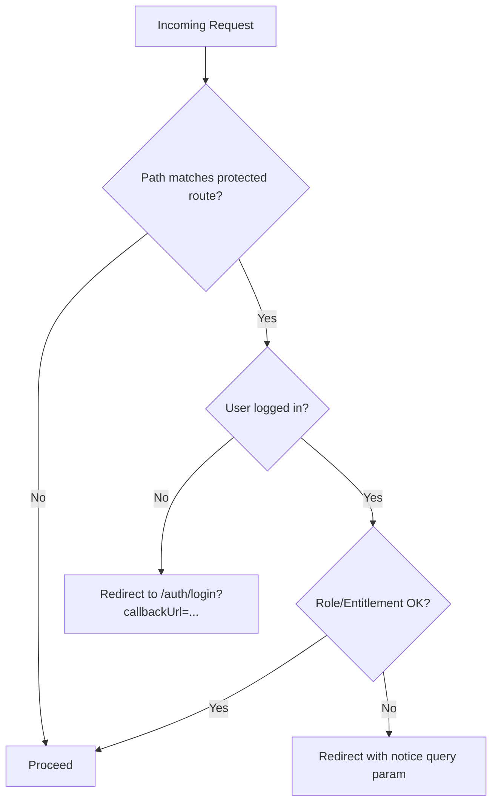
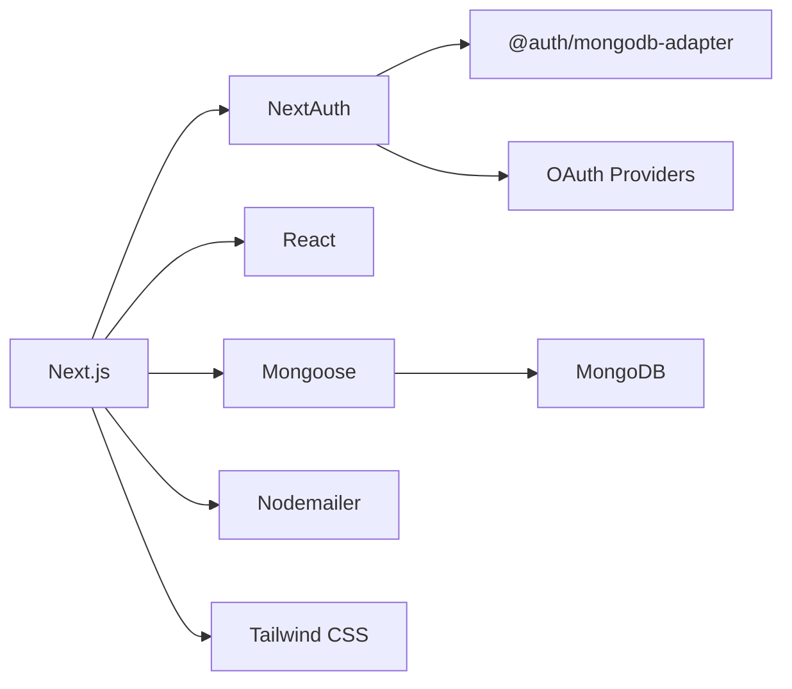

# Getting Started

<cite>
**Referenced Files in This Document**
- [package.json](file://package.json)
- [next.config.js](file://next.config.js)
- [tsconfig.json](file://tsconfig.json)
- [tailwind.config.ts](file://tailwind.config.ts)
- [components.json](file://components.json)
- [auth.config.ts](file://auth.config.ts)
- [auth.ts](file://auth.ts)
- [proxy.ts](file://proxy.ts)
- [lib/mongodb.ts](file://lib/mongodb.ts)
- [lib/mongoose.ts](file://lib/mongoose.ts)
- [lib/email.ts](file://lib/email.ts)
- [models/User.ts](file://models/User.ts)
</cite>

## Table of Contents
1. Introduction
2. Project Structure
3. Core Components
4. Architecture Overview
5. Detailed Component Analysis
6. Dependency Analysis
7. Performance Considerations
8. Troubleshooting Guide
9. Conclusion

## Introduction
This guide helps you set up and run the Digentic platform locally with minimal friction. You will install dependencies, configure environment variables for authentication and email, connect to MongoDB, and start the development server. It also covers build and deployment basics, initial configuration for authentication providers and email services, and common troubleshooting steps.

## Project Structure
Digentic is a Next.js application using React, TypeScript, Tailwind CSS, NextAuth (v5), Mongoose, and MongoDB. Key directories:
- app: Next.js App Router pages and API routes
- components: Reusable UI components
- lib: Shared utilities including database connections and email sending
- models: Mongoose schemas (e.g., User)
- Configuration files at the root for Next.js, TypeScript, Tailwind, and auth

**Diagram sources**
- [next.config.js:1-9](file://next.config.js#L1-L9)
- [tailwind.config.ts:1-129](file://tailwind.config.ts#L1-L129)
- [tsconfig.json:1-42](file://tsconfig.json#L1-L42)

**Section sources**
- [package.json:1-57](file://package.json#L1-L57)
- [next.config.js:1-9](file://next.config.js#L1-L9)
- [tsconfig.json:1-42](file://tsconfig.json#L1-L42)
- [tailwind.config.ts:1-129](file://tailwind.config.ts#L1-L129)
- [components.json:1-21](file://components.json#L1-L21)

## Core Components
- Authentication: NextAuth v5 with Google and GitHub providers, credentials provider, JWT session strategy, and MongoDB adapter.
- Database: MongoDB via native driver and Mongoose; connection caching for performance.
- Email: Nodemailer-based password reset emails with console fallback in development.
- Routing protection: Middleware-like proxy enforces login and access rules for dashboard, course lessons, and digital downloads.

Key responsibilities:
- auth.config.ts: Provider configuration and callbacks for roles and permissions.
- auth.ts: Combines providers, adapter, events, and exposes handlers.
- lib/mongodb.ts and lib/mongoose.ts: Connection management and caching.
- lib/email.ts: Password reset email delivery.
- proxy.ts: Route-level authorization logic.

**Section sources**
- [auth.config.ts:1-101](file://auth.config.ts#L1-L101)
- [auth.ts:1-133](file://auth.ts#L1-L133)
- [lib/mongodb.ts:1-38](file://lib/mongodb.ts#L1-L38)
- [lib/mongoose.ts:1-47](file://lib/mongoose.ts#L1-L47)
- [lib/email.ts:1-40](file://lib/email.ts#L1-L40)
- [proxy.ts:1-92](file://proxy.ts#L1-L92)

## Architecture Overview
The runtime flow integrates Next.js routing, NextAuth sessions, MongoDB storage, and optional email delivery.

**Diagram sources**
- [auth.ts:1-133](file://auth.ts#L1-L133)
- [proxy.ts:1-92](file://proxy.ts#L1-L92)
- [lib/mongodb.ts:1-38](file://lib/mongodb.ts#L1-L38)
- [lib/email.ts:1-40](file://lib/email.ts#L1-L40)

## Detailed Component Analysis

### Environment Setup and Prerequisites
- Node.js: Use a recent LTS version compatible with Next.js 16.x.
- MongoDB: Ensure a running instance accessible at your configured URI.
- Git: For cloning the repository.
- Optional: SMTP credentials for email functionality.

Install dependencies and start the dev server:
- npm install
- npm run dev

Build and start production:
- npm run build
- npm start

Type checking:
- npm run typecheck

**Section sources**
- [package.json:1-57](file://package.json#L1-L57)

### Environment Variables
Create a .env file at the project root with the following keys:

- Database
  - MONGODB_URI: MongoDB connection string (defaults to local if not provided).

- Authentication Providers
  - GOOGLE_CLIENT_ID, GOOGLE_CLIENT_SECRET: Google OAuth credentials.
  - GITHUB_CLIENT_ID, GITHUB_CLIENT_SECRET: GitHub OAuth credentials.
  - TEMP_ADMIN_EMAIL, TEMP_ADMIN_PASSWORD: Temporary admin credentials for development.

- Email (Password Reset)
  - SMTP_HOST, SMTP_PORT, SMTP_USER, SMTP_PASS, SMTP_FROM: SMTP settings for sending password reset emails.

Notes:
- If SMTP variables are missing, password reset links are printed to the console during development.
- The default temporary admin email and password can be changed via environment variables.

**Section sources**
- [lib/mongodb.ts:1-38](file://lib/mongodb.ts#L1-L38)
- [lib/mongoose.ts:1-47](file://lib/mongoose.ts#L1-L47)
- [auth.config.ts:1-101](file://auth.config.ts#L1-L101)
- [auth.ts:1-133](file://auth.ts#L1-L133)
- [lib/email.ts:1-40](file://lib/email.ts#L1-L40)

### Database Configuration
- MongoDB connection is handled by both the native driver and Mongoose with caching to avoid reconnections.
- Default URI points to a local MongoDB instance if MONGODB_URI is not set.

Steps:
- Start MongoDB locally or provide a remote connection string via MONGODB_URI.
- No manual schema creation is required; Mongoose manages collections based on models.

**Section sources**
- [lib/mongodb.ts:1-38](file://lib/mongodb.ts#L1-L38)
- [lib/mongoose.ts:1-47](file://lib/mongoose.ts#L1-L47)
- [models/User.ts:1-81](file://models/User.ts#L1-L81)

### Authentication Setup
Providers:
- Google and GitHub OAuth are configured via environment variables.
- Credentials provider supports email/password login with bcrypt verification.
- JWT session strategy stores user metadata in tokens.

Temporary Admin Mode:
- In development, a special email/password pair grants admin privileges without database entries.

Session and Role Handling:
- Roles and entitlements (enrolled courses, purchased digital products) are propagated into sessions and used by route protection.

**Diagram sources**
- [auth.config.ts:1-101](file://auth.config.ts#L1-L101)
- [auth.ts:1-133](file://auth.ts#L1-L133)
- [proxy.ts:1-92](file://proxy.ts#L1-L92)

**Section sources**
- [auth.config.ts:1-101](file://auth.config.ts#L1-L101)
- [auth.ts:1-133](file://auth.ts#L1-L133)
- [models/User.ts:1-81](file://models/User.ts#L1-L81)

### Email Services
- Password reset emails use Nodemailer when SMTP variables are present.
- Without SMTP, the system logs the reset link to the console for local testing.

Configuration:
- Set SMTP_HOST, SMTP_PORT, SMTP_USER, SMTP_PASS, and optionally SMTP_FROM.

Behavior:
- Secure flag is derived from SMTP_PORT.
- HTML email template includes a reset button and fallback link.

**Section sources**
- [lib/email.ts:1-40](file://lib/email.ts#L1-L40)

### Route Protection and Access Control
Protected areas:
- Dashboard routes require login.
- Course lesson routes require login and enrollment (or admin role).
- Digital download routes require login and purchase (or admin role).

Mechanism:
- A centralized matcher enforces redirects with query parameters indicating why access was denied.

**Diagram sources**
- [proxy.ts:1-92](file://proxy.ts#L1-L92)

**Section sources**
- [proxy.ts:1-92](file://proxy.ts#L1-L92)

### Development Workflow
- Hot reloading: Enabled by default with npm run dev.
- Linting: npm run lint.
- Type checking: npm run typecheck.
- Build: npm run build.
- Production start: npm start.

Styling and UI:
- Tailwind CSS configured with dark mode and custom theme tokens.
- Shadcn UI integration via components.json.

**Section sources**
- [package.json:1-57](file://package.json#L1-L57)
- [tailwind.config.ts:1-129](file://tailwind.config.ts#L1-L129)
- [components.json:1-21](file://components.json#L1-L21)

### Deployment Strategies
- Static vs Serverless: Next.js supports multiple targets; ensure image optimization settings match your host.
- Environment variables: Provide all required env vars on your hosting platform.
- MongoDB: Use a managed MongoDB service and set MONGODB_URI accordingly.
- Images: Image optimization is disabled by default in this config; adjust if needed for your deployment target.

**Section sources**
- [next.config.js:1-9](file://next.config.js#L1-L9)
- [package.json:1-57](file://package.json#L1-L57)

## Dependency Analysis
Core runtime dependencies include Next.js, React, NextAuth, MongoDB drivers, Mongoose, Nodemailer, and Tailwind CSS. Dev dependencies include TypeScript and ESLint.

**Diagram sources**
- [package.json:1-57](file://package.json#L1-L57)

**Section sources**
- [package.json:1-57](file://package.json#L1-L57)

## Performance Considerations
- Database connections are cached globally to reduce overhead across requests.
- JWT sessions minimize database calls after initial sign-in.
- Disabling image optimization may improve compatibility but can increase payload size; consider enabling it for production where supported.

[No sources needed since this section provides general guidance]

## Troubleshooting Guide
Common issues and resolutions:

- Cannot connect to MongoDB
  - Ensure MongoDB is running and reachable.
  - Verify MONGODB_URI is correct.
  - Check network/firewall if using a remote database.

- Authentication fails or redirects unexpectedly
  - Confirm OAuth client IDs and secrets are set for Google and GitHub.
  - Verify TEMP_ADMIN_EMAIL and TEMP_ADMIN_PASSWORD for development admin access.
  - Ensure session strategy is JWT and that cookies are allowed.

- Password reset email not received
  - Configure SMTP_HOST, SMTP_PORT, SMTP_USER, SMTP_PASS.
  - In development without SMTP, check the console for the reset link.

- Build errors related to images
  - Review next.config.js image optimization settings for your deployment target.

- TypeScript or lint errors
  - Run npm run typecheck and npm run lint to identify issues.

**Section sources**
- [lib/mongodb.ts:1-38](file://lib/mongodb.ts#L1-L38)
- [lib/mongoose.ts:1-47](file://lib/mongoose.ts#L1-L47)
- [auth.config.ts:1-101](file://auth.config.ts#L1-L101)
- [auth.ts:1-133](file://auth.ts#L1-L133)
- [lib/email.ts:1-40](file://lib/email.ts#L1-L40)
- [next.config.js:1-9](file://next.config.js#L1-L9)
- [package.json:1-57](file://package.json#L1-L57)

## Conclusion
You now have the essentials to set up, run, and extend Digentic locally. Configure environment variables for authentication and email, ensure MongoDB connectivity, and use the provided scripts for development, building, and deployment. Leverage the built-in route protection and session handling to secure your application while iterating quickly.