# Performance Optimization

<cite>
**Referenced Files in This Document**
- [next.config.js](file://next.config.js)
- [package.json](file://package.json)
- [lib/mongodb.ts](file://lib/mongodb.ts)
- [lib/mongoose.ts](file://lib/mongoose.ts)
- [app/layout.tsx](file://app/layout.tsx)
- [components/home/HeroSection.tsx](file://components/home/HeroSection.tsx)
- [components/blog/PostCard.tsx](file://components/blog/PostCard.tsx)
- [components/home/FeaturedCourses.tsx](file://components/home/FeaturedCourses.tsx)
- [components/layout/Navbar.tsx](file://components/layout/Navbar.tsx)
- [app/api/auth/me/route.ts](file://app/api/auth/me/route.ts)
- [.eslintrc.json](file:.eslintrc.json)
</cite>

## Table of Contents
1. Introduction
2. Project Structure
3. Core Components
4. Architecture Overview
5. Detailed Component Analysis
6. Dependency Analysis
7. Performance Considerations
8. Troubleshooting Guide
9. Conclusion

## Introduction
This document provides a comprehensive performance optimization guide tailored to the project’s architecture and current implementation. It focuses on application speed and efficiency across image handling, code splitting, database query optimization, bundle analysis, monitoring, server-side rendering (SSR), static site generation (SSG), client-side caching, progressive enhancement, and performance testing methodologies. The guidance references concrete files in the repository to ensure actionable recommendations grounded in the existing codebase.

## Project Structure
The project is a Next.js application with:
- App Router pages under app/
- Shared UI components under components/
- Data access utilities under lib/
- Authentication via NextAuth routes under app/api/auth/
- Configuration in next.config.js and package.json

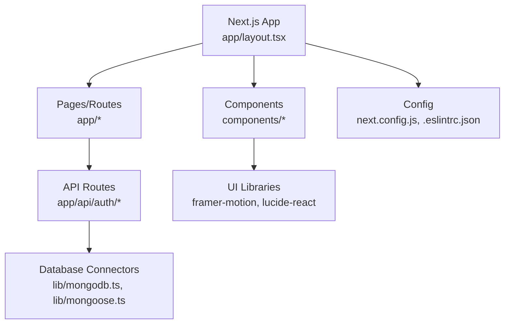

**Diagram sources**
- [app/layout.tsx:1-48](file://app/layout.tsx#L1-L48)
- [next.config.js:1-9](file://next.config.js#L1-L9)
- [lib/mongodb.ts:1-38](file://lib/mongodb.ts#L1-L38)
- [lib/mongoose.ts:1-47](file://lib/mongoose.ts#L1-L47)

**Section sources**
- [app/layout.tsx:1-48](file://app/layout.tsx#L1-L48)
- [next.config.js:1-9](file://next.config.js#L1-L9)
- [package.json:1-57](file://package.json#L1-L57)

## Core Components
Key areas impacting performance:
- Image pipeline configuration and usage
- Database connection management and reuse
- Client-side animations and lazy interactions
- API route data fetching patterns
- Linting rules for core web vitals

Highlights:
- Images are currently set to unoptimized in Next.js config; this impacts automatic resizing, format conversion, and lazy loading behavior.
- MongoDB and Mongoose connections are cached at process level to avoid repeated connect overhead.
- Client components use motion libraries for animations; consider lazy-loading heavy components where appropriate.
- ESLint extends core-web-vitals to enforce performance-oriented linting.

**Section sources**
- [next.config.js:1-9](file://next.config.js#L1-L9)
- [lib/mongodb.ts:1-38](file://lib/mongodb.ts#L1-L38)
- [lib/mongoose.ts:1-47](file://lib/mongoose.ts#L1-L47)
- [components/layout/Navbar.tsx:1-235](file://components/layout/Navbar.tsx#L1-L235)
- [.eslintrc.json:1-3](file:.eslintrc.json#L1-L3)

## Architecture Overview
The runtime flow emphasizes SSR/ISR-friendly pages, client-side interactivity, and efficient data access:

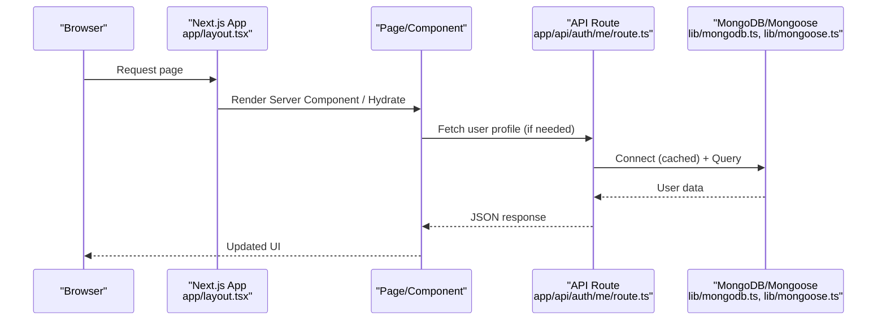

**Diagram sources**
- [app/layout.tsx:1-48](file://app/layout.tsx#L1-L48)
- [app/api/auth/me/route.ts:1-51](file://app/api/auth/me/route.ts#L1-L51)
- [lib/mongodb.ts:1-38](file://lib/mongodb.ts#L1-L38)
- [lib/mongoose.ts:1-47](file://lib/mongoose.ts#L1-L47)

## Detailed Component Analysis

### Image Optimization
Current state:
- Next.js images are disabled for optimization in config, which disables automatic resizing, format conversion (e.g., WebP/AVIF), and built-in lazy loading benefits.
- Components use next/image with explicit dimensions or fill; without optimization, these render as-is.

Recommendations:
- Enable Next.js image optimization to gain automatic resizing, modern format delivery, and lazy loading.
- Ensure all images specify width/height or layout constraints to prevent layout shifts.
- Use priority for above-the-fold images and loading="lazy" for below-the-fold.
- Prefer vector assets (SVG) for icons and simple graphics.

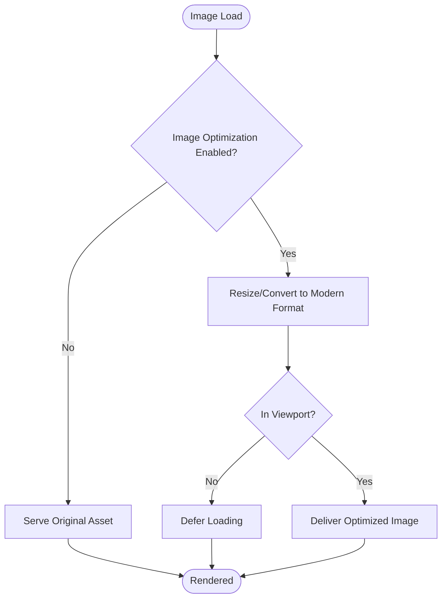

**Section sources**
- [next.config.js:1-9](file://next.config.js#L1-L9)
- [components/blog/PostCard.tsx:1-96](file://components/blog/PostCard.tsx#L1-L96)
- [components/home/FeaturedCourses.tsx:1-88](file://components/home/FeaturedCourses.tsx#L1-L88)

### Code Splitting and Dynamic Imports
Observations:
- Heavy client-side libraries (e.g., framer-motion) are used in client components.
- No dynamic imports are visible in the analyzed files; large dependencies may be bundled into initial chunks.

Recommendations:
- Use dynamic imports for heavy components (charts, video players, modals) to reduce initial bundle size.
- Leverage route-based chunking by organizing feature modules per route and importing them lazily.
- Avoid importing heavy libraries in shared layouts unless necessary.

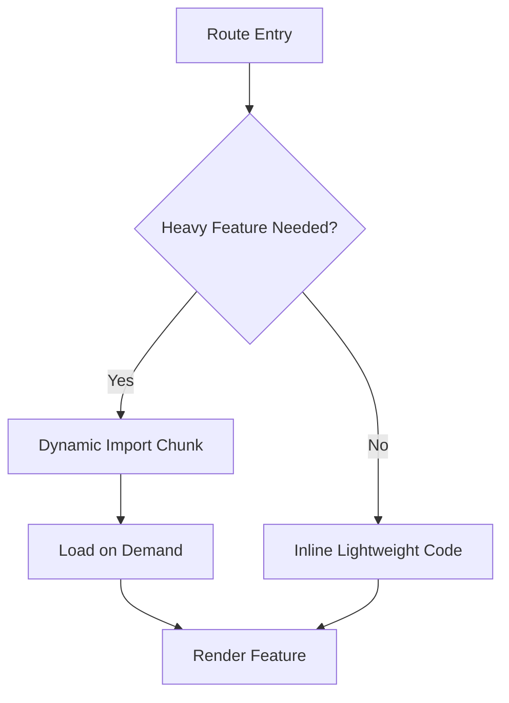

[No sources needed since this diagram shows conceptual workflow, not actual code structure]

### Database Query Optimization
Current state:
- MongoDB client and Mongoose connections are cached at process level to avoid reconnection overhead.
- API route queries select minimal fields and sanitize inputs.

Recommendations:
- Add indexes for frequently queried fields (e.g., email, slug, category).
- Use projection to fetch only required fields.
- Implement read replicas or sharding if scaling read-heavy workloads.
- Consider caching hot reads with Redis or in-memory cache for non-real-time data.

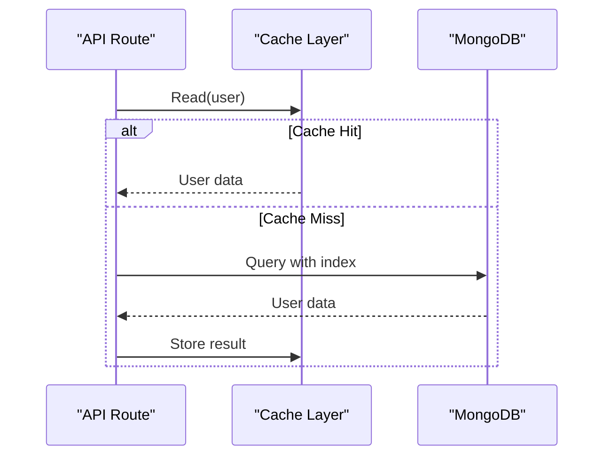

**Section sources**
- [lib/mongodb.ts:1-38](file://lib/mongodb.ts#L1-L38)
- [lib/mongoose.ts:1-47](file://lib/mongoose.ts#L1-L47)
- [app/api/auth/me/route.ts:1-51](file://app/api/auth/me/route.ts#L1-L51)

### Bundle Analysis and Dependency Optimization
Observations:
- Dependencies include animation and charting libraries that can increase bundle size.
- No build-time bundle analysis configured in the analyzed files.

Recommendations:
- Integrate a bundle analyzer (e.g., webpack-bundle-analyzer) to identify large dependencies.
- Tree-shake unused exports and prefer lightweight alternatives when possible.
- Audit third-party packages for size and performance impact; remove unused ones.
- Configure Next.js to optimize builds and enable compression.

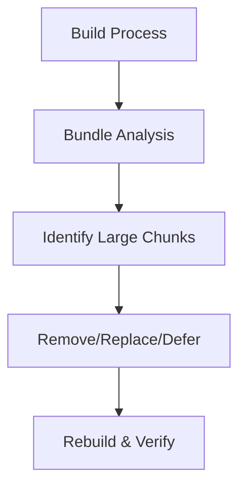

[No sources needed since this diagram shows conceptual workflow, not actual code structure]

### Performance Monitoring and Metrics Collection
Observations:
- ESLint extends core-web-vitals to enforce performance-related checks during development.
- No runtime metrics collection is visible in the analyzed files.

Recommendations:
- Instrument Core Web Vitals using Next.js analytics or custom instrumentation.
- Track API latency, error rates, and database query times in API routes.
- Use logging and tracing to measure TTFB, FCP, LCP, CLS, INP.

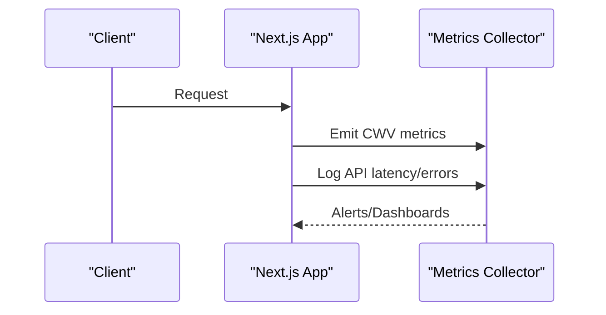

**Section sources**
- [.eslintrc.json:1-3](file:.eslintrc.json#L1-L3)

### Server-Side Rendering and Static Site Generation
Observations:
- Root layout sets metadata and providers; pages can leverage SSR/ISR.
- Blog post page uses async server component pattern.

Recommendations:
- Use SSR for content that benefits from SEO and fast first paint.
- Apply ISR for pages that update infrequently to serve cached HTML.
- Pre-render static assets and leverage CDN caching headers.

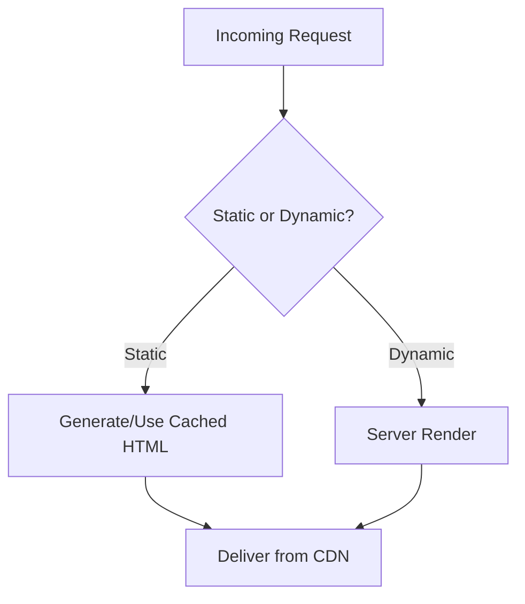

**Section sources**
- [app/layout.tsx:1-48](file://app/layout.tsx#L1-L48)
- [app/blog/[slug]/page.tsx:47-162](file://app/blog/[slug]/page.tsx#L47-L162)

### Client-Side Caching and Progressive Enhancement
Observations:
- Client components manage local state and animations; no explicit caching strategy is visible.
- Navigation and UI rely on client-side logic.

Recommendations:
- Cache API responses in memory or localStorage for short-lived data.
- Use optimistic updates for better perceived performance.
- Gracefully degrade features for slower networks or older devices.

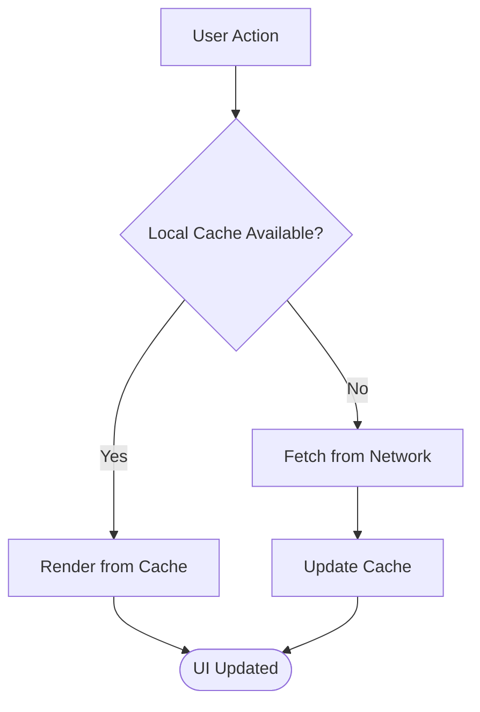

[No sources needed since this diagram shows conceptual workflow, not actual code structure]

### Performance Testing Methodologies and Benchmarking
Recommendations:
- Use Lighthouse CI and WebPageTest to measure CWV and regression detection.
- Conduct load testing with k6 or Artillery to validate API throughput and latency.
- Profile React renders and bundle sizes regularly.

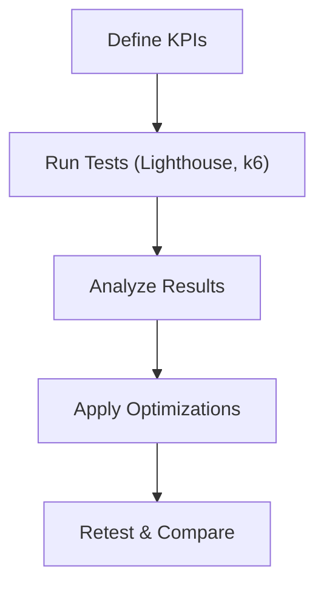

[No sources needed since this diagram shows conceptual workflow, not actual code structure]

## Dependency Analysis
Key runtime and dev dependencies influence performance:
- Animation and UI libraries (framer-motion, lucide-react) add bundle weight.
- Charting library (recharts) can be heavy; consider lazy loading.
- Database drivers (mongodb, mongoose) are essential for data layer.

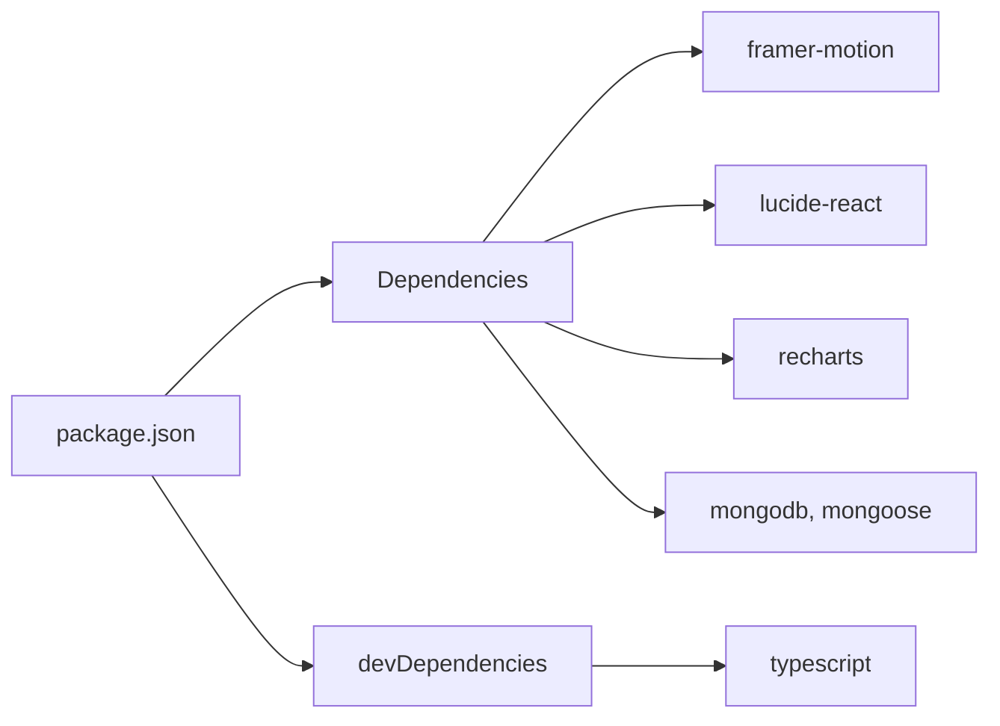

**Diagram sources**
- [package.json:1-57](file://package.json#L1-L57)

**Section sources**
- [package.json:1-57](file://package.json#L1-L57)

## Performance Considerations
- Images: Enable optimization to unlock resizing, format conversion, and lazy loading.
- Code Splitting: Dynamically import heavy components; organize routes to minimize initial payload.
- Database: Index frequently queried fields; cache hot reads; reuse connections.
- Bundles: Analyze and trim dependencies; defer non-critical scripts.
- Monitoring: Instrument CWV and API metrics; set alerts for regressions.
- SSR/ISR: Choose appropriate rendering strategies per page; precompute static content.
- Client Caching: Cache frequent reads; implement optimistic UI updates.
- Testing: Establish continuous performance testing and benchmarking.

[No sources needed since this section provides general guidance]

## Troubleshooting Guide
Common issues and mitigations:
- Images not optimized: Verify Next.js image settings; ensure proper dimensions and formats.
- Slow API responses: Check database indexes and query projections; add caching layers.
- Large bundles: Run bundle analysis; remove unused dependencies; lazy-load heavy features.
- Runtime errors in DB connections: Validate environment variables and connection options; handle retries.

**Section sources**
- [next.config.js:1-9](file://next.config.js#L1-L9)
- [lib/mongodb.ts:1-38](file://lib/mongodb.ts#L1-L38)
- [lib/mongoose.ts:1-47](file://lib/mongoose.ts#L1-L47)
- [app/api/auth/me/route.ts:1-51](file://app/api/auth/me/route.ts#L1-L51)

## Conclusion
By enabling image optimization, implementing code splitting, optimizing database queries, analyzing and trimming bundles, instrumenting performance metrics, and adopting SSR/ISR and client-side caching strategies, the application can achieve significant improvements in speed and efficiency. Continuous performance testing ensures sustained gains and early detection of regressions.

[No sources needed since this section summarizes without analyzing specific files]