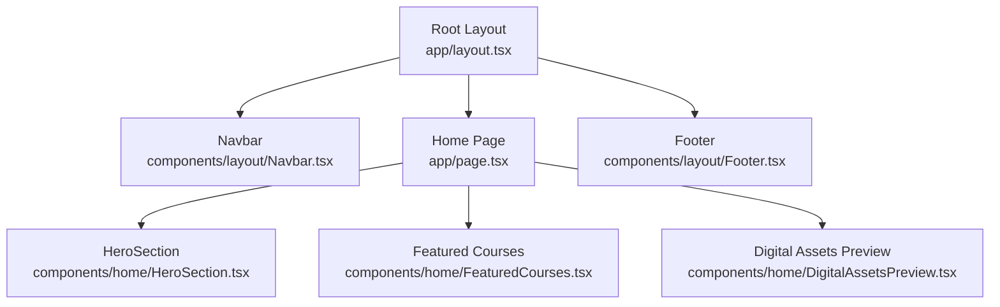
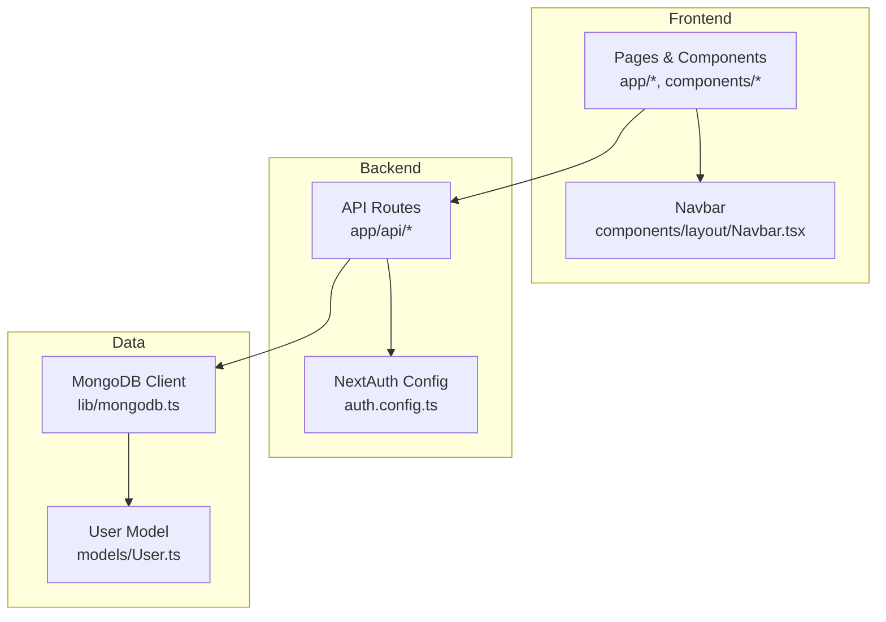
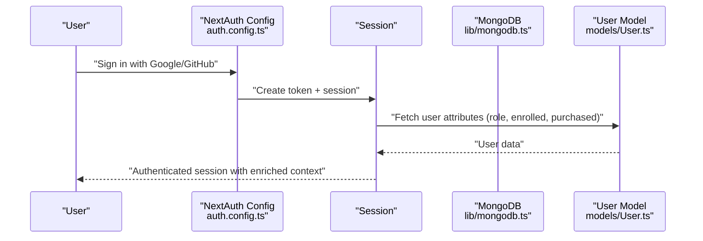
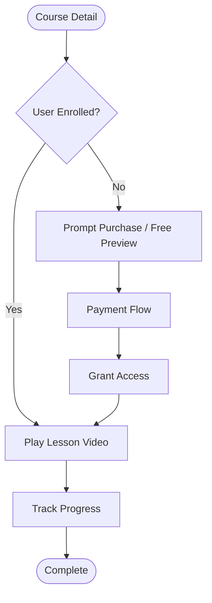
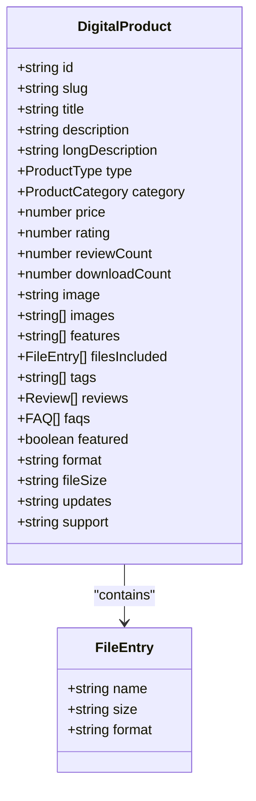
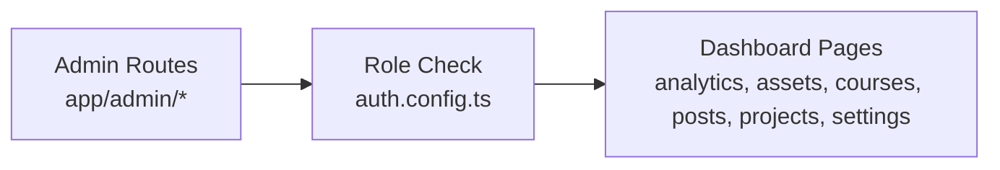
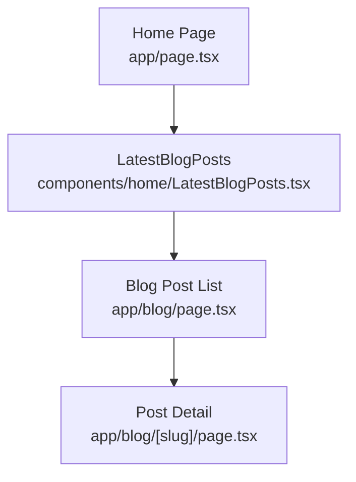
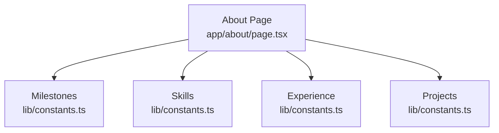
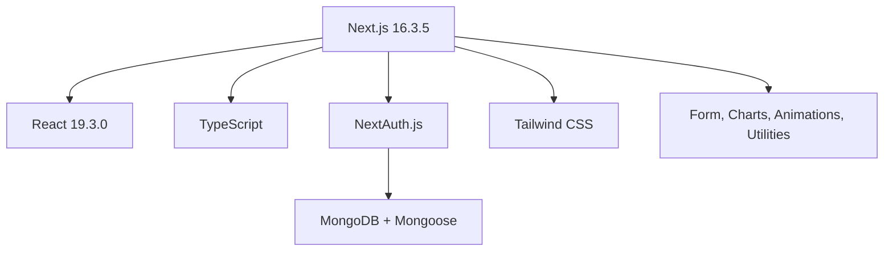

# Project Overview

<cite>
**Referenced Files in This Document**
- [package.json](file://package.json)
- [next.config.js](file://next.config.js)
- [app/layout.tsx](file://app/layout.tsx)
- [auth.config.ts](file://auth.config.ts)
- [lib/mongodb.ts](file://lib/mongodb.ts)
- [models/User.ts](file://models/User.ts)
- [app/page.tsx](file://app/page.tsx)
- [components/layout/Navbar.tsx](file://components/layout/Navbar.tsx)
- [lib/courses-data.ts](file://lib/courses-data.ts)
- [lib/digital-products.ts](file://lib/digital-products.ts)
- [lib/constants.ts](file://lib/constants.ts)
- [tailwind.config.ts](file://tailwind.config.ts)
- [app/about/page.tsx](file://app/about/page.tsx)
</cite>

## Table of Contents
1. Introduction
2. Project Structure
3. Core Components
4. Architecture Overview
5. Detailed Component Analysis
6. Dependency Analysis
7. Performance Considerations
8. Troubleshooting Guide
9. Conclusion

## Introduction
Digentic is a full-stack educational platform and professional portfolio website that combines AI education, a digital asset marketplace, and a curated project showcase. Built with Next.js 16.3.5, React 19.3.0, TypeScript, and MongoDB, it provides:
- Course management for structured learning paths
- A blog system for technical insights
- A digital products marketplace for downloadable assets
- An admin dashboard for content and analytics management
- A robust authentication system powered by NextAuth.js

Target audience includes developers, students, and professionals seeking practical AI/ML education and production-ready skills. The platform emphasizes modern React patterns, type safety with TypeScript, and a responsive UI built with Tailwind CSS.

## Project Structure
The application follows the Next.js App Router structure with feature-based directories under app/, shared components under components/, data and utilities under lib/, and database models under models/. Key entry points include the root layout for global providers and metadata, and the home page assembling core sections.

**Diagram sources**
- [app/layout.tsx:11-47](file://app/layout.tsx#L11-L47)
- [app/page.tsx:11-25](file://app/page.tsx#L11-L25)
- [components/layout/Navbar.tsx:13-235](file://components/layout/Navbar.tsx#L13-L235)

**Section sources**
- [app/layout.tsx:11-47](file://app/layout.tsx#L11-L47)
- [app/page.tsx:11-25](file://app/page.tsx#L11-L25)

## Core Components
- Authentication and Session Management: NextAuth.js configuration defines social providers (Google, GitHub), session callbacks to enrich user context (role, enrolled courses, purchased items), and sign-in routing.
- Database Layer: MongoDB client initialization with connection pooling and environment-driven URI; Mongoose model for User with validation, timestamps, and password comparison utility.
- Navigation and Global UI: Navbar integrates session state, theme toggle, and responsive menu; Root layout sets metadata, theme provider, and session provider.
- Content Modules: Courses data module defines curriculum structures and sample lessons; Digital products module defines product types, categories, and marketplace listings; constants define site config, navigation links, and mock content for pages like About.

Practical examples:
- Users can authenticate via Google or GitHub and access personalized dashboards and protected routes.
- Learners browse courses with detailed curricula and preview videos, then enroll or purchase based on permissions.
- Visitors explore digital assets, filter by category, and download or purchase products.
- Admins manage courses, posts, projects, and analytics through dedicated routes.

**Section sources**
- [auth.config.ts:5-100](file://auth.config.ts#L5-L100)
- [lib/mongodb.ts:1-38](file://lib/mongodb.ts#L1-L38)
- [models/User.ts:19-78](file://models/User.ts#L19-L78)
- [components/layout/Navbar.tsx:13-235](file://components/layout/Navbar.tsx#L13-L235)
- [lib/courses-data.ts:6-64](file://lib/courses-data.ts#L6-L64)
- [lib/digital-products.ts:18-50](file://lib/digital-products.ts#L18-L50)
- [lib/constants.ts:14-22](file://lib/constants.ts#L14-L22)

## Architecture Overview
Digentic uses a layered architecture:
- Presentation: Next.js App Router pages and React components styled with Tailwind CSS.
- Application Logic: Route handlers and server-side logic for auth, course enrollment, and product purchases.
- Data Access: MongoDB client and Mongoose models for persistence.
- External Integrations: NextAuth.js providers and email services for notifications.

**Diagram sources**
- [auth.config.ts:5-100](file://auth.config.ts#L5-L100)
- [lib/mongodb.ts:1-38](file://lib/mongodb.ts#L1-L38)
- [models/User.ts:19-78](file://models/User.ts#L19-L78)
- [components/layout/Navbar.tsx:13-235](file://components/layout/Navbar.tsx#L13-L235)

## Detailed Component Analysis

### Authentication System (NextAuth.js)
- Providers: Google and GitHub configured with environment variables.
- Callbacks: JWT and session callbacks enrich tokens with role, enrolled courses, and purchased digital items; supports temporary admin assignment via environment variable.
- Sign-in Routing: Custom sign-in page route configured.

**Diagram sources**
- [auth.config.ts:21-98](file://auth.config.ts#L21-L98)
- [lib/mongodb.ts:32-35](file://lib/mongodb.ts#L32-L35)
- [models/User.ts:19-78](file://models/User.ts#L19-L78)

**Section sources**
- [auth.config.ts:5-100](file://auth.config.ts#L5-L100)

### Course Management
- Data Model: Courses defined with curriculum sections, lessons, previews, ratings, and outcomes.
- Learning Flow: Course listing, detail view, and lesson player integrate with video playback and progress tracking.
- Enrollment: Session context determines access to lessons and premium content.

**Diagram sources**
- [lib/courses-data.ts:6-64](file://lib/courses-data.ts#L6-L64)
- [auth.config.ts:30-84](file://auth.config.ts#L30-L84)

**Section sources**
- [lib/courses-data.ts:6-64](file://lib/courses-data.ts#L6-L64)

### Digital Products Marketplace
- Product Types: Prompts, UI templates, boilerplates, resumes, Notion templates, eBooks.
- Categories and Filters: Centralized category filters and badge styles for consistent UI.
- Downloads and Purchases: Product details include files included, formats, sizes, updates, and support info.

**Diagram sources**
- [lib/digital-products.ts:18-50](file://lib/digital-products.ts#L18-L50)

**Section sources**
- [lib/digital-products.ts:1-562](file://lib/digital-products.ts#L1-L562)

### Admin Dashboard
- Scope: Analytics, assets management, courses, likes, posts (drafts/new), projects, settings.
- Integration: Protected routes rely on session context and roles; admin-only features gated by role checks.

**Diagram sources**
- [auth.config.ts:30-84](file://auth.config.ts#L30-L84)

**Section sources**
- [auth.config.ts:30-84](file://auth.config.ts#L30-L84)

### Blog System
- Content: Mock blog posts with categories, read time, publish dates, and author info.
- Display: Home page aggregates latest posts; individual post pages render content and related features.

**Diagram sources**
- [app/page.tsx:11-25](file://app/page.tsx#L11-L25)
- [lib/constants.ts:286-431](file://lib/constants.ts#L286-L431)

**Section sources**
- [lib/constants.ts:286-431](file://lib/constants.ts#L286-L431)

### Portfolio Showcase
- About Page: Personal story, skills, experience timeline, education, certifications, projects, resume download, stats, testimonials.
- Projects: Curated list with tech stacks, live links, code repositories, and case studies.

**Diagram sources**
- [app/about/page.tsx:36-381](file://app/about/page.tsx#L36-L381)
- [lib/constants.ts:46-101](file://lib/constants.ts#L46-L101)

**Section sources**
- [app/about/page.tsx:36-381](file://app/about/page.tsx#L36-L381)
- [lib/constants.ts:46-101](file://lib/constants.ts#L46-L101)

## Dependency Analysis
Core dependencies and their roles:
- Next.js 16.3.5: Framework for routing, server components, and build tooling.
- React 19.3.0: UI library for components and state management.
- TypeScript: Type safety across the stack.
- NextAuth.js: Authentication and session handling.
- MongoDB + Mongoose: Data persistence and modeling.
- Tailwind CSS: Utility-first styling with custom themes and animations.
- Additional libraries: Form handling, date formatting, charts, animations, and UI primitives.

**Diagram sources**
- [package.json:12-55](file://package.json#L12-L55)

**Section sources**
- [package.json:12-55](file://package.json#L12-L55)

## Performance Considerations
- Image Optimization: Next.js image optimization disabled globally; consider enabling for production to improve load times.
- Server Components: Leverage Next.js server components where possible to reduce client bundle size.
- Database Connections: Connection pooling via MongoDB client options; ensure proper environment configuration for production.
- Styling: Tailwind’s purge and tree-shaking minimize CSS; use dark mode classes efficiently.
- State Management: Prefer local state and React hooks; avoid unnecessary re-renders with memoization when needed.

[No sources needed since this section provides general guidance]

## Troubleshooting Guide
Common issues and resolutions:
- Authentication Failures: Verify environment variables for Google and GitHub clients/secrets; check callback URLs and allowed origins.
- Session Context Missing: Ensure session provider wraps the app and that callbacks populate required fields (role, enrolled courses, purchased items).
- Database Connectivity: Confirm MongoDB URI and server API version; validate network access and credentials.
- Model Validation Errors: Review Mongoose schema constraints and error messages for user registration and updates.
- Styling Issues: Confirm Tailwind configuration includes correct content paths and theme extensions; verify dark mode class toggling.

**Section sources**
- [auth.config.ts:10-19](file://auth.config.ts#L10-L19)
- [auth.config.ts:30-98](file://auth.config.ts#L30-L98)
- [lib/mongodb.ts:1-11](file://lib/mongodb.ts#L1-L11)
- [models/User.ts:19-67](file://models/User.ts#L19-L67)
- [tailwind.config.ts:3-129](file://tailwind.config.ts#L3-L129)

## Conclusion
Digentic delivers a cohesive educational platform and portfolio showcase that empowers learners and professionals with high-quality AI/ML content, practical digital assets, and a polished presentation of expertise. Its modern architecture—Next.js, React, TypeScript, MongoDB, NextAuth.js, and Tailwind CSS—enables scalable development, secure authentication, and a responsive user experience. With integrated course management, blog publishing, marketplace capabilities, and an admin dashboard, Digentic serves as both a learning hub and a professional brand engine.

[No sources needed since this section summarizes without analyzing specific files]