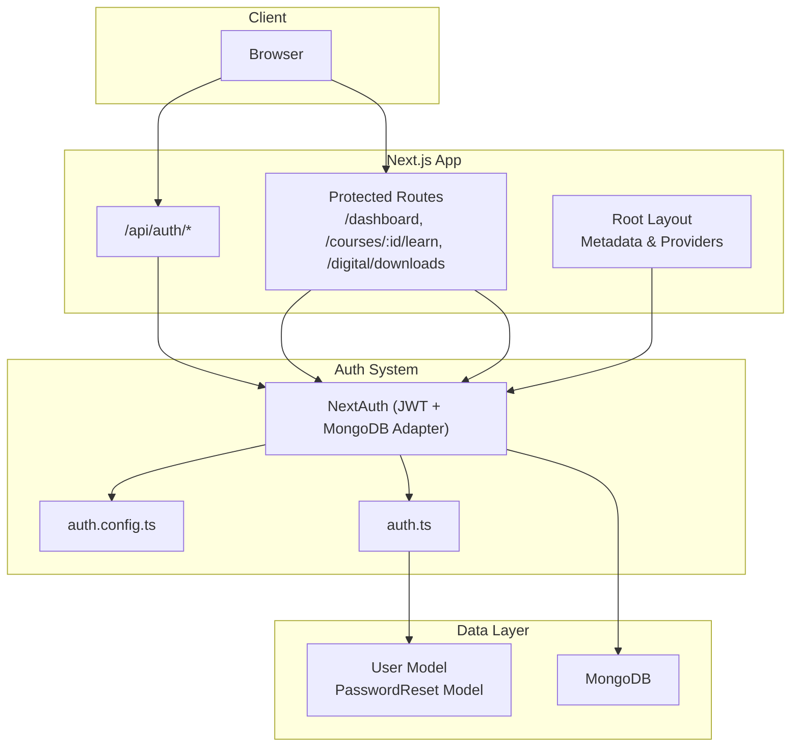
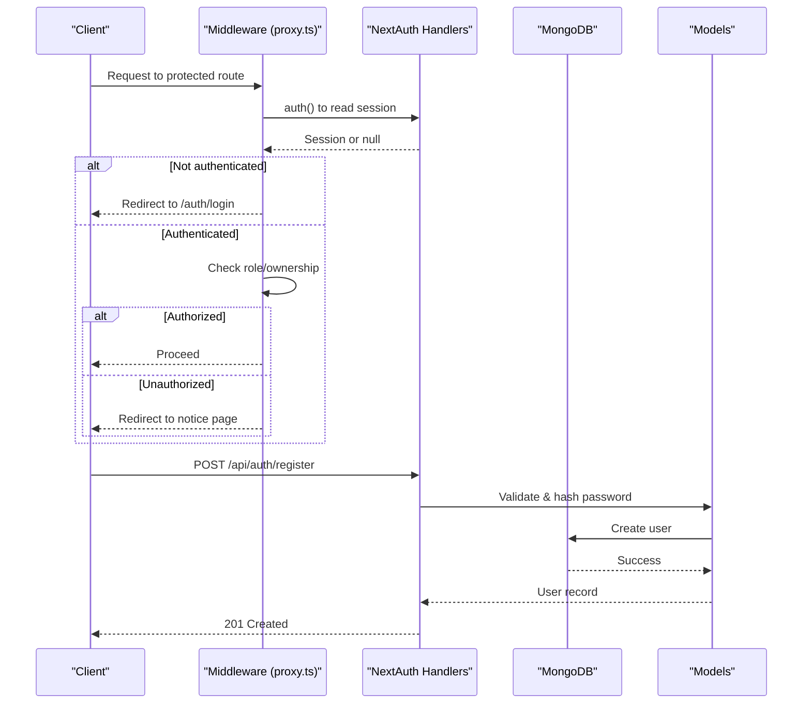
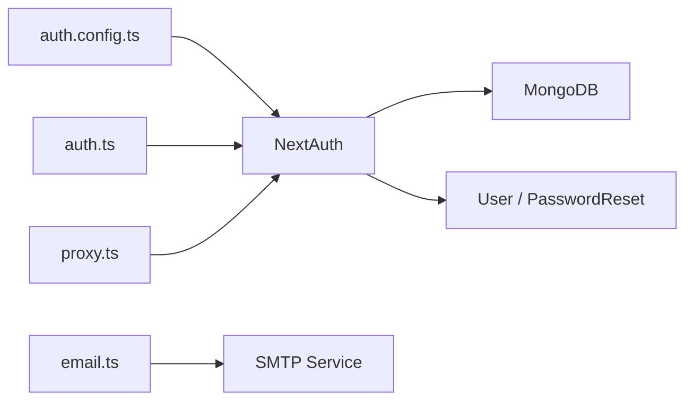
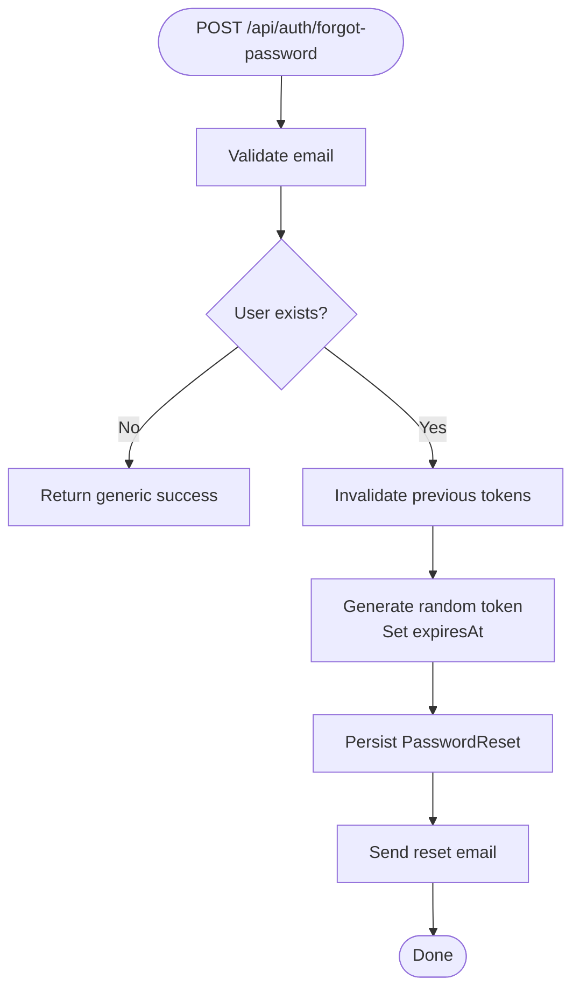
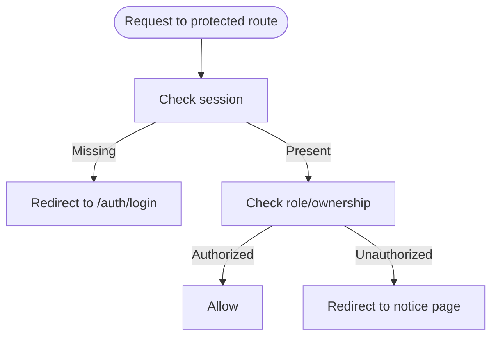

# Security Considerations

<cite>
**Referenced Files in This Document**
- [auth.config.ts](file://auth.config.ts)
- [auth.ts](file://auth.ts)
- [route.ts](file://app/api/auth/[...nextauth]/route.ts)
- [User.ts](file://models/User.ts)
- [PasswordReset.ts](file://models/PasswordReset.ts)
- [register route.ts](file://app/api/auth/register/route.ts)
- [forgot-password route.ts](file://app/api/auth/forgot-password/route.ts)
- [reset-password route.ts](file://app/api/auth/reset-password/route.ts)
- [email.ts](file://lib/email.ts)
- [proxy.ts](file://proxy.ts)
- [mongodb.ts](file://lib/mongodb.ts)
- [layout.tsx](file://app/layout.tsx)
</cite>

## Table of Contents
1. Introduction
2. Project Structure
3. Core Components
4. Architecture Overview
5. Detailed Component Analysis
6. Dependency Analysis
7. Performance Considerations
8. Troubleshooting Guide
9. Conclusion
10. Appendices

## Introduction
This document provides comprehensive security guidance for the Digentic platform, focusing on authentication security, input validation and sanitization, data protection, CSRF/XSS mitigations, secure cookies, API endpoint hardening, security headers and Content Security Policy (CSP), monitoring/logging, incident response, and ongoing audits and vulnerability scanning. It maps recommendations to the existing codebase and highlights areas that require additional controls.

## Project Structure
Security-relevant parts of the application include:
- Authentication configuration and handlers using NextAuth with JWT sessions and MongoDB adapter
- Custom credentials provider with password hashing via bcrypt
- Password reset flow with time-bound tokens and email delivery
- Middleware-based authorization for protected routes
- Database models for users and password resets
- Root layout metadata and session provider integration

**Diagram sources**
- [auth.config.ts:1-101](file://auth.config.ts#L1-L101)
- [auth.ts:1-133](file://auth.ts#L1-L133)
- [route.ts:1-4](file://app/api/auth/[...nextauth]/route.ts#L1-L4)
- [proxy.ts:1-92](file://proxy.ts#L1-L92)
- [User.ts:1-81](file://models/User.ts#L1-L81)
- [PasswordReset.ts:1-44](file://models/PasswordReset.ts#L1-L44)
- [layout.tsx:1-48](file://app/layout.tsx#L1-L48)

**Section sources**
- [auth.config.ts:1-101](file://auth.config.ts#L1-L101)
- [auth.ts:1-133](file://auth.ts#L1-L133)
- [route.ts:1-4](file://app/api/auth/[...nextauth]/route.ts#L1-L4)
- [proxy.ts:1-92](file://proxy.ts#L1-L92)
- [User.ts:1-81](file://models/User.ts#L1-L81)
- [PasswordReset.ts:1-44](file://models/PasswordReset.ts#L1-L44)
- [layout.tsx:1-48](file://app/layout.tsx#L1-L48)

## Core Components
- Authentication: NextAuth with JWT strategy, MongoDB adapter, Google/GitHub providers, and a custom Credentials provider. Session is stored server-side as JWT; user identity and roles are propagated through callbacks.
- Authorization: Middleware enforces login and role/ownership checks for dashboard, course lessons, and digital downloads.
- Password Management: Registration hashes passwords with bcrypt; forgot/reset flows use short-lived, single-use tokens with TTL cleanup.
- Data Protection: MongoDB connection uses environment variables; password fields are hashed at rest. Email transport uses environment-configured SMTP.

Key implementation references:
- JWT session strategy and provider setup
- Credentials authorize flow with bcrypt comparison
- Middleware route guards and enrollment/purchase checks
- Password reset token generation and expiration handling

**Section sources**
- [auth.ts:9-84](file://auth.ts#L9-L84)
- [auth.config.ts:21-99](file://auth.config.ts#L21-L99)
- [proxy.ts:12-77](file://proxy.ts#L12-L77)
- [register route.ts:6-67](file://app/api/auth/register/route.ts#L6-L67)
- [forgot-password route.ts:8-53](file://app/api/auth/forgot-password/route.ts#L8-L53)
- [reset-password route.ts:7-61](file://app/api/auth/reset-password/route.ts#L7-L61)
- [User.ts:19-75](file://models/User.ts#L19-L75)
- [PasswordReset.ts:10-37](file://models/PasswordReset.ts#L10-L37)

## Architecture Overview
The authentication and authorization architecture centers around NextAuth with JWT sessions. Requests to protected routes pass through middleware that validates session presence and permissions before allowing access. Sensitive operations (registration, password reset) validate inputs, hash secrets, and interact with MongoDB.

**Diagram sources**
- [proxy.ts:12-77](file://proxy.ts#L12-L77)
- [auth.ts:9-84](file://auth.ts#L9-L84)
- [register route.ts:6-67](file://app/api/auth/register/route.ts#L6-L67)
- [User.ts:19-75](file://models/User.ts#L19-L75)

## Detailed Component Analysis

### Authentication Security
- Session Strategy: JWT-based sessions configured in the main auth module. Tokens carry user id, role, enrolled courses, and purchased digital assets via callbacks.
- Providers: Google and GitHub OAuth providers are configured with client IDs/secrets from environment variables. Account linking allows dangerous email account linking per provider config.
- Credentials Provider: Local sign-in compares provided password against stored bcrypt hash. A temporary admin bypass exists for development/testing using environment variables.

Recommendations:
- Remove or restrict the temporary admin bypass in production environments.
- Enforce strong password policies consistently across registration and reset flows.
- Add rate limiting to credential verification endpoints to mitigate brute-force attacks.
- Ensure HTTPS-only cookie settings for any cookies set by the framework.

**Section sources**
- [auth.ts:9-84](file://auth.ts#L9-L84)
- [auth.config.ts:9-20](file://auth.config.ts#L9-L20)
- [auth.config.ts:30-99](file://auth.config.ts#L30-L99)

### Password Hashing and Storage
- Registration: Passwords are hashed with bcrypt before storage.
- Comparison: The User model exposes a method to compare candidate passwords against stored hashes.
- Reset Flow: New passwords are hashed before update; reset tokens are short-lived and deleted after use.

Recommendations:
- Use a consistent minimum cost factor for bcrypt across all environments.
- Enforce password complexity rules on both client and server.
- Log failed attempts without revealing sensitive details.

**Section sources**
- [register route.ts:43-48](file://app/api/auth/register/route.ts#L43-L48)
- [User.ts:69-75](file://models/User.ts#L69-L75)
- [reset-password route.ts:44-56](file://app/api/auth/reset-password/route.ts#L44-L56)

### Session Management and JWT Handling
- JWT Strategy: Sessions are JWT-based; user claims (id, role, enrolledCourses, purchasedDigital) are populated in jwt and session callbacks.
- Propagation: Claims are attached to the session object for downstream use.

Recommendations:
- Set appropriate token expiration and refresh strategies.
- Avoid storing sensitive data in JWT payloads beyond what is necessary.
- Implement token revocation mechanisms where feasible.

**Section sources**
- [auth.ts:9-13](file://auth.ts#L9-L13)
- [auth.config.ts:30-99](file://auth.config.ts#L30-L99)

### Input Validation and Sanitization
- Registration: Validates name, email format, and password length; normalizes email to lowercase and trims whitespace.
- Forgot Password: Validates email format; protects against enumeration by returning generic success messages when the account does not exist.
- Reset Password: Validates token presence and password strength; deletes expired tokens and cleans up used tokens.

Recommendations:
- Centralize validation logic into reusable validators/schemas.
- Apply strict content types and size limits on incoming requests.
- Sanitize any user-supplied strings rendered in HTML contexts.

**Section sources**
- [register route.ts:11-33](file://app/api/auth/register/route.ts#L11-L33)
- [forgot-password route.ts:12-30](file://app/api/auth/forgot-password/route.ts#L12-L30)
- [reset-password route.ts:11-23](file://app/api/auth/reset-password/route.ts#L11-L23)

### Data Protection (Encryption at Rest and In Transit)
- At Rest: Passwords are hashed with bcrypt; no plaintext secrets stored in database. MongoDB URI is sourced from environment variables.
- In Transit: Email transport supports secure ports based on configuration; ensure TLS is enforced for SMTP and database connections.

Recommendations:
- Enforce TLS for MongoDB connections in production.
- Configure SMTP to use TLS/SSL explicitly.
- Enable database encryption at rest via your hosting provider.

**Section sources**
- [User.ts:69-75](file://models/User.ts#L69-L75)
- [mongodb.ts:1-37](file://lib/mongodb.ts#L1-L37)
- [email.ts:1-13](file://lib/email.ts#L1-L13)

### CSRF Protection
- Current State: No explicit CSRF tokens are implemented in the visible routes.
- Recommendations:
  - For state-changing APIs, implement CSRF tokens or use SameSite cookies with proper configuration.
  - Validate Origin/Referer headers for sensitive endpoints.
  - Prefer double-submit cookie pattern if using browser-based forms.

[No sources needed since this section provides general guidance]

### XSS Prevention
- Current State: Server responses return JSON; root layout sets basic metadata. No explicit CSP headers are configured.
- Recommendations:
  - Implement a strict Content Security Policy to prevent inline scripts and unauthorized sources.
  - Sanitize any user-generated content before rendering in HTML.
  - Use React’s built-in escaping and avoid dangerouslySetInnerHTML unless absolutely necessary.

[No sources needed since this section provides general guidance]

### Secure Cookie Configuration
- Current State: NextAuth manages sessions; no explicit cookie options are shown in the analyzed files.
- Recommendations:
  - Ensure cookies are HttpOnly, Secure, and SameSite=Strict or Lax.
  - Set appropriate domain/path restrictions.
  - Rotate signing keys periodically.

[No sources needed since this section provides general guidance]

### Secure API Endpoints and Request Validation
- Registration Endpoint: Validates inputs, checks uniqueness, hashes password, and returns minimal user info.
- Password Reset Endpoints: Validate tokens and passwords, enforce expiration, and clean up tokens.

Recommendations:
- Add request body schema validation libraries (e.g., Zod) for robust validation.
- Implement rate limiting and throttling on auth endpoints.
- Return consistent error shapes and avoid leaking stack traces.

**Section sources**
- [register route.ts:6-67](file://app/api/auth/register/route.ts#L6-L67)
- [forgot-password route.ts:8-53](file://app/api/auth/forgot-password/route.ts#L8-L53)
- [reset-password route.ts:7-61](file://app/api/auth/reset-password/route.ts#L7-L61)

### Security Headers and Content Security Policy
- Current State: No explicit security headers or CSP are configured in the analyzed files.
- Recommendations:
  - Configure HSTS, X-Content-Type-Options, X-Frame-Options, Referrer-Policy, Permissions-Policy.
  - Define a CSP that whitelists only required domains and disallows inline scripts.
  - Use a Next.js plugin or middleware to inject headers globally.

[No sources needed since this section provides general guidance]

### Authorization and Access Control
- Middleware Guards: Protects dashboard, course lesson pages, and digital download routes by verifying authentication and ownership/roles.
- Enrollment/Purchase Checks: Ensures users can only access resources they are enrolled in or have purchased.

Recommendations:
- Centralize permission checks and add fine-grained resource-level authorization.
- Log authorization failures for auditability.

**Section sources**
- [proxy.ts:12-77](file://proxy.ts#L12-L77)

### Monitoring, Logging, and Incident Response
- Current State: Errors are logged to console in several places; no structured logging or centralized monitoring is evident.
- Recommendations:
  - Implement structured logging with correlation IDs for requests.
  - Integrate an external logging and alerting service.
  - Define incident response procedures for compromised accounts, token leaks, and abuse patterns.

[No sources needed since this section provides general guidance]

### Audits and Vulnerability Scanning
- Recommendations:
  - Run regular dependency vulnerability scans (e.g., npm audit).
  - Perform periodic penetration tests and code reviews focused on auth and data handling.
  - Maintain a patching policy for critical updates.

[No sources needed since this section provides general guidance]

## Dependency Analysis
Authentication and authorization depend on NextAuth, MongoDB, and environment variables for providers and transports.

**Diagram sources**
- [auth.config.ts:1-20](file://auth.config.ts#L1-L20)
- [auth.ts:1-13](file://auth.ts#L1-L13)
- [proxy.ts:1-10](file://proxy.ts#L1-L10)
- [email.ts:1-13](file://lib/email.ts#L1-L13)
- [mongodb.ts:1-37](file://lib/mongodb.ts#L1-L37)

**Section sources**
- [auth.config.ts:1-20](file://auth.config.ts#L1-L20)
- [auth.ts:1-13](file://auth.ts#L1-L13)
- [proxy.ts:1-10](file://proxy.ts#L1-L10)
- [email.ts:1-13](file://lib/email.ts#L1-L13)
- [mongodb.ts:1-37](file://lib/mongodb.ts#L1-L37)

## Performance Considerations
- JWT sessions reduce server-side session storage overhead but increase payload size; keep claims minimal.
- Rate limit authentication endpoints to prevent abuse and protect performance.
- Use efficient queries and indexes (already present for email and token fields).

[No sources needed since this section provides general guidance]

## Troubleshooting Guide
Common issues and mitigations:
- Invalid credentials: Ensure bcrypt cost factors are consistent and logs do not leak sensitive data.
- Expired reset links: Verify TTL and ensure tokens are deleted after successful use.
- Missing environment variables: Confirm SMTP and MongoDB URIs are correctly set in production.

**Section sources**
- [auth.ts:21-84](file://auth.ts#L21-L84)
- [forgot-password route.ts:32-53](file://app/api/auth/forgot-password/route.ts#L32-L53)
- [reset-password route.ts:27-56](file://app/api/auth/reset-password/route.ts#L27-L56)
- [email.ts:1-13](file://lib/email.ts#L1-L13)
- [mongodb.ts:1-37](file://lib/mongodb.ts#L1-L37)

## Conclusion
Digentic implements solid foundations for authentication and authorization using NextAuth with JWT and MongoDB, along with secure password hashing and time-bound reset tokens. To further harden the platform, implement CSRF protections, strict CSP and security headers, centralized logging and monitoring, and rigorous auditing practices. Remove or restrict development-only backdoors in production and enforce consistent input validation and rate limiting across all endpoints.

## Appendices

### Appendix A: Password Reset Flow

**Diagram sources**
- [forgot-password route.ts:8-53](file://app/api/auth/forgot-password/route.ts#L8-L53)
- [PasswordReset.ts:10-37](file://models/PasswordReset.ts#L10-L37)

### Appendix B: Protected Route Authorization

**Diagram sources**
- [proxy.ts:12-77](file://proxy.ts#L12-L77)