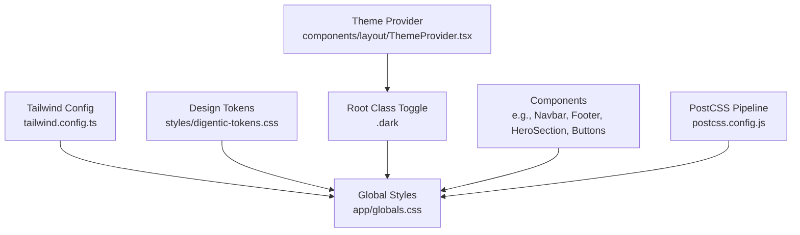
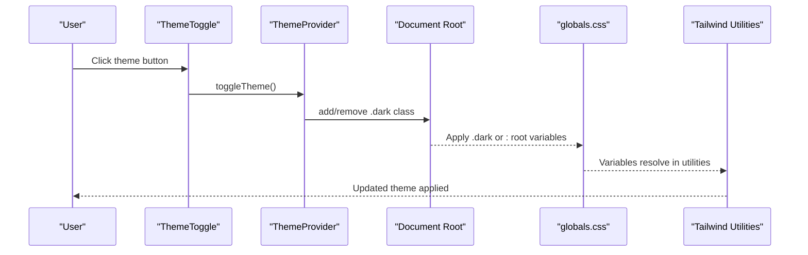
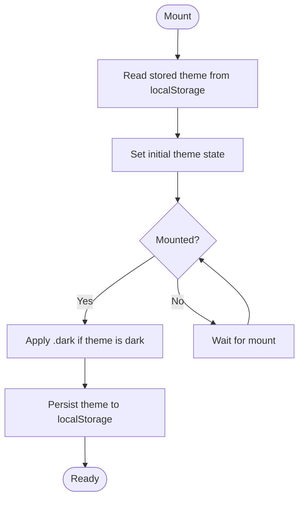
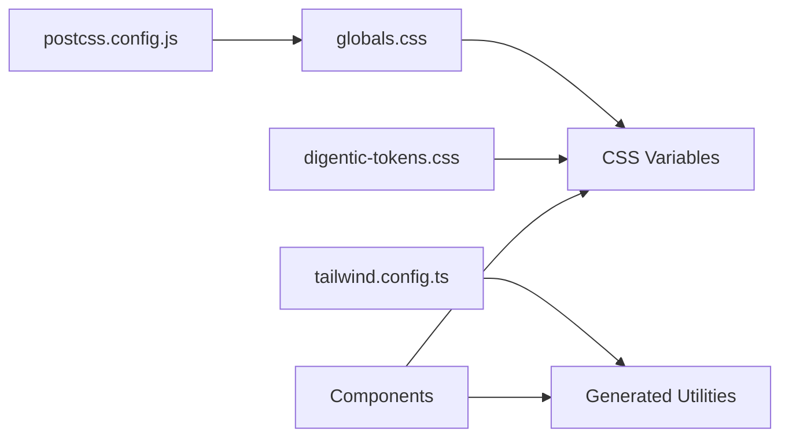

# Styling & Design System

<cite>
**Referenced Files in This Document**
- [tailwind.config.ts](file://tailwind.config.ts)
- [digentic-tokens.css](file://styles/digentic-tokens.css)
- [globals.css](file://app/globals.css)
- [postcss.config.js](file://postcss.config.js)
- [ThemeProvider.tsx](file://components/layout/ThemeProvider.tsx)
- [ThemeToggle.tsx](file://components/layout/ThemeToggle.tsx)
- [Navbar.tsx](file://components/layout/Navbar.tsx)
- [Footer.tsx](file://components/layout/Footer.tsx)
- [HeroSection.tsx](file://components/home/HeroSection.tsx)
- [CTAButton.tsx](file://components/shared/CTAButton.tsx)
- [FilterChips.tsx](file://components/shared/FilterChips.tsx)
- [TagPill.tsx](file://components/shared/TagPill.tsx)
- [StatCard.tsx](file://components/shared/StatCard.tsx)
- [SectionHeader.tsx](file://components/shared/SectionHeader.tsx)
</cite>

## Table of Contents
1. Introduction
2. Project Structure
3. Core Components
4. Architecture Overview
5. Detailed Component Analysis
6. Dependency Analysis
7. Performance Considerations
8. Troubleshooting Guide
9. Conclusion
10. Appendices

## Introduction
This document explains the styling and design system built with Tailwind CSS, CSS custom properties (design tokens), and React components. It covers theme tokens, color palettes, typography scales, spacing systems, dark/light mode switching, responsive patterns, accessibility considerations, and guidelines for extending the system consistently across components.

## Project Structure
The design system is centered around:
- Tailwind configuration that extends colors, gradients, border radius, animations, and keyframes
- Global CSS that defines light and dark themes via CSS variables and utility classes
- A client-side theme provider that toggles a class on the root element to switch themes
- Reusable UI components that consume these tokens and utilities for consistent visuals

**Diagram sources**
- [tailwind.config.ts:1-129](file://tailwind.config.ts#L1-L129)
- [globals.css:1-217](file://app/globals.css#L1-L217)
- [digentic-tokens.css:1-15](file://styles/digentic-tokens.css#L1-L15)
- [ThemeProvider.tsx:1-57](file://components/layout/ThemeProvider.tsx#L1-L57)
- [postcss.config.js:1-7](file://postcss.config.js#L1-L7)

**Section sources**
- [tailwind.config.ts:1-129](file://tailwind.config.ts#L1-L129)
- [globals.css:1-217](file://app/globals.css#L1-L217)
- [digentic-tokens.css:1-15](file://styles/digentic-tokens.css#L1-L15)
- [postcss.config.js:1-7](file://postcss.config.js#L1-L7)

## Core Components
- ThemeProvider: Manages theme state, persists selection, and applies/removes the .dark class on the document root.
- ThemeToggle: UI control to switch between light and dark modes with accessible labels and animated icons.
- Navbar and Footer: Use theme-aware colors and gradients; demonstrate responsive behavior and token usage.
- Shared UI primitives: Buttons, chips, tags, stat cards, section headers that apply consistent spacing, typography, and color tokens.

Key responsibilities:
- Centralized theme state and persistence
- Consistent application of tokens through Tailwind utilities and CSS variables
- Accessible interactions (aria-labels, focus states)
- Responsive layouts using Tailwind’s breakpoint system

**Section sources**
- [ThemeProvider.tsx:1-57](file://components/layout/ThemeProvider.tsx#L1-L57)
- [ThemeToggle.tsx:1-35](file://components/layout/ThemeToggle.tsx#L1-L35)
- [Navbar.tsx:1-235](file://components/layout/Navbar.tsx#L1-L235)
- [Footer.tsx:1-119](file://components/layout/Footer.tsx#L1-L119)
- [CTAButton.tsx:1-49](file://components/shared/CTAButton.tsx#L1-L49)
- [FilterChips.tsx:1-30](file://components/shared/FilterChips.tsx#L1-L30)
- [TagPill.tsx:1-38](file://components/shared/TagPill.tsx#L1-L38)
- [StatCard.tsx:1-36](file://components/shared/StatCard.tsx#L1-L36)
- [SectionHeader.tsx:1-42](file://components/shared/SectionHeader.tsx#L1-L42)

## Architecture Overview
The styling architecture combines Tailwind’s build-time utility generation with runtime CSS variables for theming. The flow:
- Tailwind reads config and generates utilities based on content paths
- PostCSS processes stylesheets, enabling Tailwind directives and autoprefixing
- Global CSS defines light and dark variable sets and base component styles
- ThemeProvider toggles .dark on the root element to switch themes at runtime
- Components consume tokens via Tailwind utilities and CSS variables

**Diagram sources**
- [ThemeToggle.tsx:1-35](file://components/layout/ThemeToggle.tsx#L1-L35)
- [ThemeProvider.tsx:1-57](file://components/layout/ThemeProvider.tsx#L1-L57)
- [globals.css:1-217](file://app/globals.css#L1-L217)
- [tailwind.config.ts:1-129](file://tailwind.config.ts#L1-L129)

## Detailed Component Analysis

### Theme Provider and Toggle
- ThemeProvider maintains theme state, persists to localStorage, and toggles .dark on the document root.
- ThemeToggle provides an accessible button with aria-label and animated icon transitions.

**Diagram sources**
- [ThemeProvider.tsx:1-57](file://components/layout/ThemeProvider.tsx#L1-L57)
- [ThemeToggle.tsx:1-35](file://components/layout/ThemeToggle.tsx#L1-L35)

**Section sources**
- [ThemeProvider.tsx:1-57](file://components/layout/ThemeProvider.tsx#L1-L57)
- [ThemeToggle.tsx:1-35](file://components/layout/ThemeToggle.tsx#L1-L35)

### Color Palette and Gradients
- Custom orange palette with multiple shades for consistent accent usage.
- Gradient utilities for text and backgrounds, plus hover variants.
- Dark and light semantic color tokens mapped to HSL variables for background, foreground, card, popover, primary, secondary, muted, accent, destructive, border, input, ring, and chart series.

Usage examples across components:
- Buttons use gradient backgrounds and shadow accents
- Section headers and hero sections apply gradient text
- Cards and surfaces use semantic tokens for backgrounds and borders

**Section sources**
- [tailwind.config.ts:25-94](file://tailwind.config.ts#L25-L94)
- [globals.css:8-75](file://app/globals.css#L8-L75)
- [HeroSection.tsx:1-77](file://components/home/HeroSection.tsx#L1-L77)
- [CTAButton.tsx:1-49](file://components/shared/CTAButton.tsx#L1-L49)
- [SectionHeader.tsx:1-42](file://components/shared/SectionHeader.tsx#L1-L42)

### Typography Scale
- Base typography uses semantic tokens for text color and sizes.
- Article content includes headings, paragraphs, links, code blocks, and blockquotes styled for readability.
- Gradient text utilities provide brand-consistent headlines.

Guidelines:
- Prefer semantic tokens over hardcoded colors
- Maintain line-height and spacing for readability
- Ensure contrast ratios meet accessibility standards

**Section sources**
- [globals.css:78-87](file://app/globals.css#L78-L87)
- [globals.css:139-217](file://app/globals.css#L139-L217)

### Spacing and Layout
- Consistent spacing via Tailwind utilities and CSS variables for backgrounds and borders.
- Responsive grids and flex layouts used in navigation and footer.
- Mobile-first approach with breakpoints for small, medium, and large screens.

Examples:
- Navbar collapses into a mobile menu with animated transitions
- Footer uses multi-column grid that adapts to screen size
- Hero section stacks content vertically on small screens and horizontally on larger ones

**Section sources**
- [Navbar.tsx:1-235](file://components/layout/Navbar.tsx#L1-L235)
- [Footer.tsx:1-119](file://components/layout/Footer.tsx#L1-L119)
- [HeroSection.tsx:1-77](file://components/home/HeroSection.tsx#L1-L77)

### Animations and Keyframes
- Custom keyframes for accordion, fade-in, glow-pulse, and blink effects.
- Animation utilities applied to interactive elements and decorative features.
- Motion libraries enhance transitions for menus and dropdowns.

**Section sources**
- [tailwind.config.ts:95-123](file://tailwind.config.ts#L95-L123)
- [Navbar.tsx:1-235](file://components/layout/Navbar.tsx#L1-L235)

### Shared UI Primitives
- CTAButton: Variants (primary, outline, ghost) with consistent padding, radius, and hover states.
- FilterChips and TagPill: Token-driven active/outlined states with accessible focus behaviors.
- StatCard: Semantic token usage for values, labels, and icon containers.
- SectionHeader: Badge, title, subtitle composition with gradient titles and motion.

Best practices:
- Compose base classes and variant classes to avoid duplication
- Use semantic tokens for colors and backgrounds
- Keep interactive elements keyboard-accessible and visually focused

**Section sources**
- [CTAButton.tsx:1-49](file://components/shared/CTAButton.tsx#L1-L49)
- [FilterChips.tsx:1-30](file://components/shared/FilterChips.tsx#L1-L30)
- [TagPill.tsx:1-38](file://components/shared/TagPill.tsx#L1-L38)
- [StatCard.tsx:1-36](file://components/shared/StatCard.tsx#L1-L36)
- [SectionHeader.tsx:1-42](file://components/shared/SectionHeader.tsx#L1-L42)

## Dependency Analysis
Tailwind configuration drives generated utilities, while global CSS defines theme variables and base styles. Components depend on both:
- Tailwind utilities for layout, spacing, and color classes
- CSS variables for dynamic theme switching
- PostCSS pipeline ensures compatibility and processing order

**Diagram sources**
- [tailwind.config.ts:1-129](file://tailwind.config.ts#L1-L129)
- [globals.css:1-217](file://app/globals.css#L1-L217)
- [digentic-tokens.css:1-15](file://styles/digentic-tokens.css#L1-L15)
- [postcss.config.js:1-7](file://postcss.config.js#L1-L7)

**Section sources**
- [tailwind.config.ts:1-129](file://tailwind.config.ts#L1-L129)
- [globals.css:1-217](file://app/globals.css#L1-L217)
- [postcss.config.js:1-7](file://postcss.config.js#L1-L7)

## Performance Considerations
- Content scanning: Tailwind scans only specified paths to minimize unused CSS.
- Purge strategy: Ensure content globs include all files that use utilities to avoid missing styles or bloated bundles.
- CSS variables: Prefer variables for theme values to reduce repeated color definitions and enable runtime switching without reflows.
- Animations: Use hardware-accelerated properties (transform, opacity) where possible; limit heavy box-shadows and gradients on scroll-heavy pages.
- Bundle size: Remove unused gradients or keyframes not referenced by components; consolidate similar utilities.

[No sources needed since this section provides general guidance]

## Troubleshooting Guide
Common issues and resolutions:
- Theme not applying: Verify .dark class is added to document root when theme is dark; ensure ThemeProvider wraps app components.
- Colors look wrong in dark mode: Check that semantic tokens are defined under .dark in globals.css and referenced correctly in Tailwind config.
- Gradients not visible: Confirm gradient utilities are defined in Tailwind config and used on appropriate elements; ensure background-clip is set for text gradients.
- Focus states missing: Add explicit focus styles for interactive components; ensure keyboard navigation works and focus outlines are visible.
- PostCSS errors: Validate postcss.config.js includes tailwindcss and autoprefixer; ensure @tailwind directives are present in globals.css.

**Section sources**
- [ThemeProvider.tsx:1-57](file://components/layout/ThemeProvider.tsx#L1-L57)
- [globals.css:1-217](file://app/globals.css#L1-L217)
- [postcss.config.js:1-7](file://postcss.config.js#L1-L7)

## Conclusion
The design system leverages Tailwind CSS utilities, CSS variables, and React context to deliver a cohesive, themeable interface. By centralizing tokens, enforcing consistent patterns in shared components, and following responsive and accessibility best practices, the system supports scalable growth and maintainability. Extending the system involves adding new tokens in CSS and Tailwind config, then composing reusable components that consume those tokens.

[No sources needed since this section summarizes without analyzing specific files]

## Appendices

### Adding New Design Tokens
Steps:
- Define new CSS variables in digentic-tokens.css or globals.css under appropriate theme scopes (:root and .dark).
- Extend Tailwind config to map semantic names to CSS variables or define new color scales.
- Create or update utility classes/components to consume the new tokens.
- Test in both light and dark modes for contrast and consistency.

**Section sources**
- [digentic-tokens.css:1-15](file://styles/digentic-tokens.css#L1-L15)
- [globals.css:8-75](file://app/globals.css#L8-L75)
- [tailwind.config.ts:25-94](file://tailwind.config.ts#L25-L94)

### Accessibility Guidelines
- Contrast: Ensure sufficient contrast between text and backgrounds in both themes; verify against WCAG AA thresholds.
- Focus: Provide visible focus indicators for all interactive elements; test keyboard-only navigation.
- Labels: Use aria-labels for icon-only buttons (e.g., theme toggle).
- Semantics: Use proper heading hierarchy and landmark roles for screen readers.

**Section sources**
- [ThemeToggle.tsx:1-35](file://components/layout/ThemeToggle.tsx#L1-L35)
- [globals.css:78-87](file://app/globals.css#L78-L87)

### Example: Creating a Custom Component with Consistent Styling
Pattern:
- Define base classes for layout, spacing, and typography
- Apply semantic tokens for colors and backgrounds
- Add variants for different states (e.g., primary, outline)
- Include accessible attributes and focus styles
- Compose with existing utilities for responsiveness

Reference implementations:
- Button variants and motion integration
- Chips/tags with active/outlined states
- Section headers with badges and gradient titles

**Section sources**
- [CTAButton.tsx:1-49](file://components/shared/CTAButton.tsx#L1-L49)
- [FilterChips.tsx:1-30](file://components/shared/FilterChips.tsx#L1-L30)
- [TagPill.tsx:1-38](file://components/shared/TagPill.tsx#L1-L38)
- [SectionHeader.tsx:1-42](file://components/shared/SectionHeader.tsx#L1-L42)