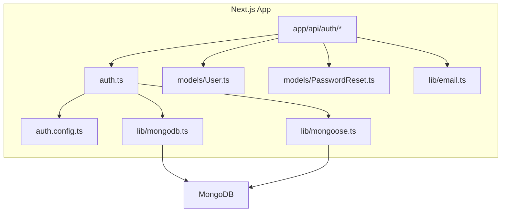
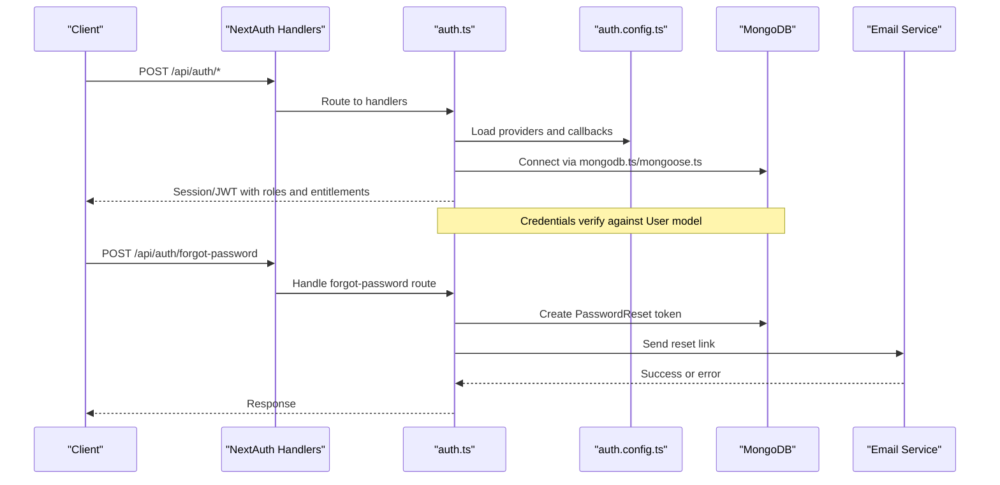
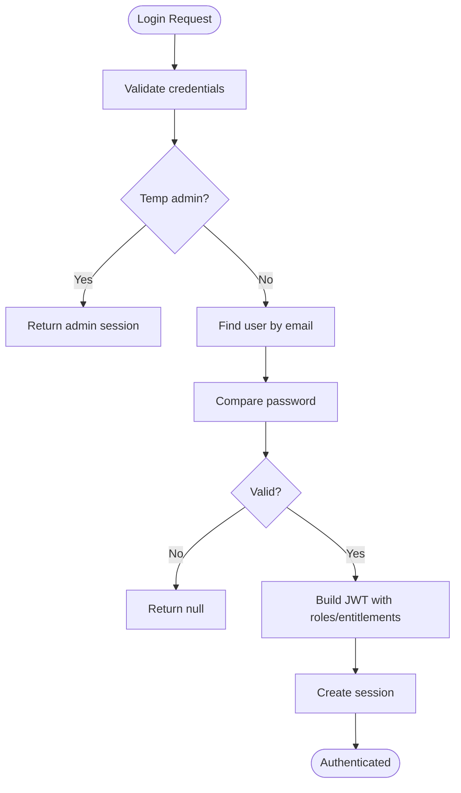
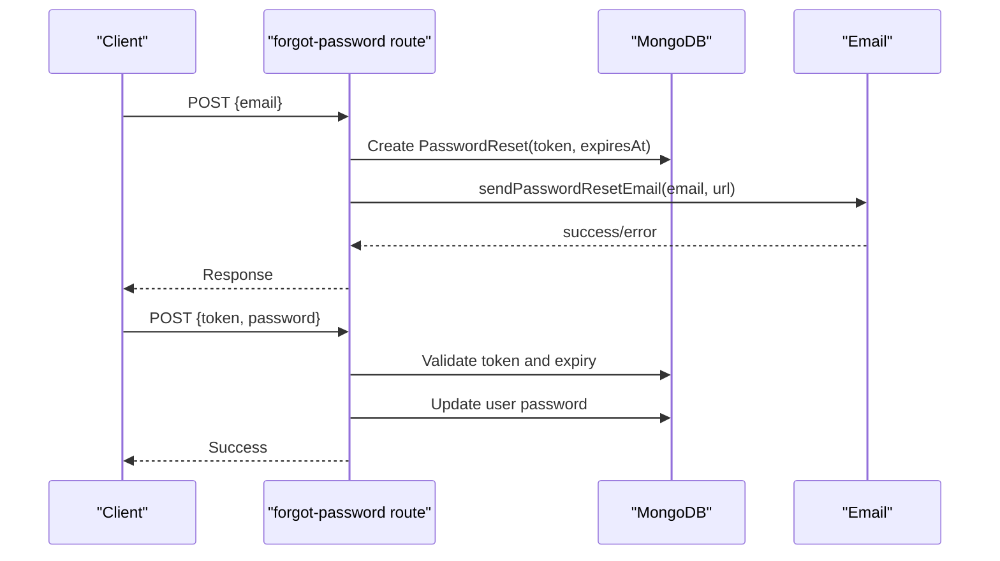

# Troubleshooting & FAQ

<cite>
**Referenced Files in This Document**
- [package.json](file://package.json)
- [next.config.js](file://next.config.js)
- [auth.ts](file://auth.ts)
- [auth.config.ts](file://auth.config.ts)
- [lib/mongodb.ts](file://lib/mongodb.ts)
- [lib/mongoose.ts](file://lib/mongoose.ts)
- [models/User.ts](file://models/User.ts)
- [models/PasswordReset.ts](file://models/PasswordReset.ts)
- [lib/email.ts](file://lib/email.ts)
- [app/api/auth/[...nextauth]/route.ts](file://app/api/auth/[...nextauth]/route.ts)
- [app/api/auth/register/route.ts](file://app/api/auth/register/route.ts)
- [app/api/auth/forgot-password/route.ts](file://app/api/auth/forgot-password/route.ts)
- [app/api/auth/reset-password/route.ts](file://app/api/auth/reset-password/route.ts)
</cite>

## Table of Contents
1. Introduction
2. Project Structure
3. Core Components
4. Architecture Overview
5. Detailed Component Analysis
6. Dependency Analysis
7. Performance Considerations
8. Troubleshooting Guide
9. Conclusion
10. Appendices

## Introduction
This document provides comprehensive troubleshooting and frequently asked questions for the Digentic platform. It focuses on resolving common setup problems (database connections, authentication failures, environment configuration), debugging performance bottlenecks, addressing deployment/build/runtime issues, and guiding logging and diagnostics. It also covers browser compatibility and mobile device considerations, plus community resources and support channels.

## Project Structure
Digentic is a Next.js application with:
- Authentication via NextAuth with MongoDB adapter and credentials provider
- Mongoose models for User and PasswordReset
- API routes for registration, password reset, and NextAuth endpoints
- Email sending via Nodemailer with SMTP or console fallback
- Next.js configuration that disables image optimization

**Diagram sources**
- [auth.ts:1-133](file://auth.ts#L1-L133)
- [auth.config.ts:1-101](file://auth.config.ts#L1-L101)
- [lib/mongodb.ts:1-38](file://lib/mongodb.ts#L1-L38)
- [lib/mongoose.ts:1-47](file://lib/mongoose.ts#L1-L47)
- [models/User.ts:1-81](file://models/User.ts#L1-L81)
- [models/PasswordReset.ts:1-44](file://models/PasswordReset.ts#L1-L44)
- [lib/email.ts:1-40](file://lib/email.ts#L1-L40)

**Section sources**
- [package.json:1-57](file://package.json#L1-L57)
- [next.config.js:1-9](file://next.config.js#L1-L9)

## Core Components
- Authentication: NextAuth with Google/GitHub providers and Credentials provider; JWT session strategy; MongoDB adapter for sessions.
- Database: MongoDB client connection and Mongoose connection with caching to avoid reconnection overhead.
- Models: User schema with role, enrolled courses, purchased digital assets; PasswordReset schema with TTL expiration.
- Email: Nodemailer transport using SMTP variables or console logging in development.
- API Routes: Registration, forgot password, reset password, and NextAuth handlers.

Key responsibilities:
- auth.ts orchestrates providers, events, and session mapping.
- lib/mongodb.ts manages MongoClient lifecycle and exposes getDatabase().
- lib/mongoose.ts caches Mongoose connection per process.
- models define schemas and methods (e.g., comparePassword).
- lib/email.ts sends password reset emails or logs them in dev.

**Section sources**
- [auth.ts:1-133](file://auth.ts#L1-L133)
- [auth.config.ts:1-101](file://auth.config.ts#L1-L101)
- [lib/mongodb.ts:1-38](file://lib/mongodb.ts#L1-L38)
- [lib/mongoose.ts:1-47](file://lib/mongoose.ts#L1-L47)
- [models/User.ts:1-81](file://models/User.ts#L1-L81)
- [models/PasswordReset.ts:1-44](file://models/PasswordReset.ts#L1-L44)
- [lib/email.ts:1-40](file://lib/email.ts#L1-L40)

## Architecture Overview
The authentication flow integrates NextAuth, MongoDB, and Mongoose-based user management with email-driven password recovery.

**Diagram sources**
- [app/api/auth/[...nextauth]/route.ts:1-4](file://app/api/auth/[...nextauth]/route.ts#L1-L4)
- [auth.ts:1-133](file://auth.ts#L1-L133)
- [auth.config.ts:1-101](file://auth.config.ts#L1-L101)
- [lib/mongodb.ts:1-38](file://lib/mongodb.ts#L1-L38)
- [lib/mongoose.ts:1-47](file://lib/mongoose.ts#L1-L47)
- [app/api/auth/forgot-password/route.ts:1-62](file://app/api/auth/forgot-password/route.ts#L1-L62)
- [lib/email.ts:1-40](file://lib/email.ts#L1-L40)

## Detailed Component Analysis

### Authentication Flow (Credentials and OAuth)
- Providers: Google and GitHub configured via environment variables; Credentials provider supports local login and a temporary admin bypass for development.
- Session Strategy: JWT-based; tokens carry id, role, enrolledCourses, purchasedDigital; session maps token fields back to session.user.
- Events: createUser synchronizes roles and entitlements for temp admin; linkAccount logs account linking.

**Diagram sources**
- [auth.ts:15-83](file://auth.ts#L15-L83)
- [auth.config.ts:21-98](file://auth.config.ts#L21-L98)
- [models/User.ts:69-75](file://models/User.ts#L69-L75)

**Section sources**
- [auth.ts:1-133](file://auth.ts#L1-L133)
- [auth.config.ts:1-101](file://auth.config.ts#L1-L101)
- [models/User.ts:1-81](file://models/User.ts#L1-L81)

### Database Connections (MongoDB and Mongoose)
- MongoDB client: Uses MONGODB_URI with server API v1; caches client promise in development to reuse connections.
- Mongoose: Caches connection per process; disables buffering; throws on connect failure to surface errors early.

Common pitfalls:
- Missing or invalid MONGODB_URI leads to connection errors.
- Repeated connections in development can cause instability if not cached.

**Section sources**
- [lib/mongodb.ts:1-38](file://lib/mongodb.ts#L1-L38)
- [lib/mongoose.ts:1-47](file://lib/mongoose.ts#L1-L47)

### Password Reset Flow
- Generates a random token, stores it with expiry, and sends an email with a reset URL.
- Validates token presence and password strength; updates user password and cleans up token.

**Diagram sources**
- [app/api/auth/forgot-password/route.ts:1-62](file://app/api/auth/forgot-password/route.ts#L1-L62)
- [app/api/auth/reset-password/route.ts:1-70](file://app/api/auth/reset-password/route.ts#L1-L70)
- [lib/email.ts:1-40](file://lib/email.ts#L1-L40)
- [models/PasswordReset.ts:1-44](file://models/PasswordReset.ts#L1-L44)

**Section sources**
- [app/api/auth/forgot-password/route.ts:1-62](file://app/api/auth/forgot-password/route.ts#L1-L62)
- [app/api/auth/reset-password/route.ts:1-70](file://app/api/auth/reset-password/route.ts#L1-L70)
- [lib/email.ts:1-40](file://lib/email.ts#L1-L40)
- [models/PasswordReset.ts:1-44](file://models/PasswordReset.ts#L1-L44)

### Registration Endpoint
- Validates name, email format, and password length.
- Normalizes email, checks uniqueness, hashes password, creates user, returns minimal user info.

**Section sources**
- [app/api/auth/register/route.ts:1-76](file://app/api/auth/register/route.ts#L1-L76)
- [models/User.ts:19-67](file://models/User.ts#L19-L67)

## Dependency Analysis
External dependencies relevant to troubleshooting:
- next-auth and @auth/mongodb-adapter for authentication and session storage
- mongodb and mongoose for database connectivity
- nodemailer for email delivery
- bcryptjs for password hashing
- next-themes for theme handling

Build and runtime scripts:
- dev, build, start, lint, typecheck

**Section sources**
- [package.json:1-57](file://package.json#L1-L57)

## Performance Considerations
- Image Optimization Disabled: The Next.js config disables image optimization, which can increase bandwidth and rendering time. Consider enabling optimized images for production where supported.
- Connection Caching: Both MongoDB client and Mongoose connections are cached per process to reduce connection overhead. Ensure you do not spawn multiple processes without proper connection sharing strategies.
- JWT Sessions: Using JWT reduces database load for session reads but increases payload size. Keep token payloads minimal and secure.
- Email Sending: SMTP calls are synchronous from the request path; consider offloading to background jobs for high volume.

[No sources needed since this section provides general guidance]

## Troubleshooting Guide

### Setup Issues

#### Database Connection Problems
Symptoms:
- Application fails to start or crashes on first request
- Errors when creating users or resetting passwords

Checklist:
- Verify MONGODB_URI is set correctly for your environment
- Ensure MongoDB server is reachable and accepting connections
- Confirm network/firewall rules allow outbound connections to MongoDB
- Check for duplicate connection attempts causing race conditions

Relevant code paths:
- MongoDB client initialization and caching
- Mongoose connection with error propagation

**Section sources**
- [lib/mongodb.ts:1-38](file://lib/mongodb.ts#L1-L38)
- [lib/mongoose.ts:1-47](file://lib/mongoose.ts#L1-L47)

#### Authentication Failures
Symptoms:
- Login fails with credentials
- OAuth sign-in redirects fail or return no user
- Temporary admin login does not work

Checklist:
- For credentials: ensure email exists and password matches hashed value
- For OAuth: verify GOOGLE_CLIENT_ID, GOOGLE_CLIENT_SECRET, GITHUB_CLIENT_ID, GITHUB_CLIENT_SECRET are set
- For temporary admin: confirm TEMP_ADMIN_EMAIL and TEMP_ADMIN_PASSWORD are set as expected
- Inspect session and token mapping for missing fields

Relevant code paths:
- Credentials authorize logic and temporary admin bypass
- OAuth provider configuration and callbacks
- JWT/session mapping

**Section sources**
- [auth.ts:15-83](file://auth.ts#L15-L83)
- [auth.config.ts:9-20](file://auth.config.ts#L9-L20)
- [auth.config.ts:21-98](file://auth.config.ts#L21-L98)

#### Environment Configuration Errors
Symptoms:
- Email not sent or logged incorrectly
- OAuth providers misconfigured
- Unexpected behavior in development vs production

Checklist:
- Ensure all required environment variables are present:
  - MONGODB_URI
  - GOOGLE_CLIENT_ID, GOOGLE_CLIENT_SECRET
  - GITHUB_CLIENT_ID, GITHUB_CLIENT_SECRET
  - SMTP_HOST, SMTP_PORT, SMTP_USER, SMTP_PASS, SMTP_FROM
  - NEXTAUTH_URL (used to construct reset URLs)
  - TEMP_ADMIN_EMAIL, TEMP_ADMIN_PASSWORD (development only)
- Validate SMTP settings and port security (465 vs 587)
- Confirm NEXTAUTH_URL matches your deployed domain for correct redirect URIs

Relevant code paths:
- Email transport configuration
- Reset URL construction using origin/NEXTAUTH_URL
- OAuth provider configuration

**Section sources**
- [lib/email.ts:1-40](file://lib/email.ts#L1-L40)
- [app/api/auth/forgot-password/route.ts:44-46](file://app/api/auth/forgot-password/route.ts#L44-L46)
- [auth.config.ts:9-20](file://auth.config.ts#L9-L20)

### Debugging Performance Bottlenecks
Steps:
- Identify slow endpoints using server logs and response times
- Profile database queries; ensure indexes exist (email index is defined)
- Avoid unnecessary reconnections; rely on cached connections
- Reduce payload sizes in JWT sessions; remove non-essential fields
- Consider enabling image optimization for static assets if applicable

Relevant areas:
- Connection caching in MongoDB and Mongoose
- Token/session mapping to minimize data transfer

**Section sources**
- [lib/mongodb.ts:1-38](file://lib/mongodb.ts#L1-L38)
- [lib/mongoose.ts:1-47](file://lib/mongoose.ts#L1-L47)
- [auth.config.ts:30-98](file://auth.config.ts#L30-L98)

### Deployment Issues
Common problems:
- Missing environment variables in production
- Incorrect NEXTAUTH_URL causing redirect failures
- SMTP misconfiguration preventing password reset emails
- Image optimization disabled affecting performance

Actions:
- Audit environment variables at deploy time
- Test email delivery in staging before production
- Monitor logs for connection errors and SMTP failures
- Evaluate enabling image optimization based on hosting capabilities

**Section sources**
- [next.config.js:1-9](file://next.config.js#L1-L9)
- [lib/email.ts:1-40](file://lib/email.ts#L1-L40)
- [app/api/auth/forgot-password/route.ts:44-46](file://app/api/auth/forgot-password/route.ts#L44-L46)

### Build Errors
Typical causes:
- TypeScript or dependency mismatches
- Linting errors blocking builds
- Incorrect module resolution

Actions:
- Run type checking and linting locally before pushing
- Ensure Node.js version matches project requirements
- Reinstall dependencies if lockfile inconsistencies occur

**Section sources**
- [package.json:5-10](file://package.json#L5-L10)

### Runtime Exceptions
Where to look:
- Console logs for authorization errors and database exceptions
- API route catch blocks returning standardized error responses
- Email sending errors during password reset flows

Mitigations:
- Add structured logging for critical paths
- Implement retry logic for transient network failures
- Surface user-friendly messages while preserving detailed logs internally

**Section sources**
- [auth.ts:78-81](file://auth.ts#L78-L81)
- [app/api/auth/register/route.ts:68-74](file://app/api/auth/register/route.ts#L68-L74)
- [app/api/auth/forgot-password/route.ts:54-60](file://app/api/auth/forgot-password/route.ts#L54-L60)
- [app/api/auth/reset-password/route.ts:62-68](file://app/api/auth/reset-password/route.ts#L62-L68)

### Browser Compatibility and Mobile Device Troubleshooting
Guidance:
- Use modern browsers; ensure HTTPS for cookies and OAuth redirects
- Clear cache and cookies if sessions behave unexpectedly
- On mobile, verify that deep links for password reset open in-app browsers correctly
- If using third-party SDKs or analytics, test on iOS Safari and Android Chrome

[No sources needed since this section provides general guidance]

### Logging Strategies and Diagnostic Tools
Strategies:
- Centralize logs for authentication events and database operations
- Log failed attempts with sanitized details (no secrets)
- Use structured formats for easier parsing and alerting
- In development, leverage console output for email links when SMTP is not configured

Tools:
- Next.js built-in logs
- External logging services (e.g., log aggregation platforms)
- Error tracking tools for unhandled exceptions

**Section sources**
- [lib/email.ts:32-38](file://lib/email.ts#L32-L38)
- [auth.ts:127-129](file://auth.ts#L127-L129)

### Frequently Asked Questions

#### Why am I getting “Invalid or expired password reset link”?
- The token may have expired after one hour or been invalidated
- Ensure the full URL including token is used
- Request a new reset link if necessary

**Section sources**
- [app/api/auth/reset-password/route.ts:27-42](file://app/api/auth/reset-password/route.ts#L27-L42)

#### Why doesn’t my OAuth login work?
- Missing or incorrect client IDs/secrets
- Redirect URI mismatch due to NEXTAUTH_URL
- Email not provided by provider

**Section sources**
- [auth.config.ts:9-20](file://auth.config.ts#L9-L20)
- [auth.config.ts:21-29](file://auth.config.ts#L21-L29)

#### How do I enable temporary admin access?
- Set TEMP_ADMIN_EMAIL and TEMP_ADMIN_PASSWORD in environment
- Use those credentials to log in; admin privileges will be applied

**Section sources**
- [auth.ts:29-47](file://auth.ts#L29-L47)
- [auth.config.ts:30-57](file://auth.config.ts#L30-L57)

#### Why is email not being sent?
- SMTP variables missing or incorrect
- Port/security mismatch (465 vs 587)
- In development, check console logs for the reset link

**Section sources**
- [lib/email.ts:4-13](file://lib/email.ts#L4-L13)
- [lib/email.ts:32-38](file://lib/email.ts#L32-L38)

#### How do I fix database connection errors?
- Verify MONGODB_URI and network reachability
- Ensure MongoDB server is running and accessible
- Check for connection caching issues in development

**Section sources**
- [lib/mongodb.ts:1-38](file://lib/mongodb.ts#L1-L38)
- [lib/mongoose.ts:1-47](file://lib/mongoose.ts#L1-L47)

#### What should I do if registration fails?
- Validate input fields (name, email, password)
- Check for duplicate email addresses
- Review server logs for detailed error messages

**Section sources**
- [app/api/auth/register/route.ts:6-41](file://app/api/auth/register/route.ts#L6-L41)

## Conclusion
This guide consolidates common issues and resolutions across authentication, database connectivity, environment configuration, and deployment. By following the checklists and leveraging the provided diagrams and references, you can quickly diagnose and fix problems in the Digentic platform. For ongoing issues, consult the community resources and support channels below.

## Appendices

### Community Resources and Support Channels
- Official documentation site
- Issue tracker for bug reports and feature requests
- Community forums and discussion boards
- Social media channels for announcements and updates

[No sources needed since this section provides general guidance]

### Contribution Guidelines
- Follow coding standards and linting rules
- Write tests for new features and fixes
- Submit pull requests with clear descriptions
- Adhere to security best practices, especially around secrets and user data

[No sources needed since this section provides general guidance]