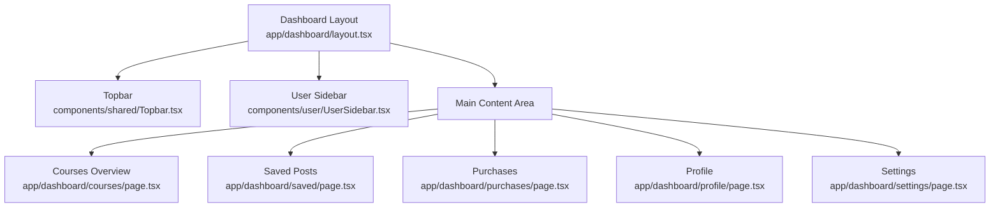
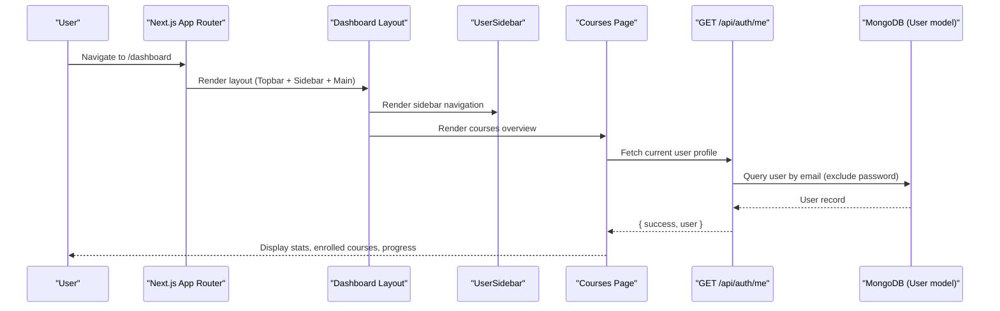
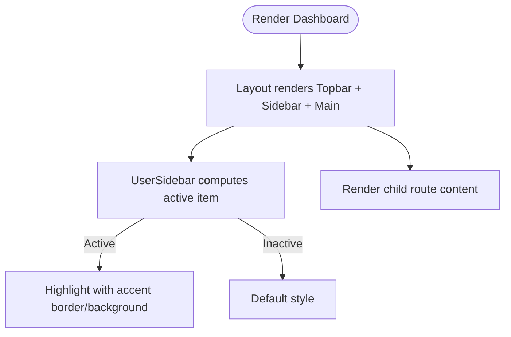
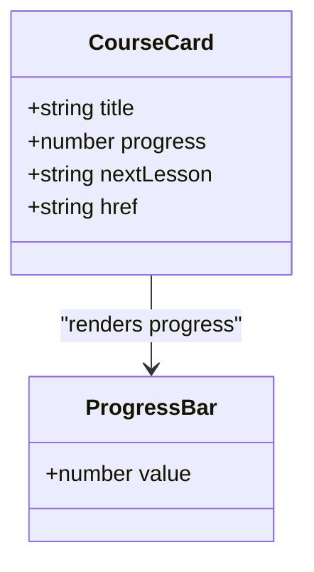
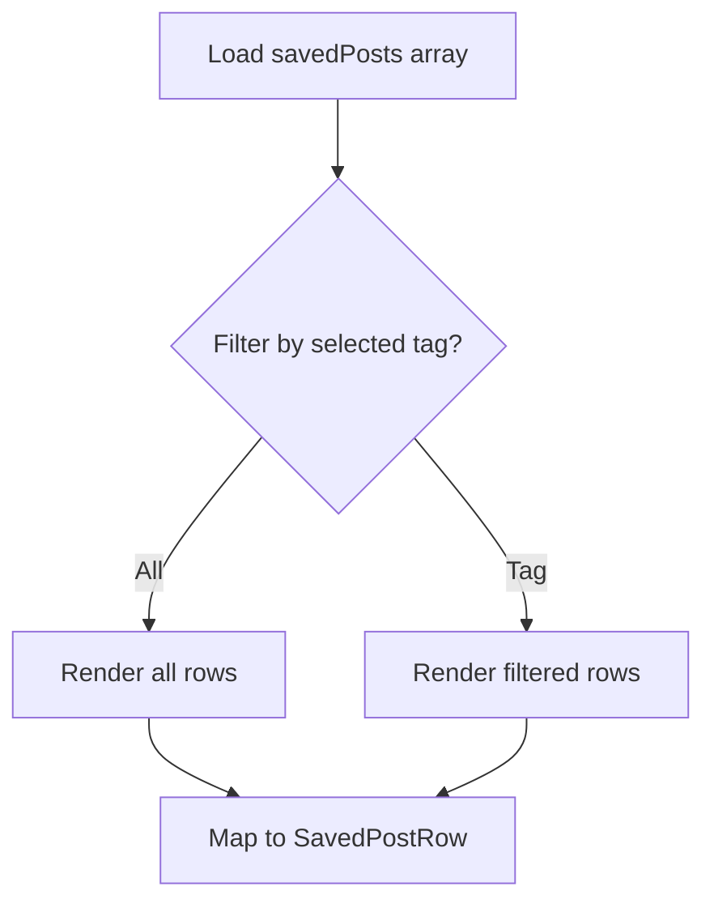
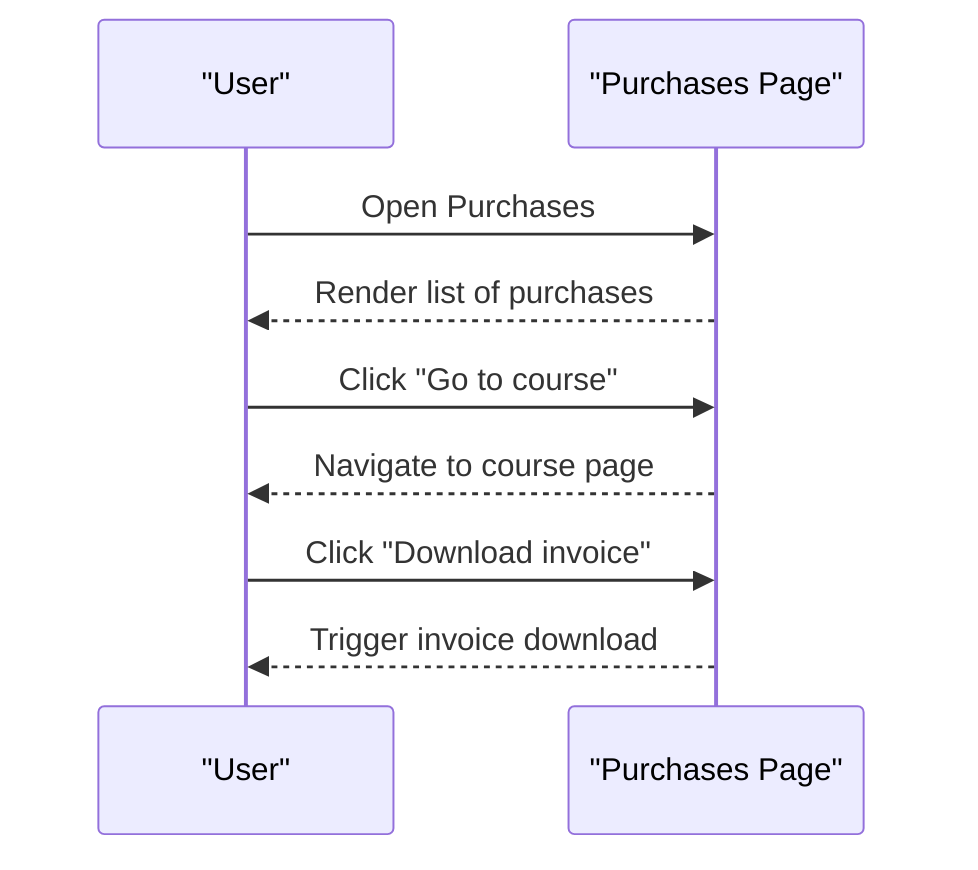
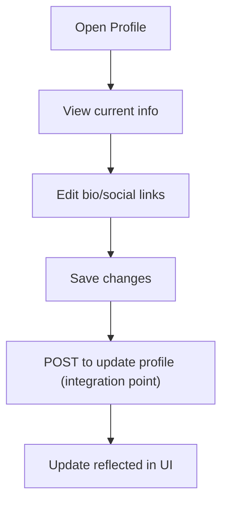
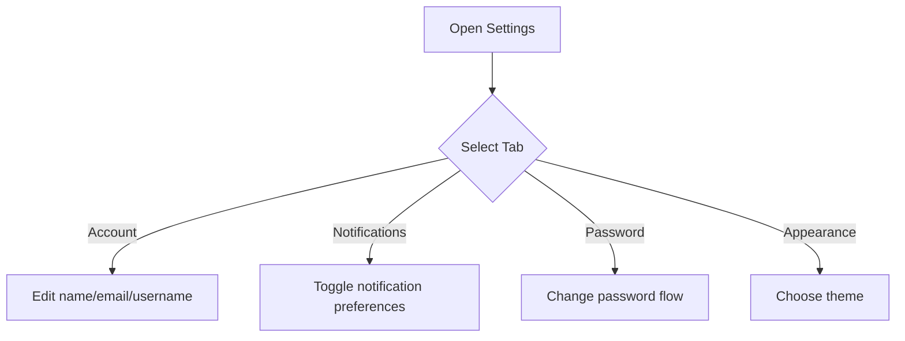
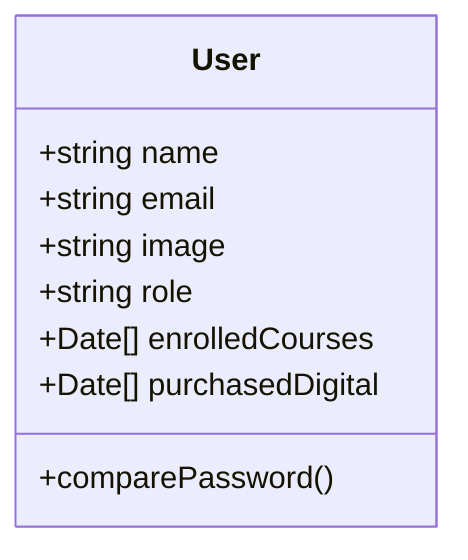
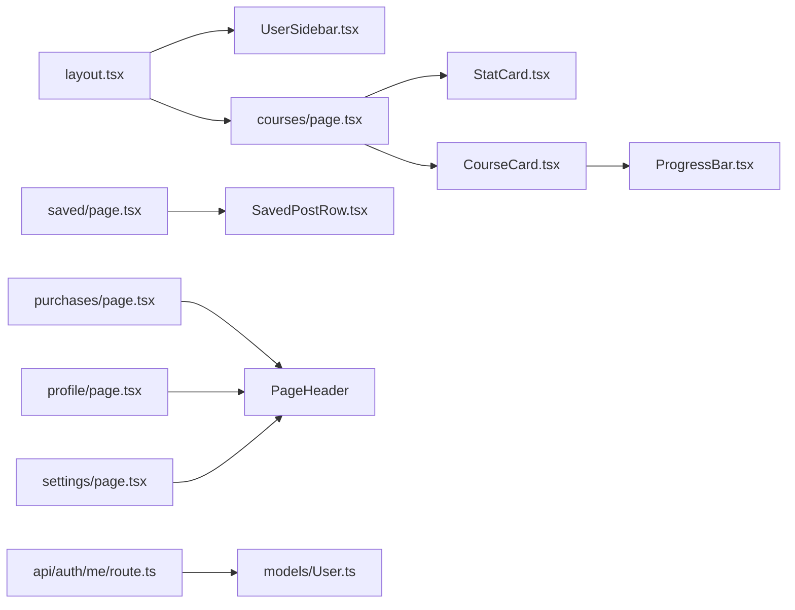

# User Dashboard

<cite>
**Referenced Files in This Document**
- [app/dashboard/page.tsx](file://app/dashboard/page.tsx)
- [app/dashboard/layout.tsx](file://app/dashboard/layout.tsx)
- [components/user/UserSidebar.tsx](file://components/user/UserSidebar.tsx)
- [app/dashboard/courses/page.tsx](file://app/dashboard/courses/page.tsx)
- [components/user/CourseCard.tsx](file://components/user/CourseCard.tsx)
- [components/shared/ProgressBar.tsx](file://components/shared/ProgressBar.tsx)
- [components/shared/StatCard.tsx](file://components/shared/StatCard.tsx)
- [app/dashboard/saved/page.tsx](file://app/dashboard/saved/page.tsx)
- [components/user/SavedPostRow.tsx](file://components/user/SavedPostRow.tsx)
- [app/dashboard/purchases/page.tsx](file://app/dashboard/purchases/page.tsx)
- [app/dashboard/profile/page.tsx](file://app/dashboard/profile/page.tsx)
- [app/dashboard/settings/page.tsx](file://app/dashboard/settings/page.tsx)
- [app/api/auth/me/route.ts](file://app/api/auth/me/route.ts)
- [models/User.ts](file://models/User.ts)
- [auth.config.ts](file://auth.config.ts)
</cite>

## Table of Contents
1. Introduction
2. Project Structure
3. Core Components
4. Architecture Overview
5. Detailed Component Analysis
6. Dependency Analysis
7. Performance Considerations
8. Troubleshooting Guide
9. Conclusion

## Introduction
This document explains the User Dashboard feature for personal account management and activity tracking. It covers profile management, course progress tracking, purchase history, saved items, sidebar navigation, and settings. It also outlines data privacy and security considerations and describes how notifications can be configured within the dashboard.

## Project Structure
The dashboard is a Next.js App Router layout with a fixed topbar and a user-specific sidebar. The root dashboard route redirects to the courses overview, which serves as the default landing area. Each subpage (courses, purchases, saved, profile, settings) composes shared UI components for consistent styling and behavior.

**Diagram sources**
- [app/dashboard/layout.tsx:1-21](file://app/dashboard/layout.tsx#L1-L21)
- [components/user/UserSidebar.tsx:1-102](file://components/user/UserSidebar.tsx#L1-L102)
- [app/dashboard/courses/page.tsx:1-71](file://app/dashboard/courses/page.tsx#L1-L71)
- [app/dashboard/saved/page.tsx:1-59](file://app/dashboard/saved/page.tsx#L1-L59)
- [app/dashboard/purchases/page.tsx:1-57](file://app/dashboard/purchases/page.tsx#L1-L57)
- [app/dashboard/profile/page.tsx:1-101](file://app/dashboard/profile/page.tsx#L1-L101)
- [app/dashboard/settings/page.tsx:1-149](file://app/dashboard/settings/page.tsx#L1-L149)

**Section sources**
- [app/dashboard/page.tsx:1-6](file://app/dashboard/page.tsx#L1-L6)
- [app/dashboard/layout.tsx:1-21](file://app/dashboard/layout.tsx#L1-L21)

## Core Components
- Dashboard layout: Provides a fixed full-screen container with a Topbar and a collapsible UserSidebar. All child routes render inside a scrollable main area.
- UserSidebar: Grouped navigation sections (Learn, Library, Profile/Settings) with active state detection and badges for counts.
- Courses overview: Displays stat cards (enrolled, average progress, saved posts, purchased), “Continue learning” cards with progress bars, and a preview of saved posts.
- Saved posts: Client-side filtering by tags using FilterChips and rendering rows with excerpts.
- Purchases: Lists purchased digital products with invoice download and quick access to courses.
- Profile: Editable bio and social links with a save action.
- Settings: Tabs for Account, Notifications, Password, Appearance; includes toggles for notification preferences and theme selection.

**Section sources**
- [app/dashboard/layout.tsx:1-21](file://app/dashboard/layout.tsx#L1-L21)
- [components/user/UserSidebar.tsx:1-102](file://components/user/UserSidebar.tsx#L1-L102)
- [app/dashboard/courses/page.tsx:1-71](file://app/dashboard/courses/page.tsx#L1-L71)
- [components/user/CourseCard.tsx:1-33](file://components/user/CourseCard.tsx#L1-L33)
- [components/shared/ProgressBar.tsx:1-22](file://components/shared/ProgressBar.tsx#L1-L22)
- [components/shared/StatCard.tsx:1-36](file://components/shared/StatCard.tsx#L1-L36)
- [app/dashboard/saved/page.tsx:1-59](file://app/dashboard/saved/page.tsx#L1-L59)
- [components/user/SavedPostRow.tsx:1-43](file://components/user/SavedPostRow.tsx#L1-L43)
- [app/dashboard/purchases/page.tsx:1-57](file://app/dashboard/purchases/page.tsx#L1-L57)
- [app/dashboard/profile/page.tsx:1-101](file://app/dashboard/profile/page.tsx#L1-L101)
- [app/dashboard/settings/page.tsx:1-149](file://app/dashboard/settings/page.tsx#L1-L149)

## Architecture Overview
The dashboard uses client-side routing and reusable components. Data for the current user is fetched via an authenticated API endpoint that returns profile fields without sensitive data. Authentication configuration injects role and entitlements into the session for authorization checks elsewhere in the app.

**Diagram sources**
- [app/dashboard/layout.tsx:1-21](file://app/dashboard/layout.tsx#L1-L21)
- [components/user/UserSidebar.tsx:1-102](file://components/user/UserSidebar.tsx#L1-L102)
- [app/dashboard/courses/page.tsx:1-71](file://app/dashboard/courses/page.tsx#L1-L71)
- [app/api/auth/me/route.ts:1-51](file://app/api/auth/me/route.ts#L1-L51)
- [models/User.ts:1-81](file://models/User.ts#L1-L81)

## Detailed Component Analysis

### Dashboard Layout and Navigation
- Fixed full-page container with dark background.
- Topbar displays user name and role context.
- Sidebar groups navigation into Learn, Library, and Profile/Settings with active highlighting based on pathname. Badges show counts for purchases and saved posts.

**Diagram sources**
- [app/dashboard/layout.tsx:1-21](file://app/dashboard/layout.tsx#L1-L21)
- [components/user/UserSidebar.tsx:1-102](file://components/user/UserSidebar.tsx#L1-L102)

**Section sources**
- [app/dashboard/layout.tsx:1-21](file://app/dashboard/layout.tsx#L1-L21)
- [components/user/UserSidebar.tsx:1-102](file://components/user/UserSidebar.tsx#L1-L102)

### Courses Overview and Progress Tracking
- Stat cards summarize enrollment, average progress, saved posts, and purchases.
- “Continue learning” lists courses with percentage progress and next lesson hint.
- Progress is visualized with a gradient progress bar component.

**Diagram sources**
- [components/user/CourseCard.tsx:1-33](file://components/user/CourseCard.tsx#L1-L33)
- [components/shared/ProgressBar.tsx:1-22](file://components/shared/ProgressBar.tsx#L1-L22)

**Section sources**
- [app/dashboard/courses/page.tsx:1-71](file://app/dashboard/courses/page.tsx#L1-L71)
- [components/user/CourseCard.tsx:1-33](file://components/user/CourseCard.tsx#L1-L33)
- [components/shared/ProgressBar.tsx:1-22](file://components/shared/ProgressBar.tsx#L1-L22)
- [components/shared/StatCard.tsx:1-36](file://components/shared/StatCard.tsx#L1-L36)

### Saved Items (Bookmarks)
- Client-side filtering by tag chips.
- Each row shows title, tag, date, and optional excerpt with a bookmark icon.

**Diagram sources**
- [app/dashboard/saved/page.tsx:1-59](file://app/dashboard/saved/page.tsx#L1-L59)
- [components/user/SavedPostRow.tsx:1-43](file://components/user/SavedPostRow.tsx#L1-L43)

**Section sources**
- [app/dashboard/saved/page.tsx:1-59](file://app/dashboard/saved/page.tsx#L1-L59)
- [components/user/SavedPostRow.tsx:1-43](file://components/user/SavedPostRow.tsx#L1-L43)

### Purchase History Management
- Lists purchased digital products with purchase date and price.
- Actions include downloading invoices and navigating to related courses.

**Diagram sources**
- [app/dashboard/purchases/page.tsx:1-57](file://app/dashboard/purchases/page.tsx#L1-L57)

**Section sources**
- [app/dashboard/purchases/page.tsx:1-57](file://app/dashboard/purchases/page.tsx#L1-L57)

### Profile Management
- Displays avatar initials, name, and email.
- Editable fields: Bio and social links (GitHub, Twitter, LinkedIn).
- Save changes button present; backend integration point is available via the user profile API.

**Section sources**
- [app/dashboard/profile/page.tsx:1-101](file://app/dashboard/profile/page.tsx#L1-L101)
- [app/api/auth/me/route.ts:1-51](file://app/api/auth/me/route.ts#L1-L51)

### Settings and Notifications
- Tabs: Account, Notifications, Password, Appearance.
- Notifications tab provides toggles for email notifications, new post alerts, course updates, and marketing emails.
- Appearance tab allows selecting theme (Dark/Light/System).

**Section sources**
- [app/dashboard/settings/page.tsx:1-149](file://app/dashboard/settings/page.tsx#L1-L149)

### Data Model and Session Integration
- User model stores identity, role, and entitlements such as enrolled courses and purchased digital items.
- Authentication configuration enriches the session with role and entitlements, enabling personalized views and access control.

**Diagram sources**
- [models/User.ts:1-81](file://models/User.ts#L1-L81)

**Section sources**
- [models/User.ts:1-81](file://models/User.ts#L1-L81)
- [auth.config.ts:1-101](file://auth.config.ts#L1-L101)

## Dependency Analysis
- Dashboard layout depends on Topbar and UserSidebar.
- Courses page depends on StatCard, CourseCard, and ProgressBar.
- Saved posts page depends on FilterChips and SavedPostRow.
- Purchases page depends on PageHeader and internal links.
- Profile and Settings pages depend on PageHeader and form inputs.
- API route depends on authentication, database connection, and User model.

**Diagram sources**
- [app/dashboard/layout.tsx:1-21](file://app/dashboard/layout.tsx#L1-L21)
- [components/user/UserSidebar.tsx:1-102](file://components/user/UserSidebar.tsx#L1-L102)
- [app/dashboard/courses/page.tsx:1-71](file://app/dashboard/courses/page.tsx#L1-L71)
- [components/shared/StatCard.tsx:1-36](file://components/shared/StatCard.tsx#L1-L36)
- [components/user/CourseCard.tsx:1-33](file://components/user/CourseCard.tsx#L1-L33)
- [components/shared/ProgressBar.tsx:1-22](file://components/shared/ProgressBar.tsx#L1-L22)
- [app/dashboard/saved/page.tsx:1-59](file://app/dashboard/saved/page.tsx#L1-L59)
- [components/user/SavedPostRow.tsx:1-43](file://components/user/SavedPostRow.tsx#L1-L43)
- [app/dashboard/purchases/page.tsx:1-57](file://app/dashboard/purchases/page.tsx#L1-L57)
- [app/dashboard/profile/page.tsx:1-101](file://app/dashboard/profile/page.tsx#L1-L101)
- [app/dashboard/settings/page.tsx:1-149](file://app/dashboard/settings/page.tsx#L1-L149)
- [app/api/auth/me/route.ts:1-51](file://app/api/auth/me/route.ts#L1-L51)
- [models/User.ts:1-81](file://models/User.ts#L1-L81)

## Performance Considerations
- Prefer server-side or cached data fetching for user profile and course progress to reduce client load.
- Use pagination or virtualization for large saved posts lists.
- Debounce input changes in profile and settings to minimize unnecessary writes.
- Keep sidebar navigation lightweight; avoid heavy computations on every render.

## Troubleshooting Guide
- Unauthorized access to profile: Ensure the user is signed in before calling the profile API. The API returns a 401 if no valid session is present.
- Missing user profile: If the API returns 404, verify that a corresponding user record exists in the database for the authenticated email.
- Database connectivity issues: Errors during profile fetch will return a 500; check database connection and credentials.
- Session enrichment: Verify that auth callbacks populate role and entitlements so that UI can reflect correct permissions and data.

**Section sources**
- [app/api/auth/me/route.ts:1-51](file://app/api/auth/me/route.ts#L1-L51)
- [auth.config.ts:1-101](file://auth.config.ts#L1-L101)

## Conclusion
The User Dashboard provides a cohesive experience for managing personal information, tracking learning progress, reviewing purchases, and organizing saved content. The modular component architecture supports easy extension for additional features such as advanced analytics, richer notifications, and deeper integrations with external services. Security is reinforced through authenticated API access and careful handling of sensitive fields.